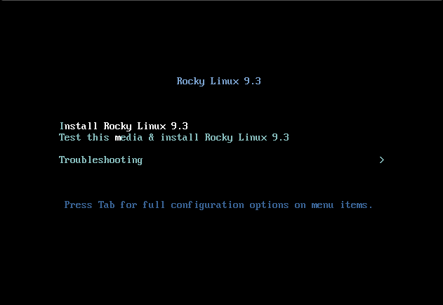
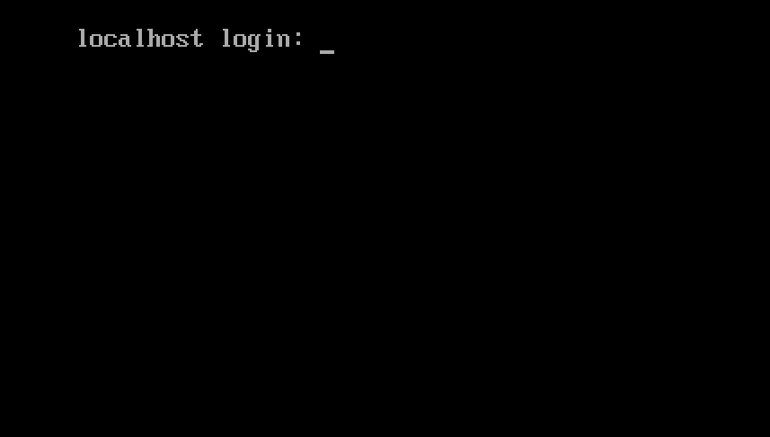
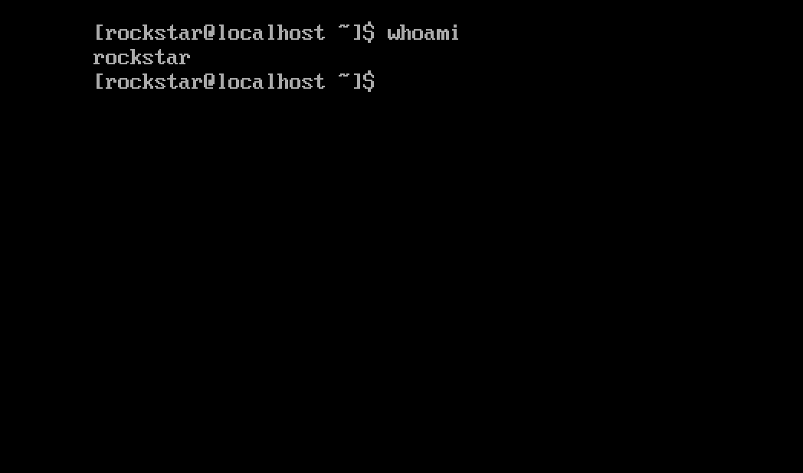

# Installing Rocky Linux 9

This is a detailed guide for installing a 64-bit version of the Rocky Linux distribution on a standalone system. We will be performing a server class install. We will step through the installation and customization steps in the following sections.

## OS Installation Prerequisites

Download the ISO to use for this installation of Rocky Linux.  
You can download the latest ISO image for the version of Rocky Linux for this installation here:

<https://www.rockylinux.org/download/>

To download the ISO directly from the command line on an existing Linux-based system, use the `wget` command:

```bash
wget https://download.rockylinux.org/pub/rocky/9/isos/x86_64/Rocky-9.3-x86_64-minimal.iso
```

Rocky Linux ISOs follow this naming convention:

```text
Rocky-<MAJOR#>.<MINOR#>-<ARCH>-<VARIANT>.iso
```

For example, `Rocky-9.3-x86_64-minimal.iso`

!!! Note

    The Rocky Project web page lists several mirrors located around the globe. Choose the mirror geographically closest to you. The list of official mirrors can be found [here](https://mirrors.rockylinux.org/mirrormanager/mirrors).

## Verifying the Installation Program ISO File

If you've downloaded the Rocky Linux ISO(s) on an existing Linux distribution, you can use the `sha256sum` utility to verify that file(s) you downloaded are not corrupt. We will show an example of verifying the <0>Rocky-9.3-x86_64-minimal.iso</0> file by checking its checksum.

1. Download the file that contains the official checksums for the available ISOs.

1. While still in the folder that contains the downloaded Rocky Linux ISO, download the checksum file for the ISO, type:

    ```bash
    wget -O CHECKSUM https://download.rockylinux.org/pub/rocky/9.3/isos/x86_64/CHECKSUM
    ```

1. Use the `sha256sum` utility to verify the integrity of the ISO file against corruption or tampering.

    ```bash
    sha256sum -c CHECKSUM --ignore-missing
    ```

    This checks the integrity of the ISO file downloaded previously, provided that it is in the same directory. The output should show:

    ```text
    Rocky-9.3-x86_64-minimal.iso: OK
    ```

## The Installation

!!! Tip

    Before installing properly, the system’s Unified Extensible Firmware Interface (UEFI) or Basic Input/Output System (BIOS) should be preconfigured to boot from the correct medium.

If the computer is set up to boot from the media with the ISO file, we can begin the installation.

1. Insert and boot from the installation medium (optical disk, USB flash drive, and so on).

2. Once the computer has booted, you see the Rocky Linux 9 welcome splash screen.

    

3. If you do not press any key, the installation program starts a countdown, after which the installation process automatically executes the default, highlighted, option:

    `Test this media & install Rocky Linux 9.3`

    You can also press ++enter++ at any time to start the process immediately.

4. A quick media verification step takes place.  
This media verification step can save you the trouble of starting the installation only to find out halfway through that the installation program has to stop because of bad installation media.

5. After the media check runs to completion and the media is successfully verified to be usable, the installation program automatically continues to the next screen.

6. Select the language you want to use to perform the installation in this screen. For this guide, we select *English (United States)*. Then click the ++"continue"++ button.

## Installation Summary

The <0>Installation Summary</0> screen is an all-in-one area where you make important decisions about installing the system.

The screen is roughly divided into the following sections:

- *LOCALIZATION*
- *SOFTWARE*
- *SYSTEM*
- *USER SETTINGS*

We will delve into each of these sections next and make changes where necessary.

### Localization Section

This section customizes items related to the system's geographic location. This includes – Keyboard, Language Support, Time and Date.

#### Keyboard

In this guide's demo system, we accept the default value (*English US*) and make no changes.

However, if you need to make any changes here, from the *Installation Summary* screen, click the ++"keyboard"++ option to specify the system's keyboard layout. Using the ++plus++ button, you can add additional keyboard layouts if you need to in the ensuing screen and even specify your preferred order.

Click ++"done"++ when you are finished with this screen.

#### Language Support

The `Language Support` option on the *Installation Summary* screen lets you specify support for additional languages.

We will accept the default value - **English (United States)** and make no change, click ++"done"++.

#### Time & Date

Click the ++"Time & Date"++ option on the main *Installation Summary* screen to bring up another screen that will allow you to select the time zone in which the machine is located. Scroll through the list of regions and cities and select the area closest to you.

Depending on your installation source, the *Network Time* option could be set to *ON* or *OFF* by default. Accept the default *ON* setting; this allows the system to automatically set the correct time using the Network Time Protocol (NTP).

Click ++"done"++ after making any changes.

### Software Section

Under the *Software* section of the *Installation Summary* screen, you can select or change the installation source as well as additional packages (applications) that get installed.

#### Installation Source

Because the installation uses a Rocky Linux 9 ISO image, you will notice that *Local Media* is automatically specified under the Installation Source section of the main *Installation Summary* screen. You can accept the preset defaults.

!!! Tip

    The installation Source area allows you to perform a network-based installation (for example, if you use the Rocky Linux boot ISO - Rocky-9.3-x86_64-boot.iso). For a network-based installation, you need first to ensure that a network adapter on the target system is properly configured, and can reach the internet. To perform a network-based installation, click `Installation Source` and then select the `On the network` radio button. Once selected, choose `https` as the protocol and type the following URL in the text field `download.rockylinux.org/pub/rocky/9/BaseOS/x86_64/os`. Click `Done`.

#### Software Selection

Clicking the ++"Software Selection"++ option on the main *Installation Summary* screen presents you with the installation section where you can pick the exact software packages installed on the system. The software selection area is divided into:

- **Base Environment**: Minimal Installation and Custom operating system
- **Additional software for Selected Environment**: Selecting a Base Environment on the left side presents a variety of related additional software to install for the given environment on the right side. Note that this only applies if you were installing from a full Rocky Linux 9.2 DVD or have additional repositories configured.

Select the *Minimal Install* (Basic functionality) option.

Click ++"done"++ at the top of the screen.

### System Section

The System section of the *Installation Summary* screen is used for customizing and making changes to things related to the underlying hardware of the target system. This is where you create your hard disk drive partitions or volumes, specify the file system, specify the network configuration, enable or disable KDUMP or select a Security Profile.

#### Installation Destination

From the *Installation Summary* screen, click the ++"Installation Destination"++ option. This takes you to the corresponding task area.

You will see a screen displaying all the candidate disk drives that you have available on the target system. If you have only one disk drive on the system, as on our sample system, you see the drive listed under *Local Standard Disks* with a check mark beside it. Clicking the disk icon will toggle on or off the disk selection check mark. Keep it checked to select the disk.

Under the *Storage Configuration* section:

1. Select the ++"Automatic"++ radio button.

2. Click ++"done"++ at the top of the screen.

3. Once the installation program determines that you have a usable disk, it returns to the *Installation Summary* screen.

### Network & Host Name

The next important task of the installation procedure under the System area deals with network configuration, where you can configure or tweak network-related settings for the system.

!!! Note

    After you click on the ++"Network & Hostname"++ option, all correctly detected network interface hardware (such as Ethernet, wireless network cards, and so on) will be listed in the left pane of the network configuration screen. Depending on your specific hardware setup, Ethernet devices in Linux have names similar to `eth0`, `eth1`, `ens3`, `ens4`, `em1`, `em2`, `p1p1`, `enp0s3`, and so on. 
    You can configure each interface using DHCP or manually set the IP address. 
    If you choose to configure manually, be sure to have all the required information ready, such as the IP address, netmask, and so on.

Clicking the ++"Network & Hostname"++ button in the main *Installation Summary* screen opens the corresponding configuration screen. Here, you can configure the system's hostname.

!!! Note

    You can easily change the system hostname later on after the OS has been installed.

The next important configuration task is related to the network interfaces on the system.

1. Verify that the left pane lists an Ethernet card (or any network card.)
2. Click any of the detected network devices in the left pane to select it.  
The selected network adapter's configurable properties appear in the screen's right pane.

!!! Note

    On our sample system, we have two Ethernet devices (`ens3` and `ens4`), all of which are in a connected state. The type, name, quantity, and state of the network devices on your system may vary from the ones on our demo system.

Verify the switch of the device you want to configure is flipped to the `ON` (blue) position in the right pane.
We'll accept all the defaults in this section.

Click ++"done"++ to return to the main *Installation Summary* screen.

!!! Warning

    Pay attention to the IP address of the server in this section of this installer. If you don’t have physical or easy console access to the system, this information will come in handy later on when you need to connect to the server to continue working on it after the OS installation is completed.

### User Settings Section

This section can be used for creating a password for the `root` user account and also for creating new administrative or non-administrative accounts.

#### Root Password

1. Click the *Root Password* field under *User Settings* to start the *Root Password* task screen.

    !!! Warning

        The root superuser is the most privileged account on the system. Therefore, if you choose to use or enable it, it is crucial that you protect this account with a strong password.

2. In the *Root Password* text box, set a strong password for the root user.

3. Enter the same password again in the *Confirm* text box.

4. Click ++"done"++.

#### User Creation

To create a user:

1. Click the *User Creation* field under *User Settings* to start the *Create User* task screen.  
This task area allows you to create a privileged or non-privileged (non-administrative) user account.

    !!! Info

        Creating and using a non-privileged account for day-to-day tasks on a system is a good system administration practice.

    We’ll create a regular user that can invoke superuser (administrator) powers when needed.

2. Complete the fields in the *Create User* screen with the following information:

    - **Full name**:
    `rockstar`
    - **Username**:
    `rockstar`
    - **Make this user administrator**:
    Checked
    - **Require a password to use this account**:
    Checked
    - **Password**:
    `04302021`
    - **Confirm password**:
    `04302021`

3. Click ++"done"++.

## Installer Phase

Once you are satisfied with your choices for the various installation tasks, the next phase of the installation process will begin the installation proper.

### Start the Installation

Once you are satisfied with your choices for the various installation tasks, click the ++"Begin Installation"++ button on the main *Installation Summary* screen.

The installation will begin, and the installation program will show the progress of the installation.
After the installation begins, various tasks will begin running in the background, such as partitioning the disk, formatting the partitions or LVM volumes, checking for and resolving software dependencies, writing the operating system to the disk, and so on.

!!! Note

    If you do not wish to continue after clicking the Begin Installation button, you can still safely exit the installation without losing data. To quit the installer, simply reset your system by clicking the Quit button, pressing ctrl-alt-del on the keyboard, or pushing the reset or power switch.

### Complete the Installation

After the installation program has completed its work, you will see a final installation progress screen with a complete message.

Finally, complete the entire procedure by clicking the ++"Reboot System"++ button. The system restarts.

### Log In

The system is now set up and ready for use. You will see the Rocky Linux console.



To log onto the system:

1. Type `rockstar` at the login prompt and press ++enter++.

2. At the Password prompt, type `04302021` (rockstar’s password) and press ++enter++ (the password will ***not*** be echoed to the screen, that is normal).

3. Run the `whoami` command after login.  
This command shows the name of the currently logged in user.


