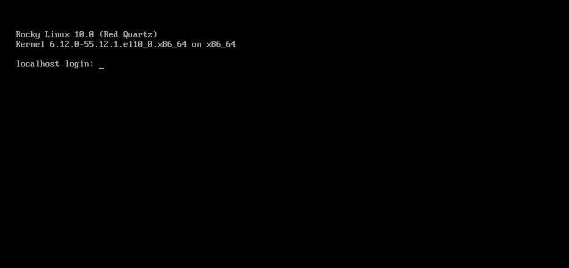

# Installing Rocky Linux 10

This is a detailed guide for installing a 64-bit version of the Rocky Linux distribution on a standalone system. We will be performing a server-class install. We will step through the installation and customization steps in the following sections.

## OS Installation Prerequisites

Download the ISO to use for this installation of Rocky Linux.  
You can download the latest ISO image for the version of Rocky Linux for this installation here:

<https://www.rockylinux.org/download/>

To download the ISO directly from the command line on an existing Linux-based system, use the `wget` command:

```bash
wget https://download.rockylinux.org/pub/rocky/10/isos/x86_64/Rocky-10.0-x86_64-minimal.iso
```

Rocky Linux ISOs follow this naming convention:

```text
Rocky-<MAJOR#>.<MINOR#>-<ARCH>-<VARIANT>.iso
```

For example, `Rocky-10.0-x86_64-minimal.iso`

!!! Note

    The Rocky Project website lists several mirrors located around the world. Select the mirror that is geographically closest to you. The list of official mirrors can be found [here](https://mirrors.rockylinux.org/mirrormanager/mirrors).

## Verifying the Installation Program ISO File

If you've downloaded the Rocky Linux ISO(s) on an existing Linux distribution, you can use the `sha256sum` utility to verify that the file(s) you downloaded are not corrupt. We will demonstrate the verification of the `Rocky-10.0-x86_64-minimal.iso` file by checking its checksum.

1. Download the file that contains the official checksums for the available ISOs.

1. While still in the folder that contains the downloaded Rocky Linux ISO, download the checksum file for the ISO, type:

    ```bash
    wget -O CHECKSUM https://download.rockylinux.org/pub/rocky/10/isos/x86_64/CHECKSUM
    ```

1. Use the `sha256sum` utility to verify the integrity of the ISO file against corruption or tampering.

    ```bash
    sha256sum -c CHECKSUM --ignore-missing
    ```

    This checks the integrity of the previously downloaded ISO file, provided it is in the same directory. The output should show:

    ```text
    Rocky-10.0-x86_64-minimal.iso: OK
    ```

## The Installation

!!! Tip

    Before starting the installation, ensure that the system’s Unified Extensible Firmware Interface (UEFI) or Basic Input/Output System (BIOS) is properly configured to boot from the correct medium.
    Also, make sure that you review the recommended [minimum hardware requirements](minimum_hardware_requirements.md) notes for running Rocky Linux 10.

Once the system is set up to boot from the media with the ISO file, we can begin the installation.

1. Insert and boot from the installation medium (e.g., optical disk, USB flash drive).

2. Once the computer has booted, you see the Rocky Linux 10 installer splash screen.

    

3. At the welcome screen, you can use the ++"up"++ or ++"down"++ arrow keys to select any of the options, followed by pressing ++enter++ to run the selected option. If you do not press any key, the installation program starts a countdown, after which the installation process automatically executes the default, highlighted option:

    `Test this media & install Rocky Linux 10.0`

4. A quick media verification step takes place.  
This media verification step can save you the trouble of starting the installation only to discover halfway through that the installation program has to stop due to faulty installation media.

1. After the media check is completed and the media is successfully verified as usable, the installation program automatically proceeds to the next screen.

2. Select the language you want to use to install this screen. For this guide, we select *English (United States)*. Then click the ++"continue"++ button.

## Installation Summary

The `Installation Summary` screen is a comprehensive area where you make key decisions about the system's installation.

The screen is roughly divided into the following sections:

- *LOCALIZATION*
- *SOFTWARE*
- *SYSTEM*
- *USER SETTINGS*

We will delve into each of these sections next and make any necessary changes.

### Localization Section

This section customizes items related to the system's geographic location. This includes – Keyboard, Language Support, Time, and Date.

#### Keyboard

In this guide's demo system, we accept the default value (*English US*) and make no changes.

However, if you need to make any changes here, from the *Installation Summary* screen, click the ++"keyboard"++ option to specify the system's keyboard layout. Using the ++plus++ button, you can add and order additional keyboard layouts as necessary.

When finished with this screen, click ++"done"++.

#### Language Support

The `Language Support` option on the *Installation Summary* screen allows for the specification of support for additional languages.

We will accept the default value - **English (United States)** and make no change, click ++"done"++.

#### Time & Date

Click the ++"Time & Date"++ option on the main *Installation Summary* screen to bring up another screen that will allow for the selection of the timezone where the machine is located. Use the drop-down arrows to select the region and city closest to you.

Accept the default and enable ++"Automatic date & time"++ option, which allows the system to automatically set the correct time and date using the Network Time Protocol (NTP).

Click ++"done"++ when completed.

### Software Section

Under the *Software* section of the *Installation Summary* screen, you can select or change the installation source as well as add additional software packages for the selected environment.

#### Installation Source

Since we are using a Rocky Linux 10 ISO image for the installation, the Auto-detected source option is selected by default for us. Accept the preset default installation source.

!!! Tip

    The installation Source area allows you to perform a network-based installation (for example, if you use the Rocky Linux boot ISO - Rocky-10.0-x86_64-boot.iso). For a network-based installation, you must first ensure that a network adapter on the target system is configured correctly and can reach the installation source(s) over the network (LAN or Internet). To perform a network-based installation, click `Installation Source` and then select the `On the network` radio button. Then select the correct protocol and type the correct URI. Click `Done`.

#### Software Selection

Clicking the ++"Software Selection"++ option on the main *Installation Summary* screen presents you with a software selection area that has two sections:

- **Base Environment**: Minimal Installation
- **Additional software for Selected Environment**: Selecting a Base Environment on the left side presents a selection of additional software to install for the given environment on the right side.

Select the *Minimal Install* (Basic functionality) option.

Click ++"done"++ at the top of the screen.

### System Section

Use the System section of the *Installation Summary* screen for customizing and making changes to things related to the underlying hardware of the target system. This is where you create your hard disk drive partitions or volumes, specify the file system, specify the network configuration, and enable or disable KDUMP.

#### Installation Destination

From the *Installation Summary* screen, click the ++"Installation Destination"++ option. This takes you to the corresponding task area.

You will see a screen displaying all the candidate disk drives available on the target system. If you have only one disk drive on the system, as on our sample system, you see the drive listed under *Local Standard Disks* with a checkmark beside it. Clicking the disk icon toggles the disk selection checkmark on or off. Keep it checked to select the disk.

Under the *Storage Configuration* section:

1. Select the ++"Automatic"++ radio button.

2. Click ++"done"++ at the top of the screen.

3. Once the installation program determines that you have a usable disk, it returns to the *Installation Summary* screen.

### Network & Host Name

The following important task in the installation procedure under the System area involves network configuration, where you can configure or adjust network-related settings for the system.

!!! Note

    After you click on the ++"Network & Host Name"++ option, all correctly detected network interface hardware (such as Ethernet, wireless network cards, and so on) will be listed in the left pane of the network configuration screen. Depending on your specific hardware setup, Ethernet devices in Linux have names similar to `eth0`, `eth1`, `ens3`, `ens4`, `em1`, `em2`, `p1p1`, `enp0s3`, and so on. 
    You can configure each interface using DHCP or manually set the IP address. 
    If you choose to configure manually, ensure that you have all the required information ready, such as the IP address, netmask, and other relevant details.

Clicking the ++"Network & Host Name"++ button in the main *Installation Summary* screen opens the corresponding configuration screen. Here, you can also configure the system's hostname.

!!! Note

    You can easily change the system hostname later on after the OS has been installed.

The following configuration task involves the system's network interfaces.

1. Verify that the left pane lists a network adapter/card
2. Click any of the detected network devices in the left pane to select it.  
The selected network adapter's configurable properties appear in the right pane of the screen.

!!! Note

    On our sample system, we have two Ethernet devices (`ens3` and `ens4`), both of which are in a connected state. The type, name, quantity, and state of the network devices on your system may differ from those on our demo system.

Verify that the switch of the device you want to configure is in the `ON` (blue) position in the right pane.
We will accept all the defaults in this section.

Click ++"done"++ to return to the main *Installation Summary* screen.

!!! Warning

    Pay attention to the IP address of the server in this section of the installer. If you do not have physical or easy console access to the system, this information will be useful later when you need to connect to the server after the OS installation is complete.

### User Settings Section

Use this section to create a password for the `root` user account and to create new administrative or non-administrative accounts.

#### Root Password

1. Click the *Root Password* field under *User Settings* to start the *Root Account* task screen.

    !!! Warning

        The root superuser is the most privileged account on the system. If you choose to use or enable it, you must protect this account with a strong password.

2. You will see two options: "Disable root account" or "Enable root account".
Accept the default.

3. Click ++"done"++.

#### User Creation

To create a user:

1. Click the *User Creation* field under *User Settings* to start the *Create User* task screen. Use this task area to create a privileged (administrative) or non-privileged (non-administrative) user account.

    !!! Caution

        On a Rocky Linux 10 system, the Root account is disabled by default; therefore, it is essential to ensure that the user account created during the OS installation has administrative privileges. This user can be used in a non-privileged manner for day-to-day tasks on the system and will also have the ability to elevate their role to perform administrative (root) functions as necessary.

    We will create a regular user that can invoke superuser (administrator) powers when needed.

2. Complete the fields in the *Create User* screen with the following information:

    - **Full name**:
    `rockstar`
    - **Username**:
    `rockstar`
        - **Add administrative privileges to this user account (wheel group membership)**:
        Checked
        - **Require a password to use this account**:
        Checked
        - **Password**:
        `04302021`
        - **Confirm password**:
        `04302021`

3. Click ++"done"++.

## Installer Phase

Once you are satisfied with your choices for the various installation tasks, the next phase of the installation process will begin: the actual installation.

### Start the Installation

Once satisfied with your choices for the various installation tasks, click the ++"Begin Installation"++ button on the main *Installation Summary* screen.

The installation will begin, and the installation program will show the progress of the installation.
After the installation starts, various tasks will begin running in the background, such as partitioning the disk, formatting the partitions or LVM volumes, checking for and resolving software dependencies, writing the operating system to the disk, and other similar tasks.

!!! Note

    If you do not wish to continue after clicking the ++"Begin Installation"++ button, you can still safely exit the installation without losing data. To quit the installer, simply reset your system by clicking the ++"Quit"++ button, pressing Ctrl-Alt-Delete on the keyboard, or pushing the reset or power switch.

### Complete the Installation

After the installation program has completed its work, you will see a final installation progress screen with a complete message.

Finally, complete the entire procedure by clicking the ++"Reboot System"++ button. The system restarts.

### Log In

The system is now set up and ready for use. You will see the Rocky Linux console.



To log onto the system:

1. Type `rockstar` at the login prompt and press ++enter++.

2. At the Password prompt, type `04302021` (rockstar’s password) and press ++enter++ (the password will ***not*** be echoed to the screen, that is normal).

3. Run the `whoami` command after login.  
This command shows the name of the currently logged-in user.


