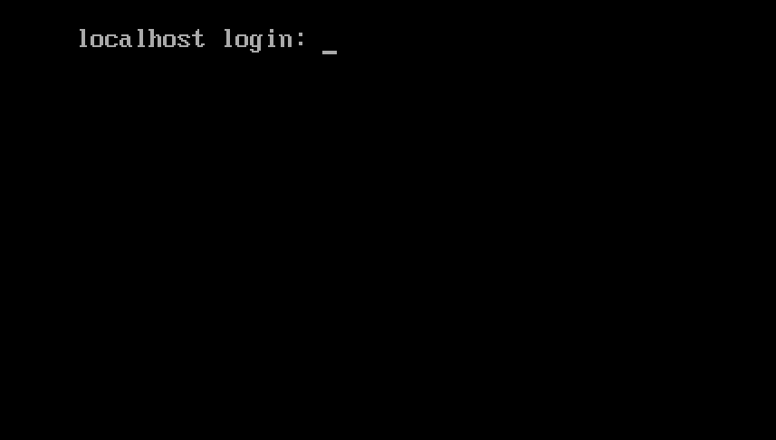

# Встановлення Rocky Linux 9

Це детальний посібник із встановлення 64-розрядної версії дистрибутива Rocky Linux в автономній системі. Ми будемо виконувати встановлення класу сервера. У наступних розділах ми розглянемо кроки встановлення та налаштування.

## Передумови встановлення ОС

Завантажте ISO для цієї інсталяції Rocky Linux.  
Ви можете завантажити останній образ ISO для версії Rocky Linux для цієї інсталяції тут:

```
https://www.rockylinux.org/download/
```

Щоб завантажити ISO безпосередньо з командного рядка в існуючій системі на основі Linux, скористайтеся командою `wget`:

```
wget https://download.rockylinux.org/pub/rocky/9/isos/x86_64/Rocky-9.3-x86_64-minimal.iso
```

ISO Rocky Linux дотримується цієї угоди про іменування:

```
Rocky-<MAJOR#>.<MINOR#>-<ARCH>-<VARIANT>.iso
```

Наприклад, `Rocky-9.3-x86_64-minimal.iso`

!!! Note "Примітка"

    Веб-сторінка проекту Rocky містить перелік кількох дзеркал, розташованих по всьому світу. По можливості вибирайте дзеркало, територіально найближче до вас. Список офіційних дзеркал можна знайти [тут](https://mirrors.rockylinux.org/mirrormanager/mirrors).

## Перевірка файлу ISO програми встановлення

Якщо ви завантажили Rocky Linux ISO в існуючий дистрибутив Linux, ви можете скористатися утилітою `sha256sum`, щоб переконатися, що файли, які ви завантажили, не пошкоджені. Ми покажемо приклад того, як перевірити файл `Rocky-9.3-x86_64-minimal.iso`, перевіривши його контрольну суму.

1. Завантажте файл, який містить офіційні контрольні суми для доступних ISO.

1. Перебуваючи в папці, яка містить завантажений ISO Rocky Linux, завантажте файл контрольної суми для ISO, введіть:

    ```
    wget -O CHECKSUM https://download.rockylinux.org/pub/rocky/9.3/isos/x86_64/CHECKSUM
    ```

1. Використовуйте утиліту `sha256sum`, щоб перевірити цілісність файлу ISO на пошкодження чи втручання.

    ```
    sha256sum -c CHECKSUM --ignore-missing
    ```

    Це перевіряє цілісність файлу ISO, завантаженого раніше, за умови, що він знаходиться в тому самому каталозі. Вихід має показати:

    ```
    Rocky-9.3-x86_64-minimal.iso: OK
    ```

## Інсталяція

!!! Tip "Підказка"

    Перш ніж правильно розпочати інсталяцію, уніфікований розширюваний інтерфейс мікропрограми системи (UEFI) або базову систему введення/виведення (BIOS) слід попередньо налаштувати для завантаження з правильного носія.

Якщо комп’ютер налаштовано на завантаження з носія з файлом ISO, ми можемо почати процес інсталяції.

1. Вставте та завантажтеся з інсталяційного носія (оптичний диск, флешка тощо).

1. Після завантаження комп’ютера ви побачите екран привітання Rocky Linux 9.

    

1. Якщо ви не натискаєте жодної клавіші, програма інсталяції починає зворотний відлік, після чого процес інсталяції автоматично виконує стандартну, виділену опцію:

    `Test this media & install Rocky Linux 9.3`

    Ви також можете будь-коли натиснути <kbd>Enter</kbd>, щоб негайно розпочати процес.

1. Відбувається швидка перевірка медіа.  
   Цей крок перевірки носія може позбавити вас від проблем із запуском інсталяції лише на півдорозі, щоб дізнатися, що програму інсталяції потрібно зупинити через поганий інсталяційний носій.

1. Після завершення перевірки носія та його придатності до використання програма встановлення автоматично переходить до наступного екрана.

1. Виберіть мову, яку ви хочете використовувати для встановлення цього екрана. Для цього посібника ми вибрали *англійську (Сполучені Штати)*. Потім натисніть кнопку <kbd>Продовжити</kbd>.

## Підсумок встановлення

*Звіт про встановлення* на екрані є повністю в одній області, де ви приймаєте важливі рішення про систему для встановлення.

Екран приблизно поділено на такі частини:

- *LOCALIZATION*
- *SOFTWARE*
- *SYSTEM*
- *USER SETTINGS*

Далі ми розглянемо кожен із цих розділів і внесемо необхідні зміни.

### Розділ Localization

Цей розділ використовується для налаштування елементів, пов’язаних із географічним положенням системи. Це включає – клавіатуру, підтримку мови, час і дату.

#### Клавіатура

У нашій демонстраційній системі в цьому посібнику ми приймаємо значення за умовчанням (*англійською мовою США*) і не вносимо жодних змін.

Однак, якщо вам потрібно внести будь-які зміни тут, на екрані *Підсумок встановлення* клацніть опцію <kbd>Клавіатура</kbd>, щоб вказати розкладку клавіатури системи. За допомогою кнопки <kbd>+</kbd> ви можете додати додаткові розкладки клавіатури, якщо вам потрібно, на наступному екрані та навіть вказати бажаний порядок.

Натисніть <kbd>Готово</kbd>, коли завершите роботу з цим екраном.

#### Підтримка мови

Параметр <kbd>Підтримка мов</kbd> на екрані *Підсумок встановлення* дає змогу вказати підтримку додаткових мов.

Ми приймемо значення за замовчуванням - **English (United States)** і не внесемо змін, натисніть <kbd>Готово</kbd>.

#### Час & Дата

Клацніть опцію <kbd>Час і дата</kbd> на головному екрані *Підсумок встановлення*, щоб відкрити інший екран, який дозволить вам вибрати часовий пояс, у якому машина знаходиться. Прокрутіть список регіонів і міст і виберіть найближчу до вас область.

Залежно від джерела інсталяції для параметра *Мережевий час* можна встановити значення *ON* або *OFF* за умовчанням. Прийміть стандартне налаштування *ON*; це дозволяє системі автоматично встановлювати правильний час за допомогою мережевого протоколу часу (NTP).

Натисніть <kbd>Готово</kbd> після внесення будь-яких змін.

### Розділ програмного забезпечення

У розділі *Програмне забезпечення* на екрані *Підсумок встановлення* можна вибрати або змінити джерело встановлення, а також додаткові пакети (додатки), які встановлюються.

#### Джерело встановлення

Оскільки під час інсталяції використовується ISO-образ Rocky Linux 9, ви помітите, що *Локальний носій* автоматично вказується в розділі "Джерело інсталяції" основного <em x-id="3" Екран ">Підсумок встановлення</em>. Ви можете прийняти стандартні налаштування.

!!! Tip "Підказка"

    Область «Джерело» встановлення — це місце, де ви можете вибрати встановлення через мережу (наприклад, якщо ви використовуєте завантажувальний ISO Rocky Linux — Rocky-9.3-x86_64-boot.iso). Для мережевої інсталяції вам потрібно спочатку переконатися, що мережевий адаптер у цільовій системі правильно налаштований і має доступ до Інтернету. Щоб виконати інсталяцію через мережу, натисніть «Джерело інсталяції», а потім виберіть перемикач «У мережі». Після вибору виберіть `https` як протокол і введіть наступну URL-адресу в текстове поле `download.rockylinux.org/pub/rocky/9/BaseOS/x86_64/os`. Натисніть `Готово`.

#### Вибір програмного забезпечення

Натиснувши опцію <kbd>Вибір програмного забезпечення</kbd> на головному екрані *Підсумок встановлення*, ви побачите розділ встановлення, де ви можете вибрати точні пакети програмного забезпечення, які отримають встановлені в системі. Зона вибору програмного забезпечення поділяється на:

- **Базове середовище**: мінімальна інсталяція та спеціальна операційна система
- **Додаткове програмне забезпечення для вибраного середовища**: якщо вибрати базове середовище ліворуч, праворуч буде показано різноманітне додаткове програмне забезпечення для встановлення для певного середовища. Зауважте, що це стосується лише тих випадків, коли ви встановлювали з повного DVD Rocky Linux 9.2 або якщо у вас налаштовано додаткові сховища.

Виберіть опцію *Мінімальна інсталяція* (базова функція).

Натисніть <kbd>Готово</kbd> у верхній частині екрана.

### Системний розділ

Розділ «Система» на екрані *Підсумок встановлення* використовується для налаштування та внесення змін у речі, пов’язані з апаратним забезпеченням, що лежить в основі цільової системи. Тут ви створюєте розділи або томи жорсткого диска, вказуєте файлову систему, вказуєте конфігурацію мережі, увімкніть або вимкніть KDUMP або виберіть профіль безпеки.

#### Місце призначення

На екрані *Підсумок встановлення* клацніть параметр <kbd>Місце призначення</kbd>. Це приведе вас до відповідної області завдань.

Ви побачите екран із усіма дисками-кандидатами, доступними у цільовій системі. Якщо у вас є лише один дисковод у системі, як у нашій зразковій системі, ви побачите диск у списку *Локальні стандартні диски* з галочкою біля нього. Натискання піктограми диска вмикає або вимикає позначку вибору диска. Поставте прапорець, щоб вибрати диск.

У розділі *Налаштування сховища*:

1. Виберіть перемикач <kbd>Автоматично</kbd>.

2. Натисніть <kbd>Готово</kbd> у верхній частині екрана.

3. Коли програма встановлення визначає, що у вас є придатний для використання диск, вона повертається до екрана *Підсумок встановлення*.

### Мережа & Ім'я хоста

Наступне важливе завдання процедури інсталяції в системній області стосується конфігурації мережі, де ви можете налаштувати або налаштувати параметри, пов’язані з мережею, для системи.

!!! Note "Примітка"

    Після того як ви натиснули <kbd>Мережа & Ім'я хосту</kbd> все правильно визначене обладнання мережевого інтерфейсу (наприклад, Ethernet, бездротові мережеві карти тощо) буде перераховано на лівій панелі екрана конфігурації мережі. Залежно від вашого конкретного апаратного забезпечення пристрої Ethernet у Linux мають назви, схожі на `eth0`, `eth1`, `ens3`, `ens4`, `em1`, `em2`, `p1p1`, `enp0s3` тощо. 
    Для кожного інтерфейсу ви можете налаштувати його за допомогою DHCP або вручну встановити IP-адресу. 
    Якщо ви вирішите налаштувати вручну, переконайтеся, що підготували всю необхідну інформацію, таку як IP-адреса, маска мережі тощо.

Натискання кнопки <kbd>Мережа та ім’я хоста</kbd> на головному екрані *Підсумок встановлення* відкриває відповідний екран налаштування. Крім іншого, у вас є можливість налаштувати ім’я хоста системи.

!!! Note "Примітка"

    Ви можете легко змінити ім’я хоста системи пізніше після встановлення ОС.

Наступне важливе завдання налаштування пов’язане з мережевими інтерфейсами в системі.

1. Переконайтеся, що на лівій панелі зазначено плату Ethernet (або будь-яку мережеву карту).
2. Натисніть будь-який із виявлених мережевих пристроїв на лівій панелі, щоб вибрати його.  
   Властивості вибраного мережевого адаптера, які можна налаштувати, з’являться на правій панелі екрана.

!!! Note "Примітка"

    У нашому прикладі системи ми маємо два пристрої Ethernet ("ens3" і "ens4"), усі вони знаходяться в підключеному стані. Тип, назва, кількість і стан мережевих пристроїв у вашій системі можуть відрізнятися від пристроїв у нашій демонстраційній системі.

Переконайтеся, що перемикач пристрою, який ви хочете налаштувати, переведено в положення `ON` (синій) на правій панелі. Ми приймемо всі значення за замовчуванням у цьому розділі.

Натисніть <kbd>Готово</kbd>, щоб повернутися до головного екрана *Підсумок встановлення*.

!!! Warning "Важливо"

    Зверніть увагу на IP-адресу сервера в цьому розділі цього інсталятора. Якщо у вас немає фізичного або легкого консольного доступу до системи, ця інформація стане в пригоді пізніше, коли вам потрібно буде підключитися до сервера, щоб продовжити роботу на ньому після завершення встановлення ОС.

### Розділ налаштувань користувача

Цей розділ можна використовувати для створення пароля для облікового запису користувача `root`, а також для створення нових адміністративних або неадміністративних облікових записів.

#### Пароль root

1. Натисніть поле *Root Password* у *User Settings*, щоб запустити *Root Пароль* екран завдання.

    !!! Warning "Важливо"
   
        Суперкористувач root є найбільш привілейованим обліковим записом у системі. Тому, якщо ви вирішите використовувати або ввімкнути його, дуже важливо захистити цей обліковий запис надійним паролем.

1. У текстовому полі *Root Password* установіть надійний пароль для користувача root.

1. Знову введіть той самий пароль у текстове поле *Підтвердити*.

1. Натисніть <kbd>Готово</kbd>.


#### Створення користувача

Щоб створити користувача:

1. Натисніть поле *Створення користувача* під *Налаштування користувача*, щоб розпочати *Створення Екран завдань користувача*.  
   Ця область завдань дозволяє створити привілейований або непривілейований (не адміністративний) обліковий запис користувача в системі.

    !!! Info "Інформація"
   
        Створення та використання непривілейованого облікового запису для повсякденних завдань у системі є хорошою практикою адміністрування системи.

    Ми створимо звичайного користувача, який за потреби може використовувати повноваження суперкористувача (адміністратора).

1. Заповніть поля на екрані *Створення користувача* такою інформацією:

    - **Full name**: `rockstar`
    - **Username**: `rockstar`
    - **Make this user administrator**: Checked
    - **Require a password to use this account**: Checked
    - **Password**: `04302021`
    - **Confirm password**: `04302021`

1. Натисніть <kbd>Готово</kbd>.

## Фаза встановлення

Коли ви задоволені своїм вибором для різних завдань встановлення, наступний етап процесу встановлення розпочне власне встановлення.


### Початок установки

Коли ви задоволені своїм вибором для різних завдань встановлення, натисніть кнопку <kbd>Почати встановлення</kbd> на головному екрані *Підсумок встановлення*.

Розпочнеться інсталяція, і програма інсталяції покаже прогрес інсталяції. Після початку інсталяції у фоновому режимі почнуть виконуватися різноманітні завдання, наприклад створення розділів диска, форматування розділів або томів LVM, перевірка та вирішення програмних залежностей, запис операційної системи на диск тощо.

!!! Note "Примітка"

    Якщо ви не бажаєте продовжувати після натискання кнопки «Почати інсталяцію», ви все одно можете безпечно завершити інсталяцію без втрати даних. Щоб вийти з інсталятора, просто скиньте систему, натиснувши кнопку «Вийти», натиснувши ctrl-alt-del на клавіатурі або натиснувши кнопку скидання чи живлення.

### Завершення установки

Після завершення програми інсталяції ви побачите екран останнього процесу інсталяції з повним повідомленням.

Нарешті завершіть всю процедуру, натиснувши кнопку <kbd>Перезавантажити систему</kbd>. Система перезавантажується.

### Вхід

Тепер система налаштована та готова до використання. Ви побачите консоль Rocky Linux.



Щоб увійти в систему:

1. Введіть `rockstar` у рядку входу та натисніть <kbd>Enter</kbd>.

1. У вікні запиту пароля введіть `04302021` (пароль rockstar) і натисніть <kbd>Enter</kbd> (пароль буде ***не*** відтворюється на екрані, це нормально).

1. Виконайте команду `whoami` після входу.  
   Ця команда показує ім’я користувача, який зараз увійшов у систему.


