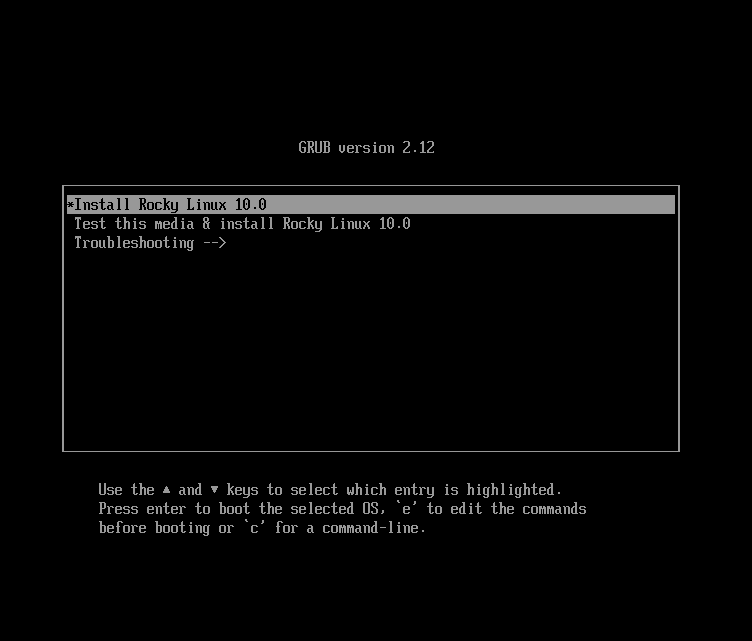

# Встановлення Rocky Linux 10

Це детальний посібник із встановлення 64-розрядної версії дистрибутива Rocky Linux в автономній системі. Ми будемо виконувати встановлення класу сервера. У наступних розділах ми розглянемо кроки встановлення та налаштування.

## Передумови встановлення ОС

Завантажте ISO для цієї інсталяції Rocky Linux.  
Ви можете завантажити останній образ ISO для версії Rocky Linux для цієї інсталяції тут:

<https://www.rockylinux.org/download/>

Щоб завантажити ISO безпосередньо з командного рядка в існуючій системі на базі Linux, скористайтеся командою `wget`:

```bash
wget https://download.rockylinux.org/pub/rocky/10/isos/x86_64/Rocky-10.0-x86_64-minimal.iso
```

ISO Rocky Linux дотримується цієї угоди про іменування:

```text
Rocky-<MAJOR#>.<MINOR#>-<ARCH>-<VARIANT>.iso
```

Наприклад, `Rocky-10.0-x86_64-minimal.iso`

!!! Note "Примітка"

    Веб-сторінка Rocky Project містить перелік кількох дзеркал, розташованих по всьому світу. Оберіть найближче до вас дзеркало. Список офіційних дзеркал можна знайти [тут](https://mirrors.rockylinux.org/mirrormanager/mirrors).

## Перевірка файлу ISO програми встановлення

Якщо ви завантажили Rocky Linux ISO в існуючий дистрибутив Linux, ви можете скористатися утилітою `sha256sum`, щоб переконатися, що файли, які ви завантажили, не пошкоджені. Ми покажемо приклад перевірки файлу `Rocky-10.0-x86_64-minimal.iso` шляхом перевірки його контрольної суми.

1. Завантажте файл, який містить офіційні контрольні суми для доступних ISO.

1. Перебуваючи в папці, яка містить завантажений ISO Rocky Linux, завантажте файл контрольної суми для ISO, введіть:

    ```bash
    wget -O CHECKSUM https://download.rockylinux.org/pub/rocky/10/isos/x86_64/CHECKSUM
    ```

1. Використовуйте утиліту `sha256sum`, щоб перевірити цілісність файлу ISO на пошкодження чи втручання.

    ```bash
    sha256sum -c CHECKSUM --ignore-missing
    ```

    Це перевіряє цілісність файлу ISO, завантаженого раніше, за умови, що він знаходиться в тому самому каталозі. Вихід має показати:

    ```text
    Rocky-9.3-x86_64-minimal.iso: OK
    ```

## Інсталяція

!!! Tip "Підказка"

    Перш ніж розпочати встановлення, переконайтеся, що інтерфейс UEFI (Unified Extensible Firmware Interface) або BIOS (Basic Input/Output System) системи належним чином налаштовано для завантаження з правильного носія.
    Також обов’язково перегляньте рекомендовані примітки до [мінімальних вимог до обладнання](minimum_hardware_requirements.md) для запуску Rocky Linux 10.

Після того, як система налаштована на завантаження з носія з ISO-файлом, ми можемо розпочати встановлення.

1. Вставте та завантажтеся з інсталяційного носія (оптичний диск, флешка тощо).

2. Після завантаження комп'ютера ви побачите заставку інсталятора Rocky Linux 10.

    

3. На екрані привітання ви можете скористатися клавішами зі стрілками ++"вгору"++ або ++"вниз"++, щоб вибрати будь-який із параметрів, а потім натиснути ++enter++, щоб запустити вибраний параметр. Якщо ви не натискаєте жодної клавіші, програма інсталяції починає зворотний відлік, після чого процес інсталяції автоматично виконує стандартну, виділену опцію:

    `Test this media & install Rocky Linux 10.0`

4. Виконується швидкий етап перевірки носія.  
   Цей етап перевірки носія може позбавити вас клопоту, пов’язаного з початком встановлення, після якого на середині процесу виявляється, що програму встановлення потрібно зупинити через несправний інсталяційний носій.

1. Після завершення перевірки носія та його придатності до використання програма встановлення автоматично переходить до наступного екрана.

2. Виберіть мову, яку ви хочете використовувати для встановлення цього екрана. Для цього посібника ми вибрали *англійську (Сполучені Штати)*. Потім натисніть кнопку ++"continue"++.

## Підсумок встановлення

Екран `Підсумок інсталяції` — це всеосяжна область, де ви приймаєте важливі рішення щодо інсталяції системи.

Екран приблизно поділено на такі частини:

- *LOCALIZATION*
- *SOFTWARE*
- *SYSTEM*
- *USER SETTINGS*

Далі ми розглянемо кожен із цих розділів і внесемо необхідні зміни.

### Розділ Localization

Цей розділ налаштовує елементи, пов’язані з географічним розташуванням системи. Це включає – клавіатуру, підтримку мови, час і дату.

#### Клавіатура

У нашій демонстраційній системі в цьому посібнику ми приймаємо значення за умовчанням (*англійською мовою США*) і не вносимо жодних змін.

Однак, якщо вам потрібно внести будь-які зміни тут, на екрані *Підсумок встановлення* натисніть опцію ++"keyboard"++, щоб указати розкладку клавіатури системи. Використовуючи кнопку ++plus++, ви можете додати додаткові розкладки клавіатури, якщо потрібно, на наступному екрані та навіть вказати бажаний порядок.

Натисніть ++"done"++, коли ви закінчите з цим екраном.

#### Підтримка мови

Параметр `Підтримка мов` на екрані *Підсумок встановлення* дає змогу вказати підтримку додаткових мов.

Ми приймемо значення за замовчуванням - **English (United States)** і не внесемо жодних змін, натисніть ++"done"++.

#### Час & Дата

Натисніть опцію ++"Time & Date"++ на головному екрані *Підсумок встановлення*, щоб відкрити інший екран, який дозволить вам вибрати часовий пояс, у якому знаходиться машина. Прокрутіть список регіонів і міст і виберіть найближчу до вас область.

Прийміть значення за замовчуванням та ввімкнено опцію ++"Автоматична дата й час"++, яка дозволяє системі автоматично встановлювати правильний час і дату за допомогою протоколу мережевого часу (NTP).

Натисніть ++"done"++ після внесення будь-яких змін.

### Розділ програмного забезпечення

У розділі *Програмне забезпечення* на екрані *Підсумок встановлення* можна вибрати або змінити джерело встановлення, а також додаткові пакети (додатки), які встановлюються.

#### Джерело встановлення

Оскільки для встановлення ми використовуємо ISO-образ Rocky Linux 10, за замовчуванням для нас автоматично вибирається опція «Автоматично визначене джерело». Ви можете прийняти стандартні налаштування.

!!! Tip "Підказка"

    Розділ «Джерело встановлення» дозволяє виконати мережеве встановлення (наприклад, якщо ви використовуєте завантажувальний ISO-образ Rocky Linux — Rocky-10.0-x86_64-boot.iso). Для мережевої інсталяції спочатку потрібно переконатися, що мережевий адаптер на цільовій системі правильно налаштований і може зв'язатися з джерелом(ами) інсталяції через мережу (локальна мережа або Інтернет). Щоб виконати інсталяцію через мережу, натисніть «Джерело інсталяції», а потім виберіть перемикач «У мережі». Потім виберіть правильний протокол і введіть правильний URI. Натисніть `Готово`.

#### Вибір програмного забезпечення

Натискання опції ++"Вибір програмного забезпечення"++ на головному екрані *Підсумок встановлення* відкриє область вибору програмного забезпечення, яка має два розділи:

- **Базове середовище**: мінімальна інсталяція
- **Додаткове програмне забезпечення для вибраного середовища**: Вибір базового середовища ліворуч відображає вибір додаткового програмного забезпечення для встановлення для цього середовища праворуч.

Виберіть опцію *Мінімальна інсталяція* (базова функція).

Натисніть ++"done"++ у верхній частині екрана.

### Системний розділ

Використовуйте розділ «Система» на екрані *Підсумок встановлення* для налаштування та внесення змін до параметрів, пов’язаних з базовим обладнанням цільової системи. Тут ви створюєте розділи або томи жорсткого диска, вказуєте файлову систему, вказуєте конфігурацію мережі, вмикаєте або вимикаєте KDUMP.

#### Місце призначення

На екрані *Підсумок встановлення* натисніть опцію ++"Місце призначення"++. Це приведе вас до відповідної області завдань.

Ви побачите екран із усіма дисками-кандидатами, доступними у цільовій системі. Якщо у вас є лише один дисковод у системі, як у нашій зразковій системі, ви побачите диск у списку *Локальні стандартні диски* з галочкою біля нього. Натискання піктограми диска вмикає або вимикає позначку вибору диска. Поставте прапорець, щоб вибрати диск.

У розділі *Налаштування сховища*:

1. Виберіть перемикач ++"Automatic"++.

2. Натисніть ++"done"++ у верхній частині екрана.

3. Коли програма встановлення визначає, що у вас є придатний для використання диск, вона повертається до екрана *Підсумок встановлення*.

### Мережа & Ім'я хоста

Наступне важливе завдання процедури інсталяції в системній області стосується конфігурації мережі, де ви можете налаштувати або налаштувати параметри, пов’язані з мережею, для системи.

!!! Note "Примітка"

    Після того, як ви клацнете опцію ++"Network & Hostname"++, усе правильно визначене обладнання мережевого інтерфейсу (наприклад, Ethernet, бездротові мережеві карти тощо) буде перераховано на лівій панелі екрана налаштування мережі. Залежно від вашого конкретного апаратного забезпечення пристрої Ethernet у Linux мають назви, схожі на `eth0`, `eth1`, `ens3`, `ens4`, `em1`, `em2`, `p1p1`, `enp0s3` тощо. 
    Для кожного інтерфейсу ви можете налаштувати його за допомогою DHCP або вручну встановити IP-адресу. 
    Якщо ви вирішите налаштувати вручну, переконайтеся, що підготували всю необхідну інформацію, таку як IP-адреса, маска мережі тощо.

Натискання кнопки ++"Network & Hostname"++ на головному екрані *Підсумок встановлення* відкриває відповідний екран конфігурації. Крім іншого, у вас є можливість налаштувати ім’я хоста системи.

!!! Note "Примітка"

    Ви можете легко змінити ім’я хоста системи пізніше після встановлення ОС.

Наступне завдання конфігурації пов'язане з мережевими інтерфейсами в системі.

1. Переконайтеся, що на лівій панелі зазначено мережевий адаптер/карту
2. Натисніть будь-який із виявлених мережевих пристроїв на лівій панелі, щоб вибрати його.  
   Властивості вибраного мережевого адаптера, які можна налаштувати, з’являться на правій панелі екрана.

!!! Note "Примітка"

    У нашій системі-прикладі є два пристрої Ethernet (`ens3` та `ens4`), обидва з яких перебувають у підключеному стані. Тип, назва, кількість і стан мережевих пристроїв у вашій системі можуть відрізнятися від пристроїв у нашій демонстраційній системі.

Verify that the switch of the device you want to configure is in the `ON` (blue) position in the right pane. Ми приймемо всі значення за замовчуванням у цьому розділі.

Натисніть ++"done"++, щоб повернутися до головного екрана *Підсумок встановлення*.

!!! Warning "Важливо"

    Зверніть увагу на IP-адресу сервера в цьому розділі цього інсталятора. Якщо у вас немає фізичного або легкого консольного доступу до системи, ця інформація стане в нагоді пізніше, коли вам знадобиться підключитися до сервера після завершення встановлення ОС.

### Розділ налаштувань користувача

Цей розділ можна використовувати для створення пароля для облікового запису користувача `root`, а також для створення нових адміністративних або неадміністративних облікових записів.

#### Пароль root

1. Натисніть поле *Root Password* у *User Settings*, щоб запустити *Root Пароль* екран завдання.

    !!! Warning "Важливо"
   
        Суперкористувач root є найбільш привілейованим обліковим записом у системі. Тому, якщо ви вирішите використовувати або ввімкнути його, дуже важливо захистити цей обліковий запис надійним паролем.

2. Ви побачите два варіанти: «Вимкнути обліковий запис root» АБО «Увімкнути обліковий запис root». Прийміть значення за замовчуванням.

3. Натисніть ++"done"++.

#### Створення користувача

Щоб створити користувача:

1. Клацніть поле *Створення користувача* у розділі *Налаштування користувача*, щоб розпочати екран завдання *Створити користувача*. Використовуйте цю область завдань для створення привілейованого (адміністративного) або непривілейованого (неадміністративного) облікового запису користувача.

    !!! Caution
   
        У системі Rocky Linux 10 обліковий запис Root за замовчуванням вимкнено, тому важливо переконатися, що обліковий запис користувача, створений під час встановлення ОС, має права адміністратора. Цього користувача можна використовувати без привілеїв для виконання щоденних завдань у системі, а також він матиме можливість підвищувати свою роль для виконання адміністративних (root) функцій за потреби.

    Ми створимо звичайного користувача, який за потреби може використовувати повноваження суперкористувача (адміністратора).

2. Заповніть поля на екрані *Створення користувача* такою інформацією:

    - **Full name**: `rockstar`
    - **Username**: `rockstar`
        - **Add administrative privileges to this user account (wheel group membership)**: Checked
        - **Require a password to use this account**: Checked
        - **Password**: `04302021`
        - **Confirm password**: `04302021`

3. Натисніть ++"done"++.

## Фаза встановлення

Коли ви задоволені своїм вибором для різних завдань встановлення, наступний етап процесу встановлення розпочне власне встановлення.

### Початок установки

Коли ви задоволені своїм вибором для різних завдань встановлення, натисніть кнопку ++"Почати встановлення"++ на головному екрані *Підсумок встановлення*.

Розпочнеться інсталяція, і програма інсталяції покаже прогрес інсталяції. Після початку інсталяції у фоновому режимі почнуть виконуватися різноманітні завдання, наприклад створення розділів диска, форматування розділів або томів LVM, перевірка та вирішення програмних залежностей, запис операційної системи на диск тощо.

!!! Note "Примітка"

    Якщо ви не бажаєте продовжувати після натискання кнопки «Почати інсталяцію», ви все одно можете безпечно завершити інсталяцію без втрати даних. Щоб вийти з інсталятора, просто скиньте налаштування системи, натиснувши кнопку ++"Вийти"++, натиснувши ctrl-alt-del на клавіатурі або натиснувши кнопку скидання чи живлення.

### Завершення установки

Після завершення програми інсталяції ви побачите екран останнього процесу інсталяції з повним повідомленням.

Нарешті завершіть всю процедуру, натиснувши кнопку ++"Reboot System"++. Система перезавантажується.

### Вхід

Тепер система налаштована та готова до використання. Ви побачите консоль Rocky Linux.


Щоб увійти в систему:

1. Введіть `rockstar` у рядку входу та натисніть ++enter++.

2. У вікні запиту пароля введіть `04302021` (пароль rockstar) і натисніть ++enter++ (пароль ***не*** відтворюється на екрані, це нормально).

3. Виконайте команду `whoami` після входу.  
   Ця команда показує ім’я користувача, який зараз увійшов у систему.


