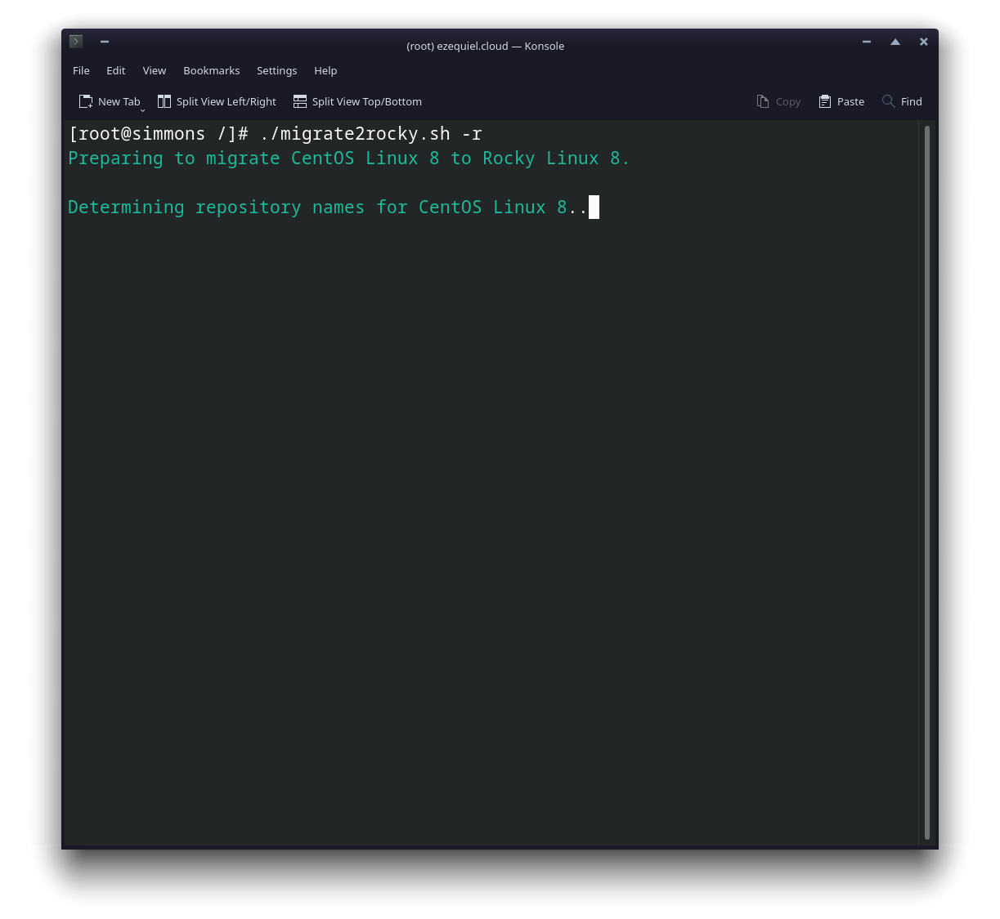
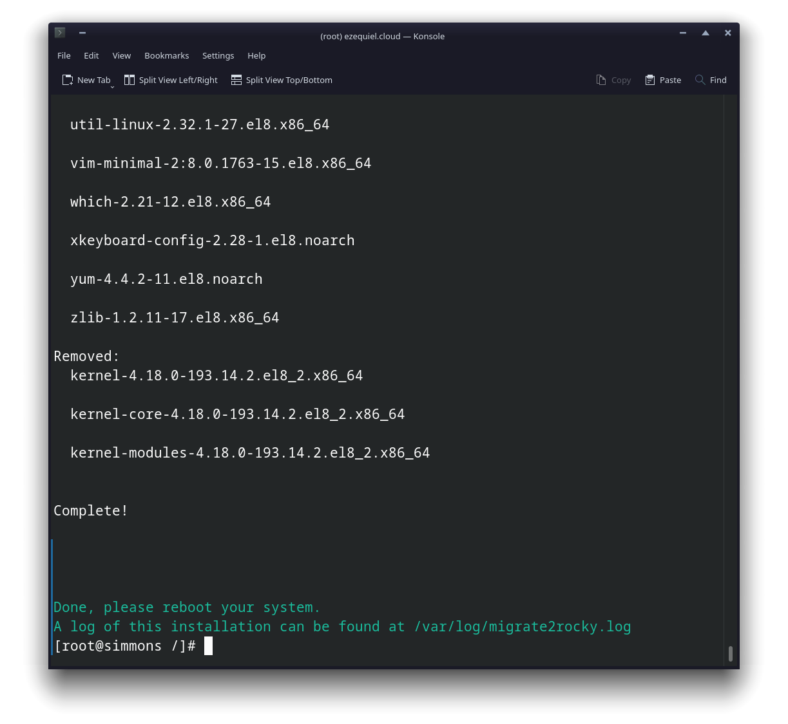
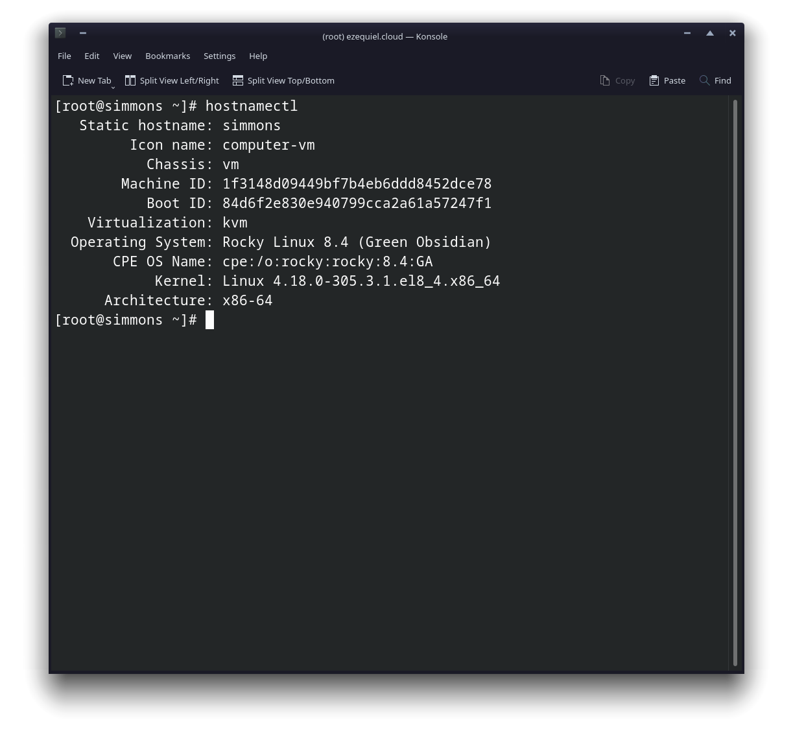

# Come migrare a Rocky Linux da CentOS Stream, CentOS, Alma Linux, RHEL, o Oracle Linux

## Prerequisiti & Presupposti

* CentOS Stream, CentOS, Alma Linux, RHEL, o Oracle Linux che funziona bene su un server hardware o VPS. La versione attualmente supportata per ciascuno di essi è la 8.8 o la 9.2.
* Conoscenza operativa della riga di comando.
* Conoscenza operativa di SSH per macchine remote.
* Un atteggiamento lievemente rischioso.
* Tutti i comandi devono essere eseguiti come root. Accedere come root, o prepararsi a digitare molti "sudo".

## Introduzione

In questa guida, imparerai come convertire tutti i sistemi operativi elencati sopra in installazioni Rocky Linux completamente funzionanti. Questo è probabilmente uno dei modi più indiretti di installare Rocky Linux, ma sarà utile per le persone in una varietà di situazioni.

Ad esempio, alcuni provider di server non supporteranno Rocky Linux per impostazione predefinita per un po'. Oppure si può avere un server di produzione che si desidera convertire in Rocky Linux senza reinstallare tutto.

Beh, abbiamo lo strumento per te: [migrate2rocky](https://github.com/rocky-linux/rocky-tools/tree/main/migrate2rocky).

È uno script che, una volta eseguito, cambierà tutti i tuoi repository in quelli di Rocky Linux. I pacchetti saranno installati e aggiornati/declassati secondo necessità, e cambierà anche tutto il marchio del vostro OS.

Non ti preoccupare, se sei nuovo nel'amministrazione dei sistemi, lo manterrò il più facile possibile. Beh, per quanto user friendly possa essere la riga di comando.

### Precisazioni e avvertimenti

1. Dai un'occhiata alla pagina README di migrate2rocky (collegata sopra), perché c'è un conflitto noto tra lo script e i repository di Katello. Nel tempo, è probabile che scopriremo (e alla fine aggiorneremo) più conflitti e incompatibilità, quindi vorrai conoscerli, soprattutto per i server di produzione.
2. Questo script è molto probabile che funzioni senza incidenti su installazioni completamente nuove. _Se volete convertire un server di produzione, per l'amore di tutto ciò che è santo e buono, **fate un backup dei dati e uno snapshot del sistema, o fatelo in un ambiente di staging prima.**_

Va Bene? Siamo pronti? Facciamolo.

## Preparare il tuo server

Avrai bisogno di prendere il file dello script dal repository. Questo può essere fatto in diversi modi.

### Il modo manuale

Scarica i file compressi da GitHub ed estrai quello di cui hai bisogno (Dovrebbe essere *migrate2rocky.sh*). È possibile trovare il file zip per qualsiasi repo GitHub sul lato destro della pagina principale del repo:


Quindi, carica l'eseguibile sul tuo server con ssh eseguendo questo comando sulla tua macchina locale:

```
scp PATH/TO/FILE/migrate2rocky.sh root@yourdomain.com:/home/
```

Correggi, cioè, regola tutti i percorsi dei file e i domini del server o gli indirizzi IP secondo necessità.

### Il modo git

Installa git sul tuo server con:

```
dnf install git
```

Quindi clona il repository rocky-tools con:

```
git clone https://github.com/rocky-linux/rocky-tools.git
```

Nota: questo metodo scaricherà tutti gli script e i file nel repository rocky-tools.

### Il modo più semplice

Questo è probabilmente il modo più semplice per ottenere lo script. È sufficiente che sul server sia installato un client HTTP adeguato (curl, wget, lynx e così via).

Supponendo che abbiate installato l'utilità `curl`, eseguite questo comando per scaricare lo script nella directory che state utilizzando:

```
curl https://raw.githubusercontent.com/rocky-linux/rocky-tools/main/migrate2rocky/migrate2rocky.sh -o migrate2rocky.sh
```

Questo comando scaricherà il file direttamente sul server e *solo* il file che vuoi. Ma ancora una volta, ci sono problemi di sicurezza che suggeriscono che questa non è necessariamente la migliore prassi, quindi tenere a mente.

## Esecuzione dello script e installazione

Usa il comando `cd` per passare alla directory in cui si trova lo script, assicurarsi che il file sia eseguibile e dare al proprietario del file dello script i permessi x.

```
chmod u+x migrate2rocky.sh
```

Ed ora, alla fine, esegui lo script:

```
./migrate2rocky.sh -r
```

Questa opzione "-r" dice allo script di andare avanti e installare tutto.

Se hai fatto tutto bene, la finestra del terminale dovrebbe assomigliare a questa:



Adesso, ci vorrà un po' allo script per convertire tutto, a seconda della macchina/server reale, e della connessione a Internet che hai.

Se vedi un messaggio **Complete!** alla fine, allora tutto va bene e puoi riavviare il server.



Dagli un po' di tempo, accedi di nuovo, e si dovrebbe avere un fantastico nuovo server Rocky Linux per giocare a wi... Intendo farci un lavoro molto serio. Esegui il comando `hostnamectl` per controllare che il tuo sistema operativo sia stato migrato correttamente, e sei pronto ad andare.


