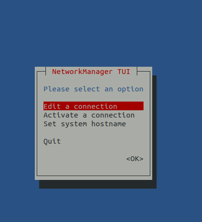
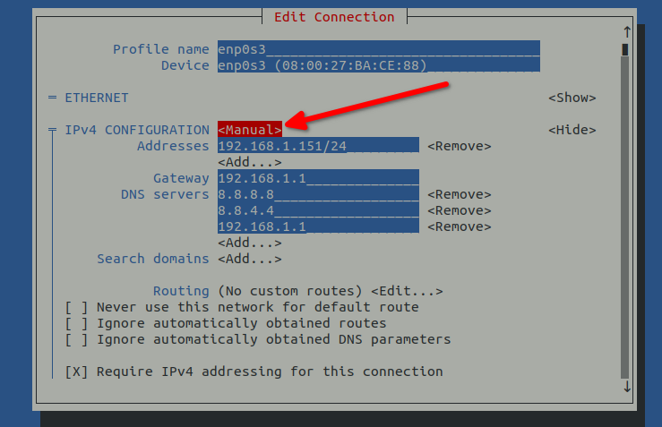
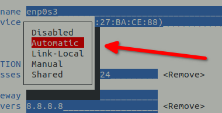
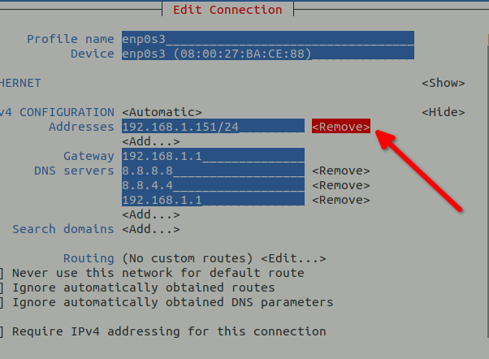

# Introduction

You can't do much with a computer these days without network connectivity. Whether you need to update the packages on a server or simply browse external websites from your laptop, you will need network access! This guide aims to provide Rocky Linux users the basic knowledge on setting up network connectivity.

## Prerequisites

* A certain amount of comfort operating from the command line
* Elevated or administrative privileges on the system (for example root, `sudo` and so on)
* Optional: familiarity with networking concepts

=== "9"
    
    ## Network Configuration - Rocky Linux 9

    A lot has changed with network configuration as of Rocky Linux 9. One of the major changes is the move from Network-Scripts (still available to install-but effectively deprecated) to the use of Network Manager and key files, rather than `ifcfg` based files. `NetworkManager` as of 9, prioritizes `keyfiles` over the previous `ifcfg` files. Since this is now the default, the act of configuring the network should now take the default as the proper way of doing things, given that other changes over the years have meant the eventual deprecation and removal of older utilities. This guide will attempt to walk you through the use of Network Manager and the latest changes within Rocky Linux 9. 

    ## Prerequisites

    * A certain amount of comfort operating from the command line
    * Elevated or administrative privileges on the system (for example root, `sudo` and so on)
    * Optional: familiarity with networking concepts

    ## Using NetworkManager service

    At the user level, the networking stack is managed by `NetworkManager`. This tool runs as a service, and you can check its state with the following command:

    ```bash
    systemctl status NetworkManager
    ```

    ## Configuration files

    As noted at the beginning, the configuration files by default are now key files. You can see how `NetworkManager` prioritizes these files by running the following command:

    ```
    NetworkManager --print-config
    ```

    This gives you output that looks like this:

    ```
    [main]
    # plugins=keyfile,ifcfg-rh
    # rc-manager=auto
    # auth-polkit=true
    # iwd-config-path=
    dhcp=dhclient
    configure-and-quit=no

    [logging]
    # backend=journal
    # audit=false

    [device]
    # wifi.backend=wpa_supplicant

    # no-auto-default file "/var/lib/NetworkManager/no-auto-default.state"
    ```

    Note at the top of the configuration file the reference to `keyfile` followed by `ifcfg-rh`. This means that the default is the `keyfile`. Any time you run any of the `NetworkManager` tools to configure an interface (example: `nmcli` or `nmtui`), it will automatically build or update key files.

    !!! tip "Configuration Storage Location"

        In Rocky Linux 8, the storage location for network configuration was in `/etc/sysconfig/Network-Scripts/`.
        With Rocky Linux 9, the new default storage location for the key files is in `/etc/NetworkManager/system-connections`. 

    The primary (but not the only) utility used for configuring a network interface is the `nmtui` command. This can also be done with the `nmcli` command, but is much less intuitive. We can show the interface as it is currently configured using `nmcli` with: 

    ```
    nmcli device show enp0s3
    GENERAL.DEVICE:                         enp0s3
    GENERAL.TYPE:                           ethernet
    GENERAL.HWADDR:                         08:00:27:BA:CE:88
    GENERAL.MTU:                            1500
    GENERAL.STATE:                          100 (connected)
    GENERAL.CONNECTION:                     enp0s3
    GENERAL.CON-PATH:                       /org/freedesktop/NetworkManager/ActiveConnection/1
    WIRED-PROPERTIES.CARRIER:               on
    IP4.ADDRESS[1]:                         192.168.1.151/24
    IP4.GATEWAY:                            192.168.1.1
    IP4.ROUTE[1]:                           dst = 192.168.1.0/24, nh = 0.0.0.0, mt = 100
    IP4.ROUTE[2]:                           dst = 0.0.0.0/0, nh = 192.168.1.1, mt = 100
    IP4.DNS[1]:                             8.8.8.8
    IP4.DNS[2]:                             8.8.4.4
    IP4.DNS[3]:                             192.168.1.1
    IP6.ADDRESS[1]:                         fe80::a00:27ff:feba:ce88/64
    IP6.GATEWAY:                            --
    IP6.ROUTE[1]:                           dst = fe80::/64, nh = ::, mt = 1024
    ```


    !!! tip "**Tips:**"  

        There are a few ways or mechanisms by which systems can be assigned their IP configuration information.
        The two most common methods are - **Static IP configuration** scheme and **Dynamic IP configuration** scheme.
        
        The static IP configuration scheme is very popular on server class systems or networks.

        The dynamic IP approach is popular on home and office networks or workstation and desktop class systems in a business environment.  The dynamic scheme usually needs _something_ extra that is locally available and that can supply proper IP configuration information to requesting workstations and desktops. This _something_ is called the Dynamic Host Configuration Protocol (DHCP). On a home network, and even on most business networks, this service is provided by a DHCP Server configured for the purpose. This can be a separate server or part of a router configuration.

    ## IP Address

    In the previous section, the displayed configuration for the interface `enp0s3` is generated from the `.ini` file  `/etc/NetworkManager/system-connections/enp0s3.nmconnection`. This shows that the IP4.ADDRESS[1] has been statically configured, rather than dynamically configured via DHCP. If we want to switch this interface back to a dynamically allocated address, the easiest way is to use the `nmtui` command. 

    1. First, run the `nmtui` command at the command-line which should show you the following
    
        

    2. It's already on the selection we need "Edit a connection" so hit the <kbd>TAB</kbd> key so that "OK" is highlighted and hit <kbd>ENTER</kbd>

    3. This will bring up a screen showing the Ethernet connections on the machine and allow you to choose one. In our case, there is *ONLY* one, so it is already highlighted, we simply need to hit the <kbd>TAB</kbd> key until "Edit" is highlighted and then hit <kbd>ENTER</kbd>

        

    4. Once we have done this, we will be on the screen showing our current configuration. What we need to do is switch from "Manual" to "Automatic" so hit the <kbd>TAB</kbd> key several times until you get to where "Manual" is highlighted and then hit <kbd>ENTER</kbd>.

        

    5. Arrow up until "Automatic" is highlighted and then hit <kbd>ENTER</kbd>
    
        

    6. Once we have switched the interface over to "Automatic" we need to remove the statically assigned IP so hit the <kbd>TAB</kbd> key until the "Remove" is highlighted next to the IP address and hit <kbd>ENTER</kbd>.

        

    7. Finally, hit the <kbd>TAB</kbd> key several times until you get to the bottom of the `nmtui` screen and the "OK" is highlighted and hit <kbd>ENTER</kbd>

    You can deactivate and reactivate your interface with `nmtui` as well, but instead let's do this with `nmcli`. In this way we can string the deactivation of the interface and the reactivation of the interface so that the interface is never down for long:

    ```
    nmcli con down enp0s3 && nmcli con up enp0s3
    ```

    Think of this as the equivalent to the old `ifdown enp0s3 && ifup enp0s3` used in older versions of the OS.

    To verify that it worked, go ahead and check using either the `ip addr` command, or the `nmcli device show enp0s3` command that we used earlier.

    ```
    ip addr
    ```

    If successful, you should now see that the static IP is removed and that a dynamically allocated address has been added, similar to this:

    ```bash
    2: enp0s3: <BROADCAST,MULTICAST,UP,LOWER_UP> mtu 1500 qdisc fq_codel state UP group default qlen 1000
    link/ether 08:00:27:ba:ce:88 brd ff:ff:ff:ff:ff:ff
    inet 192.168.1.137/24 brd 192.168.1.255 scope global dynamic noprefixroute enp0s3
       valid_lft 6342sec preferred_lft 6342sec
    inet6 fe80::a00:27ff:feba:ce88/64 scope link noprefixroute 
       valid_lft forever preferred_lft forever
    ```

    ### IP Address Changing with `nmcli`

    Using the `nmtui` is nice, but if you just want to quickly reconfigure the network interface without all of the time between screens, you probably will want to use `nmcli` by itself. Let us look at the example above of a statically assigned IP and the steps to reconfigure the interface to DHCP using only `nmcli`.

    Before we start, be aware that to reconfigure the interface to DHCP we need to: 

    * Remove the IPv4 Gateway 
    * Remove the IPv4 Address that we statically assigned
    * Change the IPv4 Method to automatic
    * Down and Up the interface

    Note too, that we are not using examples that tell you to use -ipv4.address etc. These do not change the interface completely. To do that we must set the ipv4.address and the ipv4.gateway to an empty string. Again, to save as much time as possible with our command, we are going to string them all together in one line:

    ```
    nmcli con mod enp0s3 ipv4.gateway '' && nmcli con mod enp0s3 ipv4.address '' && nmcli con mod enp0s3 ipv4.method auto && nmcli con down enp0s3 && nmcli con up enp0s3
    ```

    Running the `ip addr` command again, should show you the exact same results as when we ran the changes with `nmtui`. We could obviously do everything in reverse as well (changing our DHCP address to a static one). To do this, we would run the commands in reverse starting with changing the `ipv4.method` to manual, setting the `ipv4.gateway` and then setting the `ipv4.address`. Since in all of these examples we are completely reconfiguring the interface and not adding or subtracting values to it, we again would not use the examples out there that talk about using `+ipv4.method`,`+ipv4.gateway`, and `+ipv4.address`. If you used these commands instead of the ones we have used above, you would end up with an interface with *BOTH* a DHCP assigned address and a statically assigned one. That said, this can sometimes be very handy. If you have a web service listening on one IP lets say, and an SFTP server listening on another IP. Having a method of assigning multiple IP's to an interface is quite useful. 

    ## DNS resolution

    Setting DNS servers can be done with either `nmtui` or `nmcli`. While the `nmtui` interface is easy to navigate and much more intuitive, the process is much slower. Doing this with the `nmcli` is much faster. In the case of the DHCP assigned address, it's not usually necessary to set DNS servers as they normally are forwarded on from the DHCP server. That said, you *can* statically add DNS servers to a DHCP interface. In the case of the statically assigned interface, you will *HAVE* to do this as it will need to know how to get DNS resolution and will not have an automatically assigned method.

    Since the best example for all of this is a statically assigned IP, let's return to our original statically assigned address in our example interface (enp0s3). Before changing the DNS values, we need to see what they are currently. 
    To get proper name resolution, remove the already set DNS servers and add different ones. Currently the `ipv4.dns` is set to `8.8.8.8,8.8.4.4,192.168.1.1`. In this case, we do not need to set the ipv4.dns to an empty string. We can simply use the following command to replace our values: 

    ```
    nmcli con mod enp0s3 ipv4.dns '208.67.222.222,208.67.220.220,192.168.1.1'
    ```

    Running `nmcli con show enp0s3 | grep ipv4.dns` should show you that we have successfully changed the DNS servers. To activate everything, let's bring our interface down and up again so that our changes are active:

    ```
    nmcli con down enp0s3 && nmcli con up enp0s3
    ```

    To test that we *do* have name resolution, try pinging a known host. We will use google.com as an example:

    ```bash
    ping google.com
    PING google.com (172.217.4.46) 56(84) bytes of data.
    64 bytes from lga15s46-in-f14.1e100.net (172.217.4.46): icmp_seq=1 ttl=119 time=14.5 ms
    64 bytes from lga15s46-in-f14.1e100.net (172.217.4.46): icmp_seq=2 ttl=119 time=14.6 ms
    64 bytes from lga15s46-in-f14.1e100.net (172.217.4.46): icmp_seq=3 ttl=119 time=14.4 ms
    ^C
    ```

    ## Using The `ip` Utility

    The `ip` command (provided by the *iproute2* package) is a powerful tool to get information and configure the network of a modern Linux system such as Rocky Linux.

    In this example, we will assume the following parameters:

    * interface name: enp0s3
    * ip address: 192.168.1.151
    * subnet mask: 24
    * gateway: 192.168.1.1

    ### Get general information

    To see the detailed state of all interfaces, use

    ```bash
    ip a
    ```

    !!! tip "**Pro tips:**"

        * use the `-c` flag to get a more readable coloured output: `ip -c a`.
	    * `ip` accepts abbreviation so `ip a`, `ip addr` and `ip address` are equivalent

    ### Bring interface up or down

    !!! note 

        While it is still possible to use this method to bring the interface up and down in Rocky Linux 9, the command reacts much slower than simply using the `nmcli` command.

    To bring the *enp0s3* down and up again we can simply use: 

    ```
    ip link set enp0s3 down && ip link set enp0s3 up
    ```

    ### Assign the interface a static address

    Currently, our enp0s3 interface has an IP address of 192.168.1.151. To switch that to 192.168.1.152, we would remove the old IP with

    ```bash
    ip addr delete 192.168.1.151/24 dev enp0s3 && ip addr add 192.168.1.152/24 dev enp0s3
    ```

    If we wanted a second IP assigned to the interface instead of removing the 192.168.1.151 address, we would simply add the second address with:

    ```bash
    ip addr add 192.168.1.152/24 dev enp0s3
    ```

    We can check to see if the IP address was added with 

    ```bash
    ip a show dev enp0s3
    ```

    will output:

    ```bash
    2: enp0s3: <BROADCAST,MULTICAST,UP,LOWER_UP> mtu 1500 qdisc fq_codel state UP group default qlen 1000
    link/ether 08:00:27:ba:ce:88 brd ff:ff:ff:ff:ff:ff
    inet 192.168.1.151/24 brd 192.168.1.255 scope global noprefixroute enp0s3
       valid_lft forever preferred_lft forever
    inet 192.168.1.152/24 scope global secondary enp0s3
       valid_lft forever preferred_lft forever
    inet6 fe80::a00:27ff:feba:ce88/64 scope link noprefixroute 
       valid_lft forever preferred_lft forever
    ```

    While bringing the interface up and down using the `ip` utility is much slower than `nmcli`, `ip` has a distinct advantage when setting new or additional IP addresses, as it happens in real time, without bringing the interface down and up.

    ### Gateway configuration


    Now that the interface has an address, we have to set its default route. This can be done with:

    ```bash
    ip route add default via 192.168.1.1 dev enp0s3
    ```

    The kernel routing table can be displayed with

    ```bash
    ip route
    ```

    or `ip r` for short.

    This should output something like this:

    ```bash
    default via 192.168.1.1 dev enp0s3 
    192.168.1.0/24 dev enp0s3 proto kernel scope link src 192.168.1.151 metric 100
    ```

    ## Checking network connectivity

    Throughout the examples above we have done some testing. Your best bet for testing is to start by pinging the default gateway. This should always work:

    ```bash
    ping -c3 192.168.1.1
    PING 192.168.1.1 (192.168.1.1) 56(84) bytes of data.
    64 bytes from 192.168.1.1: icmp_seq=1 ttl=64 time=0.437 ms
    64 bytes from 192.168.1.1: icmp_seq=2 ttl=64 time=0.879 ms
    64 bytes from 192.168.1.1: icmp_seq=3 ttl=64 time=0.633 ms
    ```

    Next, test to see if your LAN routing is working completely by pinging a host on your local network:

    ```bash
    ping -c3 192.168.1.10
    PING 192.168.1.10 (192.168.1.10) 56(84) bytes of data.
    64 bytes from 192.168.1.10: icmp_seq=2 ttl=255 time=0.684 ms
    64 bytes from 192.168.1.10: icmp_seq=3 ttl=255 time=0.676 ms
    ```

    Test to ensure we cam see a reachable host external to your network. For the test below, we are using Google's open DNS server:

    ```bash
    ping -c3 8.8.8.8
    PING 8.8.8.8 (8.8.8.8) 56(84) bytes of data.
    64 bytes from 8.8.8.8: icmp_seq=1 ttl=119 time=19.8 ms
    64 bytes from 8.8.8.8: icmp_seq=2 ttl=119 time=20.2 ms
    64 bytes from 8.8.8.8: icmp_seq=3 ttl=119 time=20.1 ms
    ```

    The final test is to ensure that DNS resolution is working. For this example, we are using google.com:

    ```bash
    ping -c3 google.com
    PING google.com (172.217.4.46) 56(84) bytes of data.
    64 bytes from lga15s46-in-f14.1e100.net (172.217.4.46): icmp_seq=1 ttl=119 time=14.5 ms
    64 bytes from lga15s46-in-f14.1e100.net (172.217.4.46): icmp_seq=2 ttl=119 time=15.1 ms
    64 bytes from lga15s46-in-f14.1e100.net (172.217.4.46): icmp_seq=3 ttl=119 time=14.6 ms
    ```

    If your machine has several interfaces and you want to test from a particular interface, simply use the `-I` option with ping:

    ```bash
    ping -I enp0s3 -c3 192.168.1.10
    ```

    ## Conclusions

    There are many changes to the networking stack in Rocky Linux 9. Among these is the prioritization of `keyfile` over the formerly used `ifcfg` files found in Network-Scripts. Since the direction of movement here in future versions of Rocky Linux will deprecate and remove Network-Scripts, it is best to focus attention on methodologies such as `nmcli`, `nmtui`, and in some cases `ip`, for network configuration.

=== "8"

    ## Network Configuration - Rocky Linux 8

    ## Using NetworkManager service

    At the user level, the networking stack is managed by *NetworkManager*. This tool runs as a service, and you can check its state with the following command:

    ```bash
    systemctl status NetworkManager
    ```

    ### Configuration files

    NetworkManager simply applies a configuration read from the files found in `/etc/sysconfig/network-scripts/ifcfg-<IFACE_NAME>`.
    Each network interface has its configuration file. The following shows an example of the default configuration of a server:

    ```bash
    TYPE=Ethernet
    PROXY_METHOD=none
    BROWSER_ONLY=no
    BOOTPROTO=none
    DEFROUTE=yes
    IPV4_FAILURE_FATAL=no
    IPV6INIT=no
    NAME=enp1s0
    UUID=74c5ccee-c1f4-4f45-883f-fc4f765a8477
    DEVICE=enp1s0
    ONBOOT=yes
    IPADDR=10.0.0.10
    PREFIX=24
    GATEWAY=10.0.0.1
    DNS1=10.0.0.1
    DNS2=1.1.1.1
    IPV6_DISABLED=yes
    ```

    The interface's name is **enp1s0** so this file's name will be `/etc/sysconfig/network-scripts/ifcfg-enp1s0`.

    !!! tip "**Tips:**"  

        There are a few ways or mechanisms by which systems can be assigned their IP configuration information. The two most common methods are - **Static IP configuration** scheme and **Dynamic IP configuration** scheme.

        The static IP configuration scheme is very popular on server class systems or networks.

        The dynamic IP approach is popular on home and office networks - or workstation and desktop class systems.  The dynamic scheme usually needs _something_ extra that is locally available that can supply proper IP configuration information to requesting workstations and desktops. This _something_ is called the Dynamic Host Configuration Protocol (DHCP).

       Home or office users often do not have to worry about DHCP. This is because the something else automatically takes care of that in the background. The end user needs to physically or wirelessly connect to the right network (and of course make sure that their systems are powered on)!
    
    ### IP Address

    In the previous `/etc/sysconfig/network-scripts/ifcfg-enp1s0` listing, we see that the value of the `BOOTPROTO` parameter or key is set to `none`. The configured system is set to a static IP address scheme.

    If instead you want to configure the system to use a dynamic IP address scheme, you will have to change the value of the `BOOTPROTO` parameter from `none` to `dhcp` and also remove the `IPADDR`, `PREFIX` and `GATEWAY` lines. This is necessary because all that information will be automatically obtained from any available DHCP server.

    To configure a static IP address attribution, set the following:

    * IPADDR: the IP address to assign the interface
    * PREFIX: the subnet mask in [CIDR notation](https://en.wikipedia.org/wiki/Classless_Inter-Domain_Routing#CIDR_notation)
    * GATEWAY: the default gateway

    The `ONBOOT` parameter set to `yes` indicates that this connection will be activated during boot time.

    ### DNS resolution

    To get proper name resolution, the following parameters must be set:

    * DNS1: IP address of the main nameserver
    * DNS2: the secondary nameserver IP address

    ### Checking configuration

    You can check that the configuration has been correctly applied with the following `nmcli` command:

    ```bash
    [user@server ~]$ sudo nmcli device show enp1s0
    ```

    which should give you the following output:

    ```conf
    GENERAL.DEVICE:                         enp1s0
    GENERAL.TYPE:                           ethernet
    GENERAL.HWADDR:                         6E:86:C0:4E:15:DB
    GENERAL.MTU:                            1500
    GENERAL.STATE:                          100 (connecté)
    GENERAL.CONNECTION:                     enp1s0
    GENERAL.CON-PATH:                       /org/freedesktop/NetworkManager/ActiveConnection/1
    WIRED-PROPERTIES.CARRIER:               marche
    IP4.ADDRESS[1]:                         10.0.0.10/24
    IP4.GATEWAY:                            10.0.0.1
    IP4.ROUTE[1]:                           dst = 10.0.0.0/24, nh = 0.0.0.0, mt = 100
    IP4.ROUTE[2]:                           dst = 0.0.0.0/0, nh = 10.0.0.1, mt = 100
    IP4.DNS[1]:                             10.0.0.1
    IP4.DNS[2]:                             1.1.1.1
    IP6.GATEWAY:                            --
    ```

    ### CLI

    NetworkManager's primary function is managing "connections", which map a physical device to more logical network components like an IP address and DNS settings.
    To view the existing connections NetworkManager maintains, you can run `nmcli connection show`.

    ```bash
    [user@server ~]$ sudo nmcli connection show
    NAME    UUID                                  TYPE      DEVICE
    enp1s0  625a8aef-175d-4692-934c-2c4a85f11b8c  ethernet  enp1s0
    ```

    From the output above, we can determine that NetworkManager manages a connection (`NAME`) called `enp1s0` that maps to the physical device (`DEVICE`) `enp1s0`.

    !!! tip "Connection name"

        In this example, the connection and device share the same name, but this may not always be true. It is common to see a connection called `System eth0` that maps to a device called `eth0`, for example.

    Now that we know the name of our connection, we can view its settings. To do this, use the `nmcli connection show [connection]` command, which will print out all of the settings NetworkManager registers for the given connection.

    ```bash
    [user@server ~]$ sudo nmcli connection show enp1s0
    ...
    ipv4.method:                            auto
    ipv4.dns:                               --
    ipv4.dns-search:                        --
    ipv4.dns-options:                       --
    ipv4.dns-priority:                      0
    ipv4.addresses:                         --
    ipv4.gateway:                           --
    ipv4.routes:                            --
    ipv4.route-metric:                      -1
    ipv4.route-table:                       0 (unspec)
    ipv4.routing-rules:                     --
    ipv4.ignore-auto-routes:                no
    ipv4.ignore-auto-dns:                   no
    ipv4.dhcp-client-id:                    --
    ipv4.dhcp-iaid:                         --
    ipv4.dhcp-timeout:                      0 (default)
    ipv4.dhcp-send-hostname:                yes
    ...
    ```

    Down the left-hand column, we see the name of the setting, and down the right we see the value.

    For example, we can see that the `ipv4.method` here is currently set to `auto`. There are many allowed values for the `ipv4.method` setting, but the main two you will most likely see are:

    * `auto`: the appropriate automatic method (DHCP, PPP, etc) is used for the interface and most other properties can be left unset.
    * `manual`: static IP addressing is used and at least one IP address must be given in the 'addresses' property.

    If instead you want to configure the system to use a static IP address scheme, you will have to change the value of `ipv4.method` to `manual`, and also specify the `ipv4.gateway` and `ipv4.addresses`.

    To modify a setting, you can use the nmcli command `nmcli connection modify [connection] [setting] [value]`.

    ```bash
    # set 10.0.0.10 as the static ipv4 address
    [user@server ~]$ sudo nmcli connection modify enp1s0 ipv4.addresses 10.0.0.10

    # set 10.0.0.1 as the ipv4 gateway
    [user@server ~]$ sudo nmcli connection modify enp1s0 ipv4.gateway 10.0.0.1

    # change ipv4 method to use static assignments (set in the previous two commands)
    [user@server ~]$ sudo nmcli connection modify enp1s0 ipv4.method manual
    ```

    !!! tip "When does the connection get updated?"

        `nmcli connection modify` will not modify the *runtime* configuration, but update the `/etc/sysconfig/network-scripts` configuration files with the appropriate values based on what you have told `nmcli` to configure.

    To configure your DNS servers with NetworkManager via the CLI, you can modify the `ipv4.dns` setting.

    ```bash
    # set 10.0.0.1 and 1.1.1.1 as the primary and secondary DNS servers
    [user@server ~]$ sudo nmcli connection modify enp1s0 ipv4.dns '10.0.0.1 1.1.1.1'
    ```

    ### Apply configuration

    To apply the network configuration, you can use the `nmcli connection up [connection]` command.

    ```bash
    [user@server ~]$ sudo nmcli connection up enp1s0
    Connection successfully activated (D-Bus active path: /org/freedesktop/NetworkManager/ActiveConnection/2)
    ```

    To get the connection state, simply use:

    ```bash
    [user@server ~]$ sudo nmcli connection show
    NAME    UUID                                  TYPE      DEVICE
    enp1s0  625a8aef-175d-4692-934c-2c4a85f11b8c  ethernet  enp1s0
    ```

    You can also use the `ifup` and `ifdown` commands to bring the interface up and down (they are simple wrappers around `nmcli`):

    ```bash
    [user@server ~]$ sudo ifup enp1s0
    [user@server ~]$ sudo ifdown enp1s0
    ```

    ## Using ip utility

    The `ip` command (provided by the *iproute2* package) is a powerful tool to get information and configure the network of a modern Linux system such as Rocky Linux.

    In this example, we will assume the following parameters:

    * interface name: ens19
    * ip address: 192.168.20.10
    * subnet mask: 24
    * gateway: 192.168.20.254

    ### Get general information

    To see the detailed state of all interfaces, use

    ```bash
    ip a
    ```

    !!! tip "**Pro tips:**"

        * use the `-c` flag to get a more readable coloured output: `ip -c a`.
	    * `ip` accepts abbreviation so `ip a`, `ip addr` and `ip address` are equivalent

    ### Bring interface up or down

    To bring the *ens19* interface up, simply use `ip link set ens19 up` and to bring it down, use `ip link set ens19 down`.

    ### Assign the interface a static address

    The command to be used is of the form:

    ```bash
    ip addr add <IP ADDRESS/CIDR> dev <IFACE NAME>
    ```

    To assign the above example parameters, we will use:

    ```bash
    ip a add 192.168.20.10/24 dev ens19
    ```

    Then, checking the result with:

    ```bash
    ip a show dev ens19
    ```

    will output:

    ```bash
	3: ens19: <BROADCAST,MULTICAST,UP,LOWER_UP> mtu 1500 qdisc fq_codel state UP group default qlen 1000
		link/ether 4a:f2:f5:b6:aa:9f brd ff:ff:ff:ff:ff:ff
		inet 192.168.20.10/24 scope global ens19
		valid_lft forever preferred_lft forever
    ```

    Our interface is up and configured, but it is still lacking something!

    ### Using ifcfg utility

    To add the *ens19* interface our new example IP address, use the following command:

    ```bash
    ifcfg ens19 add 192.168.20.10/24
    ```

    To remove the address:

    ```bash
    ifcfg ens19 del 192.168.20.10/24
    ```

    To altogether turn off the IP address on this interface:

    ```bash
    ifcfg ens19 stop
    ```

    *Note that this does not bring the interface down, it simply unassigns all IP addresses from the interface.*

    ### Gateway configuration

    Now that the interface has an address, we have to set its default route, this can be done with:

    ```bash
    ip route add default via 192.168.20.254 dev ens19
    ```

    The kernel routing table can be displayed with

    ```bash
    ip route
    ```

    or `ip r` for short.

    ## Checking network connectivity

    At this point, you should have your network interface up and properly configured. There are several ways to verify your connectivity.

    By *pinging* another IP address in the same network (we will use `192.168.20.42` as an example):

    ```bash
    ping -c3 192.168.20.42
    ```

    This command will issue 3 *pings* (known as ICMP request) and wait for a reply. If everything went fine, you should get this output:

    ```bash
    PING 192.168.20.42 (192.168.20.42) 56(84) bytes of data.
    64 bytes from 192.168.20.42: icmp_seq=1 ttl=64 time=1.07 ms
    64 bytes from 192.168.20.42: icmp_seq=2 ttl=64 time=0.915 ms
    64 bytes from 192.168.20.42: icmp_seq=3 ttl=64 time=0.850 ms

    --- 192.168.20.42 ping statistics ---
    3 packets transmitted, 3 received, 0% packet loss, time 5ms
    rtt min/avg/max/mdev = 0.850/0.946/1.074/0.097 ms
    ```

    Then, to make sure your routing configuration is fine, try to *ping* a external host, such as this well known public DNS resolver:

    ```bash
    ping -c3 8.8.8.8
    ```

    If your machine has several network interfaces and you want to make ICMP request via a specific interface, you can use the `-I` flag:

    ```bash
    ping -I ens19 -c3 192.168.20.42
    ```

    It is now time to ensure that DNS resolution is working correctly. As a reminder, DNS resolution is a mechanism used to convert human friendly machine names into their IP addresses and the other way round (reverse DNS).

    If the `/etc/resolv.conf` file indicates a reachable DNS server, then the following should work:

    ```bash
    host rockylinux.org
    ```

    The result should be:

    ```bash
    rockylinux.org has address 76.76.21.21
    ```

    ## Conclusions

    Rocky Linux 8 has the tools to configure your network from the command line. This document should get you up and running with those tools quickly.
