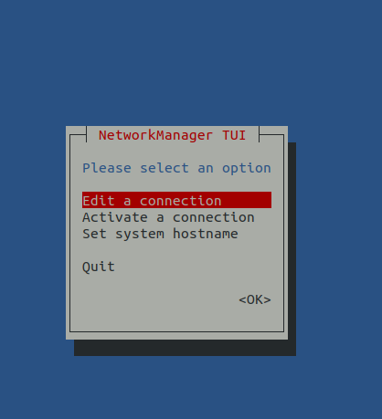
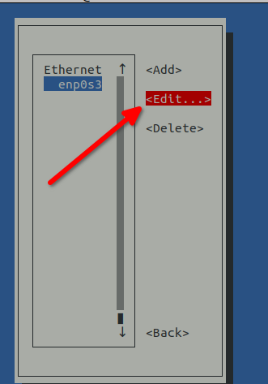

## Вступ

You cannot do much with a computer these days without network connectivity. Незалежно від того, чи потрібно вам оновити пакети на сервері чи переглядати зовнішні веб-сайти зі свого ноутбука, вам знадобиться доступ до мережі. Метою цього посібника є надання користувачам Rocky Linux базових знань щодо налаштування підключення до мережі.

Багато чого змінилося в конфігурації мережі з Rocky Linux 10. Одна з головних змін — це видалення мережевих скриптів (застарілих у Rocky Linux 9) для використання мережевого менеджера та ключових файлів. `NetworkManager`, починаючи з версії 10, наполягає на `ключових файлах` замість попередніх файлів `ifcfg`. Цей посібник має на меті ознайомити вас із використанням Network Manager та останніми змінами в Rocky Linux 10.

## Передумови

- Певний комфорт роботи з командного рядка
- Підвищені або адміністративні привілеї в системі (наприклад, root, `sudo` тощо)
- Додатково: знайомство з мережевими концепціями

## Використання служби NetworkManager

На рівні користувача мережевий стек керується `NetworkManager`. Цей інструмент працює як сервіс. Ви можете перевірити його стан за допомогою наступної команди:

```bash
systemctl status NetworkManager
```

## Файли конфігурації

Як зазначалося на початку, файли конфігурації за замовчуванням тепер життєво важливі. Ви можете побачити, як `NetworkManager` визначає пріоритет цих файлів, виконавши таку команду:

```
NetworkManager --print-config
```

Це дає вам цей або подібний результат:

```
systemctl status NetworkManager
```

Зверніть увагу на посилання на ' keyfile' у верхній частині конфігураційного файлу. Кожного разу, коли ви запускаєте будь-який із інструментів `NetworkManager` для налаштування інтерфейсу (приклад: `nmcli` або `nmtui`), він автоматично створюватиме або оновлюватиме ключові файли.

!!! tip "Місце зберігання конфігурації"

    У Rocky Linux 10 ключові файли зберігаються за замовчуванням у `/etc/NetworkManager/system-connections`.

Основною (але не єдиною) утилітою, яка використовується для налаштування мережевого інтерфейсу, є команда `nmtui`. Ви також можете зробити це за допомогою команди `nmcli`, але це набагато менш інтуїтивно зрозуміло. Ви можете показати інтерфейс у його поточному вигляді за допомогою `nmcli`:

```
nmcli device show enp0s3
GENERAL.DEVICE:                         enp0s3
GENERAL.TYPE:                           ethernet
GENERAL.HWADDR:                         08:00:27:BA:CE:88
GENERAL.MTU:                            1500
GENERAL.STATE:                          100 (connected)
GENERAL.CONNECTION:                     enp0s3
GENERAL.CON-PATH:                       /org/freedesktop/NetworkManager/ActiveConnection/1
WIRED-PROPERTIES.CARRIER:               on
IP4.ADDRESS[1]:                         192.168.1.151/24
IP4.GATEWAY:                            192.168.1.1
IP4.ROUTE[1]:                           dst = 192.168.1.0/24, nh = 0.0.0.0, mt = 100
IP4.ROUTE[2]:                           dst = 0.0.0.0/0, nh = 192.168.1.1, mt = 100
IP4.DNS[1]:                             8.8.8.8
IP4.DNS[2]:                             8.8.4.4
IP4.DNS[3]:                             192.168.1.1
IP6.ADDRESS[1]:                         fe80::a00:27ff:feba:ce88/64
IP6.GATEWAY:                            --
IP6.ROUTE[1]:                           dst = fe80::/64, nh = ::, mt = 1024
```

!!! tip "**Поради:**"  

    Існує кілька механізмів, за допомогою яких системи отримують інформацію про конфігурацію IP.
    Два найпоширеніші методи – це схеми **налаштування статичної IP-адреси** та **налаштування динамічної IP-адреси**.
    
    Схема конфігурації статичної IP-адреси дуже популярна в системах або мережах серверного класу.
    
    Підхід з динамічними IP-адресами популярний у домашніх та офісних мережах, а також на системах робочих станцій та настільних комп'ютерів у бізнес-середовищі.  Динамічна схема зазвичай потребує *чогось* додаткового, що доступне локально та може надавати належну інформацію про конфігурацію IP запитуючим робочим станціям та настільним комп'ютерам. Це *щось* називається протоколом динамічної конфігурації хоста (DHCP). У домашній мережі та навіть у більшості бізнес-мереж ця послуга надається сервером DHCP, налаштованим для цієї мети. Це може бути окремий сервер або частина конфігурації маршрутизатора.

## IP-адреса

У попередньому розділі відображена конфігурація для інтерфейсу `enp0s3` генерується з файлу `.ini` `/etc/NetworkManager/system-connections/enp0s3.nmconnection`. Це показує, що IP4.ADDRESS[1] налаштовано статично, а не динамічно за допомогою DHCP. Якщо ви хочете перемкнути цей інтерфейс назад на динамічно виділену адресу, найпростіший спосіб – скористатися командою `nmtui`.

 1. Спочатку запустіть команду `nmtui` в командному рядку, яка має показати наступне:

    

 2. Нам уже потрібне «Редагувати з’єднання» у виділеному пункті, тож натисніть клавішу ++tab++, щоб виділити «ОК», і натисніть ++enter++

 3. Відкриється екран, на якому показано підключення Ethernet на машині, і ви зможете вибрати одне з них. У нашому випадку є *ЛИШЕ* один, тому він уже виділений. Вам потрібно натискати клавішу ++Tab++, доки не буде виділено пункт «Редагувати», а потім натиснути ++Enter++.

    

 4. Коли ми це зробимо, ми будемо на екрані, де буде показано нашу поточну конфігурацію. Що нам потрібно зробити, це перемкнутися з «Вручну» на «Автоматично», тому кілька разів натисніть клавішу ++tab++, доки не дійдете до місця, де буде виділено «Вручну», а потім натисніть ++enter++.

    

 5. Стрілка вгору, доки не буде виділено «Автоматично», а потім натисніть ++enter++

    

 6. Після того, як ви переключили інтерфейс на "Автоматичний", вам потрібно видалити статично призначену IP-адресу. Натискайте клавішу ++tab++, доки поруч з IP-адресою не з’явиться напис «Видалити», і натисніть ++enter++.

    

 7. Нарешті натисніть клавішу ++tab++ кілька разів, доки не дійдете до нижньої частини екрана `nmtui` і не буде виділено «OK», а потім натисніть ++enter++

Ви також можете вимкнути та знову активувати свій інтерфейс за допомогою `nmtui`, але натомість зробимо це за допомогою `nmcli`. Таким чином, ви можете послідовно налаштувати деактивацію інтерфейсу та його повторну активацію, щоб інтерфейс ніколи не був недоступним надовго:

```
nmcli con down enp0s3 && nmcli con up enp0s3
```

Уявіть собі це як еквівалент старих команд `ifdown enp0s3 && ifup enp0s3`, що використовувалися в старіших версіях операційної системи.

Щоб переконатися, що це спрацювало, перевірте це за допомогою команди `ip addr` або команди `nmcli device show enp0s3`, яку використовували раніше.

```
ip addr
```

Якщо все вийде, ви побачите видалення статичної IP-адреси та додавання динамічно виділеної адреси, подібне до цього:

```bash
2: enp0s3: <BROADCAST,MULTICAST,UP,LOWER_UP> mtu 1500 qdisc fq_codel state UP group default qlen 1000
link/ether 08:00:27:ba:ce:88 brd ff:ff:ff:ff:ff:ff
inet 192.168.1.137/24 brd 192.168.1.255 scope global dynamic noprefixroute enp0s3
    valid_lft 6342sec preferred_lft 6342sec
inet6 fe80::a00:27ff:feba:ce88/64 scope link noprefixroute 
    valid_lft forever preferred_lft forever
```

### Зміна IP-адреси за допомогою `nmcli`

Користуватися `nmtui` добре, але якщо ви хочете швидко переналаштувати мережевий інтерфейс, не витрачаючи час між екранами, ви, ймовірно, захочете використовувати `nmcli` окремо. Розгляньте попередній приклад статично призначеної IP-адреси та кроки для переналаштування інтерфейсу на DHCP, використовуючи лише `nmcli`.

Перш ніж розпочати, пам’ятайте, що для переналаштування інтерфейсу на DHCP вам потрібно:

- Видаліть шлюз IPv4
- Підвищені або адміністративні привілеї в системі (наприклад, root, `sudo` тощо)
- Змініть метод IPv4 на автоматичний
- Інтерфейс вниз і вгору

Також зауважте, що ви не використовуєте приклади, які вказують на використання -ipv4.address тощо. Вони не змінюють повністю інтерфейс. Для цього потрібно встановити для Ipv4.address та Ipv4.gateway порожній рядок. Знову ж таки, щоб максимально заощадити час на вашій команді, об'єднайте їх усі в один рядок:

```bash
nmcli con mod enp0s3 ipv4.gateway '' && nmcli con mod enp0s3 ipv4.address '' && nmcli con mod enp0s3 ipv4.method auto && nmcli con down enp0s3 && nmcli con up enp0s3
```

Повторний запуск команди `ip addr` має показати ті ж результати, що й під час внесення змін за допомогою `nmtui`. Ви також можете зробити все навпаки (змінити свою DHCP-адресу на статичну). Щоб зробити це, потрібно виконати команди у зворотному порядку, починаючи зі зміни `ipv4.method` на manual, встановлюючи `ipv4.gateway`, а потім встановлюючи `ipv4.address`. Оскільки в усіх цих прикладах ви повністю переналаштовуєте інтерфейс, а не додаєте чи віднімаєте до нього значення, ви не використовуватимете приклади, які говорять про використання `+ipv4.method`,`+ipv4.gateway` та `+ipv4.address`. Якщо ви використаєте ці команди замість тих, що наведені в попередніх прикладах, ви отримаєте інтерфейс з *ЯК* адресою, призначеною DHCP, так і статично призначеною. Проте інколи це може бути дуже зручно. Якщо у вас є веб-сервіс, який прослуховує одну IP-адресу, скажімо, та `sftp`-сервер, який прослуховує іншу IP-адресу. Наявність методу призначення кількох IP-адрес інтерфейсу є досить корисним.

## Роздільна здатність DNS

Ви можете налаштувати DNS-сервери за допомогою `nmtui` або `nmcli`. Хоча інтерфейс `nmtui` простий у навігації та набагато більш інтуїтивно зрозумілий, процес набагато повільніший. Зробити це за допомогою `nmcli` набагато швидше. Для адрес, призначених DHCP, зазвичай не потрібно налаштовувати DNS-сервери, оскільки вони зазвичай переадресовуються DHCP-сервером. Проте ви *можете* статично додавати DNS-сервери до інтерфейсу DHCP. У випадку зі статично призначеним інтерфейсом ви *МАЄТЕ* це зробити, оскільки йому потрібно знати, як отримати дозвіл DNS, і не матимете автоматично призначеного методу.

Оскільки найкращим прикладом усього цього є статично призначена IP-адреса, повернімося до прикладу інтерфейсу (enp0s3) та його статично призначеної адреси. Перш ніж змінювати значення DNS, потрібно перевірити їх поточні значення. Щоб отримати правильний дозвіл імен, видаліть уже налаштовані DNS-сервери та додайте інші. Наразі `ipv4.dns` — `8.8.8.8,8.8.4.4,192.168.1.1`. У цьому випадку вам не потрібно встановлювати ipv4.dns у порожній рядок. Ви можете використати таку команду для заміни значень:

```bash
nmcli con mod enp0s3 ipv4.dns '208.67.222.222,208.67.220.220,192.168.1.1'
```

Виконання команди `nmcli con show enp0s3 | grep ipv4.dns` має показати вам, що ви успішно змінили DNS-сервери. Щоб активувати все, опустіть і знову підніміть інтерфейс, щоб ваші зміни були активними:

```bash
nmcli con down enp0s3 && nmcli con up enp0s3
```

Щоб перевірити, чи є у вас *дійсно* розпізнавання імен, спробуйте ping-нути відомий хост. Використайте google.com як приклад:

```bash
ping google.com
PING google.com (172.217.4.46) 56(84) bytes of data.
64 bytes from lga15s46-in-f14.1e100.net (172.217.4.46): icmp_seq=1 ttl=119 time=14.5 ms
64 bytes from lga15s46-in-f14.1e100.net (172.217.4.46): icmp_seq=2 ttl=119 time=14.6 ms
64 bytes from lga15s46-in-f14.1e100.net (172.217.4.46): icmp_seq=3 ttl=119 time=14.4 ms
^C
```

## Використання утиліти `ip`

Команда `ip` (надається пакетом *iproute2*) є потужним інструментом для отримання інформації та налаштування мережі сучасної системи Linux, такої як Rocky Linux.

У цьому прикладі ми припустимо такі параметри:

- interface name: enp0s3
- ip address: 192.168.1.151
- subnet mask: 24
- gateway: 192.168.1.1

### Отримання загальної інформації

Щоб переглянути детальний стан усіх інтерфейсів, використовуйте

```bash
ip a
```

!!! tip "**Професійні поради:**"

    * використовуйте прапорець `-c`, щоб отримати більш читабельний кольоровий вивід: `ip -c a`.
    * `ip` приймає абревіатуру, тому `ip a`, `ip addr` та `ip address` еквівалентні

### Переміщення інтерфейсу вгору або вниз

!!! note "Примітка"

    Хоча цей метод все ще можна використовувати для активації та деактивації інтерфейсу в Rocky Linux 10, команда реагує набагато повільніше, ніж просте використання команди `nmcli`.

Щоб повернути *enp0s3* вниз і знову, ми можемо просто використати:

```bash
ip link set enp0s3 down && ip link set enp0s3 up
```

### Призначення інтерфейсу статичної адреси

Наразі ваш інтерфейс enp0s3 має IP-адресу 192.168.1.151. Щоб переключитися на 192.168.1.152, вам потрібно видалити стару IP-адресу за допомогою

```bash
ip addr delete 192.168.1.151/24 dev enp0s3 && ip addr add 192.168.1.152/24 dev enp0s3
```

Якщо ви хочете, щоб інтерфейсу була призначена друга IP-адреса замість видалення адреси 192.168.1.151, вам слід додати другу адресу за допомогою:

```bash
ip addr add 192.168.1.152/24 dev enp0s3
```

Ви можете перевірити додану IP-адресу за допомогою:

```bash
ip a show dev enp0s3
```

Це виведе:

```bash
2: enp0s3: <BROADCAST,MULTICAST,UP,LOWER_UP> mtu 1500 qdisc fq_codel state UP group default qlen 1000
link/ether 08:00:27:ba:ce:88 brd ff:ff:ff:ff:ff:ff
inet 192.168.1.151/24 brd 192.168.1.255 scope global noprefixroute enp0s3
    valid_lft forever preferred_lft forever
inet 192.168.1.152/24 scope global secondary enp0s3
    valid_lft forever preferred_lft forever
inet6 fe80::a00:27ff:feba:ce88/64 scope link noprefixroute 
    valid_lft forever preferred_lft forever
```

Хоча вмикання та вимкнення інтерфейсу за допомогою утиліти `ip` набагато повільніше, ніж `nmcli`, `ip` має явну перевагу під час встановлення нових або додаткових IP-адрес, оскільки це відбувається в режимі реального часу, без вмикання та вимкнення інтерфейсу.

### Конфігурація шлюзу

Тепер, коли інтерфейс має адресу, вам потрібно встановити його маршрут за замовчуванням. Ви можете зробити це за допомогою:

```bash
ip route add default via 192.168.1.1 dev enp0s3
```

Ви можете відобразити таблицю маршрутизації ядра за допомогою:

```bash
ip route
```

або скорочено `ip r`.

Ви повинні отримати щось подібне до цього:

```bash
default via 192.168.1.1 dev enp0s3 
192.168.1.0/24 dev enp0s3 proto kernel scope link src 192.168.1.151 metric 100
```

## Перевірка підключення до мережі

У всіх прикладах цього документа ви виконали деякі тести. Найкращий варіант для тестування — почати з пінгу шлюзу за замовчуванням. Це завжди має працювати:

```bash
ping -c3 192.168.1.1
PING 192.168.1.1 (192.168.1.1) 56(84) bytes of data.
64 bytes from 192.168.1.1: icmp_seq=1 ttl=64 time=0.437 ms
64 bytes from 192.168.1.1: icmp_seq=2 ttl=64 time=0.879 ms
64 bytes from 192.168.1.1: icmp_seq=3 ttl=64 time=0.633 ms
```

Далі перевірте, чи ваша маршрутизація локальної мережі працює повністю, виконавши ping до хосту у вашій локальній мережі:

```bash
ping -c3 192.168.1.10
PING 192.168.1.10 (192.168.1.10) 56(84) bytes of data.
64 bytes from 192.168.1.10: icmp_seq=2 ttl=255 time=0.684 ms
64 bytes from 192.168.1.10: icmp_seq=3 ttl=255 time=0.676 ms
```

Перевірте, чи бачите ви доступний хост поза вашою мережею. Для цього тесту в прикладі використовується відкритий DNS-сервер Google:

```bash
ping -c3 8.8.8.8
PING 8.8.8.8 (8.8.8.8) 56(84) bytes of data.
64 bytes from 8.8.8.8: icmp_seq=1 ttl=119 time=19.8 ms
64 bytes from 8.8.8.8: icmp_seq=2 ttl=119 time=20.2 ms
64 bytes from 8.8.8.8: icmp_seq=3 ttl=119 time=20.1 ms
```

Останнім тестом є перевірка роботи роздільної здатності DNS. Для цього прикладу використовуйте google.com:

```bash
ping -c3 google.com
PING google.com (172.217.4.46) 56(84) bytes of data.
64 bytes from lga15s46-in-f14.1e100.net (172.217.4.46): icmp_seq=1 ttl=119 time=14.5 ms
64 bytes from lga15s46-in-f14.1e100.net (172.217.4.46): icmp_seq=2 ttl=119 time=15.1 ms
64 bytes from lga15s46-in-f14.1e100.net (172.217.4.46): icmp_seq=3 ttl=119 time=14.6 ms
```

Якщо у вас на комп'ютері кілька інтерфейсів, і ви хочете протестувати з певного інтерфейсу, використовуйте параметр `-I` разом з командою ping:

```bash
ping -I enp0s3 -c3 192.168.1.10
```

## Висновок

У Rocky Linux 10 є багато змін у мережевому стеку. Серед них – видалення мережевих скриптів, а разом з ним і можливість використання `ifcfg`. Натомість, Rocky Linux 10 використовує `ключові файли`. Цей документ зосереджений на використанні Network Manager та базових інструментів `nmcli` та `nmtui`. Крім того, у цьому документі показано команду `ip` разом із прикладами її використання для налаштування мережі.
