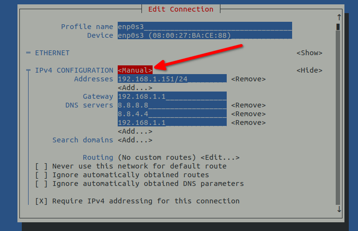

# 简介

​	如今，如果没有网络连接，你就无法用电脑做很多事情。无论你是需要更新服务器上的软件包，还是仅仅需要从笔记本电脑上浏览外部网站，你都需要网络连接！本指南旨在为 Rocky Linux 用户提供设置网络连接的基本知识。

## 前提条件

* 熟悉命令行的基本操作

* 在系统上有较高的权限或管理权限（例如`root`、`sudo`等）。

* 可选：熟悉网络概念
  
    === "9"
    
    ## 网络配置 - Rocky Linux 9
    
    	Rocky Linux 9 的网络配置发生了很多变化。其中一个主要变化是从Network-Scripts（仍可安装，但已被弃用）转向使用Network Manager和密钥文件，而不是基于`ifcfg`的文件。自Rocky Linux 9以来，`NetworkManager`将优先使用`keyfiles`而非以前的`ifcfg`文件。由于这是现在的默认设置，配置网络应该采用默认设置作为正确的操作方式，因为多年来的其他变化意味着最终会淘汰和删除旧的工具。。本指南将尝试为您介绍如何使用Network Manager以及Rocky Linux 9中的最新变化。
    
    ## 前提条件
    
    * 熟悉命令行的基本操作
    * 在系统上有较高的权限或管理权限（例如`root`、`sudo`等）
    * 可选：熟悉网络概念
    
    ## 使用 NetworkManager 服务
    
    在用户层面，网络堆栈由`NetworkManager`管理。该工具作为一个服务运行，你可以使用以下命令检查其状态：
    
    ```bash
    systemctl status NetworkManager
    ```

    ## 配置文件
    
    如开头所述，配置文件现在默认为密钥文件。您可以运行以下命令来查看 `NetworkManager` 如何优先处理这些文件：
    
    ```
    NetworkManager --print-config
    ```
    
    这会给你输出类似下面的案例：
    
    ```
    [main]
    # plugins=keyfile,ifcfg-rh
    # rc-manager=auto
    # auth-polkit=true
    # iwd-config-path=
    dhcp=dhclient
    configure-and-quit=no
    
    [logging]
    # backend=journal
    # audit=false
    
    [device]
    # wifi.backend=wpa_supplicant
    
    # no-auto-default file "/var/lib/NetworkManager/no-auto-default.state"
    ```
    
    注意在配置文件顶部对 `keyfile` 的引用，后面跟着 `ifcfg-rh`。这意味着 `keyfile` 是默认值。任何时候你运行任何 `NetworkManager` 工具来配置网络接口（例如： `nmcli` 或 `nmtui`），它都会自动构建或更新密钥文件。
    
    !!! 提示：“配置存储位置”

        在 Rocky Linux 8 中，网络配置的存储位置在 `/etc/sysconfig/Network-Scripts/` 中。在 Rocky Linux 9 中，密钥文件的新默认存储位置在 `/etc/NetworkManager/system-connections` 中。
    
    用于配置网络接口的主要（但不是唯一）工具是`nmtui`命令。这也可以用`nmcli`命令来完成，但没有那么直观。我们可以用`nmcli`来显示当前配置的网络接口：
    
    ```
    nmcli device show enp0s3
    GENERAL.DEVICE:                         enp0s3
    GENERAL.TYPE:                           ethernet
    GENERAL.HWADDR:                         08:00:27:BA:CE:88
    GENERAL.MTU:                            1500
    GENERAL.STATE:                          100 (connected)
    GENERAL.CONNECTION:                     enp0s3
    GENERAL.CON-PATH:                       /org/freedesktop/NetworkManager/ActiveConnection/1
    WIRED-PROPERTIES.CARRIER:               on
    IP4.ADDRESS[1]:                         192.168.1.151/24
    IP4.GATEWAY:                            192.168.1.1
    IP4.ROUTE[1]:                           dst = 192.168.1.0/24, nh = 0.0.0.0, mt = 100
    IP4.ROUTE[2]:                           dst = 0.0.0.0/0, nh = 192.168.1.1, mt = 100
    IP4.DNS[1]:                             8.8.8.8
    IP4.DNS[2]:                             8.8.4.4
    IP4.DNS[3]:                             192.168.1.1
    IP6.ADDRESS[1]:                         fe80::a00:27ff:feba:ce88/64
    IP6.GATEWAY:                            --
    IP6.ROUTE[1]:                           dst = fe80::/64, nh = ::, mt = 1024
    ```

    !!! tip "**科普时间：**"  
    
        有几种方法或机制，可以为系统分配其IP配置信息。
        最常见的两种方法是 **静态 IP 配置** 和 **动态 IP 配置**。
        
        静态IP配置方案在服务器类系统或网络上非常流行。
        
        动态 IP 方法在家庭和办公网络或工作站和桌面类系统中很受欢迎。 动态方案通常需要一些额外的东西，这些东西在本地是可用的，并且可以向请求的工作站和桌面提供适当的IP配置信息。这个东西被称为动态主机配置协议（DHCP）。在家庭网络中，甚至在大多数商业网络中，这项服务是由为此目的而配置的DHCP服务器提供的。这可以是一个单独的服务器，也可以是路由器配置的一部分。
    
    ## IP 地址

    在上一节中，显示的网络接口`enp0s3`的配置是从`.ini`文件`/etc/NetworkManager/system-connections/enp0s3.nmconnection`生成的。这表明 IP4.ADDRESS[1] 已经是静态配置的，而不是通过DHCP动态配置的。如果我们想把这个网络接口切换回动态分配的地址，最简单的方法是使用`nmtui`命令。
    
    1. 首先，在命令行中运行 `nmtui` 命令，会显示如下内容：
    
        
    
    2. 好了，默认已经在 "Edit a connection 选项上了，直接按 <kbd>TAB</kbd> 键，在高亮部分，并按下 <kbd>ENTER</kbd>
    
    3. 这将会显示机器上的以太网连接，并允许你选择其中一个。在默认的情况下，只有 *ONLY*，所以它已经被高亮显示，我们只需要按 <kbd>TAB</kbd> 键，直到 "Edit" 被高亮显示，然后按下 <kbd>ENTER</kbd>
    
        
    
    4. 一旦我们这样做了，我们将进入显示当前配置的界面。我们需要做的是从 "Manual" 切换到 "Automatic"，所以按 <kbd>TAB</kbd> 键多次，直到高亮显示 "Manual"，然后按下 <kbd>ENTER</kbd>
    
        
    
    5. 键盘上键，直到高亮显示 "Automatic"，然后按下 <kbd>ENTER</kbd>
    
        
    
    6. 一旦我们将网络接口切换到 "Automatic"，我们需要删除静态分配的 IP，所以按 <kbd>TAB</kbd> 键，直到在 IP 地址旁边高亮显示 "Remove"，然后按下 <kbd>ENTER</kbd>
    
        
    
    7. 最后，按 <kbd>TAB</kbd> 键多次直到到达 `nmtui` 屏幕底部，"OK" 被高亮显示，然后按下 <kbd>ENTER</kbd>。
    
    您也可以使用 `nmtui` 来禁用和启用网络接口，但我们将使用 `nmcli` 来完成此操作。通过这种方式，我们可以将网络接口的禁用和启用串联起来，以便网络接口不会长时间处于离线状态：
    
    ```
    nmcli con down enp0s3 && nmcli con up enp0s3
    ```
    
    可以将其视为旧版操作系统中使用的 `ifdown enp0s3 && ifup enp0s3` 的等效操作。
    
    为了验证它是否起作用，可以使用之前使用的 `nmcli device show enp0s3` 命令或 `ip addr` 命令进行检查。
    
    ```
    ip addr
    ```
    
    如果成功，您现在应该看到静态 IP 已被删除，并添加了一个动态分配的地址，类似于以下内容：
    
    ```bash
    2: enp0s3: <BROADCAST,MULTICAST,UP,LOWER_UP> mtu 1500 qdisc fq_codel state UP group default qlen 1000
    link/ether 08:00:27:ba:ce:88 brd ff:ff:ff:ff:ff:ff
    inet 192.168.1.137/24 brd 192.168.1.255 scope global dynamic noprefixroute enp0s3
       valid_lft 6342sec preferred_lft 6342sec
    inet6 fe80::a00:27ff:feba:ce88/64 scope link noprefixroute 
       valid_lft forever preferred_lft forever
    ```
    
    ### 使用 `nmcli` 更改 IP 地址
    
    用 `nmtui` 也很不错，但如果您只想快速重新配置网络接口而不需要在界面上花费太多时间，您可以只使用 `nmcli`。我们看一下上面的示例，其中IP地址被设置为静态，以及使用 `nmcli` 将网络接口重新配置为使用 DHCP 的步骤。
    
    在开始之前，请注意，要将网络接口重新配置为使用 DHCP，需要执行以下操作：
    
    * 删除 IPv4 网关
    * 删除分配的静态 IPv4 地址
    * 将 IPv4 类型改为自动
    * 禁用再启用网络接口
    
    还要注意的是，我们没有使用那些告诉你使用 -ipv4.地址等的例子。这些并不能完全改变网络接口。为了做到这一点，我们需要将ipv4.address 和 ipv4.gateway 设置为一个空字符串。同样，为了尽可能节省我们的命令的时间，我们将它们都串联在一起，放在一行中：
    
    ```
    nmcli con mod enp0s3 ipv4.gateway '' && nmcli con mod enp0s3 ipv4.address '' && nmcli con mod enp0s3 ipv4.method auto && nmcli con down enp0s3 && nmcli con up enp0s3
    ```
    
    再次运行 `ip addr` 命令，应该会显示与我们用 `nmtui` 进行修改后完全一样的结果。当然，我们也可以反过来做（将 DHCP 地址更改为静态地址）。要做到这一点，我们将反向运行命令，从更改 `ipv4.method` 为 manual 开始，设置 `ipv4.gateway`，然后设置 `ipv4.address`。因为在所有这些例子中，我们完全是在重新配置网络接口，而不是对其进行加减值，因此我们不会使用那些`+ipv4.method`、`+ipv4.gateway` 和 `+ipv4.address` 的示例。如果您使用上述命令而不是示例使用的命令，你将最终得到一个同时具有 DHCP 分配的地址和静态分配的地址的网络接口。两个 IP ，有时候也是非常方便。如果你在一个 IP 上监听 Web 服务，另一个 IP 上监听 SFTP 服务器，则有一种将多个 IP 分配给网络接口的方法非常有用。
    
    ## DNS 解析
    
    设置DNS服务器可以通过 `nmtui` 或 `nmcli` 完成。虽然 `nmtui` 界面易于导航且更加直观，但它让操作过程复杂了很多。用 `nmcli` 进行此操作就要快得多。对于通过 DHCP 分配的地址，通常不需要设置 DNS 服务器，因为它们通常是由 DHCP 服务器转发过来的。尽管如此，您仍然可以静态添加 DNS 服务器到 DHCP 网络接口中。对于静态分配的网络接口，你将必须这样做，因为它需要知道如何获取 DNS 解析并且不会有自动分配的方法。
    
    由于所有这些操作的最佳示例是静态分配的 IP，让我们回到我们示例的网络网络接口（enp0s3）中最初静态分配的地址。在更改 DNS 值之前，我们需要看看它们目前被设置为什么。
    为了获得正确的 DNS 解析，我们先删除已设置的 DNS 服务器并添加不同的 DNS 服务器。当前的 `ipv4.dns` 被设置为 `8.8.8.8，8.8.4.4,192.168.1.1`。在这种情况下，我们不需要先将 ipv4.dns 设置为空字符串。我们可以使用以下命令替换我们的值：
    
    ```
    nmcli con mod enp0s3 ipv4.dns '208.67.222.222,208.67.220.220,192.168.1.1'
    ```
    
    运行 `nmcli con show enp0s3 | grep ipv4.dns` 应该会显示我们已成功更改 DNS 服务器。为了使更改生效，让我们将网络接口关闭再重新启动：
    
    ```
    nmcli con down enp0s3 && nmcli con up enp0s3
    ```
    
    为了测试是否确实具有域名解析功能，请尝试 ping 已知的主机。我们将以 google.com 为例（看中文文档的用户，建议换成baidu.com）：
    
    ```bash
    ping google.com
    PING google.com (172.217.4.46) 56(84) bytes of data.
    64 bytes from lga15s46-in-f14.1e100.net (172.217.4.46): icmp_seq=1 ttl=119 time=14.5 ms
    64 bytes from lga15s46-in-f14.1e100.net (172.217.4.46): icmp_seq=2 ttl=119 time=14.6 ms
    64 bytes from lga15s46-in-f14.1e100.net (172.217.4.46): icmp_seq=3 ttl=119 time=14.4 ms
    ```
    
    ## 使用 `ip` 工具
    
    `ip` 命令（由 *iproute2* 包提供）是获取信息和配置 Rocky Linux 等现代 Linux 系统网络的强大工具。
    
    在本示例中，我们假设以下参数：
    
    * 网络接口名称：enp0s3
    * IP 地址：192.168.1.151
    * 子网掩码：24
    * 网关：192.168.1.1
    
    ### 获取常规信息
    
    要查看所有网络接口的详细状态，请使用以下命令：
    
    ```bash
    ip a
    ```
    
    !!! tip "**专业提示：**"
    
        * use the `-c` flag to get a more readable coloured output: `ip -c a`.
        * `ip` accepts abbreviation so `ip a`, `ip addr` and `ip address` are equivalent
    
    ### 启用或禁用网络接口
    
    !!! 注意
    
        虽然在 Rocky Linux 9 中仍然可以使用此方法来启用和禁用网络接口，但此命令的反应速度比在前面的示例中简单地使用 `nmcli` 命令要慢得多。
    
    要使 *enp0s3* 接口下线并再次上线，我们可以使用以下命令：
    
    ```
    ip link set enp0s3 down && ip link set enp0s3 up
    ```
    
    ### 为网络接口分配静态地址
    
    目前，我们的 enp0s3 网络接口的 IP 地址为 192.168.1.151。要将其切换为 192.168.1.152，我们需要使用以下命令删除旧 IP：
    
    ```bash
    ip addr delete 192.168.1.151/24 dev enp0s3 && ip addr add 192.168.1.152/24 dev enp0s3
    ```
    
    如果我们希望为网络接口分配第二个 IP 地址而不是删除 192.168.1.151 地址，则只需使用以下命令添加第二个地址：
    
    ```bash
    ip addr add 192.168.1.152/24 dev enp0s3
    ```
    
    我们可以使用以下命令检查 IP 地址是否已添加：
    
    ```bash
    ip a show dev enp0s3
    ```
    
    将输出：
    
    ```bash
    2: enp0s3: <BROADCAST,MULTICAST,UP,LOWER_UP> mtu 1500 qdisc fq_codel state UP group default qlen 1000
    link/ether 08:00:27:ba:ce:88 brd ff:ff:ff:ff:ff:ff
    inet 192.168.1.151/24 brd 192.168.1.255 scope global noprefixroute enp0s3
       valid_lft forever preferred_lft forever
    inet 192.168.1.152/24 scope global secondary enp0s3
       valid_lft forever preferred_lft forever
    inet6 fe80::a00:27ff:feba:ce88/64 scope link noprefixroute 
       valid_lft forever preferred_lft forever
    ```
    
    虽然使用 `ip` 工具启动和关闭接口比 `nmcli` 要慢得多，但在设置新的或额外的 IP 地址时，`ip` 具有明显的优势，因为它可以实时进行，而不需要重启网络接口。
    
    ### 网关配置


    现在网络接口已经有了地址，我们必须设置它的默认路由，这可以用以下命令完成：
    
    ```bash
    ip route add default via 192.168.1.1 dev enp0s3
    ```
    
    可以使用以下命令显示内核路由表：
    
    ```bash
    ip route
    ```
    
    或者简写为 `ip r`。
    
    这样应该会输出和下面相同内容：
    
    ```bash
    default via 192.168.1.1 dev enp0s3 
    192.168.1.0/24 dev enp0s3 proto kernel scope link src 192.168.1.151 metric 100
    ```
    
    ## 检查网络连通性
    
    在上面的例子中，我们已经做了一些测试。最好的测试方法是先 ping 一下默认网关：
    
    ```bash
    ping -c3 192.168.1.1
    PING 192.168.1.1 (192.168.1.1) 56(84) bytes of data.
    64 bytes from 192.168.1.1: icmp_seq=1 ttl=64 time=0.437 ms
    64 bytes from 192.168.1.1: icmp_seq=2 ttl=64 time=0.879 ms
    64 bytes from 192.168.1.1: icmp_seq=3 ttl=64 time=0.633 ms
    ```
    接下来，通过 ping 你本地网络上的一个主机，测试你的局域网路由是否完全工作：
    
    ```bash
    ping -c3 192.168.1.10
    PING 192.168.1.10 (192.168.1.10) 56(84) bytes of data.
    64 bytes from 192.168.1.10: icmp_seq=2 ttl=255 time=0.684 ms
    64 bytes from 192.168.1.10: icmp_seq=3 ttl=255 time=0.676 ms
    ```
    
    现在测试一下，以确保我们可以看到网络外的其他主机。在下面的测试中，我们使用 Google 的开放 DNS 服务器：
    
    ```bash
    ping -c3 8.8.8.8
    PING 8.8.8.8 (8.8.8.8) 56(84) bytes of data.
    64 bytes from 8.8.8.8: icmp_seq=1 ttl=119 time=19.8 ms
    64 bytes from 8.8.8.8: icmp_seq=2 ttl=119 time=20.2 ms
    64 bytes from 8.8.8.8: icmp_seq=3 ttl=119 time=20.1 ms
    ```
    
    最后一个测试是确保 DNS 解析正常工作。对于这个示例，我们使用 google.com（国内用户建议用 baidu.com）：
    
    ```bash
    ping -c3 google.com
    PING google.com (172.217.4.46) 56(84) bytes of data.
    64 bytes from lga15s46-in-f14.1e100.net (172.217.4.46): icmp_seq=1 ttl=119 time=14.5 ms
    64 bytes from lga15s46-in-f14.1e100.net (172.217.4.46): icmp_seq=2 ttl=119 time=15.1 ms
    64 bytes from lga15s46-in-f14.1e100.net (172.217.4.46): icmp_seq=3 ttl=119 time=14.6 ms
    ```
    
    如果您的机器上有多个网络接口，并且您想从特定接口进行测试，只需使用 ping 的 `-I` 选项：
    
    ```bash
    ping -I enp0s3 -c3 192.168.1.10
    ```
    
    ## 最后
    
    在Rocky Linux 9中，网络堆栈有大量的变化，其中包括优先使用`keyfile`而不是以前在Network-Script中使用的`ifcfg`文件。因为很明显，在未来版本的 Rocky Linux 中，将完全废弃和删除 Network-Script 这个选项，因此最好把注意力集中在诸如`nmcli`、`nmtui`，和在某些情况下的 `ip` 之类的方法论上，用于网络配置。