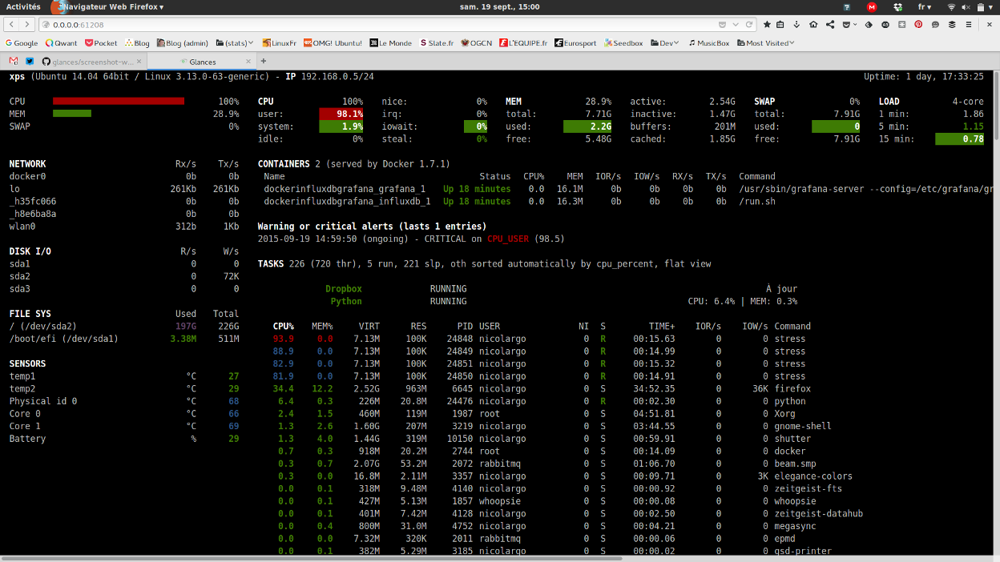

!!! warning Avviso “Temporaneamente in Sospenso”

```
`glances` è attualmente assente dall'EPEL. Probabilmente verrà compilato. Il team Docs continuerà a testarne la disponibilità nell'EPEL non appena possibile. Per ora, l'unica opzione è compilare `glances` dal sorgente, ma le istruzioni per farlo non sono disponibili qui.
```

## Introduzione

Questa guida vi mostrerà come impostare un **monitoraggio della rete o delle risorse** decente, con il minimo sforzo.
Dal punto di vista dell'autore, Glances è simile a `vim` nel mondo degli strumenti di monitoraggio.

## Riguardo a Glances

Glances è uno strumento di monitoraggio open source multipiattaforma.
Consente il monitoraggio in tempo reale di vari aspetti del sistema, come CPU, memoria, disco, utilizzo della rete e altro ancora.
Consente inoltre di monitorare i processi in esecuzione, gli utenti registrati, le temperature, le tensioni, le velocità delle ventole e così via.
Supporta inoltre il monitoraggio dei container e diversi sistemi di gestione dei container, come Docker e LXC.
Una dashboard presenta le informazioni in modo facile da leggere e può anche eseguire il monitoraggio remoto dei sistemi tramite un'interfaccia web o a riga di comando.
È facile da installare e da usare ed è personalizzabile per mostrare solo le informazioni che interessano.

## Prerequisiti

- Un server o container
- Privilegi di root
- Il repository EPEL installato

## Installazione dei Pacchetti

**Prima di tutto, installare il repository EPEL (Extra Packages for Enterprise Linux):**

```bash
dnf install -y epel-release
```

Quindi, installare **Glances**

```bash
dnf install -y glances
```

Ora è possibile monitorare tutto ciò di cui si ha bisogno.

Digitare `glances` per avviare glances.

## Interfaccia Web

È possibile accedere a glance anche con un browser web, basta passare la flag `-w`:

```bash
glances -w
```

Una volta inviato, si vedrà:

```bash
Glances Web User Interface started on http://0.0.0.0:61208/
```

È possibile accedervi con un indirizzo IP o semplicemente con un reverse proxy al nome di dominio.

## Che aspetto ha Glances

Per impostazione predefinita, è possibile vedere tutte le interfacce di rete, la media del carico, i grafici del carico, i contenitori, gli avvisi e i processi.



## Comandi interattivi

**Il potenziale di Glances è nelle sue scorciatoie, in quanto nasconde molte metriche di rete per impostazione predefinita.**

I seguenti comandi (tasto premuto) sono supportati in Glances:

- \++enter++ : Impostazione del process filter

!!! NOTE

```
Su macOS, usare ++ctrl+h++ per eliminare il filtro.
```

Il filtro è un modello di espressione regolare:

- `gnome`: corrisponde a tutti i processi che iniziano con la stringa `gnome`.

- `.*gnome.*`: corrisponde a tutti i processi contenenti la stringa `gnome`.

- \++“a”++, ordinamento automatico dell'elenco dei processi

- Se CPU `>70%`, ordinare i processi in base all'utilizzo della CPU

- Se MEM `>70%`, ordinare i processi in base all'utilizzo della MEM

- Se l'iowait della CPU è `>60%`, ordinare i processi per I/O in lettura e scrittura

- \++a++, attivare o disattivare il processo di monitoraggio delle applicazioni.

- \++“b”++, commutazione tra bit/s o Byte/s per l'I/O di rete

- \++b++, View disk I/O counters per second

- \++“c”++, ordinamento dei processi in base all'utilizzo della CPU

- \++c++, Abilitare o disabilitare le statistiche del cloud

- \++“d”++, Mostra o nasconde le statistiche di I/O del disco

- \++d++, Abilita o disabilita le statistiche di Docker

- \++“e”++, Abilitazione o disabilitazione delle statistiche estese

- \++e++, cancellare il filtro del processo corrente

- \++“f”++, Mostra o nascondi le statistiche di monitoraggio del sistema e delle cartelle

- \++f++, passa dal file system usato allo spazio libero

- \++“g”++, generazione di grafici per la cronologia corrente

- \++g++, Abilita o disabilita le statistiche della GPU

- \++"h"++, Mostra o nasconde la schermata di aiuto

- \++“i”++, ordinamento dei processi in base alla velocità di I/O

- \++i++, mostra o nasconde il modulo IP

- `+`, Aumentare il livello di priorità del processo selezionato / Ridurre la priorità (richiede diritti di amministratore) - Solo in modalità standalone.

- `-`, Decrementare il livello di priorità del processo selezionato / Aumenta la priorità (richiede diritti di amministratore) - Solo in modalità standalone.

- \++“k”++, Termina il processo selezionato (richiede diritti di amministratore) - Solo in modalità standalone.

- \++k++, Mostra o nasconde la connessione TCP

- \++“l”++, mostra o nasconde i messaggi di log

- \++“m”++, ordinamento dei processi in base all'utilizzo della MEM

- \++m++, Azzeramento del riepilogo dei processi min/max

- \++“n”++, mostra o nasconde le statistiche di rete

- \++n++, Mostra o nasconde l'ora corrente

- \++“p”++, ordinamento dei processi per nome

- \++p++, Abilita o disabilita le statistiche delle porte

- \++“q”++ o ++esc++ o ++ctrl+c++, chiude la sessione corrente di Glances

- \++q++, Mostra o nasconde il modulo IRQ

- \++“r”++, Azzeramento della cronologia

- \++r++, Mostra o nasconde il plugin RAID

- \++“s”++, Mostra o nasconde le statistiche dei sensori

- \++s++, Abilita o disabilita le spark lines

- \++“t”++, ordinamento dei processi per tempi di CPU (TIME+)

- \++t++, considerare l'I/O di rete come una combinazione

- \++“u”++, Ordina i processi per UTENTE

- \++u++, Visualizzazione dell'I/O di rete cumulativo

- \++“w”++, eliminare i messaggi di log di avviso terminati

- \++w++, mostra o nasconde il modulo Wifi

- \++“x”++, Eliminazione dei messaggi di log critici e di avvertimento terminati

- \++“z”++, Mostra o nascondi le statistiche dei processi

- \++0++, Abilita o disabilita la modalità Irix/Solaris. Divide l'utilizzo della CPU dell'attività per il numero totale di CPU.

- \++1++, passare dalle statistiche globali della CPU a quelle per CPU

- \++2++, Attivare o disattivare la barra laterale sinistra

- \++3++, Abilita o disabilita il modulo di ricerca rapida

- \++4++, Abilitare o disabilitare il modulo di ricerca e caricamento rapidi

- \++5++, abilita o disabilita il menu superiore (QuickLook, CPU, MEM, SWAP e LOAD)

- \++6++, Abilita o disabilita la modalità GPU media

- \++9++, Commutazione dell'interfaccia utente tra bianco e nero

- \++slash++, passa dalla riga di comando del processo al nome del comando.

- \++f5++ o ++ctrl+“R”++, Aggiorna interfaccia utente

- \++left++, Navigazione a sinistra attraverso l'ordinamento del processo

- \++right++, Navigazione a destra attraverso il processo di ordinamento

- \++up++, In alto nell'elenco dei processi

- \++down++, Giù nell'elenco dei processi

Nel browser del client Glances (accessibile tramite l'argomento della riga di comando `--browser`):

- \++enter++, Eseguire il server selezionato
- \++up++, In alto nell'elenco dei server
- \++down++, In fondo all'elenco dei server
- \++q++ o ++esc++, Termina Glances

## Conclusione

Anche se Glances non può esattamente sostituire strumenti come Grafana, è comunque un'ottima alternativa se non si ha il tempo di impostare complicati cruscotti di monitoraggio.
È possibile distribuirlo in pochi secondi e ottenere le stesse metriche di Grafana con Prometheus.
L'interfaccia web non è molto versatile come quella di Grafana. Se avete la possibilità di utilizzare il terminale, dovreste assolutamente farlo.
