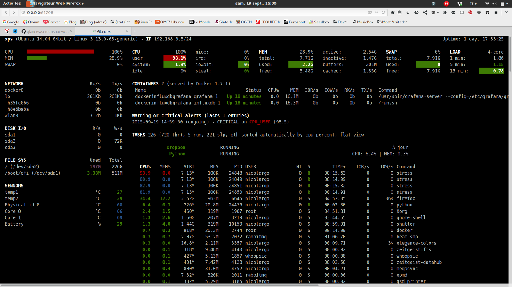

!!! Warning "Тимчасово не працює"

```
`glances` наразі відсутній в EPEL. Ймовірно, його буде створено. Команда документації продовжить тестувати доступність в EPEL, якщо дозволить час. Наразі єдиний варіант — створити `glances` з вихідного коду, а інструкції щодо цього тут відсутні.
```

## Вступ

З мінімальними зусиллями цей посібник покаже вам, як налаштувати гідний **моніторинг мережі або ресурсів**.
З точки зору автора, Glances схожий на `vim` в інструментах моніторингу.

## Про Glances

Glances — це міжплатформний інструмент моніторингу системи з відкритим кодом.
Це дозволяє вам відстежувати різні аспекти вашої системи в режимі реального часу, такі як ЦП, пам’ять, диск, використання мережі тощо.
Він також дозволяє контролювати запущені процеси, користувачів, які ввійшли в систему, температуру, напругу, швидкість вентилятора тощо.
Він також підтримує моніторинг контейнерів і різні системи керування контейнерами, такі як Docker і LXC.
Інформаційна панель представляє інформацію в зручному для читання вигляді, а також може виконувати віддалений моніторинг систем через веб-інтерфейс або інтерфейс командного рядка.
Його легко встановити та використовувати, його можна налаштувати, щоб відображати лише ту інформацію, яка вас цікавить.

## Передумови

- Сервер або контейнер
- Привілеї root
- Встановлений репозиторій EPEL

## Встановлення пакетів

**Спочатку встановіть репозиторій EPEL (додаткові пакети для Enterprise Linux):**

```bash
dnf install -y epel-release
```

Далі встановіть **Glances**

```bash
dnf install -y glances
```

Тепер ви можете контролювати все, що вам потрібно.

Впишіть `glances` для запуску glances.

## Веб-інтерфейс

Ви можете отримати доступ до поглядів навіть за допомогою веб-браузера, вам просто потрібно передати один прапорець `-w`:

```bash
glances -w
```

Надіславши це, ви побачите:

```bash
Glances Web User Interface started on http://0.0.0.0:61208/
```

Ви можете отримати до нього доступ за допомогою IP-адреси або зворотного проксі-сервера до доменного імені.

## Як виглядає Glances

За замовчуванням ви можете бачити всі свої мережеві інтерфейси, середні значення навантаження, графіки навантаження, контейнери, сповіщення та процеси.



## Інтерактивні команди

**Повний потенціал Glances полягає в його ярликах, оскільки він приховує багато мережевих показників за замовчуванням.**

Наступні команди (натиснута клавіша) підтримуються в Glances:

- \++enter++ : Встановлює фільтр процесу

!!! NOTE "Примітка"

```
У macOS використовуйте ++ctrl+h++, щоб видалити фільтр.
```

Фільтр є шаблоном регулярного виразу:

- `gnome`: відповідає всім процесам, починаючи з рядка `gnome`

- `.*gnome.*`: відповідає всім процесам, що містять рядок `gnome`

- \++"a"++, Сортує список процесів автоматично

- Якщо ЦП `>70%`, сортує процеси за використанням ЦП

- Якщо MEN `>70%`, сортує процеси за використанням ПАМ'ЯТІ

- Якщо CPU iowait `>60%`, сортує процеси за читанням і записом введення-виведення

- \++a++, вмикає або вимикає процес моніторингу програми

- \++"b"++, перемикання між біт/с або байт/с для мережевого введення/виведення

- \++b++, Переглядає лічильники дискового введення/виведення за секунду

- \++"c"++, Сортує процеси за використанням ЦП

- \++c++, Вмикає або вимикає хмарну статистику

- \++"d"++, Показує або приховує статистику дискового введення/виведення

- \++d++, Вмикає або вимикає статистику Docker

- \++"e"++, Вмикає або вимикає розширену статистику

- \++e++, Стирає поточний фільтр процесу

- \++"f"++, Показує або приховує статистику моніторингу системи та папок

- \++f++, Перемикання між використовуваною файловою системою та вільним місцем

- \++"g"++, Створює графіки для поточної історії

- \++g++, Вмикає або вимикає статистику GPU

- \++"h"++, Показує або приховує екран довідки

- \++"i"++, Сортує процеси за швидкістю введення-виведення

- \++i++, Показує або приховує IP-модуль

- `+`, Підвищує приємний рівень вибраного процесу / Знижує пріоритет (необхідне право) - Тільки в автономному режимі.

- `-`, Зменшує приємний рівень вибраного процесу / Вищий пріоритет (потрібне право) - Лише в автономному режимі.

- \++"k"++, Знищує вибраний процес (потрібне право) - Лише в автономному режимі.

- \++k++, показує або приховує з'єднання TCP

- \++"l"++, Показує або приховує повідомлення журналу

- \++"m"++, Сортує процеси за використанням MEM

- \++m++, Скидає підсумок процесів мін/макс

- \++"n"++, Показує або приховує статистику мережі

- \++n++, Показує або приховує поточний час

- \++"p"++, Сортує процеси за назвою

- \++p++, Вмикає або вимикає статистику портів

- \++"q"++ або ++esc++ або ++ctrl+c++, Завершує поточний сеанс Glances

- \++q++, Показує або приховує модуль IRQ

- \++"r"++, Скидання історії

- \++r++, показує або приховує плагін RAID

- \++"s"++, показує або приховує статистику датчиків

- \++s++, Вмикає або вимикає спарклайни

- \++"t"++, Сортує процес за часом ЦП (TIME+)

- \++t++, Розглядає мережевий ввід-вивід як комбінацію

- \++"u"++, Сортує процеси за USER

- \++u++, Переглядає сукупний мережевий ввід-вивід

- \++"w"++, Видаляє готові повідомлення журналу попереджень

- \++w++, Показує або приховує модуль Wi-Fi

- \++"x"++, Видаляє попередження про завершення та критичні повідомлення журналу

- \++"z"++, Показує або приховує статистику процесів

- \++0++, Вмикає або вимикає режим Irix/Solaris. Розділяє використання ЦП завданням на загальну кількість ЦП

- \++1++, Перемикання між глобальною статистикою процесора та статистикою кожного процесора

- \++2++, Вмикає або вимикає ліву бічну панель

- \++3++, Вмикає або вимикає модуль швидкого перегляду

- \++4++, Вмикає або вимикає модуль швидкого перегляду та завантаження

- \++5++, Вмикає або вимикає головне меню (QuickLook, CPU, MEM, SWAP і LOAD)

- \++6++, Вмикає або вимикає середній режим GPU

- \++9++, Перемикає інтерфейс користувача між чорним і білим

- \++slash++, Перемикання між командним рядком процесу та назвою команди

- \++f5++ або ++ctrl+"R"++, Оновлює інтерфейс користувача

- \++left++, Навігація вліво через процес сортування

- \++right++, Навігація прямо через процес сортування

- \++up++, Вгору в списку процесів

- \++down++, Вниз в списку процесів

У браузері клієнта Glances (доступний через аргумент командного рядка `--browser`):

- \++enter++, Запускає вибраний сервер
- \++up++, Вгору в списку серверів
- \++down++, Вниз в списку серверів
- \++q++ або ++esc++, Вихід із Glances

## Висновок

Хоча Glances не може точно замінити такі інструменти, як Grafana, він все одно є чудовою альтернативою, якщо у вас немає часу на налаштування складних панелей моніторингу.
Ви можете розгорнути його за лічені секунди та отримати точні показники в Grafana з Prometheus.
Веб-інтерфейс не такий універсальний, як у Grafana. Якщо ви можете використовувати термінал, ви повинні це зробити.
