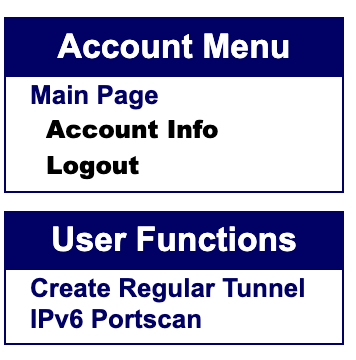

# Hurricane Electric IPv6 tunnel

IPv6 needs no introduction, but in case you are not aware, IPv6 is the replacement for the more popular IPv4 protocol that uses 128-bit hexadecimal addresses instead of 32-bit decimal ones.

[Hurricane Electric](https://he.net) is an internet service provider. Among its other service, Hurricane Electric runs the free [Tunnel Broker](https://tunnelbroker.net/) service to give IPv6 connectivity behind IPv4-only networks.

## Introduction

Thanks to the IPv4 depletion a need for an expanded IP addressing space has arisen in the form of IPv6. However, many networks still lack IPv6 support due to the ubiquity of Network Address Translation (NAT). Because of this Hurricane Electric offers IPv6 tunnels.

## Prerequisites

- A [free Hurricane Electric IPv6 tunnel](https://tunnelbroker.net/)

- A Rocky Linux server with a public IP address and non-filtered Internet Control Message Protocol (otherwise known as ICMP).

## Getting an IPv6 tunnel

First, create an account at [tunnelbroker.net](https://tunnelbroker.net/).

When you have an account, select **Create Regular Tunnel** in the **User Functions** sidebar:



Then enter in your public IPv4 address, select your endpoint location and click **Create Tunnel**.

## Setting up the IPv6 tunnel

The good news is that an IPv6 tunnel only needs one command:

```bash
nmcli connect add type ip-tunnel ifname he-sit mode sit remote IPV4_SERVER ipv4.method disabled ipv6.method manual ipv6.address IPV6_CLIENT ipv6.gateway IPV6_SERVER
```

Replace the following with the details from your Hurricane Electric portal:

- `IPV4_SERVER` with the **Server IPv4 Address**
- `IPV6_SERVER` with the **Server IPv6 Address**
- `IPV6_CLIENT` with the **Client IPv6 Address**
