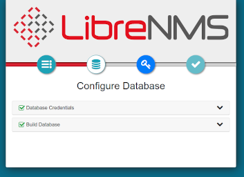

- - -
title: LibreNMS Monitoring Server author: Steven Spencer contributors: Ezequiel Bruni, Ganna Zhyrnova tested_with: 8.5, 8.6, 9.0 tags:
  - monitoring
  - network
- - -

# LibreNMS Monitoring Server

## Introduzione

Gli amministratori di rete e di sistema hanno quasi sempre bisogno di una forma di monitoraggio. Ciò può includere il grafico dell'utilizzo della larghezza di banda negli end point dei router, il monitoraggio dello stato dei servizi in esecuzione su vari server e molto altro ancora. Esistono molte opzioni di monitoraggio, ma una buona opzione con molti, se non tutti, i componenti di monitoraggio disponibili sotto lo stesso tetto, è LibreNMS.

Questo documento è solo un punto di partenza per LibreNMS. L'autore vi indicherà l'eccellente (ed estesa) documentazione del progetto per ulteriori opzioni. L'autore ha utilizzato molte altre soluzioni di monitoraggio, tra cui Nagios e Cacti, ma LibreNMS offre ciò che questi due progetti offrono singolarmente in un unico prodotto.

L'installazione seguirà fedelmente le [istruzioni di installazione ufficiali](https://docs.librenms.org/Installation/Install-LibreNMS/).  Le spiegazioni e le piccole modifiche apportate alla procedura rendono questa procedura preferibile a quell'eccellente documento.

## Prerequisiti, presupposti e convenzioni

* Un server o un container (sì, LibreNMS può essere eseguito in un container. Se si devono monitorare molte cose, la scelta migliore è quella di installare su un hardware indipendente) con Rocky Linux. Tutti i comandi presuppongono una nuova installazione di Rocky Linux.
* Presupposto: che si possano eseguire i comandi come root o che si sia in grado di usare _sudo_ per elevare i privilegi
* Conoscenza di strumenti a riga di comando, inclusi editor di testo come _vi_
* Presupposto: l'uso di SNMP v2. Se si desidera utilizzare SNMP v3, LibreNMS lo supporta e funzionerà. È necessario modificare la configurazione e le opzioni SNMP dei dispositivi per adeguarli alla versione v3.
* È inclusa la procedura SELinux. Il container utilizzato dall'autore nel laboratorio non lo include per impostazione predefinita. Per questo motivo, la procedura SELinux **non** è stata testata in laboratorio.
* In questo documento, gli esempi utilizzano l'editor _vi_. Quando il documento dice di salvare le modifiche e di uscire, usare <kbd>SHIFT</kbd>+<kbd>:</kbd>+<kbd>wq!</kbd>.
* La procedura richiede alcune competenze in materia di risoluzione dei problemi, tra cui il monitoraggio dei log, i test web e altro ancora

## Installazione dei pacchetti

Inserire questi comandi come utente root. Prima di iniziare, si noti che questa procedura di installazione si concentra su *httpd*, piuttosto che su *nginx*. Se preferite quest'ultima, seguite le [Istruzioni per l'installazione di Librenms](https://docs.librenms.org/Installation/Install-LibreNMS/) e la guida.

Per prima cosa, installare il repository EPEL (Extra Packages for Enterprise Linux):

```
dnf install -y epel-release
```

La versione attuale di LibreNMS richiede una versione minima di PHP pari a 8.1. Rocky Linux 9.0 utilizza PHP 8.0. Abilitare un repository di terze parti (anche in Rocky Linux 8.6) per questa nuova versione.

La versione del repository da installare dipende dalla versione di Rocky Linux in uso. L'ipotesi è che si tratti della versione 9, ma si può modificare di conseguenza in base alla versione in uso:

```
dnf install http://rpms.remirepo.net/enterprise/remi-release-9.rpm
```

Una volta installati i repository EPEL e REMI, è il momento di installare i pacchetti:

```
dnf install bash-completion cronie fping git httpd ImageMagick mariadb-server mtr net-snmp net-snmp-utils nmap php81-php-fpm php81-php-cli php81-php-common php81-php-curl php81-php-gd php81-php-json php81-php-mbstring php81-php-process php81-php-snmp php81-php-xml php81-php-zip php81-php-mysqlnd python3 python3-PyMySQL python3-redis python3-memcached python3-pip python3-systemd rrdtool unzip wget
```

Tutti questi pacchetti rappresentano una parte delle funzionalità di LibreNMS.

## Impostazione dell'utente 'librenms'

Copiare e incollare (o inserire) quanto segue:

```
useradd librenms -d /opt/librenms -M -r -s "$(which bash)"
```

Questo comando imposta la directory predefinita per l'utente a `/opt/librenms`, tuttavia l'opzione `-M` dice "non creare la directory." Il motivo è che ciò avviene al momento dell'installazione di LibreNMS. Il `-r` dice di rendere questo utente un account di sistema e il `-s` dice di impostare la shell (in questo caso, "bash").

## Scaricare LibreNMS e impostare i permessi

Git facilita il download. Forse conoscete già il processo. Per prima cosa, passate alla directory `/opt`:

```
cd /opt
```

Clonare il repository:

```
git clone https://github.com/librenms/librenms.git
```

Modificare le autorizzazioni per la directory:

```
chown -R librenms:librenms /opt/librenms
chmod 771 /opt/librenms
setfacl -d -m g::rwx /opt/librenms/rrd /opt/librenms/logs /opt/librenms/bootstrap/cache/ /opt/librenms/storage/
setfacl -R -m g::rwx /opt/librenms/rrd /opt/librenms/logs /opt/librenms/bootstrap/cache/ /opt/librenms/storage/
```

Il comando `setfacl` sta per "set file access control lists" ed è un altro modo per proteggere directory e file.

## Installare le dipendenze di PHP come `librenms`

Le dipendenze PHP di LibreNMS devono essere installate con l'utente `librenms`. A tal fine, eseguire:

```
su - librenms
```

Inserire quanto segue:

```
./scripts/composer_wrapper.php install --no-dev
```

Uscire di nuovo a root:

```
exit
```

### Errore nell'installazione delle dipendenze di PHP

La documentazione di LibreNMS dice che la procedura di cui sopra potrebbe fallire se ci si trova dietro un server proxy. Può fallire anche per altri motivi. Per questo motivo, la procedura di installazione di Composer viene descritta più avanti.

## Impostare il fuso orario

È necessario assicurarsi che l'impostazione sia corretta per il sistema e per PHP. È possibile trovare un elenco di [impostazioni valide del fuso orario per PHP qui](https://php.net/manual/en/timezones.php). Ad esempio, per il fuso orario Central, una voce comune è "America/Chicago". Iniziate modificando il file `php.ini`:

```
vi /etc/opt/remi/php81/php.ini
```

Trovare la riga `date.timezone` e modificarla. Si noti che è annotato, quindi rimuovere il ";" dall'inizio della riga e aggiungere il proprio fuso orario dopo il segno "=". Per l'esempio del fuso orario Central utilizzare:

```
date.timezone = America/Chicago
```

Salvare le modifiche e uscire dal file `php.ini`.

È inoltre necessario assicurarsi che il fuso orario del sistema sia corretto. Utilizzando l'esempio del fuso orario Central, eseguire questa operazione con:

```
timedatectl set-timezone America/Chicago
```

## Impostazione di MariaDB

Prima di avviare i requisiti del database per LibreNMS, eseguire la procedura [MariaDB](../database/database_mariadb-server.md), in particolare la sezione "Messa in sicurezza di mariadb-server", e tornare qui per queste impostazioni specifiche. Modificare il file `mariadb-server.cnf`:

```
vi /etc/my.cnf.d/mariadb-server.cnf
```

Aggiungere le seguenti righe alla sezione "[Mysqld]":

```
innodb_file_per_table=1
lower_case_table_names=0
```

Quindi attivare e riavviare il server `mariadb`:

```
systemctl enable mariadb
systemctl restart mariadb
```

Accedere a `mariadb` come utente root. Ricordarsi di utilizzare la password creata seguendo la sezione "Messa in sicurezza di mariadb-server" eseguita in precedenza:


```
mysql -u root -p
```

Apportare alcune modifiche specifiche per LibreNMS. Con il comando sottostante, ricordatevi di cambiare la password "password" con qualcosa di sicuro e di documentarlo in un luogo sicuro.

Al prompt di `mysql` eseguire:

```
CREATE DATABASE librenms CHARACTER SET utf8mb4 COLLATE utf8mb4_unicode_ci;
CREATE USER 'librenms'@'localhost' IDENTIFIED BY 'password';
GRANT ALL PRIVILEGES ON librenms.* TO 'librenms'@'localhost';
FLUSH PRIVILEGES;
```

Digitare "exit" per uscire da `mariadb`.

## Configurare PHP-FPM

Questo non è cambiato rispetto alla documentazione ufficiale, tranne che per il percorso dei file. Per prima cosa, copiare il file `www.conf`:

```
cp /etc/opt/remi/php81/php-fpm.d/www.conf /etc/opt/remi/php81/php-fpm.d/librenms.conf
```

Modificare il file `librenms.conf`:

```
vi /etc/opt/remi/php81/php-fpm.d/librenms.conf
```

Cambiare "[www]" con ["librenms]"

Cambiare l'utente e il gruppo in "librenms":

```
user = librenms
group = librenms
```

Modificare la riga "listen" in modo che rifletta un nome univoco:

```
listen = /run/php-fpm-librenms.sock
```

Salvare le modifiche e uscire dal file. Se questo è l'unico servizio web che verrà eseguito su questa macchina, si può rimuovere il vecchio file www.conf copiato:

```
rm -f /etc/opt/remi/php81/php-fpm.d/www.conf
```

## Configurare `httpd`

Iniziate creando questo file:

```
vi /etc/httpd/conf.d/librenms.conf
```

Inserite in quel file quanto segue:

```
<VirtualHost *:80>
  DocumentRoot /opt/librenms/html/
  ServerName  librenms.example.com

  AllowEncodedSlashes NoDecode
  <Directory "/opt/librenms/html/">
    Require all granted
    AllowOverride All
    Options FollowSymLinks MultiViews
  </Directory>

  # Enable http authorization headers
  <IfModule setenvif_module>
    SetEnvIfNoCase ^Authorization$ "(.+)" HTTP_AUTHORIZATION=$1
  </IfModule>

  <FilesMatch ".+\.php$">
    SetHandler "proxy:unix:/run/php-fpm-librenms.sock|fcgi://localhost"
  </FilesMatch>
</VirtualHost>
```

È necessario rimuovere il vecchio sito predefinito, `welcome.conf`:

```
rm /etc/httpd/conf.d/welcome.conf
```

Abilitare  `httpd` and `php-fpm`:

```
systemctl enable --now httpd
systemctl enable --now php81-php-fpm
```

## SELinux

Se non si intende utilizzare SELinux, passare alla sezione successiva. Questo potrebbe valere anche per chi usa LibreNMS su un container che non supporta SELinux a livello di container o non lo include per default.

Per configurare tutto con SELinux, è necessario installare un pacchetto aggiuntivo:

```
dnf install policycoreutils-python-utils
```

### Configurare i contesti LibreNMS

Affinché LibreNMS funzioni correttamente con SELinux, è necessario impostare i seguenti contesti:

```
semanage fcontext -a -t httpd_sys_content_t '/opt/librenms/html(/.*)?'
semanage fcontext -a -t httpd_sys_rw_content_t '/opt/librenms/(logs|rrd|storage)(/.*)?'
restorecon -RFvv /opt/librenms
setsebool -P httpd_can_sendmail=1
setsebool -P httpd_execmem 1
chcon -t httpd_sys_rw_content_t /opt/librenms/.env
```

### Permettere il `fping`

Creare un file chiamato `http_fping.tt` in un percorso qualsiasi. Non importa dove. L'installazione avviene successivamente. Il contenuto di questo file è:

```
module http_fping 1.0;

require {
type httpd_t;
class capability net_raw;
class rawip_socket { getopt create setopt write read };
}

#============= httpd_t ==============
allow httpd_t self:capability net_raw;
allow httpd_t self:rawip_socket { getopt create setopt write read };
```

Installate questo file con i seguenti comandi:

```
checkmodule -M -m -o http_fping.mod http_fping.tt
semodule_package -o http_fping.pp -m http_fping.mod
semodule -i http_fping.pp
```

Se si verificano problemi e si sospetta che possano essere dovuti a un problema di SELinux, eseguire quanto segue:

```
audit2why < /var/log/audit/audit.log
```

## configurazione di `firewalld`

Le istruzioni di `firewalld` seguono la documentazione ufficiale.

Il comando da utilizzare per le regole di autorizzazione di `firewalld` è il seguente:

```
firewall-cmd --zone public --add-service http --add-service https
firewall-cmd --permanent --zone public --add-service http --add-service https
```
L'autore ha problemi con questo semplicistico insieme di regole `firewalld`. Questa regola permette ai servizi web di essere aperti al mondo, ma è questo che si vuole per un server di monitoraggio?

Di solito **non** è questo il caso. Se si desidera un approccio più granulare all'uso di `firewalld`, consultare [questo documento](../security/firewalld.md) e modificare di conseguenza le regole di `firewalld`.

## Abilitare i collegamenti simbolici e il completamento automatico delle schede per i comandi `lnms`

Innanzitutto, è necessario un collegamento simbolico al comando `lnms`, in modo da poterlo eseguire da qualsiasi punto:

```
ln -s /opt/librenms/lnms /usr/bin/lnms
```

Quindi, impostare il completamento automatico:

```
cp /opt/librenms/misc/lnms-completion.bash /etc/bash_completion.d/
```

## Configurare `snmpd`

_SNMP_ è l'acronimo di "Simple Network Management Protocol" ed è utilizzato da molti programmi di monitoraggio per l'estrazione dei dati. La versione 2, utilizzata in questo caso, richiede una "community string" specifica per il vostro ambiente.

Assegnate questa "community string" ai dispositivi di rete che volete monitorare, in modo che `snmpd` (la "d" qui sta per il demone) sia in grado di trovarli. Se la rete non è di nuova costruzione, è possibile che sia già in uso una "stringa di comunità".

Copiare il file `snmpd.conf` da LibreNMS:

```
cp /opt/librenms/snmpd.conf.example /etc/snmp/snmpd.conf
```

Modificare questo file e cambiare la stringa di comunità da "RANDOMSTRINGGOESHERE" a quella che è o sarà la vostra community string. Nell'esempio, questa è "LABone":

```
vi /etc/snmp/snmpd.conf
```

Modificare questa riga:

```
com2sec readonly  default         RANDOMSTRINGGOESHERE
```

in

```
com2sec readonly  default         LABone
```

Salvare le modifiche e uscire.

## Automatizzare con un cron job

Eseguire i seguenti comandi per impostare i lavori di cron:

```
cp /opt/librenms/librenms.nonroot.cron /etc/cron.d/librenms
```

Il poller deve essere eseguito una volta, anche se non c'è nulla da interrogare, prima di eseguire la procedura di configurazione web. In questo modo si risparmia la risoluzione dei problemi per capire cosa non va quando si ottengono errori di polling nella sezione di convalida.

Il poller viene eseguito con l'utente "librenms" e, sebbene sia possibile passare a questo utente ed eseguire i file cron, è meglio lasciare che il poller lo faccia da solo. Assicurarsi che siano trascorsi almeno 5 minuti per consentire l'esecuzione del cron e quindi proseguire con la sezione "Impostazione Web".


## Rotazione del registro

LibreNMS creerà nel tempo un'ampia serie di registri. È necessario impostare la rotazione dei registri per conservare lo spazio su disco. Per farlo, eseguire questo comando:

```
cp /opt/librenms/misc/librenms.logrotate /etc/logrotate.d/librenms
```

## Installazione di composer (soluzione alternativa)

PHP Composer è un requisito per l'installazione corrente (menzionato nella procedura precedente). Se l'installazione eseguita in precedenza non è andata a buon fine, è necessario eseguire questa operazione.

Prima di iniziare, è necessario collegare la versione corrente del binario `php` a una posizione del percorso. Questa procedura ha utilizzato l'installazione REMI per ottenere la versione corretta di PHP, che non è installata nel percorso.

Questo è risolvibile con un collegamento simbolico e vi renderà la vita molto più facile durante l'esecuzione dei passi rimanenti:

```
ln -s /opt/remi/php81/root/usr/bin/php /usr/bin/php
```

Accedere al sito web di [Composer](https://getcomposer.org/download/) e verificare che i passaggi seguenti non siano stati modificati. Eseguite quindi questi comandi da qualche parte sul computer. Una volta terminato, il composer verrà spostato:

```
php -r "copy('https://getcomposer.org/installer', 'composer-setup.php');"
php -r "if (hash_file('sha384', 'composer-setup.php') === '55ce33d7678c5a611085589f1f3ddf8b3c52d662cd01d4ba75c0ee0459970c2200a51f492d557530c71c15d8dba01eae') { echo 'Installer verified'; } else { echo 'Installer corrupt'; unlink('composer-setup.php'); } echo PHP_EOL;"
php composer-setup.php
php -r "unlink('composer-setup.php');"
```

Spostatelo in un punto del percorso. Utilizzare `/usr/local/bin/` per questo:

```
mv composer.phar /usr/local/bin/composer
```

## Impostazione Web

Una volta installati e configurati tutti i componenti, il passo successivo è quello di completare l'installazione via web. Nella versione di laboratorio, non è stato impostato alcun hostname. Per completare la configurazione, è necessario accedere al server web tramite l'indirizzo IP.

L'IP della macchina del laboratorio è 192.168.1.140. Per terminare l'installazione, navigare al seguente indirizzo in un browser web:

`http://192.168.1.140/librenms`

Se tutto funziona correttamente, segue un reindirizzamento ai controlli di preinstallazione. Se tutti questi elementi sono contrassegnati in verde, è possibile continuare.


Sotto il logo LibreNMS si trovano quattro pulsanti. Il primo pulsante a sinistra è per i controlli preliminari. Il pulsante successivo è quello del database. È necessaria la password impostata in precedenza per l'utente del database "librenms".

Se ci avete seguito, avete già salvato questo dato in un posto sicuro. Cliccare sul pulsante "Database". È sufficiente inserire "User" e "Password". A questo punto, fare clic sul pulsante "Check Credentials".


Fare clic sul pulsante "Build Database" se diventa verde.



Il pulsante "Create Admin User" sarà ora attivo. Cliccatelo. Viene quindi richiesto il nome di un utente amministratore. Nel laboratorio è "admin." Creare una password per questo utente.

Assicurarsi che la password sia sicura e registrarla in un luogo sicuro, ad esempio in un gestore di password. È necessario aggiungere anche l'indirizzo e-mail dell'utente amministrativo. Al termine, fare clic sul pulsante "Add User".


A questo punto apparirà la schermata "Finish Install." Rimarrà solo un elemento per terminare l'installazione, una riga che chiede di "validate your install".

Fare clic sul link. Si verificherà un reindirizzamento alla pagina di accesso. Accedere con l'utente amministrativo e la password.

## Aggiungere dispositivi

Anche in questo caso, uno dei presupposti è che si stia utilizzando SNMP v2. Ricordate che ogni dispositivo aggiunto deve essere un membro della vostra stringa di comunità. Qui l'autore utilizza due esempi di dispositivi, una workstation Ubuntu e un server CentOS.

È probabile che si debbano aggiungere switch, router e altri dispositivi gestiti. L'autore può dire per esperienza che aggiungere switch e router è più facile che aggiungere workstation e server.

### Configurazione della workstation Ubuntu

Per prima cosa, installare `snmpd` sulla workstation e aggiornare i pacchetti per sicurezza:

```
sudo update && sudo apt-get upgrade && sudo apt-get install snmpd
```

Successivamente, è necessario modificare il file `snmpd.conf`:

```
sudo vi /etc/snmpd/snmpd.conf
```

Trovate le righe che descrivono la vostra postazione di lavoro e cambiatele con altre che la identificano:

```
sysLocation    Desktop
sysContact     Username <user@mydomain.com>
```

Quando si installa `snmpd` su Ubuntu, questo si collega solo all'indirizzo locale. Non ascolta l'indirizzo IP della macchina. Questo non permetterà a LibreNMS di connettersi ad esso. È necessario rimuovere questa riga:

```
agentaddress  127.0.0.1,[::1]
```

Aggiungete una nuova riga: (in questo esempio, l'indirizzo IP della vostra workstation è 192.168.1.122 e la porta UDP che state impostando è la "161")

```
agentAddress udp:127.0.0.1:161,udp:192.168.1.122:161
```

È necessario specificare la community string per l'accesso in sola lettura. Trovate le linee sottostanti e commentatele come indicato:

```
#rocommunity public default -V systemonly
#rocommunity6 public default -V systemonly
```

Aggiungere una riga:

```
rocommunity LABone
```

Salvare le modifiche e uscire.

Abilitare e avviare `snmpd`:

```
sudo systemctl enable snmpd
sudo systemctl start snmpd
```

Se si utilizza un firewall sulle postazioni di lavoro interne, è necessario modificarlo per consentire il traffico UDP dal server di monitoraggio o dalla rete. LibreNMS vuole anche essere in grado di fare "ping" al dispositivo. Assicurarsi che la porta 8 ICMP del server non sia filtrata.

### Configurazione del server CentOS o Rocky Linux

Si presuppone che siate root o che possiate fare `sudo` per elevare i privilegi. È necessario installare alcuni pacchetti:

```
dnf install net-snmp net-snmp-utils
```

Creare un file `snmpd.conf`. LibreNMS vuole anche essere in grado di "pingare" il dispositivo, quindi assicuratevi che la porta icmp 8 sia consentita dal server.

```
mv /etc/snmp/snmpd.conf /etc/snmp/snmpd.conf.orig
```

e

```
vi /etc/snmp/snmpd.conf
```

Copiare il tutto nel nuovo file:

```
# Map 'LABone' community to the 'AllUser'
# sec.name source community
com2sec AllUser default LABone
# Map 'ConfigUser' to 'ConfigGroup' for SNMP Version 2c
# Map 'AllUser' to 'AllGroup' for SNMP Version 2c
# sec.model sec.name
group AllGroup v2c AllUser
# Define 'SystemView', which includes everything under .1.3.6.1.2.1.1 (or .1.3.6.1.2.1.25.1)
# Define 'AllView', which includes everything under .1
# incl/excl subtree
view SystemView included .1.3.6.1.2.1.1
view SystemView included .1.3.6.1.2.1.25.1.1
view AllView included .1
# Give 'ConfigGroup' read access to objects in the view 'SystemView'
# Give 'AllGroup' read access to objects in the view 'AllView'
# context model level prefix read write notify
access AllGroup "" any noauth exact AllView none none
```

CentOS e Rocky utilizzano una convenzione di mappatura per indirizzare le cose. Il file mostrato contiene commenti per definire ciò che accade, ma non include tutto il disordine del file originale.

Una volta apportate le modifiche, salvarle e uscire dal file.

Abilitare e avviare `snmpd`:

```
systemctl enable snmpd
systemctl start snmpd
```

#### Firewall

Se state gestendo un server, allora **state** gestendo un firewall, giusto? Se si sta eseguendo `firewalld`, si presume che si utilizzi la zona "trusted" e che si voglia consentire tutto il traffico dal server di monitoraggio, 192.168.1.140:

```
firewall-cmd --zone=trusted --add-source=192.168.1.140 --permanent
```
Se la zona "trusted" non è corretta per il vostro ambiente, modificatela in base alle vostre esigenze. Considerate le vostre regole e il loro effetto prima di aggiungerle.

## Aggiungere i dispositivi in Librenms

Dopo aver configurato i dispositivi campione per accettare il traffico SNMP dal server LibreNMS, il passo successivo consiste nell'aggiungere tali dispositivi a LibreNMS. Con l'interfaccia web di LibreNMS aperta, cliccare per aggiungere un dispositivo:


Inserite le informazioni utilizzate per i vostri dispositivi di prova. Immettere l'IP della workstation Ubuntu da avviare. Nell'esempio è 192.168.1.122. Aggiungere la stringa di comunità "LABone" nel campo "Community".

Cliccare sul pulsante "Add Device". Se tutto è corretto, il processo si concluderà con successo.

Se si verifica un errore di "failure to add", rivedere l'impostazione SNMP della workstation o del firewall, se esiste. Ripetere la procedura "Add Device" per il server CentOS.

## Ricevere avvisi

Come già detto all'inizio, questo documento serve solo per iniziare a utilizzare LibreNMS. Esiste un gran numero di elementi di configurazione aggiuntivi, un'ampia API (Application Programming Interface), un sistema di avvisi che fornisce un gran numero di opzioni per la consegna, chiamate "Transports", e molto altro ancora.

Questo documento non contiene procedure per la creazione di regole di allerta. Si modificherà invece la regola di avviso incorporata "Device Down! Due to no ICMP response" che è preconfigurato in partenza. Per "Transports" utilizzeremo "Mail", che è semplicemente un'e-mail. Sappiate che non siete limitati a questa segnalazione.

La posta deve essere funzionante per poter utilizzare l'e-mail per il trasporto. Utilizzate questa [Procedura di Postfix](../email/postfix_reporting.md) per ottenere questo risultato.

### Transports

È necessario un modo per inviare gli avvisi. Come già detto, LibreNMS supporta un numero enorme di trasporti. L'avviso di posta elettronica, definito come trasporto "Mail", viene utilizzato in questo caso. Per impostare il trasporto:

1. Vai al cruscotto
2. Passare il mouse su "Alerts"
3. Scendere fino a " Alert Transports" e fare clic su di esso
4. Cliccare sul pulsante " Create alert transport" (Notare il pulsante "Create transport group". È possibile utilizzare questa opzione per inviare avvisi a più persone)
5. Nel campo "Transport name:", immettere "Alert By Email"
6. Nel campo "Transport type:", utilizzare il menu a tendina per selezionare "Mail"
7. Assicurarsi che il campo " Default alert:" sia impostato su "On"
8. Nel campo "Email:", inserire l'indirizzo email dell'amministratore

### Configurazione del server CentOS o Rocky Linux

Il modo migliore per impostare gli avvisi è organizzare i dispositivi in modo logico. Attualmente sono presenti una workstation e un server nei dispositivi. Normalmente non si possono combinare le due cose, come in questo caso.

Questo esempio è anche ridondante, poiché esiste un gruppo "All Devices" che funziona anche per questo. Per impostare un gruppo di dispositivi:

1. Vai al cruscotto
2. Passare il mouse su "Devices"
3. Scendere fino a "Manage Groups" e fare clic su di esso
4. Cliccare sul pulsante "+ New Device Group"
5. Nel campo "Name", inserire "ICMP Group"
6. Nel campo della descrizione inserire ciò che si ritiene possa aiutare a descrivere il gruppo
7. Cambiare il campo "Type" da "Dynamic" a "Static"
8. Aggiungete ogni dispositivo al campo "Select Devices" e salvate le modifiche

### Impostare le regole di avviso

Configurare poi la regola di avviso. Per impostazione predefinita, LibreNMS ha diverse regole di avviso già create per voi:

1. Vai al cruscotto
2. Passare il mouse su "Alerts"
3. Scendere fino a "Alert Rules" e fare clic sopra
4. La regola attiva principale sarà "Device Down! Due to no ICMP response." Andare su "Action" (colonna all'estrema destra) e fare clic sull'icona della matita per modificare la regola.
5. Lasciare tutti i campi in alto con le impostazioni predefinite. Nel campo "Match devices, groups and locations list:", fare clic all'interno del campo.
6. Selezionare "ICMP Group" dalla lista
7. Assicurarsi che il campo "All devices except in list:" sia "Off"
8. Fare clic nel campo " Transports:" e selezionare "Mail: Alert By Email" e salvare la regola.

Prima di salvare, la regola sarà:


Questi due dispositivi ora vi avviseranno via e-mail se sono inattivi e al momento del ripristino.

## Conclusioni

LibreNMS è un potente strumento di monitoraggio con una serie completa di funzioni in un'unica applicazione. Questo documento ha _solo_ scalfito la superficie delle sue capacità. Alcune delle schermate più semplici non vengono mostrate.

Quando si aggiungono i dispositivi, supponendo che tutte le proprietà SNMP siano state impostate correttamente, si iniziano a ricevere i grafici della larghezza di banda, dell'utilizzo della memoria e dell'utilizzo della CPU di ciascun dispositivo. Questo laboratorio non ha mostrato la varietà dei trasporti disponibili oltre a "Mail".

In questo documento sono state fornite le informazioni necessarie per iniziare a monitorare l'ambiente. LibreNMS richiede un po' di tempo per padroneggiare tutti gli elementi. Per ulteriori informazioni, visitate la [eccellente documentazione](https://docs.librenms.org/) del progetto.
