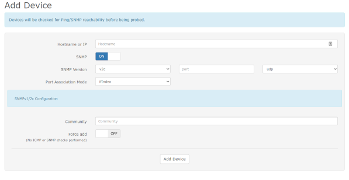

# LibreNMS Monitoring Server

## Introduction

Network and systems administrators almost always need some form of monitoring. This can include graphing bandwidth usage at router end points, monitoring the up/down of services running on various servers, and much, much more. There are many monitoring options out there, but one option that is very good and has many, if not all, of the monitoring components available under one roof, is LibreNMS.

This document will only get you started with LibreNMS, but we will point you to the projects excellent (and extensive) documentation to get you going further. There are lots of other options for monitoring out there that this author has used before, Nagios and Cacti being two, but LibreNMS offers what these two project offer individually, in one spot.

While the installation will follow pretty closely to the official install instructions found [here](https://docs.librenms.org/Installation/Install-LibreNMS/), we've added some explanation and even some minor changes, which make this procedure preferable to that excellent document.

## Prerequisites, Assumptions and Conventions

* A server or container (yes, LibreNMS will run in a container, however if you have a lot to monitor, your best bet would be to install on its own hardware) running Rocky Linux. All commands assume a fresh install of Rocky Linux.
* Assumption: that you are able to execute commands as root or can _sudo_ to do so
* Working knowledge of command-line tools, including editors, such as _vi_
* We are assuming the use of SNMP v2. If you want to use SNMP v3, it is supported by LibreNMS and will work. You'll just need to switch up the SNMP configuration and options on your devices to match up to v3.
* While we have included the SELinux procedure in this document, the container that we are using in the lab does not include it by default. For this reason, the SELinux procedure has **not** been lab tested.
* Throughout this document, the examples use the _vi_ editor as mentioned. When the document says to save your changes and exit, this is done with `SHIFT:wq!`
* Some trouble-shooting skills, including log monitoring, web testing, and more, are required.

## Installing Packages

These commands should be entered as the root user. Before we begin, note that this installation procedure focuses on httpd, rather than nginx. If you prefer to use the latter, head up to the [Librenms Install Instructions](https://docs.librenms.org/Installation/Install-LibreNMS/) and follow the guide there. We are assuming a fresh install, so we need to do a few things with the repositories before we can continue. First, we need to install the EPEL repository (Extra Packages for Enterprise Linux):

`dnf install -y epel-release`

Next, we need to tell the repositories to enable PHP 7.3 as the default PHP:

```
dnf module reset php
dnf module enable php:7.3
```

This will return a listing for httpd, nginx, and php, just answer "y" to the prompt to continue. Next, we need to install a bunch of packages:

`dnf install bash-completion cronie fping git httpd ImageMagick mariadb-server mtr net-snmp net-snmp-utils nmap php-fpm php-cli php-common php-curl php-gd php-json php-mbstring php-process php-snmp php-xml php-zip php-mysqlnd python3 python3-PyMySQL python3-redis python3-memcached python3-pip python3-systemd rrdtool unzip`

All of these packages represent some portion of the LibreNMS feature set.

## Setting Up The librenms User

To do this, copy and paste (or type) the following:

`useradd librenms -d /opt/librenms -M -r -s "$(which bash)"`

With this command, we are setting the default directory for our new user to "/opt/librenms" however the "-M" option says "don't create the directory." The reason, of course, is that we will be creating it when we install libreNMS. The "-r" says to make this user a system account and the "-s" says to set the shell (in this case, to "bash")

## Download LibreNMS and Set Permissions

The download is all done through git. You may be familiar with the process as it is used for many projects these days. First, switch over to the /opt directory:

`cd /opt`

Then clone the repository:

`git clone https://github.com/librenms/librenms.git`

Next change permissions for the directory:

```
chown -R librenms:librenms /opt/librenms
chmod 771 /opt/librenms
setfacl -d -m g::rwx /opt/librenms/rrd /opt/librenms/logs /opt/librenms/bootstrap/cache/ /opt/librenms/storage/
setfacl -R -m g::rwx /opt/librenms/rrd /opt/librenms/logs /opt/librenms/bootstrap/cache/ /opt/librenms/storage/
```

The _setfacl_ command stands for "set file access control lists" and is another way of securing directories and files.

## Install PHP Dependencies As librenms

All of the above commands were executed as root or _sudo_, but the PHP dependencies within LibreNMS need to be installed as the librenms user. To do this,

`su - librenms`

And then enter the following:

`./scripts/composer_wrapper.php install --no-dev`

Once the script is completed, exit back to root:

`exit`

### Failure Of PHP Dependency Install Workaround

LibreNMS documentation says that when you are behind a proxy server, the above procedure may fail. If so, use this procedure as a workaround. Note, too, that this workaround would have to be run as the root user, because it makes modifications to /usr/bin:

```
wget https://getcomposer.org/composer-stable.phar
mv composer-stable.phar /usr/bin/composer
chmod +x /usr/bin/composer
```

## Set Timezone

We need to make sure that this is set correctly, both for the system and for PHP. You can find a list of valid timezone settings for PHP [here](https://php.net/manual/en/timezones.php). For instance, for the Central timezone, a common entry would be "America/Chicago". Let's start by editing the php.ini file:

`vi /etc/php.ini`

Find the `date.timezone` line and modify it. Note that it is remarked out, so remove the ";" from the beginning of the line and add your timezone after the "=" sign. For our Central timezone example we will use:

`date.timezone = America/Chicago`

Save your changes and exit the php.ini file.

We also need to make sure that the system timezone is correct. Again, using our Central timezone as the example, we would do this with:

`timedatectl set-timezone America/Chicago`

## MariaDB Setup

Before we get into the database setup required for LibreNMS, run through the [MariaDB procedure](../database/database_mariadb-server.md) and specifically the section for "Securing mariadb-server", and then come back here for these specific settings. The first thing we need to do is modify the mariadb-server.cnf file:

`vi /etc/my.cnf.d/mariadb-server.cnf`

And add the following lines to the "[Mysqld]" section:

```
innodb_file_per_table=1
lower_case_table_names=0
```

Then enable and restart the mariadb server:

```
systemctl enable mariadb
systemctl restart mariadb
```

Now gain access to mariadb as the root user. Remember to use the password that you created when folloing the "Securing mariadb-server" section that you performed above:

`mysql -u root -p`

The next thing we need to do is make some specific changes for LibreNMS. With the command below, remember to change the password "password" to something secure and document what that is in a safe spot, such as a password manager, so that you will have it later. At the mysql prompt do:

```
CREATE DATABASE librenms CHARACTER SET utf8mb4 COLLATE utf8mb4_unicode_ci;
CREATE USER 'librenms'@'localhost' IDENTIFIED BY 'password';
GRANT ALL PRIVILEGES ON librenms.* TO 'librenms'@'localhost';
FLUSH PRIVILEGES;
```

Once you've done this, type "exit" to exit back out of mariadb.

## Configure PHP-FPM

This section is basically unchanged from the official documentation. First, copy the www.conf:

`cp /etc/php-fpm.d/www.conf /etc/php-fpm.d/librenms.conf`

Next modify the librenms.conf file:

`vi /etc/php-fpm.d/librenms.conf`

Near the top, add these two lines to fix a path issue for the librenms user that will come up later:

```
; Set the ENV path to fix broken Centos web page issue
env[PATH] = /usr/local/bin:/usr/bin:/bin
```

Change "[www]" to ["librenms]"

Change the user and group to "librenms":

```
user = librenms
group = librenms
```

And finally change the "listen" line to reflect a unique name:

`listen = /run/php-fpm-librenms.sock`

Save your changes and exit the file. If this is the only web service that will be running on this machine, feel free to remove the old www.conf file that we copied:

`rm -f /etc/php-fpm.d/www.conf`

## Configure Apache

Normally, we would use the [Apache sites-enabled](../web/apache-sites-enabled.md) procedure to set up any web services, but in this case, we are just going with the default setup. Note that if you want to use that procedure, you simply need to place the configuration file in /etc/httpd/sites-available and then follow the procedure to link it to sites-enabled. The default document root, however, would **not** be /var/www/sub-domains/librenms/html, but instead it would be /opt/librenms/html.

Again, in this case we aren't using that procedure and just going with the default, suggested setup. To do this, start by creating this file:

`vi /etc/httpd/conf.d/librenms.conf`

And placing the following in that file:

```
<VirtualHost *:80>
  DocumentRoot /opt/librenms/html/
  ServerName  librenms.example.com

  AllowEncodedSlashes NoDecode
  <Directory "/opt/librenms/html/">
    Require all granted
    AllowOverride All
    Options FollowSymLinks MultiViews
  </Directory>

  # Enable http authorization headers
  <IfModule setenvif_module>
    SetEnvIfNoCase ^Authorization$ "(.+)" HTTP_AUTHORIZATION=$1
  </IfModule>

  <FilesMatch ".+\.php$">
    SetHandler "proxy:unix:/run/php-fpm-librenms.sock|fcgi://localhost"
  </FilesMatch>
</VirtualHost>
```

You should also remove the old default site, welcome.conf:

`rm /etc/httpd/conf.d/welcome.conf`

Finally, we need to enable both _httpd_ and _php-fpm_:

```
systemctl enable --now httpd
systemctl enable --now php-fpm
```
## SELinux

Please note that if you don't plan on using SELinux, skip this and head to the next section. This might also apply to you if you use LibreNMS on a container that does not support SELinux at the container level, or does not include it by default.

To setup everything with SELinux, you'll need an additional package installed:

`dnf install policycoreutils-python-utils`

### Configure LibreNMS Contexts

You'll need to set the following contexts for LibreNMS to work properly with SELinux:

```
semanage fcontext -a -t httpd_sys_content_t '/opt/librenms/html(/.*)?'
semanage fcontext -a -t httpd_sys_rw_content_t '/opt/librenms/(logs|rrd|storage)(/.*)?'
restorecon -RFvv /opt/librenms
setsebool -P httpd_can_sendmail=1
setsebool -P httpd_execmem 1
chcon -t httpd_sys_rw_content_t /opt/librenms/.env
```

### Allow fping

Create a file called `http_fping.tt` anywhere and it will be installed via a command later. The contents of this file are:

```
module http_fping 1.0;

require {
type httpd_t;
class capability net_raw;
class rawip_socket { getopt create setopt write read };
}

#============= httpd_t ==============
allow httpd_t self:capability net_raw;
allow httpd_t self:rawip_socket { getopt create setopt write read };
```
Now install the contents of this file with the following commands:

```
checkmodule -M -m -o http_fping.mod http_fping.tt
semodule_package -o http_fping.pp -m http_fping.mod
semodule -i http_fping.pp
```
If you run into problems and you suspect it might be due to an SELinux issue, run the following:

`audit2why < /var/log/audit/audit.log`

## Firewall Configuration

We will include the _firewalld_ instructions from the official documentation, however we will be using _iptables_ in the lab, so will also include those instructions. To use _iptables_ simply follow [this procedure](../security/enabling_iptables_firewall.md) and then use the _iptables_ script found in this procedure, and make modifications to it for your network.

### firewalld

The command to use for _firewalld_ allow rules are as follows:

```
firewall-cmd --zone public --add-service http --add-service https
firewall-cmd --permanent --zone public --add-service http --add-service https
```

The author has problems with the simplistic nature of _firewalld_. This rule allows your web services to be open to the world, but is that what you want for a monitoring server?  I would say that this is usually **not** the case. I prefer _iptables_ rules, because it is easy to see at a glance what you are allowing.

### iptables

Create a script to run for adding, changing firewall rules called firewall.conf and put this in /etc

`vi /etc/firewall.conf`

Place the following in the file, substituting your network IP addresses as needed. This script allows UDP, SSH, HTTP and HTTPS from the local network in the lab, 192.168.1.0/24. It also allows ICMP type 8 (which stands for "Echo Request" or more commonly "ping") from our network gateway, 192.168.1.2:

```
#!/bin/sh
#
#IPTABLES=/usr/sbin/iptables

#  Unless specified, the defaults for OUTPUT is ACCEPT
#    The default for FORWARD and INPUT is DROP
#
echo "   clearing any existing rules and setting default policy.."
iptables -F INPUT
iptables -P INPUT DROP
iptables -A INPUT -p udp -m udp -s 192.168.1.0/24 -j ACCEPT
iptables -A INPUT -p tcp -m tcp -s 192.168.1.0/24 --dport 22 -j ACCEPT
iptables -A INPUT -p tcp -m tcp -s 192.168.1.0/24 --dport 80 -j ACCEPT
iptables -A INPUT -p tcp -m tcp -s 192.168.1.0/24 --dport 443 -j ACCEPT
iptables -A INPUT -p icmp -m icmp --icmp-type 8 -s 192.168.1.2 -j ACCEPT
iptables -A INPUT -i lo -j ACCEPT
iptables -A INPUT -m state --state ESTABLISHED,RELATED -j ACCEPT
iptables -A INPUT -p tcp -j REJECT --reject-with tcp-reset
iptables -A INPUT -p udp -j REJECT --reject-with icmp-port-unreachable

/usr/sbin/service iptables save
```

Make the script executable:

`chmod +x /etc/firewall.conf`

Run the script:

`/etc/firewall.conf`

Assuming no errors, you should be ready to go.

## Enable Symbolic Link And Tab-Autocomplete For lnms Commands

First, we need a symbolic link on our _lnms_ command so that it can be executed from anywhere:

`ln -s /opt/librenms/lnms /usr/bin/lnms`

Next, we need to set it up for autocomplete:

`cp /opt/librenms/misc/lnms-completion.bash /etc/bash_completion.d/`

## Configure snmpd

_SNMP_ stands for "Simple Network Management Protocol" and is used in many monitoring programs for pulling data. In version 2, which we are using here, it involves a "community string" which is specific for your environment. You'll need to assign this "community string" to your network devices that you want to monitor so that _snmpd_ (the "d" here stands for the daemon) will be able to find it. If your network has been in place for some time, you may already have a "community string" that you are using.

First, copy the snmp.conf file from LibreNMS:

`cp /opt/librenms/snmpd.conf.example /etc/snmp/snmpd.conf`

Next, edit this file and change the community string from "RANDOMSTRINGGOESHERE" to whatever your community string is or will be. In our example, we are changing it to "LABone":

`vi /etc/snmp/snmpd.conf`

and change this line:

`com2sec readonly  default         RANDOMSTRINGGOESHERE`

to

`com2sec readonly  default         LABone`

Now save your changes and exit.

## Automating With A Cron Job

Do the following:

`cp /opt/librenms/librenms.nonroot.cron /etc/cron.d/librenms`

## Log Rotation

LibreNMS will create a large set of logs over time. You'll need to setup log rotation for this so that it doesn't eat up too much disk space. To do this, simply do the following now:

`cp /opt/librenms/misc/librenms.logrotate /etc/logrotate.d/librenms`

## Web Setup

Now that we have all of the components installed and configured, our next step is to finish the installation via the web. In our lab version, we've got no hostname setup so to finish the setup, we need to go to the web server by IP address. The IP of our lab machine is 192.168.1.140, so we need to do the following in a web browser to finish the install:

`http://192.168.1.140/librenms`

Assuming all is working correctly, you should be redirected to the pre-install checks. Assuming that these are all marked as green, then we should be able to continue.


There are four buttons beneath the LibreNMS logo. The first button on the left is for the pre-checks. Our next button over is for the database. You'll need the password that you set for the database user "librenms" earlier in the process. If you've been following along diligently, then you've got that saved in a safe place. Go ahead and click on the "Database" button. The "User" and "Password" should be all that is necessary to fill in here. Once you do that, click the "Check Credentials" button.


Once you click that, if it comes back green, then you are ready to click the "Build Database" button.


Once that is complete, the third button will be active, which is "Create Admin User", so go ahead and click this. You will be prompted for an admin user name. In our lab we are simply going to use "admin", and a password for that user. Make sure the password is secure and, again, log it somewhere safe, such as a password manager. You'll also need to fill in the email address for the administrative user. Once all of that is completed, simply click the "Add User" button.


Once you do this, you'll be faced with a screen for "Finish Install." There should only be one item left to finish the install and that is a line that asks you to "validate your install". Click the link. Once you've done this and everything is successful, you'll be redirected to the login page. Login with your administrative user and password.

## Adding Devices

Again, one of our assumptions was that you are using SNMP v2. Remember that each device you add must be member of your community string. We are adding two devices as examples here. A Ubuntu workstation and a CentOS server. You will more than likely have managed switches, routers, and other devices to add. The author can tell you from past experience that adding switches and routers tends to be a whole lot easier than adding workstations and servers, which is why we are using those as our examples.

### Ubuntu Workstation Setup

First, install _snmpd_ on the workstation while also updating packages, just to be safe:

`sudo update && sudo apt-get upgrade && sudo apt-get install snmpd`

Next, you need to modify the snmpd.conf file:

`sudo vi /etc/snmpd/snmpd.conf`

Go ahead and find the lines that describe your workstation and change them to things that identify the workstation. These lines are shown below:

```
sysLocation    Desktop
sysContact     Username <user@mydomain.com>
```

By default, when you install snmpd on Ubuntu, it only binds to the local address. It does not listen on your machine IP address. This will not allow LibreNMS to connect to it. We need to remark out this line:

`agentaddress  127.0.0.1,[::1]`

And add a new line that looks like what follows here: (In this example, the IP address of our workstation is 192.168.1.122 and the UDP port we are setting is "161")

`agentAddress udp:127.0.0.1:161,udp:192.168.1.122:161`

Next, we need to specify the read only access community string. Find the below lines and remark them out. (note that we are showing them as remarked out below):

```
#rocommunity public default -V systemonly
#rocommunity6 public default -V systemonly
```

Next, add a new line:

`rocommunity LABone`

Now save your changes and exit.

Enable and start _snmpd_:

```
sudo systemctl enable snmpd
sudo systemctl start snmpd
```

If you are running a firewall on your internal workstations, then you will need to modify the firewall to allow UDP traffic from the monitoring server or from the network. LibreNMS also wants to be able to "ping" your device, so make sure that icmp port 8 is allowed from the server.

### CentOS or Rocky Linux Server Setup

We are assuming that you are root here or that you can _sudo_ to become so. First, we need to install some packages:

`dnf install net-snmp net-snmp-utils`

Next, we want to create a snmpd.conf file. Rather than try to navigate through the file that is included, move this file to rename it, and create a brand new empty file:

`mv /etc/snmp/snmpd.conf /etc/snmp/snmpd.conf.orig`

and

`vi /etc/snmp/snmpd.conf`

Next copy the below into the new file:

```
# Map 'LABone' community to the 'AllUser'
# sec.name source community
com2sec AllUser default LABone
# Map 'ConfigUser' to 'ConfigGroup' for SNMP Version 2c
# Map 'AllUser' to 'AllGroup' for SNMP Version 2c
# sec.model sec.name
group AllGroup v2c AllUser
# Define 'SystemView', which includes everything under .1.3.6.1.2.1.1 (or .1.3.6.1.2.1.25.1)
# Define 'AllView', which includes everything under .1
# incl/excl subtree
view SystemView included .1.3.6.1.2.1.1
view SystemView included .1.3.6.1.2.1.25.1.1
view AllView included .1
# Give 'ConfigGroup' read access to objects in the view 'SystemView'
# Give 'AllGroup' read access to objects in the view 'AllView'
# context model level prefix read write notify
access AllGroup "" any noauth exact AllView none none
```

CentOS and Rocky use a mapping convention to direct things. The above file is commented nicely so that you can learn what is happening, but doesn't include all of the clutter of the original file.

Once you've made the changes, save them and exit the file.

Now we need to enable and start _snmpd_:

```
systemctl enable snmpd
systemctl start snmpd
```

#### Firewall

If you are running a server, then you **are** running a firewall, right?  We are assuming _iptables_ as noted above, so we need to modify our firewall configuration, (in this case, /etc/firewall.conf) and add access for UDP and ICMP traffic coming from the monitoring server. If you are running _firewalld_, just substitute in the appropriate rules for _firewalld_. Here's a rule set for our example server:

```
#!/bin/sh
#
#IPTABLES=/usr/sbin/iptables

#  Unless specified, the defaults for OUTPUT is ACCEPT
#    The default for FORWARD and INPUT is DROP
#
echo "   clearing any existing rules and setting default policy.."
iptables -F INPUT
iptables -P INPUT DROP
iptables -A INPUT -p icmp --icmp-type 8 -s 192.168.1.140 -j ACCEPT
iptables -A INPUT -p udp -m udp -s 192.168.1.140 -j ACCEPT
iptables -A INPUT -p tcp -m tcp -s 192.168.1.0/24 --dport 22 -j ACCEPT
iptables -A INPUT -i lo -j ACCEPT
iptables -A INPUT -m state --state ESTABLISHED,RELATED -j ACCEPT
iptables -A INPUT -p tcp -j REJECT --reject-with tcp-reset
iptables -A INPUT -p udp -j REJECT --reject-with icmp-port-unreachable

/usr/sbin/service iptables save
```

If you are new to this particular _iptables_ concept, the /etc/firewall.conf is executable, and it's our way of making changes to the saved _iptables_ rules that will be restored on boot. In the above example, we are allowing "ping" and UDP traffic from our monitoring server and SSH from our local network. Many other rules may be necessary for your server functions, perhaps http rules or mysql port allow rules, etc. Once you've made the changes to /etc/firewall.conf, execute it with:

`/etc/firewall.conf`

## Adding The Devices In Librenms

Now that our sample devices are configured to accept snmp traffic from our LibreNMS server, the next step is to add those devices in LibreNMS. We are assuming that you have the web interface for LibreNMS open, and if so, it is going to be showing you that you have no devices added and asking you to add one. So go ahead and do that. Once you click to add a device, you'll be faced with this screen:



Put in the information we used for our test devices. In our case, we are using the IP for the Ubuntu workstation to start, in our example that is 192.168.1.122. The only other thing we will need to add here is the community string in the "Community" field, so we would type in "LABone" here. Now click the "Add Device" button. Assuming that you have done everything correctly above when adding the device, your device should be added successfully. If you run into a failure to add, review the SNMP setup for the workstation or the firewall if it exists. Next we repeat the "Add Device" process for our CentOS server.

## Getting Alerts

As we said from the start, this document will only get you started with LibreNMS. There are a large number of additional configuration items, an extensive API (Application Programming Interface), an alerts system that provides a huge number of options for delivery, called "Transports", and much more.  We are not going to create any alert rules, but instead we will be editing the built-in alert rule "Device Down! Due to no ICMP response"  that is pre-configured out of the box, and for "Transports" we are going to stick with "Mail", which is just email. Just know that you are not limited.

In order to use email for our transport, however, we need to have mail working on our server. To get this going, we are going to use this [Postfix Procedure](../email/postfix_reporting.md). Run through that procedure to configure postfix so that it will properly identify where the messages are coming from, but you can stop after the configuration process and come back here.

### Transports

We need a way to send out our alerts. As noted earlier, LibreNMS supports a huge number of transports. We are going to do our alert by email, which is defined as the "Mail" transport. To set up the transport:

1. Go to the dashboard
2. Let your mouse hover over "Alerts"
3. Go down to "Alert Transports" and click on it
4. Click on on the "Create alert transport" button (Note the "Create transport group" button. You can use this to have alerts go to several individuals)
5. In the "Transport name:" field, type in "Alert By Email"
6. In the "Transport type: field, use the drop down to select "Mail"
7. Make sure the "Default alert:" field is set to "On"
8. In the "Email:" field, type the email address of the administrator

### Organizing Devices Into Groups

The best way to set up alerts is to first organize your devices into some logical order. Currently, we have a workstation and a server in devices. While we may not normally wish to organize the two together, we will for this example. Keep in mind that our example is also redundant, as there is an "All Devices" group that would work for this as well. To set up a device group:

1. Go to the dashboard
2. Let your mouse hover over "Devices"
3. Go down to "Manage Groups" and click on it
4. Click on the "+ New Device Group" button
5. In the "Name" field, type "ICMP Group"
6. In the description field type what ever you think will help describe the group
7. Change the "Type" field from "Dynamic" to "Static"
8. Add both devices to the "Select Devices" field and then just save your changes

### Setting Up The Alert Rules

Now that we have the transport and the device group set up, let's configure the alert rule. By default, LibreNMS has several alert rules already created for you:

1. Go to the dashboard
2. Let your mouse hover over "Alerts"
3. Go down to "Alert Rules" and click on it
4. The top active rule in the display will be "Device Down! Due to no ICMP response." Go over to the "Action" (far right column) and click on the pencil icon to edit the rule.
5. Leave all the fields at the top as is and go down to the "Match devices, groups and locations list:" field and click inside the field
6. Select "ICMP Group" from the list
7. Make sure the "All devices except in list:" field is "Off"
8. Click inside the "Transports:" field and select "Mail: Alert By Email" and save your rule.

Before saving, your rule should look something like this:


These two devices should now alert you by email if they are down and when they recover.

## Conclusions

LibreNMS is a powerful monitoring tool with a full set of features in one application. We have only _just_ scratched the surface on the capabilities. We haven't shown you some of the obvious screens. For instance, as soon as you add devices, assuming that all of the SNMP properties are set correctly, you'll start to receive bandwidth, memory utilization, and CPU utilization graphs on each device. We haven't shown you the wealth of transports available besides "Mail". All of that said, we have shown you enough in this document to get a good start monitoring your environment. LibreNMS takes some time to master all of the elements. You should visit the project's [excellent documentation](https://docs.librenms.org/) for additional information.
