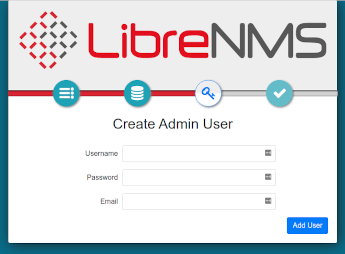

# LibreNMS monitoring server

## Introduction

Network and systems administrators almost always need some form of monitoring. This can include graphing bandwidth usage at router end points, monitoring the status of services running on various servers, and much more. Many monitoring options exist, but one good option with many, if not all, of the monitoring components available under one roof, is LibreNMS.

This document is just a starting point for LibreNMS. The author will point you to the project's excellent (and extensive) documentation for more options. The author has used many other monitoring solutions, Nagios and Cacti being two, but LibreNMS offers what those two projects offer individually in one spot.

The installation will closely follow the [official install instructions](https://docs.librenms.org/Installation/Install-LibreNMS/).  Explanations and minor changes to that procedure, make this procedure preferable to that excellent document.

## Prerequisites, assumptions, and conventions

* A server or container (yes, LibreNMS will run in a container. If you have a great deal to  monitor, your best bet would be to install on stand-alone hardware) running Rocky Linux. All commands assume a fresh install of Rocky Linux.
* Assumption: that you can run commands as root or can _sudo_ to elevate privileges 
* Working knowledge of command-line tools, including text editors such as _vi_
* Assumption: the use of SNMP v2. If you want to use SNMP v3, LibreNMS supports it and will work. You will need to switch up the SNMP configuration and options on your devices to match up to v3.
* Included here is the SELinux procedure. The container the author uses in the lab does not include it by default. For this reason, the SELinux procedure has **not** been lab tested.
* Throughout this document, the examples use the _vi_ editor. When the document says to save your changes and exit, use <kbd>SHIFT</kbd>+<kbd>:</kbd>+<kbd>wq!</kbd>.
* The procedure requires some troubleshooting skills, including log monitoring, web testing, and more

## Installing packages

Enter these commands as the root user. Before starting, note that this installation procedure focuses on *httpd*, rather than *nginx*. If you prefer the latter, follow the [Librenms Install Instructions](https://docs.librenms.org/Installation/Install-LibreNMS/) and guide there. 

First, install the EPEL repository (Extra Packages for Enterprise Linux):

```
dnf install -y epel-release
```

The current version of LibreNMS requires a minimum PHP version of 8.1. Rocky Linux 9.0 has PHP 8.0. Enable a third-party repository (also in Rocky Linux 8.6) for this newer version. 

The version of the repository you install will depend on the version of Rocky Linux you are running. The assumption is version 9, but change this accordingly for the version you are running: 

```
dnf install http://rpms.remirepo.net/enterprise/remi-release-9.rpm
```

Once both the EPEL and REMI repositories are installed, it is time to install the packages:

```
dnf install bash-completion cronie fping git httpd ImageMagick mariadb-server mtr net-snmp net-snmp-utils nmap php81-php-fpm php81-php-cli php81-php-common php81-php-curl php81-php-gd php81-php-json php81-php-mbstring php81-php-process php81-php-snmp php81-php-xml php81-php-zip php81-php-mysqlnd python3 python3-PyMySQL python3-redis python3-memcached python3-pip python3-systemd rrdtool unzip wget
```

All of these packages represent some portion of the LibreNMS feature set.

## Setting up the 'librenms' user

Copy and paste (or enter) the following:

```
useradd librenms -d /opt/librenms -M -r -s "$(which bash)"
```

This command sets the default directory for the user to `/opt/librenms` however the `-M` option says "do not create the directory." The reason is that this happens upon LibreNMS's installation. The `-r` says to make this user a system account and the `-s` says to set the shell (in this case, to "bash").

## Download LibreNMS and set permissions

Git facilitates the Download. You might be familiar with the process. First, switch over to the `/opt` directory:

```
cd /opt
```

Clone the repository:

```
git clone https://github.com/librenms/librenms.git
```

Change permissions for the directory:

```
chown -R librenms:librenms /opt/librenms
chmod 771 /opt/librenms
setfacl -d -m g::rwx /opt/librenms/rrd /opt/librenms/logs /opt/librenms/bootstrap/cache/ /opt/librenms/storage/
setfacl -R -m g::rwx /opt/librenms/rrd /opt/librenms/logs /opt/librenms/bootstrap/cache/ /opt/librenms/storage/
```

The `setfacl` command stands for "set file access control lists" and is another way of securing directories and files.

## Install PHP dependencies as `librenms`

The PHP dependencies within LibreNMS need installation with the `librenms` user. To do this, run:

```
su - librenms
```

Enter the following:

```
./scripts/composer_wrapper.php install --no-dev
```

Exit back to root:

```
exit
```

### Failure Of PHP dependency install workaround

LibreNMS documentation says that the above procedure might fail when you are behind a proxy server. It can fail for other reasons also. For this reason, a procedure for installing Composer comes later. 

## Set timezone

You need to ensure the correct setting for the system and PHP. You can find a list of [valid timezone settings for PHP here](https://php.net/manual/en/timezones.php). For instance, for the Central timezone, a common entry is "America/Chicago". Start by editing the `php.ini` file:

```
vi /etc/opt/remi/php81/php.ini
```

Find the `date.timezone` line and modify it. Note that it is remarked out, so remove the ";" from the beginning of the line and add your timezone after the "=" sign. For the Central timezone example use:

```
date.timezone = America/Chicago
```

Save your changes and exit the `php.ini` file.

You also need to ensure that the system timezone is correct. Using the Central timezone example, do this with:

```
timedatectl set-timezone America/Chicago
```

## MariaDB setup

Before starting the database requirements for LibreNMS, run through the [MariaDB procedure](../database/database_mariadb-server.md), specifically the section for "Securing mariadb-server", and return here for these specific settings. Change the `mariadb-server.cnf` file:

```
vi /etc/my.cnf.d/mariadb-server.cnf
```

Add these lines to the "[Mysqld]" section:

```
innodb_file_per_table=1
lower_case_table_names=0
```

Then enable and restart the `mariadb` server:

```
systemctl enable mariadb
systemctl restart mariadb
```

Access `mariadb` as the root user. Remember to use the password that you created when following the "Securing mariadb-server" section performed earlier:


```
mysql -u root -p
```

Make some specific changes for LibreNMS. With the command below, remember to change the password "password" to something secure and document what that is in a safe spot. 

At the `mysql` prompt run:

```
CREATE DATABASE librenms CHARACTER SET utf8mb4 COLLATE utf8mb4_unicode_ci;
CREATE USER 'librenms'@'localhost' IDENTIFIED BY 'password';
GRANT ALL PRIVILEGES ON librenms.* TO 'librenms'@'localhost';
FLUSH PRIVILEGES;
```

Enter "exit" to exit out of `mariadb`.

## Configure PHP-FPM

This not changed from the official documentation except for the path to the files. First, copy the `www.conf`:

```
cp /etc/opt/remi/php81/php-fpm.d/www.conf /etc/opt/remi/php81/php-fpm.d/librenms.conf
```

Change the `librenms.conf` file:

```
vi /etc/opt/remi/php81/php-fpm.d/librenms.conf
```

Change "[www]" to ["librenms]"

Change the user and group to "librenms":

```
user = librenms
group = librenms
```

Change the "listen" line to reflect a unique name:

```
listen = /run/php-fpm-librenms.sock
```

Save your changes and exit the file. If this is the only web service that will be running on this machine, you can remove the old www.conf file you copied:

```
rm -f /etc/opt/remi/php81/php-fpm.d/www.conf
```

## Configure `httpd` 

Start by creating this file:

```
vi /etc/httpd/conf.d/librenms.conf
```

Enter the following in that file:

```
<VirtualHost *:80>
  DocumentRoot /opt/librenms/html/
  ServerName  librenms.example.com

  AllowEncodedSlashes NoDecode
  <Directory "/opt/librenms/html/">
    Require all granted
    AllowOverride All
    Options FollowSymLinks MultiViews
  </Directory>

  # Enable http authorization headers
  <IfModule setenvif_module>
    SetEnvIfNoCase ^Authorization$ "(.+)" HTTP_AUTHORIZATION=$1
  </IfModule>

  <FilesMatch ".+\.php$">
    SetHandler "proxy:unix:/run/php-fpm-librenms.sock|fcgi://localhost"
  </FilesMatch>
</VirtualHost>
```

You should remove the old default site, `welcome.conf`:

```
rm /etc/httpd/conf.d/welcome.conf
```

Enable  `httpd` and `php-fpm`:

```
systemctl enable --now httpd
systemctl enable --now php81-php-fpm
```

## SELinux

If you do not plan to use SELinux, skip to the next section. This might also apply to you if you use LibreNMS on a container that does not support SELinux at the container level, or does not include it by default.

To setup everything with SELinux, you will need an additional package installed:

```
dnf install policycoreutils-python-utils
```

### Configure LibreNMS contexts

You will need to set the following contexts for LibreNMS to work properly with SELinux:

```
semanage fcontext -a -t httpd_sys_content_t '/opt/librenms/html(/.*)?'
semanage fcontext -a -t httpd_sys_rw_content_t '/opt/librenms/(logs|rrd|storage)(/.*)?'
restorecon -RFvv /opt/librenms
setsebool -P httpd_can_sendmail=1
setsebool -P httpd_execmem 1
chcon -t httpd_sys_rw_content_t /opt/librenms/.env
```

### Allow `fping`

Create a file called `http_fping.tt` anywhere. It does not matter where. Installing this happens next. The contents of this file are:

```
module http_fping 1.0;

require {
type httpd_t;
class capability net_raw;
class rawip_socket { getopt create setopt write read };
}

#============= httpd_t ==============
allow httpd_t self:capability net_raw;
allow httpd_t self:rawip_socket { getopt create setopt write read };
```

Install this file with the following commands:

```
checkmodule -M -m -o http_fping.mod http_fping.tt
semodule_package -o http_fping.pp -m http_fping.mod
semodule -i http_fping.pp
```

If you run into problems and you suspect it might be due to an SELinux issue, run the following:

```
audit2why < /var/log/audit/audit.log
```

## `firewalld` configuration

The `firewalld` instructions follow the official documentation. 

The command to use for `firewalld` allow rules are as follows:

```
firewall-cmd --zone public --add-service http --add-service https
firewall-cmd --permanent --zone public --add-service http --add-service https
```
The author has problems with this simplistic `firewalld` rule set. This rule allows your web services to be open to the world, but is that what you want for a monitoring server? 

This is usually **not** the case. If you would like a more granular approach to using `firewalld`, review [this document](../security/firewalld.md) and then make changes to your `firewalld` rules accordingly.

## Enable symbolic link And tab-autocomplete For `lnms` commands

First, you need a symbolic link on your `lnms` command so it is possible to run from anywhere:

```
ln -s /opt/librenms/lnms /usr/bin/lnms
```

Next, set it up for autocomplete:

```
cp /opt/librenms/misc/lnms-completion.bash /etc/bash_completion.d/
```

## Configure `snmpd`

_SNMP_ stands for "Simple Network Management Protocol" and is in use by many monitoring programs for pulling data. Version 2, used here, requires a "community string" which is specific to your environment.

Assign this "community string" to your network devices you want to monitor, so that `snmpd` (the "d" here stands for the daemon) will be able to find it. You might already have a "community string" in use if your network is not new.

Copy the `snmpd.conf` file from LibreNMS:

```
cp /opt/librenms/snmpd.conf.example /etc/snmp/snmpd.conf
```

Edit this file and change the community string from "RANDOMSTRINGGOESHERE" to whatever your community string is or will be. In the example, this is "LABone":

```
vi /etc/snmp/snmpd.conf
```

Change this line:

```
com2sec readonly  default         RANDOMSTRINGGOESHERE
```

to

```
com2sec readonly  default         LABone
```

Save your changes and exit.

## Automating with a cron job

Run the following commands to set up the cron jobs:

```
cp /opt/librenms/librenms.nonroot.cron /etc/cron.d/librenms
```

The poller must run once, even though nothing is there to poll, before running the web setup procedure. It saves some troubleshooting trying to figure out what is wrong when you get poller errors in the validation section later on.

The poller runs with the "librenms" user, and though it is possible to switch to this user and run the cron files, it is really better to let the poller do it on its own. Ensure that at least 5 minutes have passed to allow the cron to run and then continue  the "Web Setup" section.


## Log rotation

LibreNMS will create a large set of logs over time. You will need to setup log rotation for this to conserve disk space. To do this, run this command:

```
cp /opt/librenms/misc/librenms.logrotate /etc/logrotate.d/librenms
```

## Installing composer (workaround)

PHP Composer is a requirement for the current installation (mentioned in the earlier procedure). If the install you ran earlier failed, you will need to do this.

Before starting, you need to link your current version of the `php` binary to a location in the path. This procedure used the REMI installation to get the correct version of PHP, and it is not installed within the path. 

This is fixable with a symbolic link and will make your life much easier as you run the remaining steps:

```
ln -s /opt/remi/php81/root/usr/bin/php /usr/bin/php
```

Go to the [Composer website](https://getcomposer.org/download/) and ensure that the following steps have not changed. Then run these commands somewhere on the machine. You will move composer when this is done: 

```
php -r "copy('https://getcomposer.org/installer', 'composer-setup.php');"
php -r "if (hash_file('sha384', 'composer-setup.php') === '55ce33d7678c5a611085589f1f3ddf8b3c52d662cd01d4ba75c0ee0459970c2200a51f492d557530c71c15d8dba01eae') { echo 'Installer verified'; } else { echo 'Installer corrupt'; unlink('composer-setup.php'); } echo PHP_EOL;"
php composer-setup.php
php -r "unlink('composer-setup.php');"
```

Move it to a spot within the path. Use `/usr/local/bin/` for this:

```
mv composer.phar /usr/local/bin/composer
```

## Web setup

With all of the components installed and configured, your next step is to finish the installation via the web. In the lab version, you have no hostname setup. To finish the setup, you need to go to the web server by IP address. 

The IP of the lab machine is 192.168.1.140. Navigate to the following address in a web browser to finish the install:

`http://192.168.1.140/librenms`

A redirection to the pre-install checks follows if all is working correctly. If these are all marked in green, you can continue.


Four buttons are beneath the LibreNMS logo. The first button on the left is for the pre-checks. The next button over is for the database. You will need the password you set for the database user "librenms" earlier.

If you have been following along, then you have that saved in a safe place. Click on the "Database" button. The "User" and "Password" are all that is necessary here. When you do that, click the "Check Credentials" button.


Click the "Build Database" button if it comes back green.


The "Create Admin User" button will be active now. Click this. A prompt for an admin user name is next. In the lab it is "admin." Create a password for this user.

Ensure the password is secure and log it somewhere safe, such as a password manager. You will also need to add the email address for the administrative user. When completed, click the "Add User" button.



You will now see a screen for "Finish Install." There will only be one item left to finish the installation, a line that asks you to "validate your install".

Click the link. A redirect occurs to the login page. Login with your administrative user and password.

## Adding devices

Again, one of the assumptions was that you are using SNMP v2. Remember that each device you add must be  a member of your community string. Here the author uses two device examples, An Ubuntu workstation and a CentOS server. 

You will likely have managed switches, routers, and other devices to add. The author can tell you from experience that adding switches and routers is easier than adding workstations and servers.

### Ubuntu workstation setup

First, install `snmpd` on the workstation and update packages just to be safe:

```
sudo update && sudo apt-get upgrade && sudo apt-get install snmpd
```

Next, you need to change the `snmpd.conf` file:

```
sudo vi /etc/snmpd/snmpd.conf
```

Find the lines that describe your workstation and change them to things that identify the workstation:

```
sysLocation    Desktop
sysContact     Username <user@mydomain.com>
```

When you install `snmpd` on Ubuntu, it only binds to the local address. It does not listen on your machine IP address. This will not allow LibreNMS to connect to it. You need to remark out this line:

```
agentaddress  127.0.0.1,[::1]
```

Add a new line: (In this example, the IP address of your workstation is 192.168.1.122 and the UDP port you are setting is "161")

```
agentAddress udp:127.0.0.1:161,udp:192.168.1.122:161
```

You need to specify the read-only access community string. Find the below lines and remark them out as shown:

```
#rocommunity public default -V systemonly
#rocommunity6 public default -V systemonly
```

Add a line:

```
rocommunity LABone
```

Save your changes and exit.

Enable and start `snmpd`:

```
sudo systemctl enable snmpd
sudo systemctl start snmpd
```

If you are running a firewall on your internal workstations, you will need to change the firewall to allow UDP traffic from the monitoring server or from the network. LibreNMS also wants to be able to "ping" your device. Ensure that ICMP port 8 from the server is not filtered.

### CentOS or Rocky Linux server setup

The assumption is you are root or that you can `sudo` to elevate privileges. You need to install some packages:

```
dnf install net-snmp net-snmp-utils
```

Create a `snmpd.conf` file. Rather than try to navigate the included file, move this file to rename it, and create a brand new empty file:

```
mv /etc/snmp/snmpd.conf /etc/snmp/snmpd.conf.orig
```

and

```
vi /etc/snmp/snmpd.conf
```

Copy this into the new file:

```
# Map 'LABone' community to the 'AllUser'
# sec.name source community
com2sec AllUser default LABone
# Map 'ConfigUser' to 'ConfigGroup' for SNMP Version 2c
# Map 'AllUser' to 'AllGroup' for SNMP Version 2c
# sec.model sec.name
group AllGroup v2c AllUser
# Define 'SystemView', which includes everything under .1.3.6.1.2.1.1 (or .1.3.6.1.2.1.25.1)
# Define 'AllView', which includes everything under .1
# incl/excl subtree
view SystemView included .1.3.6.1.2.1.1
view SystemView included .1.3.6.1.2.1.25.1.1
view AllView included .1
# Give 'ConfigGroup' read access to objects in the view 'SystemView'
# Give 'AllGroup' read access to objects in the view 'AllView'
# context model level prefix read write notify
access AllGroup "" any noauth exact AllView none none
```

CentOS and Rocky use a mapping convention to direct things. The shown file has comments to define what is happening, but does not include all of the clutter of the original file.

When you have made the changes, save them and exit the file.

Enable and start `snmpd`:

```
systemctl enable snmpd
systemctl start snmpd
```

#### Firewall

If you are running a server, then you **are** running a firewall, right? If you are running `firewalld` the assumption is that you use the "trusted" zone and you just want to allow all traffic from your monitoring server, 192.168.1.140:

```
firewall-cmd --zone=trusted --add-source=192.168.1.140 --permanent
```
If the "trusted" zone is incorrect for your environment, change this to suite your needs. Consider your rules and their effect before adding them in.

## Adding the devices in Librenms

With your sample devices configured to accept SNMP traffic from the LibreNMS server, the next step is adding those devices to LibreNMS. With the web interface for LibreNMS open, click to add a device: 


Put in the information used for your test devices. Enter the IP for the Ubuntu workstation to start. In the example that is 192.168.1.122. Add the "LABone" community string in the "Community" field. 

Click the "Add Device" button. Assuming everything is correct, this process will complete successfully. 

If you run into a "failure to add" error, review the SNMP setup for the workstation or the firewall if it exists. Repeat the "Add Device" process for your CentOS server.

## Getting alerts

As noted from the start, this document will only get you started with LibreNMS. A large number of additional configuration items exist, an extensive API (Application Programming Interface), an alerts system that provides a huge number of options for delivery, called "Transports", and much more. 

This document does not contain any alert rules creation procedures. Instead, you will edit the built-in alert rule "Device Down! Due to no ICMP response" that is pre-configured out of the box. For "Transports" use "Mail", which is just email. Know that you are not limited to this alert.

Mail must be working to use email for transport. Use this [Postfix Procedure](../email/postfix_reporting.md) to get this going. 

### Transports

You need a way to send your alerts. As noted earlier, LibreNMS supports a huge number of transports. Email alert defined as "Mail" transport, is in use here. To set up the transport:

1. Go to the dashboard
2. Let your mouse hover over "Alerts"
3. Go down to "Alert Transports" and click on it
4. Click on the "Create alert transport" button (Note the "Create transport group" button. You can use this to have alerts go to several individuals)
5. In the "Transport name:" field, enter  "Alert By Email"
6. In the "Transport type:" field, use the drop down to select "Mail"
7. Ensure the "Default alert:" field is "On"
8. In the "Email:" field, enter the email address of the administrator

### Organizing devices into groups

The best way to set up alerts is to organize your devices logically. Currently, you have a workstation and a server in devices. Normally you would not combine the two, as done here.

This example is also redundant, as an "All Devices" group exists that will work for this as well. To set up a device group:

1. Go to the dashboard
2. Let your mouse hover over "Devices"
3. Go down to "Manage Groups" and click on it
4. Click on the "+ New Device Group" button
5. In the "Name" field, enter "ICMP Group"
6. In the description field enter what ever you think will help describe the group
7. Change the "Type" field from "Dynamic" to "Static"
8. Add each device to the "Select Devices" field and save your changes

### Setting up the alert rules

Configure the alert rule next. By default, LibreNMS has several alert rules already created for you:

1. Go to the dashboard
2. Let your mouse hover over "Alerts"
3. Go down to "Alert Rules" and click on it
4. The top active rule here will be "Device Down! Due to no ICMP response." Go over to the "Action" (far right column) and click on the pencil icon to edit the rule.
5. Leave all the fields at the top with defaults. In the "Match devices, groups and locations list:" field, click inside the field.
6. Select "ICMP Group" from the list
7. Ensure the "All devices except in list:" field is "Off"
8. Click inside the "Transports:" field and select "Mail: Alert By Email" and save your rule.

Before saving, your rule will be:


These two devices will now alert you by email if they are down, and upon recovery.

## Conclusion

LibreNMS is a powerful monitoring tool with a full set of features in one application. This document has _just_ scratched the surface on its capabilities. Some of the simpler screens are not shown. 

When you add devices, assuming that all of the SNMP properties are correctly set, you will start to receive bandwidth, memory utilization, and CPU utilization graphs on each device. This lab has not shown you the wealth of transports available besides "Mail". 

This document has shown you enough to get a good start monitoring your environment. LibreNMS takes some time to master all of the elements. You should visit the project's [excellent documentation](https://docs.librenms.org/) for additional information.
