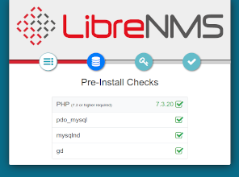

- - -
title: LibreNMS Monitoring Server author: Steven Spencer contributors: Ezequiel Bruni, Ganna Zhyrnova tested_with: 8.5, 8.6, 9.0 tags:
  - моніторинг
  - мережа
- - -

# Сервер моніторингу LibreNMS

## Вступ

Мережевим і системним адміністраторам майже завжди потрібна певна форма моніторингу. Це може включати графічне використання пропускної здатності на кінцевих точках маршрутизатора, моніторинг підвищення/зниження служб, що працюють на різних серверах, і багато іншого. Існує багато варіантів моніторингу, але одним хорошим варіантом з багатьма, якщо не всіма, компонентами моніторингу, доступними під одним дахом, є LibreNMS.

Цей документ є лише відправною точкою для LibreNMS. Автор вкаже вам на чудову (і розширену) документацію проекту для отримання додаткових варіантів. Автор використовував багато інших рішень для моніторингу, Nagios і Cacti, але LibreNMS пропонує те, що пропонують ці два проекти окремо, в одному місці.

Встановлення відбуватиметься відповідно до [офіційних інструкцій із встановлення](https://docs.librenms.org/Installation/Install-LibreNMS/).  Пояснення та незначні зміни в цій процедурі роблять цю процедуру кращою за чудовий документ.

## Передумови, припущення та умовності

* Сервер або контейнер (так, LibreNMS працюватиме в контейнері. Якщо у вас є багато чого для моніторингу, найкращим варіантом буде інсталяція на автономному апаратному забезпеченні) під керуванням Rocky Linux. Усі команди передбачають нову інсталяцію Rocky Linux.
* Припущення: ви можете запускати команди від імені адміністратора або _sudo_ для підвищення привілеїв
* Практичні знання інструментів командного рядка, включаючи текстові редактори, такі як _vi_
* Припущення: використання SNMP v2. Якщо ви хочете використовувати SNMP v3, LibreNMS підтримує це і буде працювати. Ви повинні змінити конфігурацію та параметри SNMP на своїх пристроях, щоб відповідати версії 3.
* Тут включено процедуру SELinux. Контейнер, який автор використовує в лабораторії, не включає його за замовчуванням. З цієї причини процедура SELinux **не** була лабораторно перевірена.
* У цьому документі в прикладах використовується редактор _vi_. Коли в документі написано зберегти зміни та вийти, використовуйте <kbd>SHIFT</kbd>+<kbd>:</kbd>+<kbd>wq!</kbd>.
* Процедура вимагає певних навичок усунення несправностей, включаючи моніторинг журналів, веб-тестування тощо

## Встановлення пакетів

Введіть ці команди від імені користувача root. Перш ніж почати, зауважте, що ця процедура встановлення зосереджена на *httpd*, а не на *nginx*. Якщо ви віддаєте перевагу останньому, дотримуйтеся [інструкцій зі встановлення Librenms](https://docs.librenms.org/Installation/Install-LibreNMS/) і вказівок.

Спочатку встановіть репозиторій EPEL (додаткові пакети для Enterprise Linux):

```
dnf install -y epel-release
```

Для поточної версії LibreNMS потрібна мінімальна версія PHP 8.1. Rocky Linux 9.0 має PHP 8.0. Увімкніть репозиторій третьої сторони (також у Rocky Linux 8.6) для цієї новішої версії.

Версія репозиторію, яку ви встановите, залежатиме від версії Rocky Linux, яку ви використовуєте. Припущенням є версія 9, але змініть це відповідно до версії, яку ви використовуєте:

```
dnf install http://rpms.remirepo.net/enterprise/remi-release-9.rpm
```

Після того, як репозиторії EPEL і REMI встановлено, настав час інсталювати пакунки:

```
dnf install bash-completion cronie fping git httpd ImageMagick mariadb-server mtr net-snmp net-snmp-utils nmap php81-php-fpm php81-php-cli php81-php-common php81-php-curl php81-php-gd php81-php-json php81-php-mbstring php81-php-process php81-php-snmp php81-php-xml php81-php-zip php81-php-mysqlnd python3 python3-PyMySQL python3-redis python3-memcached python3-pip python3-systemd rrdtool unzip wget
```

Усі ці пакети представляють певну частину набору функцій LibreNMS.

## Налаштування користувача «librenms»

Скопіюйте та вставте (або введіть) наступне:

```
useradd librenms -d /opt/librenms -M -r -s "$(which bash)"
```

Ця команда встановлює типовий каталог для користувача на `/opt/librenms`; однак параметр `-M` каже "не створювати каталог". Причина в тому, що це відбувається під час встановлення LibreNMS. `-r` каже зробити цього користувача системним обліковим записом, а `-s` говорить про встановлення оболонки (у цьому випадку на "bash").

## Завантаження LibreNMS і встановлення дозволів

Git полегшує завантаження. Можливо, ви знайомі з процесом. Спочатку перейдіть до каталогу `/opt`:

```
cd /opt
```

Клонуйте репозиторій:

```
git clone https://github.com/librenms/librenms.git
```

Змініть дозволи для каталогу:

```
chown -R librenms:librenms /opt/librenms
chmod 771 /opt/librenms
setfacl -d -m g::rwx /opt/librenms/rrd /opt/librenms/logs /opt/librenms/bootstrap/cache/ /opt/librenms/storage/
setfacl -R -m g::rwx /opt/librenms/rrd /opt/librenms/logs /opt/librenms/bootstrap/cache/ /opt/librenms/storage/
```

Команда `setfacl` розшифровується як «встановити списки контролю доступу до файлів» і є іншим способом захисту каталогів і файлів.

## Встановлення залежності PHP як `librenms`

Залежності PHP у LibreNMS потрібно інсталювати за допомогою користувача `librenms`. Для цього запустіть:

```
su - librenms
```

Введіть наступне:

```
./scripts/composer_wrapper.php install --no-dev
```

Поверніться до root:

```
exit
```

### Помилка встановлення залежностей PHP

У документації LibreNMS зазначено, що описана вище процедура може завершитися помилкою, якщо ви перебуваєте за проксі-сервером. Вона також може вийти з ладу з інших причин. З цієї причини процедура встановлення Composer з’явиться пізніше.

## Встановлення часового поясу

Вам потрібно переконатися, що налаштування системи та PHP є правильними. Ви можете знайти список [дійсних налаштувань часового поясу для PHP тут](https://php.net/manual/en/timezones.php). Наприклад, для центрального часового поясу стандартним записом є «Америка/Чикаго». Почніть із редагування файлу `php.ini`:

```
vi /etc/opt/remi/php81/php.ini
```

Знайдіть рядок `date.timezone` і змініть його. Зауважте, що це позначено, тому видаліть ";" від початку рядка та додайте свій часовий пояс після знака "=". Для прикладу центрального часового поясу використовуйте наступне:

```
date.timezone = America/Chicago
```

Збережіть зміни та закрийте файл `php.ini`.

Вам також потрібно переконатися, що системний часовий пояс правильний. Використовуючи приклад центрального часового поясу, зробіть це за допомогою:

```
timedatectl set-timezone America/Chicago
```

## Налаштування MariaDB

Перш ніж розпочинати вимоги до бази даних для LibreNMS, виконайте [процедуру MariaDB](../database/database_mariadb-server.md), зокрема розділ «Захист mariadb-сервера», і поверніться сюди, щоб отримати ці конкретні налаштування. Змініть файл `mariadb-server.cnf`:

```
vi /etc/my.cnf.d/mariadb-server.cnf
```

Додайте такі рядки до розділу "[Mysqld]":

```
innodb_file_per_table=1
lower_case_table_names=0
```

Потім увімкніть і перезапустіть сервер `mariadb`:

```
systemctl enable mariadb
systemctl restart mariadb
```

Отримайте доступ до `mariadb` як користувач root. Не забувайте використовувати пароль, який ви створили під час виконання розділу «Захист mariadb-сервера», виконаного раніше:


```
mysql -u root -p
```

Внесіть певні зміни для LibreNMS. За допомогою наведеної нижче команди не забудьте змінити пароль "password" на щось безпечне та задокументувати те, що знаходиться в безпечному місці.

У підказці `mysql` виконайте:

```
CREATE DATABASE librenms CHARACTER SET utf8mb4 COLLATE utf8mb4_unicode_ci;
CREATE USER 'librenms'@'localhost' IDENTIFIED BY 'password';
GRANT ALL PRIVILEGES ON librenms.* TO 'librenms'@'localhost';
FLUSH PRIVILEGES;
```

Введіть "exit", щоб вийти з `mariadb`.

## Налаштувати PHP-FPM

Це не змінилося в офіційній документації, за винятком шляху до файлу. Спочатку скопіюйте `www.conf`:

```
cp /etc/opt/remi/php81/php-fpm.d/www.conf /etc/opt/remi/php81/php-fpm.d/librenms.conf
```

Змініть файл `librenms.conf`:

```
vi /etc/opt/remi/php81/php-fpm.d/librenms.conf
```

Змініть "[www]" на ["librenms]"

Змініть користувача та групу на "librenms":

```
user = librenms
group = librenms
```

Змініть рядок «listen», щоб відобразити унікальну назву:

```
listen = /run/php-fpm-librenms.sock
```

Збережіть зміни та вийдіть із файлу. Якщо це єдина веб-служба, яка працюватиме на цій машині, ви можете видалити старий файл www.conf, який ви скопіювали:

```
rm -f /etc/opt/remi/php81/php-fpm.d/www.conf
```

## Налаштування `httpd`

Почніть зі створення цього файлу:

```
vi /etc/httpd/conf.d/librenms.conf
```

Введіть у цей файл наступне:

```
<VirtualHost *:80>
  DocumentRoot /opt/librenms/html/
  ServerName  librenms.example.com

  AllowEncodedSlashes NoDecode
  <Directory "/opt/librenms/html/">
    Require all granted
    AllowOverride All
    Options FollowSymLinks MultiViews
  </Directory>

  # Enable http authorization headers
  <IfModule setenvif_module>
    SetEnvIfNoCase ^Authorization$ "(.+)" HTTP_AUTHORIZATION=$1
  </IfModule>

  <FilesMatch ".+\.php$">
    SetHandler "proxy:unix:/run/php-fpm-librenms.sock|fcgi://localhost"
  </FilesMatch>
</VirtualHost>
```

Ви повинні видалити старий сайт за замовчуванням, `welcome.conf`:

```
rm /etc/httpd/conf.d/welcome.conf
```

Увімкніть `httpd` і `php-fpm`:

```
systemctl enable --now httpd
systemctl enable --now php81-php-fpm
```

## SELinux

Якщо ви не плануєте використовувати SELinux, перейдіть до наступного розділу. Це також може стосуватися вас, якщо ви використовуєте LibreNMS у контейнері, який не підтримує SELinux на рівні контейнера або не включає його за замовчуванням.

Щоб налаштувати все за допомогою SELinux, вам знадобиться встановити додатковий пакет:

```
dnf install policycoreutils-python-utils
```

### Налаштування контекста LibreNMS

Щоб LibreNMS належним чином працював із SELinux, потрібно встановити наступні контексти:

```
semanage fcontext -a -t httpd_sys_content_t '/opt/librenms/html(/.*)?'
semanage fcontext -a -t httpd_sys_rw_content_t '/opt/librenms/(logs|rrd|storage)(/.*)?'
restorecon -RFvv /opt/librenms
setsebool -P httpd_can_sendmail=1
setsebool -P httpd_execmem 1
chcon -t httpd_sys_rw_content_t /opt/librenms/.env
```

### Дозволити `fping`

Створіть будь-де файл під назвою `http_fping.tt`. Не має значення де. Встановлення цього відбувається далі. Вміст цього файлу:

```
module http_fping 1.0;

require {
type httpd_t;
class capability net_raw;
class rawip_socket { getopt create setopt write read };
}

#============= httpd_t ==============
allow httpd_t self:capability net_raw;
allow httpd_t self:rawip_socket { getopt create setopt write read };
```

Встановіть цей файл за допомогою таких команд:

```
checkmodule -M -m -o http_fping.mod http_fping.tt
semodule_package -o http_fping.pp -m http_fping.mod
semodule -i http_fping.pp
```

Якщо у вас виникли проблеми та ви підозрюєте, що це може бути пов’язано з проблемою SELinux, виконайте наступне:

```
audit2why < /var/log/audit/audit.log
```

## Конфігурація `firewalld`

Інструкції `firewalld` відповідають офіційній документації.

Команда для використання правил дозволу `firewalld` наступна:

```
firewall-cmd --zone public --add-service http --add-service https
firewall-cmd --permanent --zone public --add-service http --add-service https
```
Автор має проблеми з цим спрощеним набором правил `firewalld`. Це правило дозволяє вашим веб-сервісам бути відкритими для світу, але чи цього ви хочете від сервера моніторингу?

Зазвичай це **ні**. Якщо вам потрібен більш детальний підхід до використання `firewalld`, перегляньте [цей документ](../security/firewalld.md), а потім внесіть відповідні зміни до своїх правил `firewalld`.

## Увімкнення символьного посилання та автозаповнення табуляції для команд `lnms`

По-перше, вам потрібне символічне посилання на вашу команду `lnms`, щоб можна було запускати будь-де:

```
ln -s /opt/librenms/lnms /usr/bin/lnms
```

Далі налаштуйте його на автозаповнення:

```
cp /opt/librenms/misc/lnms-completion.bash /etc/bash_completion.d/
```

## Налаштування `snmpd`

_SNMP_ означає "Simple Network Management Protocol (Простий протокол керування мережею)" і використовується багатьма програмами моніторингу для отримання даних. Для версії 2, яка тут використовується, потрібен «рядок спільноти», який відповідає вашому середовищу.

Призначте цей «рядок спільноти» мережевим пристроям, які ви хочете контролювати, щоб `snmpd` («d» тут означає демон) міг знайти його. Якщо ваша мережа існує певний час, можливо, ви вже використовуєте «рядок спільноти».

Скопіюйте файл `snmpd.conf` із LibreNMS:

```
cp /opt/librenms/snmpd.conf.example /etc/snmp/snmpd.conf
```

Відредагуйте цей файл і змініть рядок спільноти з "RANDOMSTRINGGOESHERE" на будь-який рядок вашої спільноти. У прикладі це "LABone":

```
vi /etc/snmp/snmpd.conf
```

Змініть цей рядок:

```
com2sec readonly  default         RANDOMSTRINGGOESHERE
```

на

```
com2sec readonly  default         LABone
```

Збережіть зміни та вийдіть.

## Автоматизація за допомогою завдання Cron

Виконайте такі команди, щоб налаштувати завдання cron:

```
cp /opt/librenms/librenms.nonroot.cron /etc/cron.d/librenms
```

Опитувач має запуститися один раз, навіть якщо не буде нічого для опитування, перед запуском процедури веб-налаштування. Це заощаджує час від розчісування голови, щоб визначити, що не так, коли пізніше ви отримуєте помилки опитувальника в розділі перевірки.

Опитувач працює з користувачем «librenms», і хоча можна переключитися на цього користувача та запустити файли cron, краще дозволити опитувальнику робити це самостійно. Переконайтеся, що минуло принаймні 5 хвилин, щоб запустити cron, і продовжте розділ «Веб-налаштування».


## Ротація Журналу

LibreNMS з часом створить великий набір журналів. Для цього вам потрібно буде налаштувати ротацію журналу, щоб заощадити місце на диску. Для цього виконайте цю команду:

```
cp /opt/librenms/misc/librenms.logrotate /etc/logrotate.d/librenms
```

## Встановлення composer (вирішення проблеми)

PHP Composer є вимогою для поточної інсталяції (згаданої в попередній процедурі). Якщо встановлення, яке ви запустили раніше, не вдалось, ви повинні це зробити.

Перш ніж почати, вам потрібно прив’язати вашу поточну версію двійкового файлу `php` до розташування в шляху. Ця процедура використовувала інсталяцію REMI для отримання правильної версії PHP, і її не було встановлено в межах шляху.

Це можна виправити за допомогою символічного посилання, і це значно полегшить ваше життя під час виконання решти кроків:

```
ln -s /opt/remi/php81/root/usr/bin/php /usr/bin/php
```

Перейдіть на [веб-сайт Composer](https://getcomposer.org/download/) і переконайтеся, що наведені нижче дії не змінилися. Потім запустіть ці команди десь на машині. Ви перемістите composer, коли це буде зроблено:

```
php -r "copy('https://getcomposer.org/installer', 'composer-setup.php');"
php -r "if (hash_file('sha384', 'composer-setup.php') === '55ce33d7678c5a611085589f1f3ddf8b3c52d662cd01d4ba75c0ee0459970c2200a51f492d557530c71c15d8dba01eae') { echo 'Installer verified'; } else { echo 'Installer corrupt'; unlink('composer-setup.php'); } echo PHP_EOL;"
php composer-setup.php
php -r "unlink('composer-setup.php');"
```

Перемістіть його в місце на шляху. Для цього використовуйте `/usr/local/bin/`:

```
mv composer.phar /usr/local/bin/composer
```

## Веб-налаштування

Коли всі компоненти встановлено та налаштовано, вашим наступним кроком є завершення встановлення через Інтернет. У лабораторній версії у вас немає налаштування імені хоста. Щоб завершити налаштування, необхідно перейти на веб-сервер за IP-адресою.

IP-адреса лабораторної машини 192.168.1.140. Перейдіть за такою адресою у веб-браузері, щоб завершити встановлення:

`http://192.168.1.140/librenms`

Далі буде переспрямування до перевірки перед інсталяцією, припускаючи, що все працює правильно. Якщо всі вони позначені зеленим, ви можете продовжувати.



Чотири кнопки знаходяться під логотипом LibreNMS. Перша кнопка зліва призначена для попередніх перевірок. Наступна кнопка для бази даних. Вам знадобиться пароль, який ви встановили раніше для користувача бази даних «librenms».

Якщо ви стежили за цим, значить, ви зберегли це в безпечному місці. Натисніть на кнопку «Database». Тут необхідні «Користувач» і «Пароль». Коли ви це зробите, натисніть кнопку «Перевірити облікові дані».


Натисніть кнопку «Створити базу даних», якщо вона знову стане зеленою.


Кнопка «Створити адміністратора» тепер буде активною. Натисніть її. Далі буде запропоновано ввести ім’я користувача адміністратора. У лабораторії це «admin». Створіть пароль для цього користувача.

Переконайтеся, що пароль надійний, і зареєструйте його в безпечному місці, наприклад у менеджері паролів. Вам також потрібно буде додати адресу електронної пошти користувача-адміністратора. Після завершення натисніть кнопку «Додати користувача».


Тепер ви побачите екран «Завершити встановлення». Для завершення інсталяції залишиться лише один елемент: рядок із запитом «перевірити інсталяцію».

Натисніть на посилання. Відбувається перенаправлення на сторінку входу. Увійдіть за допомогою облікового запису адміністратора та пароля.

## Додавання пристроїв

Знову ж таки, одним із припущень було те, що ви використовуєте SNMP v2. Пам’ятайте, що кожен пристрій, який ви додаєте, має бути членом вашої спільноти. Автор використовує два приклади пристроїв: робочу станцію Ubuntu і сервер CentOS.

Ймовірно, вам доведеться додати керовані комутатори, маршрутизатори та інші пристрої. Автор може сказати вам з досвіду, що додавати комутатори та маршрутизатори легше, ніж додавати робочі станції та сервери.

### Налаштування робочої станції Ubuntu

Спочатку встановіть `snmpd` на робочу станцію та оновіть пакунки просто для безпеки:

```
sudo update && sudo apt-get upgrade && sudo apt-get install snmpd
```

Далі вам потрібно змінити файл `snmpd.conf`:

```
sudo vi /etc/snmpd/snmpd.conf
```

Знайдіть рядки, які описують вашу робочу станцію, і змініть їх на речі, які ідентифікують робочу станцію:

```
sysLocation    Desktop
sysContact     Username <user@mydomain.com>
```

Встановлення `snmpd` на Ubuntu прив’язується лише до локальної адреси. Він не прослуховує IP-адресу вашого пристрою. Це не дозволить LibreNMS підключитися до нього. Вам потрібно виділити цей рядок:

```
agentaddress  127.0.0.1,[::1]
```

Додайте новий рядок: (У цьому прикладі IP-адреса вашої робочої станції – 192.168.1.122, а UDP-порт, який ви встановлюєте, – «161»)

```
agentAddress udp:127.0.0.1:161,udp:192.168.1.122:161
```

Потрібно вказати рядок спільноти доступу лише для читання. Знайдіть наведені нижче рядки та позначте їх, як показано:

```
#rocommunity public default -V systemonly
#rocommunity6 public default -V systemonly
```

Додайте рядок:

```
rocommunity LABone
```

Збережіть зміни та вийдіть.

Увімкніть і запустіть `snmpd`:

```
sudo systemctl enable snmpd
sudo systemctl start snmpd
```

Якщо ви використовуєте брандмауер на внутрішніх робочих станціях, ви повинні змінити брандмауер, щоб дозволити UDP-трафік із сервера моніторингу або мережі. LibreNMS також хоче мати можливість "пінгувати" ваш пристрій. Переконайтеся, що порт 8 ICMP із сервера не фільтрується.

### Налаштування сервера CentOS або Rocky Linux

Припускається, що ви є користувачем root або можете `sudo` щоб підвищити привілеї. Вам потрібно встановити деякі пакети:

```
dnf install net-snmp net-snmp-utils
```

Створіть файл `snmpd.conf`. Замість того, щоб намагатися перейти до включеного файлу, перемістіть цей файл, щоб перейменувати його, і створіть абсолютно новий порожній файл:

```
mv /etc/snmp/snmpd.conf /etc/snmp/snmpd.conf.orig
```

та

```
vi /etc/snmp/snmpd.conf
```

Скопіюйте це в новий файл:

```
# Map 'LABone' community to the 'AllUser'
# sec.name source community
com2sec AllUser default LABone
# Map 'ConfigUser' to 'ConfigGroup' for SNMP Version 2c
# Map 'AllUser' to 'AllGroup' for SNMP Version 2c
# sec.model sec.name
group AllGroup v2c AllUser
# Define 'SystemView', which includes everything under .1.3.6.1.2.1.1 (or .1.3.6.1.2.1.25.1)
# Define 'AllView', which includes everything under .1
# incl/excl subtree
view SystemView included .1.3.6.1.2.1.1
view SystemView included .1.3.6.1.2.1.25.1.1
view AllView included .1
# Give 'ConfigGroup' read access to objects in the view 'SystemView'
# Give 'AllGroup' read access to objects in the view 'AllView'
# context model level prefix read write notify
access AllGroup "" any noauth exact AllView none none
```

CentOS і Rocky використовують угоду про відображення, щоб керувати справами. Показаний файл має коментарі, щоб визначити, що відбувається, але не включає весь безлад оригінального файлу.

Після внесення змін збережіть їх і закрийте файл.

Увімкніть і запустіть `snmpd`:

```
systemctl enable snmpd
systemctl start snmpd
```

#### Firewall

Якщо ви використовуєте сервер, то ви **використовуєте** брандмауер, вірно? Якщо ви використовуєте `firewalld`, припускаємо, що ви використовуєте «довірену» зону і просто хочете дозволити весь трафік із вашого сервера моніторингу, 192.168.1.140:

```
firewall-cmd --zone=trusted --add-source=192.168.1.140 --permanent
```
Якщо «довірена» зона не підходить для вашого середовища, змініть її відповідно до ваших потреб. Перш ніж додавати їх, подумайте про свої правила та їх вплив.

## Додавання пристроїв у Librenms

Коли ваші зразки пристроїв налаштовано на прийом SNMP-трафіку від сервера LibreNMS, наступним кроком буде додавання цих пристроїв до LibreNMS. Відкривши веб-інтерфейс для LibreNMS, натисніть, щоб додати пристрій:


Введіть інформацію, яка використовується для ваших тестових пристроїв. Введіть IP-адресу робочої станції Ubuntu для запуску. У прикладі це 192.168.1.122. Додайте рядок спільноти "LABone" у поле "Community".

Натисніть кнопку «Додати пристрій». Якщо під час додавання пристрою все зроблено правильно, ваш пристрій буде успішно додано.

Якщо ви зіткнулися з помилкою «не вдалося додати», перегляньте налаштування SNMP для робочої станції або брандмауера, якщо він існує. Повторіть процес «Додати пристрій» для вашого сервера CentOS.

## Отримання сповіщень

Як зазначалося, цей документ лише допоможе вам почати роботу з LibreNMS. Існує велика кількість додаткових елементів конфігурації, розширений API (інтерфейс прикладного програмування), система сповіщень, яка надає величезну кількість варіантів доставки, які називаються «Транспорти», і багато іншого.

Цей документ не містить процедур створення правил сповіщень. Замість цього ви відредагуєте вбудоване правило сповіщення «Пристрій не працює! Через відсутність відповіді ICMP", яка попередньо налаштована з коробки. Для «Transports» використовуйте «Mail», яка є просто електронною поштою. Знайте, що цей тип оповіщення не обмежує вас.

Пошта має працювати, щоб використовувати електронну пошту для транспортування. Використовуйте цю [Процедуру Postfix](../email/postfix_reporting.md), щоб розпочати це.

### Транспорти

Вам потрібен спосіб надсилати сповіщення. Як зазначалося раніше, LibreNMS підтримує величезну кількість транспортів. Тут використовується сповіщення електронною поштою, визначене як транспорт "Пошта". Щоб налаштувати транспорт:

1. Перейдіть до інформаційної панелі
2. Наведіть вказівник миші на «Сповіщення»
3. Перейдіть до «Alert Transports» і натисніть на нього
4. Натисніть кнопку «Create alert transport» (зверніть увагу на кнопку «Create transport group». Ви можете використовувати це, щоб надсилати сповіщення кільком особам)
5. У полі «Назва транспорту:» введіть «Сповіщення електронною поштою»
6. У полі «Тип транспорту:» у розкривному меню виберіть «Пошта»
7. Переконайтеся, що поле «Сповіщення за замовчуванням:» має значення «Увімк.»
8. У полі «Електронна адреса:» введіть адресу електронної пошти адміністратора

### Організація пристроїв у групи

Найкращий спосіб налаштувати сповіщення – це логічно організувати свої пристрої. Наразі у вас є робоча станція та сервер у пристроях. Зазвичай ви не поєднуєте обидва, як це зроблено тут.

Цей приклад також зайвий, оскільки існує група «Усі пристрої», яка також працюватиме для цього. Щоб налаштувати групу пристроїв:

1. Перейдіть до інформаційної панелі
2. Наведіть вказівник миші на «Пристрої»
3. Перейдіть до «Керування групами» та натисніть на нього
4. Натисніть кнопку «+ Нова група пристроїв»
5. У полі «Назва» введіть «ICMP Group»
6. У полі опису введіть те, що, на вашу думку, допоможе описати групу
7. Змініть поле "Тип" з "Динамічний" на "Статичний"
8. Додайте обидва пристрої в поле «Вибрати пристрої», та збережіть зміни

### Налаштування правил сповіщень

Далі налаштуйте правило сповіщення. За замовчуванням у LibreNMS вже створено кілька правил сповіщень:

1. Перейдіть до інформаційної панелі
2. Наведіть вказівник миші на «Сповіщення»
3. Перейдіть до «Правил сповіщень» і натисніть на нього
4. Верхнє активне правило на дисплеї буде «Device Down! Due to no ICMP response» Перейдіть до «Дії» (крайній правий стовпець) і натисніть значок олівця, щоб редагувати правило.
5. Залиште всі поля вгорі стандартними. У полі «Відповідність списку пристроїв, груп і місць:» клацніть усередині поля.
6. Виберіть зі списку «ICMP Group»
7. Переконайтеся, що поле «Усі пристрої, крім у списку:» має значення «Вимкнено»
8. Клацніть у полі «Transports:» і виберіть «Mail: Alert By Email» і збережіть своє правило.

Перед збереженням ваше правило буде таким:


Ці два пристрої сповіщатимуть вас електронною поштою, якщо вони не працюють, а також після відновлення.

## Висновок

LibreNMS — це потужний інструмент моніторингу з повним набором функцій в одній програмі. У цьому документі _лише_ наведено поверхню його можливостей. Деякі з простіших екранів не показані.

Коли ви додаєте пристрої, припускаючи, що всі властивості SNMP налаштовано правильно, ви отримаєте графіки пропускної здатності, використання пам’яті та використання ЦП на кожному пристрої. Ця лабораторія не показала вам багатства транспортів, крім «Пошти».

Цей документ показав вам достатньо, щоб почати добре контролювати своє середовище. LibreNMS потребує деякого часу, щоб освоїти всі елементи. Щоб отримати додаткову інформацію, відвідайте [чудову документацію](https://docs.librenms.org/) проекту.
