# Dnf Package Manager

DNF, or Dandified Yum, is a package manager used in some Linux distributions. It is the next generation version of the Yum (Yellowdog Updater, Modified) package manager, which was widely used in Red Hat-based systems. DNF was introduced as a replacement for Yum to address some limitations and improve performance. 

DNF is commonly used in Rocky Linux, Fedora, RHEL (Red Hat Enterprise Linux) 8 and later, and other Linux distributions that have adopted it as their package manager. It aims to provide a more modern and efficient package management experience for users and administrators.

* For all Rocky Linux versions, the ability to use `sudo` to elevate privileges.

## Installing Packages

  At this point you can use the Dnf package manager on Rocky Linux operating system just like you do with other package managers to install, remove, and update the packages you desire.


  ```bash
  sudo dnf install package_name1 package_name2 package_name3 
  ```

  ```bash
  sudo dnf install perl 
  ```
  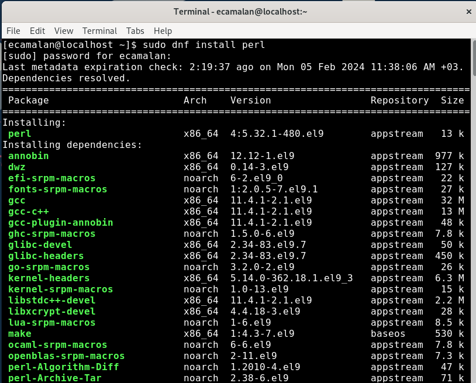

  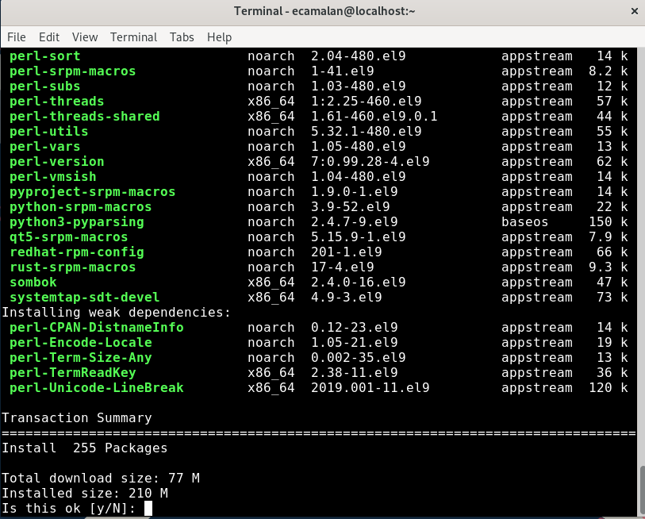

  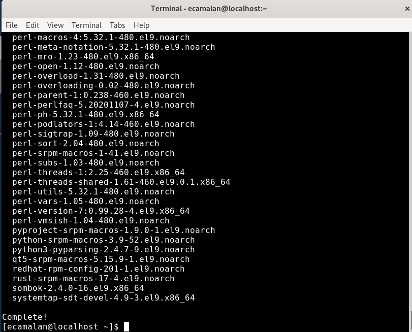

Installing a package group , for install installing Xfce desktop, Kde Desktop etc.

```Bash
sudo dnf groupinstall xfce
```

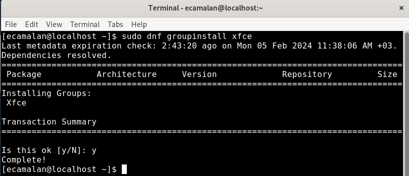

Another ways for KDE Desktop;

```Bash
sudo dnf group install "KDE Plasma Workspaces"
sudo dnf group install kde-desktop-environment
sudo dnf install @kde-desktop-environment
```


## Update and Upgrade Packages

  ## Update & Upgrade

  If you decided to update your packages, use this simple code on the terminal.

  ### Update your system


  ```bash
  sudo dnf update
  ```

  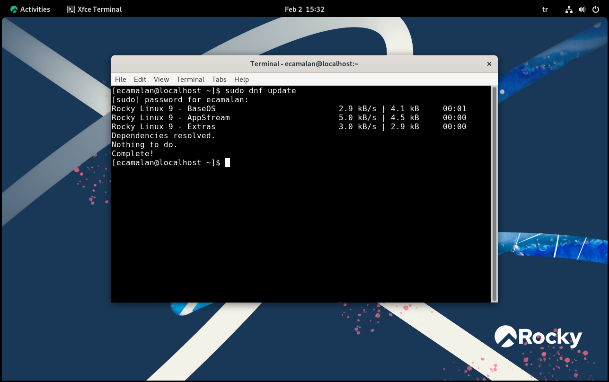

    ### Upgrade your system

  ```bash
  sudo dnf upgrade
  ```

    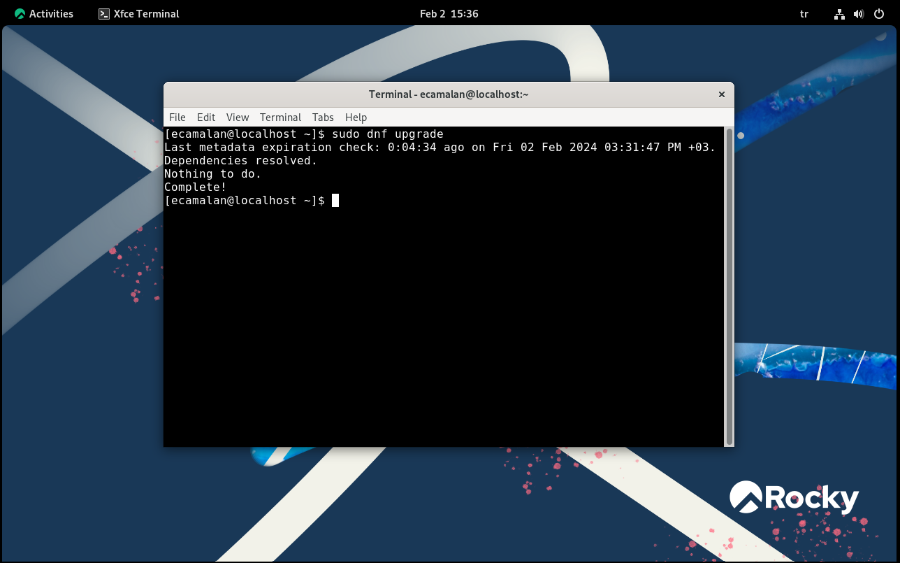


  ### Update your single package


  ```bash
  sudo dnf upgrade package_name
  ```
  For example you want to upgrade your python package. You can upgrade single package with dnf.

  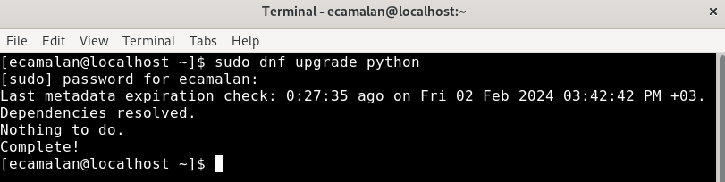

  Previously we upgrade all system so there is no need to upgrade any package.


## Removing Packages
Similarly to installing packages, you can use `dnf` to uninstall packages. However, package dependencies are crucial in Linux systems, and if you are not aware of these dependencies, I recommend not removing a package. For instance, a mistakenly installed package may have 20 dependencies, and when you remove that package, the system will also remove those 20 packages shared with other programs. Consequently, some previously functioning programs may become unusable. Moreover, if you think you can resolve it by reinstalling the same package, you may encounter version and old version conflict issues. I advise you to be cautious in this regard.

!!! Warning
    DNF cannot remove a package without also removing packages that depend on it. 

> ~]$ sudo dnf remove package_name1 package_name2

```Bash
sudo dnf remove totem
```
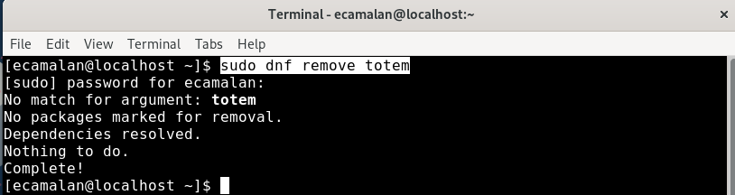


!!! Note
    Be careful, DNF shows the package dependencies! 
    If you remove Perl, you will remove 254 packages that depend on Perl!

```Bash
sudo dnf remove perl
```


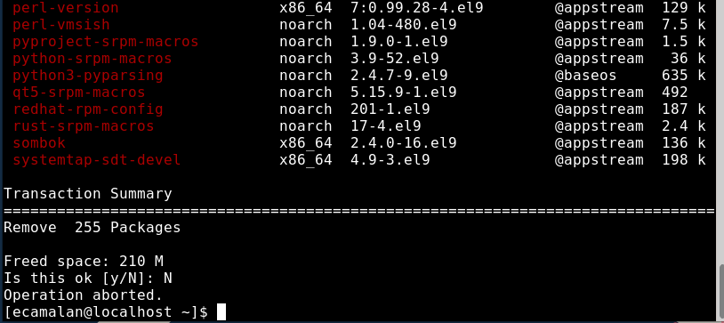


```Bash
~]$ sudo dnf group remove "KDE Plasma Workspaces"
~]$ sudo dnf group remove kde-desktop-environment
~]$ sudo dnf remove @kde-desktop-environment
```


## Dnf List

  Listing any package if you don't know whole name of the package by running this command:

  ```bash
  dnf list kernel*
  ```
  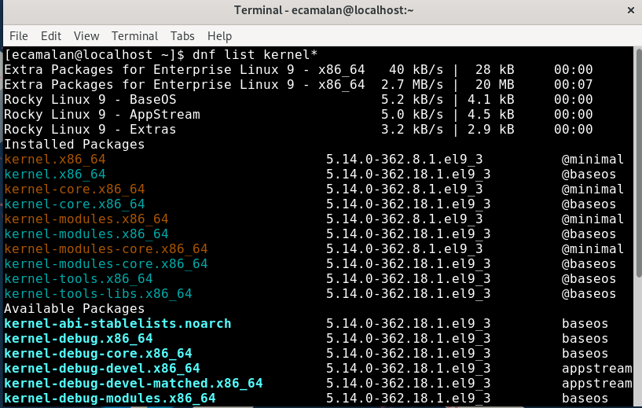

  Lists information on installed and available kernel tools and modules matching information with this command:

  ```bash
  dnf list kernel-tools\* kernel-modules\*
  ```

  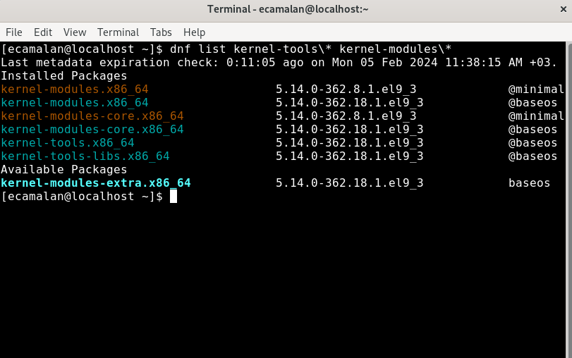


  Lists all installed and available packages.

  ```Bash
  dnf list all
  ```

  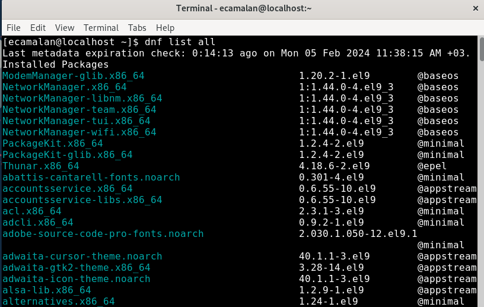

  How many packages are there in Rocky Linux ?

  ```Bash
  dnf list all | wc -l
  ```

  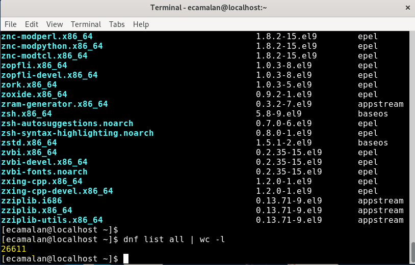
  
  
  Lists all packages installed on your Rocky Linux System.

  ```Bash
  dnf list installed "krb?-*"
  ```

  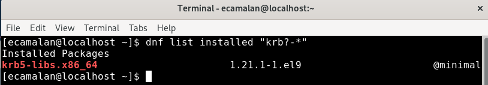


  Lists all available packages in all enabled repositories.

  ```Bash
  dnf list available "perl"
  ```

  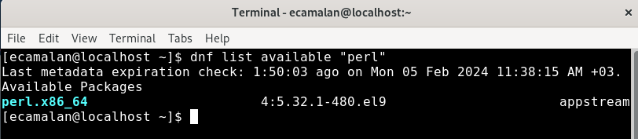


  Lists all package groups.

  ```Bash
  dnf group list 
  ```

  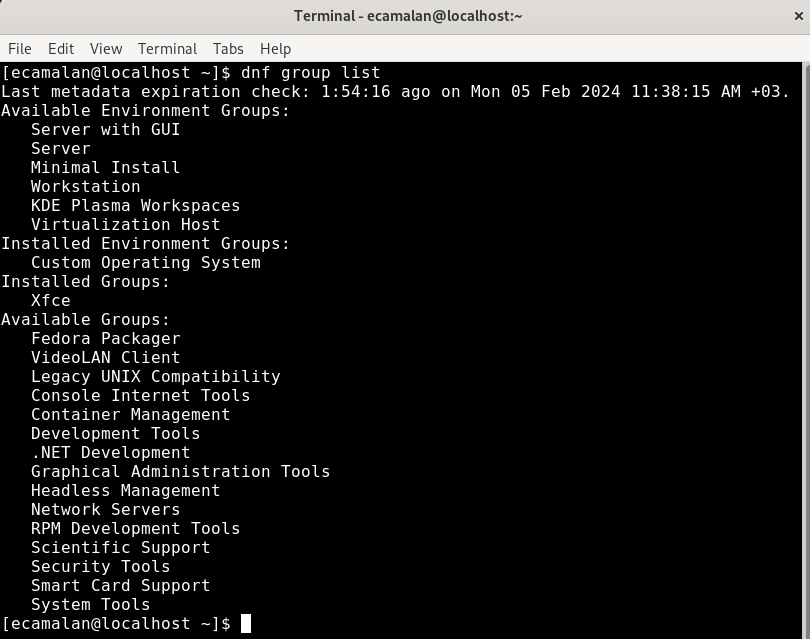

  Lists the repository information of packages it provides for each enabled repository.

  ```Bash
  dnf repolist 
  ```

  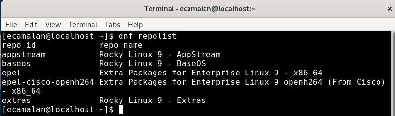

## Dnf List History
You can see dnf list history with this simple command;

```Bash
dnf history List
```

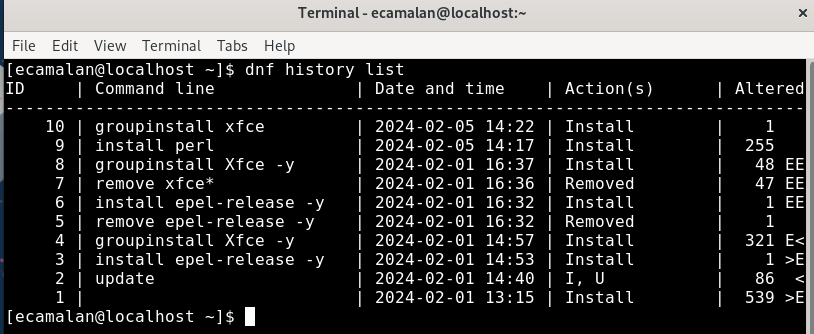

<br>

One of the most advantageous aspects of DNF history is the ability to revert and repeat transactions.

```Bash
dnf history undo id
```

```Bash
dnf history redo id
```

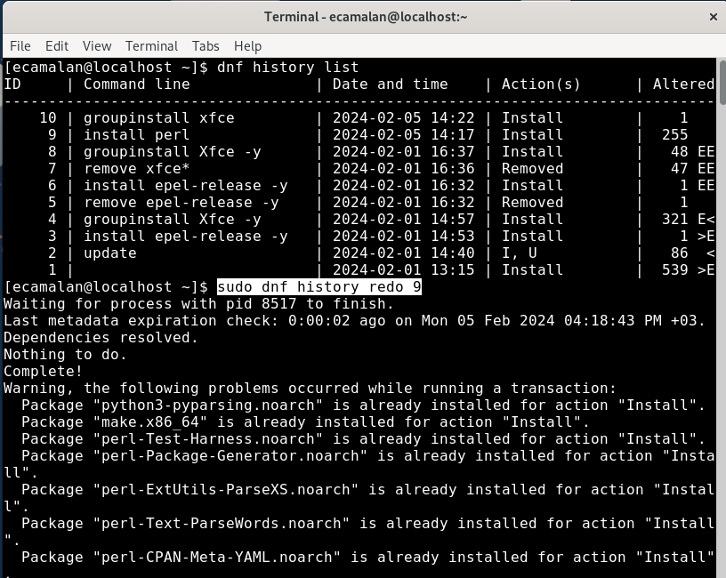

The `sudo dnf history redo 9` command used to repeat the command with ID:9 from the DNF History List, and it attempted to reinstall `perl`. Naturally, since it had been installed before, the operation displayed 'already installed'.


### Searching Packages
Searching any package by running this command:

```bash
dnf search python
```


Searching more than one package in one search by running this command:

```bash
dnf search all yum vim
```
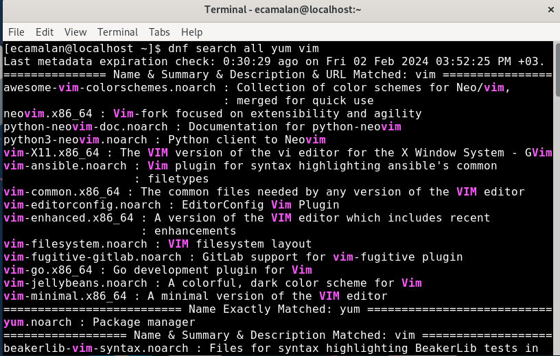


### Dnf Package Information

To display information about packages, use this simple command as follows:


```bash
dnf info perl
```


To display information about all available packages, both installed and available from a repository, use this simple command as follows:

```bash
dnf repoquery perl --info
```

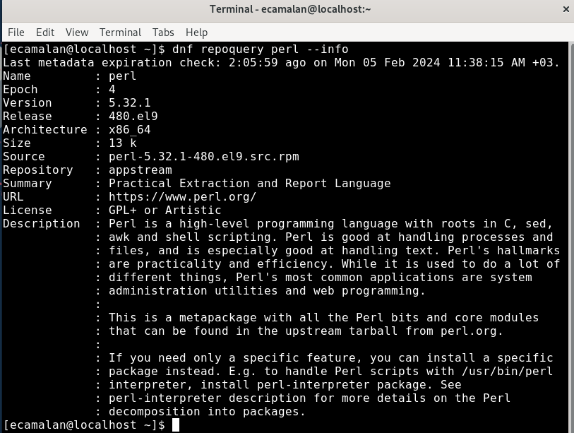


## Dnf Repository Configuration
The configuration file for DNF and its associated utilities can be found at `/etc/dnf/dnf.conf`. 
Within this file, there is a mandatory [main] section that allows the configuration of DNF options with global effects. Additionally, it may include one or more [repository] sections, providing the ability to set repository-specific options. 

Any values specified in the [repository] sections of the `/etc/dnf/dnf.conf` file will take precedence over values set in the [main] section.

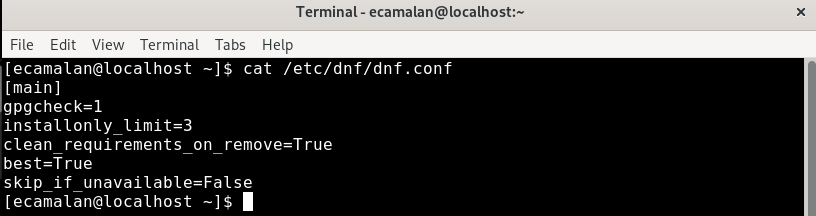

Original text of Rocky Linux dnf.conf file;

>[ecamalan@localhost ~]$ cat /etc/dnf/dnf.conf 
[main]
gpgcheck=1
installonly_limit=3
clean_requirements_on_remove=True
best=True
skip_if_unavailable=False

### Dnf Config-manager
To retrieve a comprehensive list of configuration options along with their respective values and information about repositories, utilize the dnf config-manager command with the --dump option.

```Bash
dnf config-manager --dump
```

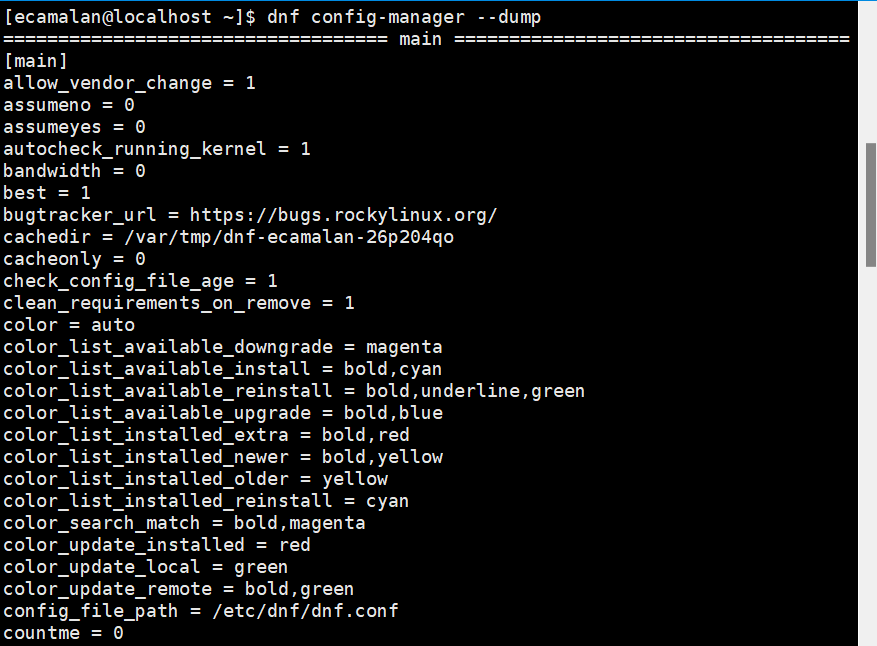


## Conclusion
Rocky linux uses DNF, the next generation replacement for YUM.
We have provided examples of basic DNF usage that you might generally need on this page. For more information, you can refer to the official documentation of DNF: 
https://dnf.readthedocs.io/en/latest/index.html


