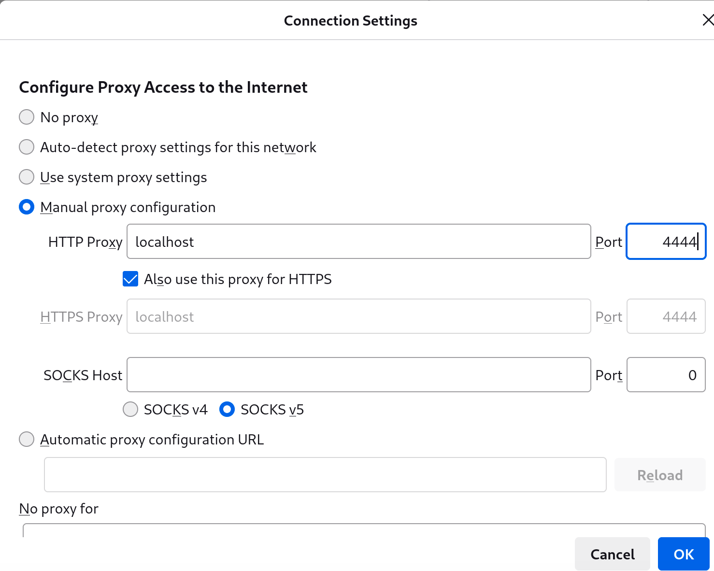

## Introduction

[I2P](https://geti2p.net/en/) est un réseau anonyme de type overlay et un concurrent du réseau Tor plus populaire, axé sur les sites Web cachés appelés eepsites. [`i2pd`](https://i2pd.website/) (I2P Daemon) est une implémentation C++ légère du protocole I2P.

## Prérequis

Les conditions suivantes sont indispensables pour utiliser cette procédure :

- Une adresse IPv4 ou IPv6 publique, que ce soit directement sur le serveur, avec redirection de port ou UPnP/NAT-PMP

## Installation de `i2pd`

Pour mettre en place `i2pd`, vous devez d'abord installer les dépôts EPEL (Extra Packages for Enterprise Linux) et `i2pd` copr (Cool Other Package Repo) :

```bash
curl -s https://copr.fedorainfracloud.org/coprs/supervillain/i2pd/repo/epel-10/supervillain-i2pd-epel-10.repo -o /etc/yum.repos.d/i2pd-epel-10.repo
dnf install -y epel-release
```

Ensuite installez `i2pd`:

```bash
dnf install -y i2pd
```

## Configuration de `i2pd` (facultatif)

Une fois les paquets installés, vous pouvez configurer `i2pd` si nécessaire. L'auteur utilise `vim` pour cela, mais si vous préférez `nano` ou un autre utilitaire, n'hésitez pas à le remplacer :

```bash
vim /etc/i2pd/i2pd.conf
```

Le fichier `i2pd.conf` par défaut est assez descriptif, mais il peut devenir long ; si vous voulez juste une configuration de base, vous pouvez le laisser tel quel.

Toutefois, si vous souhaitez activer IPv6 et UPnP et configurer le port d'écoute du proxy HTTP sur `12345`, voici une configuration permettant d'illustrer comment faire :

```bash
ipv6 = true
[httpproxy]
port = 12345
[upnp]
enabled = true
```

Si vous souhaitez utiliser d'autres options, le fichier de configuration est explicite quant à toutes les options possibles.

## Activation de `i2pd`

Vous pouvez maintenant activer `i2pd`

```bash
systemctl enable --now i2pd
```

## Accès aux `I2P eepsites`

Cet exemple utilise Firefox sous Rocky Linux. Si vous n'utilisez pas Firefox, consultez la documentation de votre application pour configurer un proxy HTTP.

Ouvrez Firefox, cliquez sur l'icône du menu hamburger, puis accédez à
**Settings**:


Faites défiler jusqu'aux **Paramètres réseau** puis appuyez sur **Paramètres**


Sélectionnez ensuite **Connexion proxy manuelle**, entrez `localhost` et `4444` (ou le port que vous avez sélectionné), cochez **Utiliser également ce proxy pour HTTPS** et sélectionnez **OK**.



Vous pouvez maintenant consulter les sites I2P
—eepsites—. Par exemple, allez à `http://planet.i2p` (Remarque : le `http://` est important pour empêcher Firefox d’utiliser un moteur de recherche par défaut) :


## Conclusion

Face aux nombreuses préoccupations des internautes concernant la confidentialité en ligne, I2P est une solution pour accéder en toute sécurité à des sites Web cachés. `i2pd` est un logiciel léger qui permet de naviguer sur les sites Web I2P tout en partageant votre connexion comme relais.
