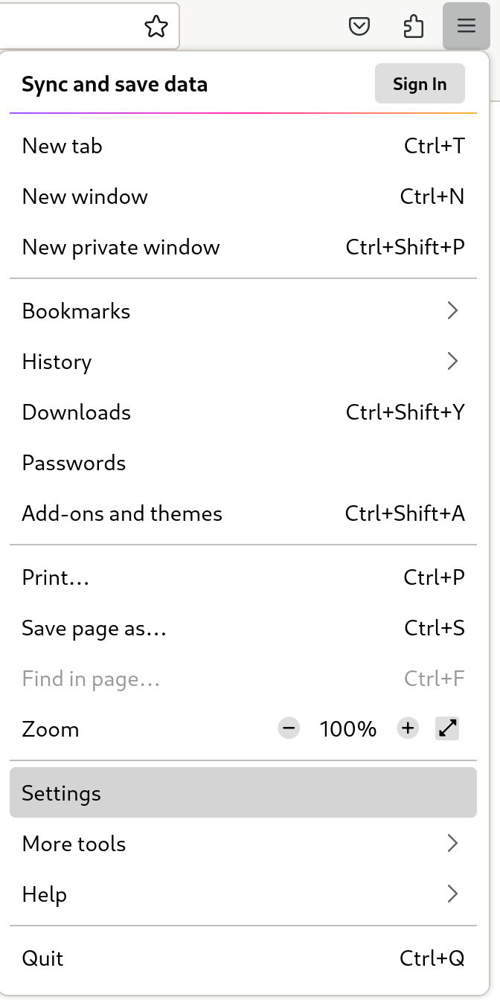
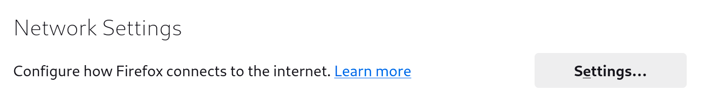
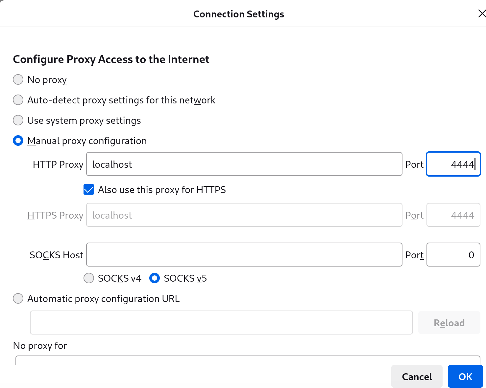

# i2pd Anonymous Network

## Introduction

[I2P](https://geti2p.net/en/) is an anonymous overlay network and competitor to the more-popular Tor network with a focus on hidden websites called eepsites. [`i2pd`](https://i2pd.website/) (I2P Daemon) is a lightweight C++ implementation of the I2P protocol.

## Prerequisites and assumptions

The following are minimum requirements for using this procedure:

- A public IPv4 or IPv6 address, whether directly on the server, with port forwarding, or UPnP/NAT-PMP

## Installing `i2pd`

To install `i2pd`, you need to first install the EPEL (Extra Packages for Enterprise Linux) and `i2pd` copr (Cool Other Package Repo) repositories (Note: If you are running Rocky Linux 8, substitute in `8` for `9`):

```bash
curl -s https://copr.fedorainfracloud.org/coprs/supervillain/i2pd/repo/epel-9/supervillain-i2pd-epel-9.repo -o /etc/yum.repos.d/i2pd-epel-9.repo
dnf install -y epel-release
```

Then install `i2pd`:

```bash
dnf install -y i2pd
```

## (Optional) Configuring `i2pd`

With the packages installed, you can configure `i2pd` if desired. The author uses `vim` for this, but if you prefer `nano` or something else, go ahead and substitute that in:

```bash
vim /etc/i2pd/i2pd.conf
```

The default `i2pd.conf` file is pretty descriptive, but can get long if you just want a basic configuration, you can leave as-is.

However, if you want to enable IPv6 and UPnP and listen the HTTP proxy to port `12345`, a configuration allowing this is as follows:

```bash
ipv6 = true
[httpproxy]
port = 12345
[upnp]
enabled = true
```

If you wish to set other options, the configuration file is self-explanatory on all the possible options.

## Enabling `i2pd`

We can now enable `i2pd`

```bash
systemctl enable --now i2pd
```

## Visiting I2P eepsites

In this example, we are using Firefox on Rocky Linux. If you are not using Firefox, refer to the documentation of your application to set an HTTP proxy.

Open up Firefox, click the hamburger menu icon, and then go to **Settings**:



Scroll to the **Network Settings** and subsequently press **Settings*



Then select **Manual proxy connection**, enter in `localhost` and `4444` (or the port you selected), check **Also use this proxy for HTTPS** and select **OK**.



Now, you are able to browse I2P eepsites. As an example, navigate to `http://planet.i2p` (Note: the `http://` is important to prevent Firefox from defaulting to a serch engine):


## Conclusion

With so many internet users concerned about online privacy, I2P is ony way to access hidden websites securely. `i2pd` is lightweight software which makes browsing I2P websites possible, alongside sharing your connection as an relay.
