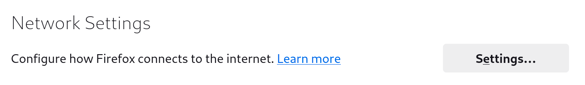

# Анонімна мережа i2pd

## Вступ

[I2P](https://geti2p.net/en/) — це анонімна накладна мережа, яка є конкурентом більш популярної мережі Tor, що зосереджується на прихованих веб-сайтах, які називаються eepsites. [`i2pd`](https://i2pd.website/) (I2P Daemon) — це спрощена реалізація протоколу I2P на C++.

## Передумови та припущення

Нижче наведено мінімальні вимоги для використання цієї процедури:

- Загальнодоступна адреса IPv4 або IPv6, безпосередньо на сервері, з переадресацією портів або uPNP/NAT-PMP

## Встановлення `i2pd`

Щоб інсталювати `i2pd`, вам потрібно спочатку інсталювати сховища EPEL (додаткові пакети для Enterprise Linux) і `i2pd` copr (Cool Other Package Repo) (Примітка: якщо ви використовуєте Rocky Linux 8, замініть `8` на ` 9`):

```bash
curl -s https://copr.fedorainfracloud.org/coprs/supervillain/i2pd/repo/epel-9/supervillain-i2pd-epel-9.repo -o /etc/yum.repos.d/i2pd-epel-9.repo
dnf install -y epel-release
```

Потім встановіть `i2pd`:

```bash
dnf install -y i2pd
```

## (Додатково) Налаштування `i2pd`

З установленими пакетами ви можете налаштувати `i2pd` за бажанням. Автор використовує для цього `vim`, але якщо ви віддаєте перевагу `nano` або щось інше, замініть його в:

```bash
vim /etc/i2pd/i2pd.conf
```

Типовий файл `i2pd.conf` досить описовий, але може бути довгим, якщо вам потрібна просто базова конфігурація, ви можете залишити як є.

Однак, якщо ви хочете ввімкнути IPv6 і uPNP і прослуховувати проксі-сервер HTTP до порту `12345`, конфігурація, яка дозволяє це, така:

```bash
ipv6 = true
[httpproxy]
port = 12345
[upnp]
enabled = true
```

Якщо ви бажаєте встановити інші параметри, у файлі конфігурації є пояснення щодо всіх можливих параметрів.

## Увімкнення `i2pd`

Тепер ми можемо ввімкнути `i2pd`

```bash
systemctl enable --now i2pd
```

## Відвідування eepsites I2P

У цьому прикладі ми використовуємо Firefox на Rocky Linux. Якщо ви не використовуєте Firefox, зверніться до документації програми, щоб налаштувати HTTP-проксі.

Відкрийте Firefox, натисніть піктограму меню гамбургера, а потім перейдіть до **Налаштування**:


Перейдіть до **Налаштування мережі** і потім натисніть \*_Налаштування_



Потім виберіть **Ручне підключення проксі-сервера**, введіть `localhost` і `4444` (або вибраний вами порт), позначте **Також використовувати цей проксі для HTTPS** і виберіть **OK**.


Тепер ви можете переглядати eep-сайти I2P. Як приклад, перейдіть до `http://planet.i2p` (Примітка: `http://` важливий, щоб Firefox не використовував пошукову систему за замовчуванням):


## Висновок

Оскільки так багато користувачів Інтернету стурбовані конфіденційністю в Інтернеті, I2P є єдиним способом безпечного доступу до прихованих веб-сайтів. `i2pd` — це легке програмне забезпечення, яке робить можливим перегляд веб-сайтів I2P разом із спільним використанням вашого з’єднання як реле.
