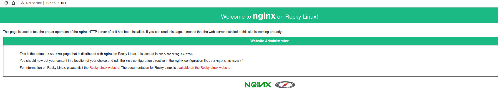
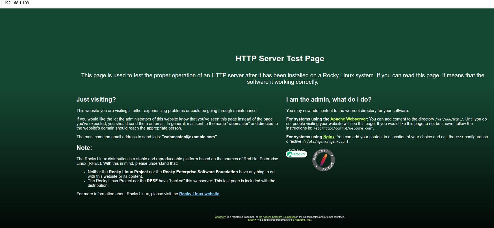

# Pound proxy server

!!! warning "Pound Missing from EPEL-9"

    As of this writing, on Rocky Linux 9.0, Pound cannot be installed from the EPEL repository. While there are sources out there for SRPM packages, we can not verify the integrity of these sources. For this reason, we do not recommend installing the Pound proxy server on Rocky Linux 9.0 at this time. This may change if the EPEL once again picks up Pound.  Use this procedure specifically for Rocky Linux 8.x versions.

## Introduction

Pound is a web server agnostic reverse proxy and load balancer that is simplistic to setup and manage. It does not use a web service, but does listens on the web service ports (http, https). 

Now, many proxy server options exist, some referenced in these documentation pages. A document on using [HAProxy is here](haproxy_apache_lxd.md) and references to applying Nginx for a reverse proxy exist in other documents.

Load balancing services are quite useful for a busy web server environment. Many proxy servers exist, including the previously mentioned HAProxy, and have uses for many service types. 

In the case of Pound, it is only usable for web services, but it is good at what it does.

## Prerequisites and assumptions

The following are minimum requirements for using this procedure:

* A desire to load balance between a few websites, or the willingness to learn a new tool to do the same.
* The ability to run commands as the root user or use `sudo` to elevate privileges.
* Familiarity with a command-line editor. The author is using `vi` or `vim` here, but substitute in your favorite editor.
* Comfort with changing the listen ports on a few types of web servers.
* Assuming the earlier installation of the Nginx and Apache servers.
* Assuming that you are using Rocky Linux servers or containers for everything here.
* While all kinds of statements regarding `https` are in this document, this guide only deals with the `http` service. To properly do `https`, you will need to configure your pound server with a real certificate from a real certificate authority.

!!! tip

    If you do not have either of these servers installed, you can do so on a container environment (LXD or Docker) or on bare metal, and get them up and running. For this procedure, you must install them with their respective packages and enable and start the services. We will not be modifying them significantly in any way.

    ```
    dnf -y install nginx && systemctl enable --now nginx
    ```

    or

    ```
    dnf -y install httpd && systemctl enable --now httpd
    ```

## Conventions

For this procedure, we are going to be using two web servers (known as back end servers), one running Nginx (192.168.1.111) and one running Apache (192.168.1.108). 

Our Pound server (192.168.1.103) is the gateway. 

You will be switching your listen ports on the back end servers to 8080 for the Nginx server and 8081 for the Apache server. (Showing everything below.)

!!! note

    Remember to change the associated IPs to whatever they are in your own environment and substitute them where applicable throughout this procedure.

## Installing the Pound server

To install Pound, you need to first install the EPEL (Extra Packages for Enterprise Linux) and run updates:

```
dnf -y install epel-release && dnf -y update
```

Then install Pound. (Yes that is a capital "P"):

```
dnf -y install Pound
```

## Configuring Pound

With the packages installed, you need to configure Pound. The author is using `vi` to update this, but if you prefer `nano` or something else, go ahead and substitute that in:

```bash
vi /etc/pound.cfg
```

The file has default information in it, which makes it easy to see most of the default components of Pound:

```bash
User "pound"
Group "pound"
Control "/var/lib/pound/pound.cfg"

ListenHTTP
    Address 0.0.0.0
    Port 80
End

ListenHTTPS
    Address 0.0.0.0
    Port    443
    Cert    "/etc/pki/tls/certs/pound.pem"
End

Service
    BackEnd
        Address 127.0.0.1
        Port    8000
    End

    BackEnd
        Address 127.0.0.1
        Port    8001
    End
End
```

### Taking a closer look

* The "User" and "Group" - populated with the installation
* The "Control" file is not used anywhere
* The "ListenHTTP" section represents the service `http` (Port 80) and the "Address" that the proxy will listen on. You will change this to the actual IP of our Pound server.
* The "ListenHTTPS" section represents the service `https` (Port 443) and the "Address" that the proxy will listen on. You will change this to the IP of the Pound server. 
* The "Cert" option is the self-signed certificate provided by the Pound install process. You want to replace this in a production environment with a real certificate using one of these procedures: [Generating SSL Keys](../security/ssl_keys_https.md) or [SSL Keys with Let's Encrypt](../security/generating_ssl_keys_lets_encrypt.md).
* The "Service" section configures the "BackEnd" servers with their listening ports. You can have as many "BackEnd" servers as you need.

### Changing the configuration

* change the IP Address under each listen option to our Pound server IP, 192.168.1.103
* change the IP Addresses and ports under the "BackEnd" sections to match our configuration found in "Conventions" above (IPs and Ports)

When you are all done modifying the configuration, your file will look something like this:

```bash
User "pound"
Group "pound"
Control "/var/lib/pound/pound.cfg"

ListenHTTP
    Address 192.168.1.103
    Port 80
End

ListenHTTPS
    Address 192.168.1.103
    Port    443
    Cert    "/etc/pki/tls/certs/pound.pem"
End

Service
    BackEnd
        Address 192.168.1.111
        Port    8080
    End

    BackEnd
        Address 192.168.1.108
        Port    8081
    End
End
```

## Configuring Nginx to listen on 8080

Since you have set the listen port for Nginx in our Pound configuration to 8080, you need to also make that change on your running Nginx server. You do this by modifying the `nginx.conf`:

```bash
vi /etc/nginx/nginx.conf
```

You just want to change the "listen" line to the new port number:

```bash
listen       8080 default_server;
```

Save your changes and restart the nginx service:

```
systemctl restart nginx
```

## Configuring Apache to listen on 8081

Since you have set the listen port for Apache in our Pound configuration to 8081, you need to also make that change on our running Apache server. You do this by modifying the `httpd.conf`:


```bash
vi /etc/httpd/conf/httpd.conf
```

You want to change the "Listen" line to the new port number:

```bash
Listen 8081
```

Save your changes and restart the httpd service:

```
systemctl restart httpd
```

## Test and turn up

Once you have your web services up and running and listening on the right ports on each of your servers, the next step is to turn up the pound service on the Pound server:

```
systemctl enable --now pound
```

!!! warning

    Using Nginx and Apache, as done here for demonstration, will mean that the Nginx server will almost always respond first. For this reason, to test effectively, you will need to assign a low priority to the Nginx server so that you will be able to see both screens. This speaks volumes about the speed of Nginx over Apache. To change the priority for the Nginx server, you just need to add a priority (1-9, with 9 being the lowest priority) in the "BackEnd" section for the Nginx server like this:

    ```
    BackEnd
        Address 192.168.1.111
        Port    8080
        Priority 9
    End
    ```

When you open your proxy server IP in a web browser you will see one of these two screens:



Or

    

## Using "Emergency"

One thing that you may need to do when using a load balancer such as Pound, is to take the productions servers off-line for maintenance or to have a fall-back "BackEnd" for a complete outage. Do this with the "Emergency" declaration in the `pound.conf` file. You can only have one "Emergency" declaration per service. In our case, this will appear at the end of the "Service" section in our configuration file:

```
...
Service
    BackEnd
        Address 192.168.1.117
        Port    8080
	Priority 9
    End

    BackEnd
        Address 192.168.1.108
        Port    8081
    End
    Emergency
	   Address 192.168.1.104
	   Port	8000
   End
End
```

This server might only show a message that says, "Down For Maintenance".

## Security considerations

Something that most documents dealing with load balancing proxy servers will not deal with are security issues. For instance, if this is a public facing web server, you will need to have `http` and `https` services open to the world on the load balancing proxy. But what about the "BackEnd" servers? 

Those only need accessing by their ports from the Pound server, but since the Pound server is redirecting to 8080 or 8081 on the BackEnd servers, and since the BackEnd servers have `http` listening on those subsequent ports, you can just use the service names for the firewall commands on those BackEnd servers.

This section will deal with those concerns and the `firewalld` commands needed to lock everything down.

!!! warning

    The assumption here is that you have direct access to the servers in question and are not remote to them. If you are remote, take extreme caution when removing services from a `firewalld` zone!

    You could lock yourself out of your server by accident.

### Firewall - Pound server

For the Pound server, you want to allow `http` and `https` from the world. It is best to consider whether you need to allow `ssh` from the world or not. If you are local to the server, this is probably **NOT** the case. The author assumes here that the server is available via your local network and that you have direct access to it, so you will be locking down `ssh` to your LAN IPs.

To accomplish this, you will use the built-in firewall for Rocky Linux, `firewalld` and the `firewall-cmd` command structure. You will also use two built-in zones, "public" and "trusted", to keep things uncomplicated.

Start by adding our source IPs to the "trusted" zone. This is our LAN here (in our example: 192.168.1.0/24):

```
firewall-cmd --zone=trusted --add-source=192.168.1.0/24 --permanent
```

Then, add the `ssh` service to the zone:

```
firewall-cmd --zone=trusted --add-service=ssh --permanent
```

And reload the firewall with:

```
firewall-cmd --reload
```

List out the zone so that you can see everything with `firewall-cmd --zone=trusted --list-all` which will give you something like this:

```bash
trusted (active)
  target: ACCEPT
  icmp-block-inversion: no
  interfaces:
  sources: 192.168.1.0/24
  services: ssh
  ports:
  protocols:
  forward: no
  masquerade: no
  forward-ports:
  source-ports:
  icmp-blocks:
  rich rules:

```

Next you need to make changes to the "public" zone, which by default has the `ssh` service enabled. This needs to be carefully removed (again, the author assumes that you are **NOT** remote to the server here!) with the following:

```
firewall-cmd --zone=public --remove-service=ssh --permanent
```
You also need to add `http` and `https` services:

```
firewall-cmd --zone=public --add-service=http --add-service=https --permanent
```

Then reload the firewall before to see the changes:

```
firewall-cmd --reload
```

List out the public zone with `firewall-cmd --zone=public --list-all` which will show you something like this:

```bash
public
  target: default
  icmp-block-inversion: no
  interfaces:
  sources:
  services: cockpit dhcpv6-client http https
  ports:
  protocols:
  forward: no
  masquerade: no
  forward-ports:
  source-ports:
  icmp-blocks:
  rich rules:
```

Those are the only changes needed to our pound server load balancer within the lab environment.

### Firewall - back end servers

For the "BackEnd" servers, you do not need to allow access from the world for anything. You will need to allow `ssh` from the LAN IPs, and `http` and `https` from our Pound load balancer. 

That is pretty much it. 

Again, you are going to add the `ssh` service to your "trusted" zone, with the essentially the same commands used for your pound server. Then add a zone called "balance" that you will use for the remaining `http` and `https`, and set the source IPs to that of the load balancer. 

To simplify things, use all of those commands that you used for the "trusted" zone in a single set of commands:

```
firewall-cmd --zone=trusted --add-source=192.168.1.0/24 --permanent
firewall-cmd --zone=trusted --add-service=ssh --permanent
firewall-cmd --reload
firewall-cmd --zone=trusted --list-all
```

After, the "trusted" zone will look like this:

```bash
trusted (active)
  target: ACCEPT
  icmp-block-inversion: no
  interfaces:
  sources: 192.168.1.0/24
  services: ssh
  ports:
  protocols:
  forward: no
  masquerade: no
  forward-ports:
  source-ports:
  icmp-blocks:
  rich rules:
```

Again, test your `ssh` rule from an IP on the LAN, and then remove the `ssh` service from the "public" zone. **Remember our warning earlier, and do this only if you have local access to the server!**

```
firewall-cmd --zone=public --remove-service=ssh --permanent
firewall-cmd --reload
firewall-cmd --zone=public --list-all
```

The public zone will now look like this:

```bash
public
  target: default
  icmp-block-inversion: no
  interfaces:
  sources:
  services: cockpit dhcpv6-client
  ports:
  protocols:
  forward: no
  masquerade: no
  forward-ports:
  source-ports:
  icmp-blocks:
  rich rules:
```

Add that new zone to deal with `http` and `https`. Remember that the source IP here needs to only be your load balancer (in our example: 192.168.1.103):

!!! note

    A new zone must be added with the `--permanent` option and cannot be used until the firewall is reloaded. Also, do not forget to `--set-target=ACCEPT` for this zone!

```
firewall-cmd --new-zone=balance --permanent
firewall-cmd --reload
firewall-cmd --zone=balance --set-target=ACCEPT
firewall-cmd --zone=balance --add-source=192.168.1.103 --permanent
firewall-cmd --zone=balance --add-service=http --add-service=https --permanent
firewall-cmd --reload
firewall-cmd --zone=balance --list-all
```

The result:

```bash
balance (active)
  target: ACCEPT
  icmp-block-inversion: no
  interfaces:
  sources: 192.168.1.103
  services: http https
  ports:
  protocols:
  forward: no
  masquerade: no
  forward-ports:
  source-ports:
  icmp-blocks:
  rich rules:
```

Repeat those steps on the other web server back end.

Once you have your firewall rules added to everything, test your Pound server again from your workstation browser.

## Other information

*Many* options are usable in your `pound.conf` file, including error message directives, logging options, time out values, and more. You can find what is available by [looking here.](https://linux.die.net/man/8/pound)

Conveniently, Pound automatically figures out if one of the "BackEnd" servers is off-line and disables it so that web services can continue without delay. It also automatically sees them again when they are back on-line.

## Conclusion

Pound offers another option for those who do not want to use HAProxy or Nginx as for load balancing. 

Pound as a load balancing server is very easy to install, set up and use. As noted here, you can use Pound as a reverse proxy, and many proxy and load balancing options exist. 

And you should always remember to keep security in mind when setting up any service, including a load balancing proxy server.
