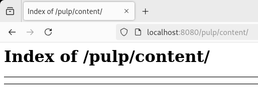

## Introduzione

Gli sviluppatori che utilizzano Rocky Linux hanno spesso bisogno di diversi repository RPM remoti per supportare le loro operazioni. Pulp è un progetto open source che può aiutare gli sviluppatori a soddisfare questa esigenza, facilitando il reperimento e la distribuzione di diversi repository RPM. Questa guida mostra un semplice esempio di utilizzo di Pulp per prelevare BaseOS e AppStream dal vault di Rocky Linux.

## Requisiti

- Un sistema Rocky Linux
- In grado di eseguire container

## Configurazione - Singolo Container

Esistono molte configurazioni possibili per Pulp, ma questa guida utilizzerà lo scenario di distribuzione di un singolo contenitore per facilitare l'illustrazione. Scegliete una directory per Pulp e create le seguenti directory e file.

```bash
mkdir -p settings/certs pulp_storage pgsql containers
echo "CONTENT_ORIGIN='http://$(hostname):8080'" >> settings/settings.py
```

Se si abilita SELinux, si può eseguire quanto segue per distribuire Pulp. Se SELinux non è abilitato, si può rimuovere il suffisso `:Z' dalle righe `--volume':

```bash
$ podman run --detach \
             --publish 8080:80 \
             --name pulp \
             --volume "$(pwd)/settings":/etc/pulp:Z \
             --volume "$(pwd)/pulp_storage":/var/lib/pulp:Z \
             --volume "$(pwd)/pgsql":/var/lib/pgsql:Z \
             --volume "$(pwd)/containers":/var/lib/containers:Z \
             --device /dev/fuse \
             pulp/pulp
```

Se navighi su `http://localhost:8080/pulp/content/`, dovresti ora vedere l' “Indice di /pulp/content/” che al momento è vuoto. Alla fine di questa guida, i repository verranno riempiti con i propri repository.



## Creare Remotes Pulp

Considerate i Pulp remotes come repository remoti di sorgenti. In questo caso, i repository remoti dei sorgenti sono BaseOS e AppStream dal vault di Rocky Linux 9.2. Questi remotes verranno utilizzati per sincronizzarsi con i repository creati con Pulp. Per ulteriori informazioni sulle politiche remote, consultare la [Documentazione ufficiale di Pulp](https://pulpproject.org/).

```bash
pulp rpm remote create --name "rocky_92_appstream_vault" --url "https://dl.rockylinux.org/vault/rocky/9.2/AppStream/x86_64/os/" --policy on_demand
pulp rpm remote create --name "rocky_92_baseos_vault" --url "https://dl.rockylinux.org/vault/rocky/9.2/BaseOS/x86_64/os/" --policy on_demand
```

## Copie del Repository Pulp

Si tratta di copie one-to-one dei repository di BaseOS e AppStream dal caveau di Rocky Linux 9.2. Se si conoscono i remote da cui si vuole usare la sincronizzazione per i repository, è possibile aggiungerli al momento della creazione del repository. Altrimenti, se non si sa quali remote utilizzare o se tali remote possono cambiare, si possono escludere i remote. Per questa guida, la dichiarazione dei remote avviene al momento della creazione del repository.

```bash
pulp rpm repository create --name "R92_AppStream_Vault" --remote "rocky_92_appstream_vault"
pulp rpm repository create --name "R92_BaseOS_Vault" --remote "rocky_92_baseos_vault"
```

## Copie di Pulp Sync

!!! note

    È importante aggiungere “--skip-type treeinfo”. Altrimenti, invece di avere solo BaseOS o AppStream, si finisce per avere uno strano mix di entrambi. Questo è probabilmente dovuto a un problema con i repository che sono chiusi per dipendenza. Se il telecomando non è stato specificato prima, è possibile aggiungerlo. Se è stato aggiunto al momento della creazione, non è necessario menzionarlo nella sincronizzazione, come è implicito.

```bash
pulp rpm repository sync --name "R92_AppStream_Vault" --skip-type treeinfo
pulp rpm repository sync --name "R92_BaseOS_Vault" --skip-type treeinfo
```

## Pubblicazioni Pulp Publish

Una volta sincronizzati i repository dai remote, si dovranno creare le pubblicazioni da questi repository da servire alle distribuzioni. Finora si è potuto usare solo i nomi dei remote e dei repository, ma Pulp si basa anche su `hrefs` e si possono usare in modo intercambiabile. Dopo aver creato la pubblicazione, assicurarsi di prendere nota del valore `pulp_href` di ciascuna, poiché sarà necessario per il passo successivo.

```bash
pulp rpm publication create --repository "R92_AppStream_Vault"
pulp rpm publication create --repository "R92_BaseOS_Vault"
```

## Pulp Crea Distribuzioni

Con il `pulp_href` della fase di pubblicazione precedente, si può ora servire il contenuto a una distribuzione. Questo contenuto verrà quindi visualizzato sotto `http://localhost:8080/pulp/content/` e non sarà più vuoto. È possibile verificare il `pulp_href` delle pubblicazioni utilizzando il comando `pulp rpm publication list` e cercando `pulp_href`. Per esempio, di seguito è riportato un `pulp_href` per BaseOS, ma il vostro `pulp_href` potrebbe essere diverso, quindi cambiatelo di conseguenza.

```bash
pulp rpm distribution create --name "Copy of BaseOS 92 RL Vault" --base-path "R92_BaseOS_Vault" --publication "/pulp/api/v3/publications/rpm/rpm/0195fdaa-a194-7e9d-a6a9-e6fd4eaa7a20/"
pulp rpm distribution create --name "Copy of AppStream 92 RL Vault" --base-path "R92_AppStream_Vault" --publication "<pulp_href>"
```

Se si controlla `http://localhost:8080/pulp/content/,` si dovrebbero vedere i due repository, che sono copie dei repository Rocky Linux 9.2 AppStream e BaseOS vault.


## Conclusione

Pulp può essere uno strumento molto versatile per recuperare più repository e distribuirli secondo le necessità. Sebbene questo sia un esempio di base, è possibile utilizzare Pulp in una serie di scenari di distribuzione più complessi e avanzati. Per ulteriori informazioni, consultare la [documentazione ufficiale](https://pulpproject.org/).
