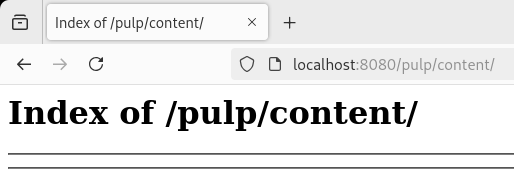
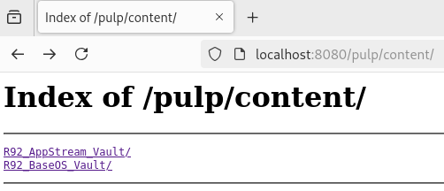

## Introduction

Developers who use Rocky Linux often require different remote RPM repositories to support their operations. Pulp is an open source project that can help developers meet this need by facilitating fetching and distributing different RPM repositories. This guide shows a simple example of using Pulp to fetch BaseOS and AppStream from the Rocky Linux vault.

## Requirements

* A Rocky Linux system
* Able to run containers

## Setup - Single Container

There are many possible setups for Pulp, but this guide will use the single container deployment scenario for ease of illustration. Pick a directory for Pulp and create the following directories and files.

```bash
mkdir -p settings/certs pulp_storage pgsql containers
echo "CONTENT_ORIGIN='http://$(hostname):8080'" >> settings/settings.py
```

If you enable SELinux, you can run the following to deploy Pulp. If SELinux is not enabled, then you can remove the `:Z` suffix from the `--volume` lines:

```bash
$ podman run --detach \
             --publish 8080:80 \
             --name pulp \
             --volume "$(pwd)/settings":/etc/pulp:Z \
             --volume "$(pwd)/pulp_storage":/var/lib/pulp:Z \
             --volume "$(pwd)/pgsql":/var/lib/pgsql:Z \
             --volume "$(pwd)/containers":/var/lib/containers:Z \
             --device /dev/fuse \
             pulp/pulp
```

If you browse to `http://localhost:8080/pulp/content/`, you should now see the "Index of /pulp/content/" that is currently empty. You will fill these with your repositories by the end of this guide.



## Create Pulp Remotes

Think of Pulp remotes as remote source repositories. In this case, the remote source repositories are BaseOS and AppStream from Rocky Linux 9.2 vault. You will use these remotes to sync to the repositories you create with Pulp. Please check the [Pulp official documentation](https://pulpproject.org/) for more on remote policies.

```bash
pulp rpm remote create --name "rocky_92_appstream_vault" --url "https://dl.rockylinux.org/vault/rocky/9.2/AppStream/x86_64/os/" --policy on_demand
pulp rpm remote create --name "rocky_92_baseos_vault" --url "https://dl.rockylinux.org/vault/rocky/9.2/BaseOS/x86_64/os/" --policy on_demand
```

## Pulp Repository Copies

These will be one-to-one repository copies of BaseOS and AppStream from the Rocky Linux 9.2 vault. If you know the remote you want to use to sync from for your repositories, you can add those remotes at the time of repository creation. Otherwise, if you do not know what remotes to use or if those remotes can change, then you can leave the remotes out. For this guide, the declaration of the remotes occurs at the time of repository creation.

```bash
pulp rpm repository create --name "R92_AppStream_Vault" --remote "rocky_92_appstream_vault"
pulp rpm repository create --name "R92_BaseOS_Vault" --remote "rocky_92_baseos_vault"
```

## Pulp Sync Copies

!!! note

    It is important to add "--skip-type treeinfo". Otherwise, instead of just BaseOS or AppStream, you end up with a weird mix of both. This is probably due to an issue with repositories that are dependency closed. If the remote was not specified before, you can just add it. If you added it at the time of creation, it is not necessary to mention the remote in the sync, as implied.

```bash
pulp rpm repository sync --name "R92_AppStream_Vault" --skip-type treeinfo
pulp rpm repository sync --name "R92_BaseOS_Vault" --skip-type treeinfo
```

## Pulp Publish Publications

Once your repositories are synced from the remotes, you will want to create the publications from those repositories to serve up to the distributions. So far you have been able to get by just using names of remotes and repositories, however, Pulp relies on `hrefs` as well, and you can use them interchangeably. After creating the publication, make sure to take note of the `pulp_href` value of each, as they will be necessary for the next step.

```bash
pulp rpm publication create --repository "R92_AppStream_Vault"
pulp rpm publication create --repository "R92_BaseOS_Vault"
```

## Pulp Create Distributions

With the `pulp_href` from the previous publication step, you can now serve up that content to a distribution. This content will then show under `http://localhost:8080/pulp/content/` and no longer be empty. You can double-check the `pulp_href` of the publications using the `pulp rpm publication list` and look for `pulp_href`. For example, a `pulp_href` for BaseOS is below, but your `pulp_href` could be different, so swap it accordingly.

```bash
pulp rpm distribution create --name "Copy of BaseOS 92 RL Vault" --base-path "R92_BaseOS_Vault" --publication "/pulp/api/v3/publications/rpm/rpm/0195fdaa-a194-7e9d-a6a9-e6fd4eaa7a20/"
pulp rpm distribution create --name "Copy of AppStream 92 RL Vault" --base-path "R92_AppStream_Vault" --publication "<pulp_href>"
```

If you check `http://localhost:8080/pulp/content/,` you should see your two repositories, which are copies of the Rocky Linux 9.2 AppStream and BaseOS vault repositories.



## Conclusion

Pulp can be a very versatile tool for fetching multiple repositories and distributing them as needed. While this is a basic example, you can use Pulp in a variety of deployment scenarios that are more complex and advanced. Please check the [official documentation](https://pulpproject.org/) for more information.
