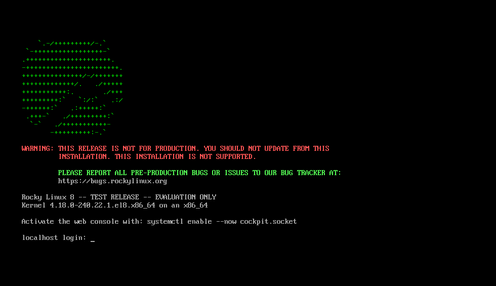

# 安装 Rocky Linux

本文介绍在独立系统上安装 64 位 rocky Linux 发行版的详细步骤。

本文将使用从 rocky 项目网站下载的操作系统安装程序映像执行服务器类安装。以下部分将介绍安装和自定义步骤。


## OS 安装前提

首先，您需要下载将要安装的 Rocky ISO。

用于此安装的 Rocky 版本的最新 ISO 映像可从以下位置下载：

```
https://www.rockylinux.org/download/

```

要直接从命令行下载 ISO，请输入：

```
$ wget https://download.rockylinux.org/pub/rocky/8.3/isos/x86_64/Rocky-8.3-x86_64-minimal.iso
```

Rocky ISO 的命名遵循以下约定：

```
Rocky-<主版本号#>.<次版本号#>.<架构>-<变体>.iso
```

例如  `Rocky-8.3-x86_64-minimal.iso`


**注意:**
Rock 项目页面列出了世界各地的几个镜像。您应该尽可能地选择地理位置最接近的镜像。官方镜像列表可在 `https://#` 处找到。


## 验证安装 ISO

如果您已经在现有的 Linux 发行版上下载了 Rocky ISO，那么可以使用 sha256sum 程序验证下载的文件是否损坏。接下来通过一个示例演示如何验证 `sha256sum Rocky-8.3-x86_64-minimal.iso `。

首先下载包含可用 ISO 的官方校验和的文件。如果仍在包含已下载文件的文件夹中，请输入：

```
wget http://download.rockylinux.org/pub/rocky/8.3/isos/x86_64/CHECKSUM
```

使用 sha256sum 程序验证

```
sha256sum -c CHECKSUM    --ignore-missing Rocky-8.3-x86_64-minimal.iso
```

输出应包括：

```
Rocky-8.3-x86_64-minimal.iso: OK
```


**提示:** 在正确启动安装之前，应预先配置系统的统一可扩展固件接口（UEFI）或基本输入/输出系统（BIOS），以从正确的介质引导。

# 安装

开始安装过程。

插入并引导安装介质（光盘、USB闪存驱动器等）。

启动后，您将看到一个欢迎的初始界面。


如果您不按任何键，提示将开始倒计时，然后安装过程将启动高亮显示的“This Media & Install Rocky Linux 8 ... ”选项。您还可以按 Enter 键立即启动安装。

将进行快速介质验证步骤。此介质验证步骤可以省去您在中途才开始安装却发现安装程序将因安装介质损坏而中止的麻烦。

介质检查运行完成，并且介质被成功验证为可用后，安装程序将自动跳到下一个界面。

在界面中选择要用于执行安装的语言。此处选择英语（美国）。然后单击“继续”按钮。

**警告:** :warning: 接下来将看到警告界面，将警告您正在安装预发行软件，并且不应在生产环境中使用该操作系统。如果您对此同意，请单击“我要继续”。

# 安装信息摘要

安装信息摘要界面是一个集合多种设置的区域，您可以在其中做出有关要安装的操作系统的重要决定。界面大致分为以下几部分：
    • 本地化（键盘、语言支持以及时间和日期）
    • 软件（安装源和软件选择）
    • 系统（安装目的地以及网络和主机名）

接下来将深入研究其中的每一个部分，并在必要时进行更改。


## 本地化部分
此部分用于自定义与系统区域设置相关的项目，其中包括键盘、语言支持、时间和日期。


### 键盘
在本文演示的系统中，接受默认值（English US），不做任何更改。
如果需要在此处进行任何更改，请从“安装信息摘要”界面中单击键盘选项以指定系统的键盘布局。如果需要，在后续界面中添加其他键盘布局并指定其顺序。
完成后，单击“完成”。

### 语言支持
“安装信息摘要”界面上的“语言支持”选项允许指定对完成安装后系统上可能需要的其他语言的支持。
此处接受默认值（English – United States），不做任何更改。单击“完成”。


### 时间和日期
单击主“安装信息摘要”界面上的“时间和日期”选项，调出另一个界面，您可以通过该界面选择机器所在的时区。滚动区域和城市列表，选择离您最近的区域。

根据安装源，默认情况下可以将“网络时间”选项设置为“打开”或“关闭”。接受默认“打开”设置；这允许系统使用网络时间协议(NTP)自动设置正确的时间。进行任何更改后，单击“完成”。

## 软件部分
在“安装信息摘要”界面的“软件”部分下，您可以选择安装源以及要安装的其他软件包(应用程序)。

### 安装源
由于使用完整的 Rocky 8 映像执行安装，因此您会注意到，在主“安装信息摘要”界面的“安装源”部分下会自动指定本地介质。接受预设的默认值。

### 软件选择

单击主“安装信息摘要”界面上的“软件选择”选项，将显示安装部分，从中可以选择系统上安装的确切软件包。软件选择区域分为“基本环境”（服务器、最小安装、自定义操作系统）和“所选环境的额外软件”。
在左侧选择“基本环境”会在右侧显示可为给定环境安装的各种相关附加软件。

改为选择“最小安装(基本功能)”选项。

单击界面顶部的“完成”。
        ​
## 系统部分
“安装信息摘要”界面的“系统”部分用于自定义和更改目标系统的底层硬件。在此处可以创建硬盘分区或卷、指定要使用的文件系统，以及指定网络配置。

### 安装目的地

在“安装信息摘要”界面上，单击“安装目的地”选项。这会将您带到相应的任务区域。
您将看到一个界面，显示目标系统上可用的所有候选磁盘驱动器。如果系统上只有一个磁盘驱动器，如示例所示，您将看到在“本地标准磁盘”下列出的驱动器旁边有一个复选标记。单击磁盘图标将打开或关闭磁盘选择复选标记。此处选择/选中它。


在“存储配置”选项部分下，选择“自动”单选按钮。
然后单击界面顶部的“完成”。
安装程序确定有可用的磁盘后，将返回到“安装信息摘要”界面。


### 网络和主机名
安装过程的最后一项任务是网络配置，您可以在其中配置或调整系统的网络相关设置。

**注意：** 单击“网络和主机名”选项后，所有正确检测到的网络接口硬件(如以太网、无线网卡等)都将列在网络配置界面的左窗格中。Linux 中的以太网设备的名称类似于eth0、eth1、ens3、ens4、em1、em2、p1p1、enp0s3等，具体取决于 Linux 发行版和特定的硬件设置。
 
对于每个接口，您可以使用 DHCP 或手动配置 IP 地址。如果您选择手动配置，请确保准备好所有相关信息，如 IP 地址、网络掩码等。
单击主“安装信息摘要”界面中的“网络和主机名”按钮将打开相应的配置界面。此外，您还可以选择配置系统的主机名(默认为 localhost.localdomain)。请注意，在安装操作系统之后，您可以很容易地更改此名称。此处接受为主机名提供的默认值。

下一个重要的配置任务与系统上的网络接口相关。首先，验证左窗格中是否列出了以太网卡(或任何网卡)。单击左窗格中检测到的任何网络设备将其选中。所选网络适配器的可配置属性将出现在界面的右窗格中。
在示例服务器上有四个以太网设备(ens3、ens4、ens5 和 ens6)，它们都处于连接状态。您系统上的网络设备的类型、名称、数量和状态可能与示例系统上的网络设备的类型、名称、数量和状态不同。
确保要配置的设备的开关在右窗格中处于“打开”位置。
接受本部分中的所有默认值。

单击“完成”返回安装信息摘要主界面。

**警告：**  请注意本安装程序此部分中服务器的 IP 地址。如果您无法对系统进行物理或轻松的控制台访问，当您需要连接到服务器以继续使用它时，这些信息将在以后派上用场。

## 安装
对各种安装任务的选择满意后，安装过程的下一个阶段将开始正确的安装。

## 用户设置部分

此部分可用于为 root 用户帐户创建密码，也可用于创建新的管理员或非管理员帐户。


### 设置 Root 密码

单击“用户设置”下的“Root 密码”字段以启动“Root 密码”任务界面。在“Root 密码”文本框中，为 root 用户设置一个强密码。
此用户是系统中权限最高的帐户。因此，如果您选择使用或启用它，请使用强密码保护该帐户。
在“确认”文本框中再次输入相同的密码。单击“完成”。
            ​

### 创建用户帐户

接下来单击“用户设置”下的“用户创建”字段以启动创建用户任务界面。此任务区域允许您在系统上创建特权或非特权（非管理）用户帐户。

在系统上创建和使用非特权帐户执行日常任务是一种很好的系统管理实践。

将创建一个常规用户，在需要时可以调用超级用户（管理员）权限。
使用以下信息填写“创建用户”界面中的字段，然后单击“完成”：

全名
`rockstar`
用户名
`rockstar`
将此用户设为管理员
选中

需要密码才能使用此帐户
选中

密码
`04302021`

确认密码
`04302021`


### 开始安装

对各种安装任务的选择满意后，请在“安装信息摘要”主界面上单击“开始安装”按钮。安装将开始，安装程序将显示安装进度。

**注意：** 如果您在单击“开始安装”按钮后遇到了问题，您仍然可以安全地退出安装，而不会丢失任何数据。要退出安装程序，只需单击“退出”按钮，按键盘上的 ctrl-alt-del 组合键，或者按下重置或电源开关，即可重置系统。

安装开始时，各种任务将开始在后台运行，例如对磁盘进行分区、格式化分区或 LVM 卷、检查并解决软件依赖关系、将操作系统写入磁盘等。 ​
 
### 完成安装
完成所有必需的子任务并完成安装程序的安装过程后，系统将为您提供最终的安装进度界面，并显示完整的消息。

最后，单击“重新启动系统”按钮来完成整个过程。系统将自行重启。
            ​
### 登录
系统现在已设置好，您可以使用了。您将看到可爱的 Rocky Linux 控制台。



要登录到系统，请在登录提示处键入 `rockstar`，然后按 enter 键。

在密码提示处，键入 `04302021`（rockstar 的密码），然后按 enter 键。

在登录后运行 `whoami` 命令。


