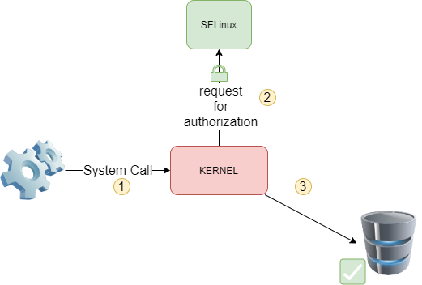
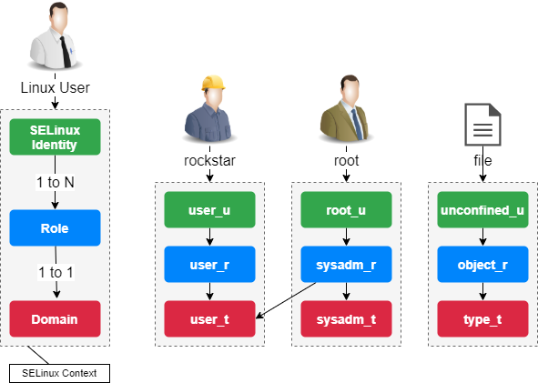

# Безпека SELinux

З появою версії ядра 2.6 була представлена нова система безпеки, яка забезпечує механізм безпеки для підтримки політик безпеки контролю доступу.

Ця система називається **SELinux** (**S**security **E**nchanced **Linux**) і було створено **NSA** (**N**ational **S**ecurity **A**gency (Національне Агенство з Безпеки)) для впровадження надійного **M**andatory **A**ccess **C**ontrol (**MAC**) у підсистемах ядра Linux.

Якщо протягом вашої кар’єри ви вимикали або ігнорували SELinux, цей документ стане гарним вступом до цієї системи. SELinux обмежує привілеї або усуває ризики, пов’язані з компрометацією програми чи демона.

Перш ніж почати, ви повинні знати, що SELinux в основному призначений для дистрибутивів RHEL, хоча його можна реалізувати в інших дистрибутивах, таких як Debian (але удачі!). Дистрибутиви сімейства Debian зазвичай інтегрують систему AppArmor, яка працює інакше, ніж SELinux.

## Загальні положення

**SELinux** (Security Enhanced Linux) — це обов’язкова система контролю доступу.

До появи систем MAC стандартний захист керування доступом базувався на **DAC** (**D**iscretionary **A**ccess **C**ontrol). Програма або демон, які працюють за допомогою **UID** або **SUID** (**S**et **O**wner **U**ser **I**d) права, які дозволили оцінити дозволи (на файли, сокети та інші процеси...) відповідно до цього користувача. Ця операція недостатньо обмежує права пошкодженої програми, потенційно дозволяючи їй отримати доступ до підсистем операційної системи.

Система MAC посилює розділення конфіденційності та цілісності інформації для досягнення системи стримування. Система обмеження не залежить від традиційної системи прав, і тут немає поняття суперкористувача.

З кожним системним викликом ядро запитує SELinux, щоб перевірити, чи дозволяє воно виконати дію.



SELinux використовує для цього набір правил (політик). Надається набір із двох стандартних наборів правил (**targeted** і **strict**), і кожна програма зазвичай надає власні правила.

### Контекст SELinux

Робота SELinux відрізняється від традиційних прав Unix.

Контекст безпеки SELinux визначається тріо **identity**+**role**+**domain**.

Ідентичність користувача безпосередньо залежить від його облікового запису Linux. Ідентифікатору призначається одна або кілька ролей, але кожна роль відповідає лише одному домену.

Саме відповідно до домену контексту безпеки (і, отже, ролі) оцінюються права користувача на ресурс.



Терміни «domain» і «type» подібні. Як правило, «домен» відноситься до процесу, тоді як «тип» відноситься до об’єкта.

Правила іменування: **user_u:role_r:type_t**.

Контекст безпеки призначається користувачеві під час його підключення відповідно до його ролей. Контекст безпеки файлу визначається `chcon` (**ch**ange **con**text), яку ми побачимо далі в цьому документі.

Розглянемо такі частини головоломки SELinux:

* Суб'єкти
* Об'єкти
* Політики
* Режими

Коли суб’єкт (наприклад, програма) намагається отримати доступ до об’єкта (наприклад, файлу), частина SELinux ядра Linux запитує його базу даних політики. Залежно від режиму роботи, SELinux авторизує доступ до об’єкта в разі успіху, інакше він записує помилку у файл `/var/log/messages`.

#### Контекст стандартних процесів SELinux

Права процесу залежать від його контексту безпеки.

За замовчуванням контекст безпеки процесу визначається контекстом користувача (ідентифікація + роль + домен), який його запускає.

Домен — це певний тип (у розумінні SELinux), пов’язаний із процесом і успадкований (зазвичай) від користувача, який його запустив. Його права виражені в термінах дозволу або відмови щодо типів, пов’язаних з об’єктами:

Процес, контекст якого має безпеку __домен D__, може отримати доступ до об’єктів __типу T__.


#### Контекст SELinux важливих процесів

Більшості важливих програм призначається окремий домен.

Кожен виконуваний файл позначено спеціальним типом (тут **sshd_exec_t**), який автоматично перемикає відповідний процес на контекст **sshd_t** (замість **user_t**).

Цей механізм є важливим, оскільки він максимально обмежує права процесу.


## Управління

Команда `semanage` керує правилами SELinux.

```
semanage [object_type] [options]
```

Приклад:

```
$ semanage boolean -l
```

| Опції | Функціональність  |
| ----- | ----------------- |
| -a    | Додає об’єкт      |
| -d    | Видаляє об’єкт    |
| -m    | Змінює об’єкт     |
| -l    | Перелічує об’єкти |

Команда `semanage` може бути не встановлена за замовчуванням у Rocky Linux.

Не знаючи пакета, який надає цю команду, ви повинні шукати його назву за допомогою команди:

```
dnf provides */semanage
```

потім встановіть це:

```
sudo dnf install policycoreutils-python-utils
```

### Адміністрування булевих об'єктів

Логічні значення дозволяють стримувати процеси.

```
semanage boolean [options]
```

Щоб отримати список доступних логічних значень:

```
semanage boolean –l
SELinux boolean    State Default  Description
…
httpd_can_sendmail (off , off)  Allow httpd to send mail
…
```

!!! Note "Примітка"

    Як бачите, існує стан «за замовчуванням» (наприклад, під час запуску) і стан роботи.

Команда `setsebool` використовується для зміни стану логічного об’єкта:

```
setsebool [-PV] boolean on|off
```

Приклад:

```
sudo setsebool -P httpd_can_sendmail on
```

| Опції | Функціональність                                                                   |
| ----- | ---------------------------------------------------------------------------------- |
| `-P`  | Змінює значення за замовчуванням під час запуску (інакше лише до перезавантаження) |
| `-V`  | Видаляє об’єкт                                                                     |

!!! Warning "Важливо"

    Не забудьте опцію `-P`, щоб зберегти стан після наступного запуску.

### Адміністрування об'єктів порту

Команда `semanage` використовується для керування об’єктами типу port:

```
semanage port [options]
```

Приклад: дозволити порт 81 для процесів домену httpd

```
sudo semanage port -a -t http_port_t -p tcp 81
```

## Режими роботи

SELinux має три режими роботи:

* Enforcing (Примусове виконання)

Режим за замовчуванням для Rocky Linux. Доступ буде обмежено відповідно до чинних правил.

* Permissive (Дозвільний)

Правила опитуються, а помилки доступу реєструються, але доступ не блокується.

* Disabled (Вимкнено)

Ніщо не буде обмежено, нічого не буде зареєстровано.

За замовчуванням більшість операційних систем налаштовано за допомогою SELinux у режимі Enforcing.

Команда `getenforce` повертає поточний режим роботи

```
getenforce
```

Приклад:

```
$ getenforce
Enforcing
```

Команда `sestatus` повертає інформацію про SELinux

```
sestatus
```

Приклад:

```
$ sestatus
SELinux status:                enabled
SELinuxfs mount:                 /sys/fs/selinux
SELinux root directory:    /etc/selinux
Loaded policy name:        targeted
Current mode:                enforcing
Mode from config file:     enforcing
...
Max kernel policy version: 33
```

Команда `setenforce` змінює поточний режим роботи:

```
setenforce 0|1
```

Перемкніть SELinux у дозвільний режим:

```
sudo setenforce 0
```

### Файл `/etc/sysconfig/selinux`

Файл `/etc/sysconfig/selinux` дозволяє змінити режим роботи SELinux.

!!! Warning "Важливо"

    Вимкнення SELinux виконується на ваш власний ризик! Краще дізнатися, як працює SELinux, ніж систематично відключати його!

Відредагуйте файл `/etc/sysconfig/selinux`

```
SELINUX=disabled
```

!!! Note "Примітка"

    `/etc/sysconfig/selinux` є символічним посиланням на `/etc/selinux/config`

Перезавантажте систему:

```
sudo reboot
```

!!! Warning "Важливо"

    Остерігайтеся зміни режиму SELinux!

У дозволеному або вимкненому режимі новостворені файли не матимуть міток.

Щоб повторно активувати SELinux, вам доведеться змінити розташування міток у всій системі.

Маркування всієї системи:

```
sudo touch /.autorelabel
sudo reboot
```

## Тип політики

SELinux надає два стандартних типи правил:

* **Targeted (Цільовий)**: захищені лише мережеві демони (`dhcpd`, `httpd`, `named`, `nscd`, `ntpd`, `portmap`, `snmpd`, `squid` і `syslogd`)
* **Strict (Строгий)**: усі демони захищені

## Контекст

Відображення контекстів безпеки виконується за допомогою параметра `-Z`. Він пов'язаний з багатьма командами:

Приклади:

```
id -Z   # the user's context
ls -Z   # those of the current files
ps -eZ  # those of the processes
netstat –Z # for network connections
lsof -Z # for open files
```

Команда `matchpathcon` повертає контекст каталогу.

```
matchpathcon directory
```

Приклад:

```
sudo matchpathcon /root
 /root  system_u:object_r:admin_home_t:s0

sudo matchpathcon /
 /      system_u:object_r:root_t:s0
```

Команда `chcon` змінює контекст безпеки:

```
chcon [-vR] [-u USER] [–r ROLE] [-t TYPE] file
```

Приклад:

```
sudo chcon -vR -t httpd_sys_content_t /data/websites/
```

| Опції          | Функціональність                             |
| -------------- | -------------------------------------------- |
| `-v`           | Перемикається в багатослівний режим          |
| `-R`           | Застосовує рекурсію                          |
| `-u`,`-r`,`-t` | Застосовується до користувача, ролі або типу |

Команда `restorecon` відновлює контекст безпеки за умовчанням (той, який передбачено правилами):

```
restorecon [-vR] directory
```

Приклад:

```
sudo restorecon -vR /home/
```

| Опції | Функціональність                    |
| ----- | ----------------------------------- |
| `-v`  | Перемикається в багатослівний режим |
| `-R`  | Застосовує рекурсію                 |

Команда `restorecon` відновлює контекст безпеки за умовчанням (той, який передбачено правилами):

```
semanage fcontext -a options file
```

!!! Note "Примітка"

    Якщо ви виконуєте перемикання контексту для папки, яка не є стандартною для системи, гарною практикою є створення правила, а потім застосування контексту, як у прикладі нижче!

Приклад:

```
$ sudo semanage fcontext -a -t httpd_sys_content_t "/data/websites(/.*)?"
$ sudo restorecon -vR /data/websites/
```

## Команда `audit2why`

Команда `audit2why` вказує на причину відхилення SELinux:

```
audit2why [-vw]
```

Приклад визначення причини останньої відмови SELinux:

```
sudo cat /var/log/audit/audit.log | grep AVC | grep denied | tail -1 | audit2why
```

| Опції | Функціональність                                                                                     |
| ----- | ---------------------------------------------------------------------------------------------------- |
| `-v`  | Перемикається в багатослівний режим                                                                  |
| `-w`  | Перекладає причину відхилення SELinux і пропонує рішення для її усунення (параметр за замовчуванням) |

### Йти далі з SELinux

Команда `audit2allow` створює модуль, щоб дозволити дію SELinux (якщо модуль не існує) із рядка у файлі «аудит»:

```
audit2allow [-mM]
```

Приклад:

```
sudo cat /var/log/audit/audit.log | grep AVC | grep denied | tail -1 | audit2allow -M mylocalmodule
```

| Опції | Функціональність                                |
| ----- | ----------------------------------------------- |
| `-m`  | Просто створює модуль (`*.te`)                  |
| `-M`  | Створює модуль, компілює та пакує його (`*.pp`) |

#### Приклад конфігурації

Після виконання команди система повертає вам командний рядок, але очікуваного результату не видно: на екрані немає повідомлення про помилку.

* **Крок 1**: прочитайте файл журналу, знаючи, що повідомлення, яке нас цікавить, має тип AVC (SELinux), відхилено (відмовлено) і найновіше (тобто останнє один).

```
sudo cat /var/log/audit/audit.log | grep AVC | grep denied | tail -1
```

Повідомлення правильно ізольовано, але воно нам не допомагає.

* **Крок 2**: прочитайте ізольоване повідомлення за допомогою команди `audit2why`, щоб отримати більш чітке повідомлення, яке може містити рішення нашої проблеми (зазвичай логічний бути встановлено).

```
sudo cat /var/log/audit/audit.log | grep AVC | grep denied | tail -1 | audit2why
```

Є два випадки: або ми можемо розмістити контекст або заповнити логічне значення, або ми повинні перейти до кроку 3, щоб створити наш власний контекст.

* **Крок 3**: Створіть власний модуль.

```
$ sudo cat /var/log/audit/audit.log | grep AVC | grep denied | tail -1 | audit2allow -M mylocalmodule
Generating type enforcement: mylocalmodule.te
Compiling policy: checkmodule -M -m -o mylocalmodule.mod mylocalmodule.te
Building package: semodule_package -o mylocalmodule.pp -m mylocalmodule.mod

$ sudo semodule -i mylocalmodule.pp
```
