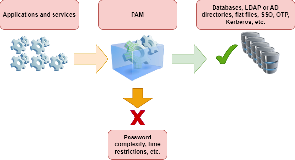
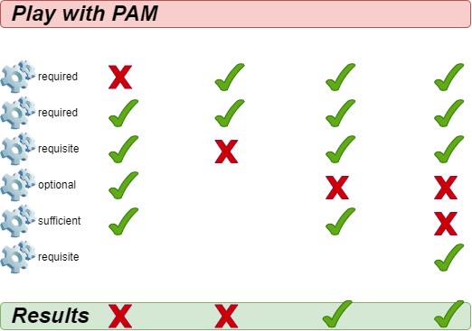

# Модулі автентифікації PAM

## Передумови та припущення

* Некритичний ПК, сервер або віртуальна машина Rocky Linux
* Root доступ
* Деякі існуючі знання Linux (дуже допоможуть)
* Бажання дізнатися про автентифікацію користувачів і програм у Linux
* Здатність приймати наслідки власних дій

## Вступ

PAM (**Pluggable Authentication Modules**) — це система під GNU/Linux, яка дозволяє багатьом програмам або службам централізовано автентифікувати користувачів. Іншими словами:

> PAM — це набір бібліотек, який дозволяє системному адміністратору Linux налаштовувати методи автентифікації користувачів. Він забезпечує гнучкий і централізований спосіб перемикання методів автентифікації для захищених програм за допомогою файлів конфігурації замість зміни коду програми. \- [Wikipedia](https://en.wikipedia.org/wiki/Linux_PAM)

Цей документ *не* призначений для того, щоб навчити вас, як саме загартувати машину. Це скоріше довідковий посібник, щоб показати вам, що PAM *може* робити, а не те, що ви *маєте робити*.

## Загальні положення

Автентифікація — це етап, під час якого перевіряється, що ви є особою, за яку себе видаєте. Найпоширенішим прикладом є пароль, але існують і інші форми автентифікації.



Реалізація нового методу автентифікації не повинна вимагати змін у вихідному коді конфігурації програми чи служби. Ось чому програми покладаються на PAM, який надає їм примітиви*, необхідні для автентифікації своїх користувачів.

Таким чином, усі програми в системі можуть реалізувати такі складні функції, як **SSO** (єдиний вхід), **OTP** (Одноразовий пароль) або **Kerberos** у абсолютно прозорий спосіб. Системний адміністратор може вибрати, яку саме політику автентифікації використовувати для окремої програми (наприклад, для посилення служби SSH) незалежно від програми.

Кожна програма або служба, що підтримує PAM, матиме відповідний файл конфігурації в каталозі `/etc/pam.d/`. Наприклад, процес `login` призначає назву `/etc/pam.d/login` своєму файлу конфігурації.

\* Примітиви — це буквально найпростіші елементи програми або мови, які дозволяють створювати на їх основі більш витончені та складні речі.

!!! WARNING "Увага"

    Неправильно налаштований екземпляр PAM може поставити під загрозу безпеку всієї системи. Якщо PAM вразливий, то вразлива вся система. Робіть будь-які зміни обережно.

## Директиви

Директива використовується для налаштування програми для використання з PAM. Директиви матимуть такий формат:

```
mechanism [control] path-to-module [argument]
```

**Директива** (повний рядок) складається з **механізму** (`auth`, `обліковий запис`, `пароль` або `сеанс`), **перевірка успіху** (`включити `, `необов'язково`, `обов'язково`, ...), **шлях до модуля** та, можливо, **аргументи** (наприклад, `revoke`).

Кожен файл конфігурації PAM містить набір директив. Директиви інтерфейсу модуля можна складати або розміщувати одна на одній. Насправді **порядок, у якому перераховані модулі, дуже важливий для процесу автентифікації.**

Наприклад, ось файл конфігурації `/etc/pam.d/sudo`:

```
#%PAM-1.0
auth       include      system-auth
account    include      system-auth
password   include      system-auth
session    include      system-auth
```

## Механізми

### `auth` – автентифікація

Це забезпечує автентифікацію запитувача та встановлює права облікового запису:

* Зазвичай автентифікується за допомогою пароля, порівнюючи його зі значенням, що зберігається в базі даних, або покладаючись на сервер автентифікації,

* Встановлює параметри облікового запису: uid, gid, групи та обмеження ресурсів.

### `account` – керування обліковим записом

Перевіряє доступність запитуваного облікового запису:

* Пов’язано з доступністю облікового запису з причин, відмінних від автентифікації (наприклад, через часові обмеження).

### `session` – керування сеансом

Відноситься до налаштування та завершення сеансу:

* Виконує завдання, пов’язані з налаштуванням сеансу (наприклад, журналювання),
* Виконує завдання, пов'язані із завершенням сесії.

### `password` – керування паролями

Використовується для зміни маркера автентифікації, пов’язаного з обліковим записом (закінчення терміну дії або зміна):

* Змінює маркер автентифікації та, можливо, перевіряє, чи він достатньо надійний або ще не використовувався.

## Контрольні індикатори

Механізми PAM (`auth`, `account`, `session` і `password`) вказують на `успіх` або `помилку`. Контрольні прапорці (`required`, `requisite`, `sufficient`, `optional`) повідомляють PAM, як обробляти цей результат.

### `required`

Успішне завершення всіх `required` модулів є необхідним.

* **Якщо модуль пройдено:** решта ланцюжка виконується. Запит дозволений, якщо інші модулі не дають збою.

* **Якщо модуль виходить з ладу:** виконується решта ланцюжка. Зрештою запит відхилено.

Для продовження автентифікації модуль має бути успішно перевірено. Якщо перевірка модуля, позначеного як `required`, не вдається, користувач не отримує сповіщення, доки не буде перевірено всі модулі, пов’язані з цим інтерфейсом.

### `requisite`

Необхідно успішне проходження всіх `необхідних` модулів.

* **Якщо модуль пройдено:** решта ланцюжка виконується. Запит дозволений, якщо інші модулі не дають збою.

* **Якщо модуль не працює:** запит негайно відхиляється.

Для продовження автентифікації модуль має бути успішно перевіреним. Проте, якщо перевірка модуля, позначеного `requisite`, не вдається, користувач негайно отримує повідомлення про невдачу першого `required` або `requisite` модуля.

### `sufficient`

Модулі з позначкою `sufficient` можуть бути використані, щоб дозволити користувачеві «достроково» за певних умов:

* **Якщо модуль завершується успішно:** Запит на автентифікацію негайно дозволяється, якщо жоден із попередніх модулів не вдався.

* **Якщо модуль не працює:** модуль ігнорується. Решта ланцюжка виконується.

Проте, якщо перевірка модуля з позначкою `sufficient` пройшла успішно, але модулі з позначкою `required` або `requisite` не пройшли перевірки, успіх модуля `sufficient` ігнорується, і запит не виконується.

### `optional`

Модуль виконується, але результат запиту ігнорується. Якби всі модулі в ланцюжку були позначені як `опціональні`, усі запити завжди приймалися б.

### Висновок



## Модулі PAM

Існує багато модулів для PAM. Ось найпоширеніші з них:

* pam_unix
* pam_ldap
* pam_wheel
* pam_cracklib
* pam_console
* pam_tally
* pam_securetty
* pam_nologin
* pam_limits
* pam_time
* pam_access

### `pam_unix`

Модуль `pam_unix` дозволяє вам керувати глобальною політикою автентифікації.

У `/etc/pam.d/system-auth` можна додати:

```
password sufficient pam_unix.so sha512 nullok
```

Для цього модуля можливі аргументи:

* `nullok`: у механізмі `auth` дозволяє порожній пароль для входу.
* `sha512` визначає алгоритм шифрування в механізмі пароля.
* `debug`: надсилає інформацію до `syslog`.
* `remember=n`: використовуйте це, щоб запам’ятати останні `n` використаних паролів (працює разом із файлом `/etc/security/opasswd`, який створюється адміністратором).

### `pam_cracklib`

Модуль `pam_cracklib` дозволяє перевіряти паролі.

У `/etc/pam.d/password-auth` додайте:

```
password sufficient pam_cracklib.so retry=2
```

Цей модуль використовує бібліотеку `cracklib` для перевірки надійності нового пароля. Він також може перевірити, чи новий пароль не побудовано на основі старого. Це *лише* впливає на механізм пароля.

За замовчуванням цей модуль перевіряє наступні аспекти та відхиляє, якщо це так:

* Чи це новий пароль зі словника?
* Чи є новий пароль паліндромом старого (наприклад: azerty <> ytreza)?
* Користувач змінив лише регістр пароля (наприклад, azerty <>AzErTy)?

Можливі аргументи для цього модуля:

* `retry=n`: накладає `n` запитів (1` за умовчанням) для нового пароля.
* `difok=n`: накладає принаймні `n` символів (`10` за умовчанням), відмінних від старого пароля. Якщо половина символів нового пароля відрізняється від старого, новий пароль вважається дійсним.
* `minlen=n`: накладає пароль мінімум з `n+1` символів. Ви не можете призначати мінімум менше 6 символів (модуль скомпільовано таким чином).

Інші можливі аргументи:

* `dcredit=-n`: нав’язує пароль, що містить щонайменше `n` цифр,
* `ucredit=-n`: нав’язує пароль, що містить принаймні `n` великих літер,
* `credit=-n`: нав’язує пароль, що містить принаймні `n` малих літер,
* `ocredit=-n`: накладає пароль, що містить принаймні `n` спеціальних символів.

### `pam_tally`

Модуль `pam_tally` дозволяє блокувати обліковий запис після кількох невдалих спроб входу.

Типовий файл конфігурації для цього модуля може виглядати так: `/etc/pam.d/system-auth`:

```
auth required /lib/security/pam_tally.so onerr=fail no_magic_root
account required /lib/security/pam_tally.so deny=3 reset no_magic_root
```

Механізм `auth` приймає або забороняє автентифікацію та скидає лічильник.

Механізм `account` збільшує лічильник.

Деякі аргументи модуля pam_tally включають:

* `onerr=fail`: збільшує лічильник.
* `deny=n`: після перевищення кількості `n` невдалих спроб обліковий запис блокується.
* `no_magic_root`: можна використовувати для заборони доступу до служб кореневого рівня, запущених демонами.
    * напр. не використовуйте це для `su`.
* `reset`: скидає лічильник до 0, якщо автентифікацію перевірено.
* `lock_time=nsec`: обліковий запис заблоковано на `n` секунд.

Цей модуль працює разом із файлом за замовчуванням для невдалих спроб `/var/log/faillog` (який можна замінити іншим файлом з аргументом `file=xxxx`) і пов’язаним команда `faillog`.

Синтаксис команди faillog:

```
faillog[-m n] |-u login][-r]
```

Опції:

* `m`: щоб визначити максимальну кількість невдалих спроб у вікні команд,
* `u`: щоб вказати користувача,
* `r`: щоб розблокувати користувача.

### `pam_time`

Модуль `pam_time` дозволяє обмежити час доступу до служб, якими керує PAM.

Щоб активувати його, відредагуйте `/etc/pam.d/system-auth` і додайте:

```
account required /lib/security/pam_time.so
```

Налаштування виконується у файлі `/etc/security/time.conf`:

```
login ; * ; users ;MoTuWeThFr0800-2000
http ; * ; users ;Al0000-2400
```

Синтаксис директиви наступний:

```
services; ttys; users; times
```

У наведених нижче визначеннях логічний список використовує:

* `&`: логічне значення "і".
* `|`: логічне "або".
* `!`: означає заперечення або "всі, крім".
* `*`: символ підстановки.

Стовпці відповідають:

* `services`: логічний список служб, керованих PAM, якими також керуватиме це правило
* `ttys`: логічний список пов’язаних пристроїв
* `users`: логічний список користувачів, керованих правилом
* `times`: логічний список авторизованих часових інтервалів

Як керувати часовими інтервалами:

* Дні: `Mo`, `Tu`, `We`, `Th`, `Fr,` `Sa`, `Su`, `Wk`, (з понеділка по п’ятницю), `Wd` (субота та неділя) та `Al` (з понеділка по неділю)
* Погодинний діапазон: `HHMM-HHMM`
* Повторення скасовує ефект: `WkMo` = усі дні тижня (пн-пт), мінус понеділок (повтор).

Приклади:

* Боб, можна входити через термінал щодня з 07:00 до 09:00, крім середи:

```
login; tty*; bob; alth0700-0900
```

Без входу, терміналу чи дистанційного входу, окрім root, щодня з 17:30 до 7:45 наступного дня:

```
login; tty* | pts/*; !root; !wk1730-0745
```

### `pam_nologin`

Модуль `pam_nologin` вимикає всі облікові записи, крім root:

У `/etc/pam.d/login` потрібно вказати:

```
auth required pam_nologin.so
```

Тільки root може підключитися, якщо існує файл `/etc/nologin`.

### `pam_wheel`

Модуль `pam_wheel` дозволяє обмежити доступ до команди `su` членам групи `wheel`.

У `/etc/pam.d/su` ви повинні розмістити:

```
auth required pam_wheel.so
```

Аргумент `group=my_group` обмежує використання команди `su` членами групи `my_group`

!!! NOTE "Примітка"

    Якщо група `my_group` порожня, то команда `su` більше не доступна в системі, що змушує використовувати команду sudo.

### `pam_mount`

Модуль `pam_mount` дозволяє монтувати том для сеансу користувача.

У `/etc/pam.d/system-auth` потрібно вказати:

```
auth optional pam_mount.so
password optional pam_mount.so
session optional pam_mount.so
```

Точки монтування налаштовуються у файлі `/etc/security/pam_mount.conf`:

```
<volume fstype="nfs" server="srv" path="/home/%(USER)" mountpoint="~" />
<volume user="bob" fstype="smbfs" server="filesrv" path="public" mountpoint="/public" />
```

## Підсумок

Наразі ви повинні мати набагато краще уявлення про те, що може робити PAM, і як вносити зміни, коли це необхідно. Однак ми повинні повторити важливість бути дуже, *дуже* обережними з будь-якими змінами, які ви вносите в модулі PAM. Ви можете заблокувати себе у своїй системі або впустити всіх інших.

Ми наполегливо рекомендуємо тестувати всі зміни в середовищі, яке можна легко повернути до попередньої конфігурації. Тим не менш, отримуйте задоволення!
