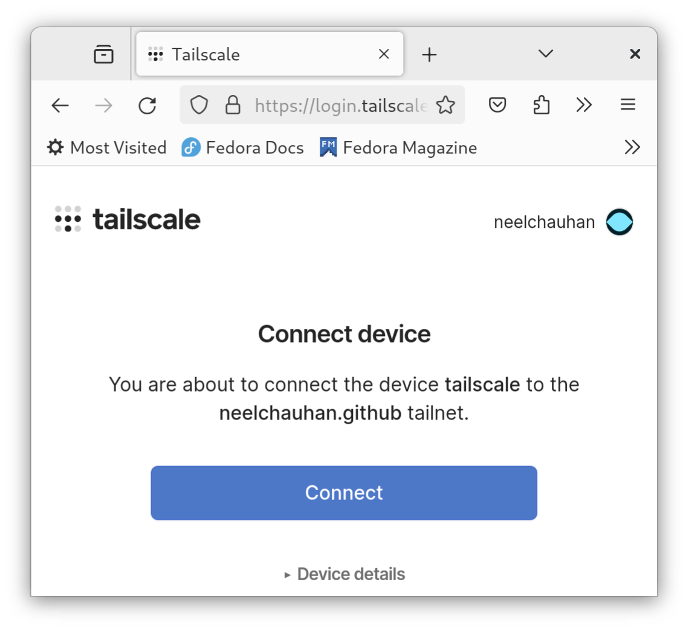
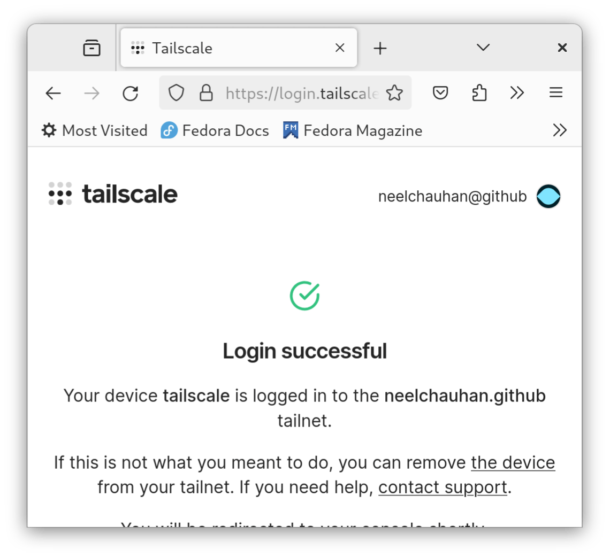

# Tailscale VPN

## Introduction

[Tailscale](https://tailscale.com/) is a zero-config, end-to-end encrypted, peer-to-peer VPN based on Wireguard. Tailscale supports all major desktop and mobile operating systems.

When compared to other VPN solutions, Tailscale does not require open TCP/IP ports and can work behind Network Address Translation or a firewall.

## Prerequisites and assumptions

The following are minimum requirements for using this procedure:

* The ability to run commands as the root user or use `sudo` to elevate privileges
* A Tailscale account

## Installing Tailscale

To install Tailscale, we first need to add its `dnf` repository (note if you are using Rocky Linux 8.x, substitute in 8):

```bash
dnf config-manager --add-repo https://pkgs.tailscale.com/stable/rhel/9/tailscale.repo
```

Then install Tailscale:

```bash
dnf install tailscale
```

## Configuring Tor

With the packages installed, you need to enable and configure Tailscale. To enable the Tailscale daemon:

```bash
systemctl enable --now tailscaled
```

Subsequently, you will authenticate with Tailscale:

```bash
tailscale up
```

You will get a URL for authentication. Visit that in a browser and log into Tailscale:


Subsequently, you will grant access to your server. Click **Connect** to do so:



When you've granted access, you will see a success dialog:



Once your server is authenticated with Tailscale, it will get a Tailscale IPv4 address:

```bash
tailscale ip -4
```

You will also get a non-routable Tailscale IPv6 address:

```bash
tailscale ip -6
```

## Conclusion

Traditionally, VPN services operated in a Client-Server model where a VPN gateway was centralized. This required manual configuration, firewall configuration and giving user accounts. Tailscale solves this problem by its peer-to-peer model combined with network-level access control.
