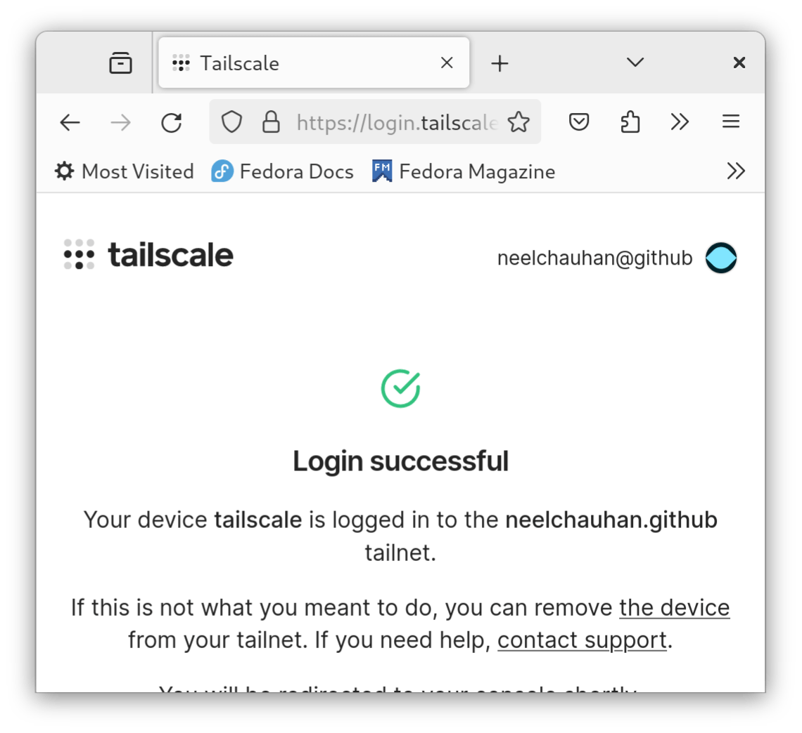

# Tailscale VPN

## Вступ

[Tailscale](https://tailscale.com/) – це однорангова VPN без налаштувань із наскрізним шифруванням на основі Wireguard. Tailscale підтримує всі основні настільні та мобільні операційні системи.

Порівняно з іншими рішеннями VPN, Tailscale не вимагає відкритих портів TCP/IP і може працювати за трансляцією мережевих адрес або брандмауером.

## Передумови та припущення

Нижче наведено мінімальні вимоги для використання цієї процедури:

- Можливість запускати команди від імені користувача root або використовувати `sudo` для підвищення привілеїв.
- Обліковий запис Tailscale

## Встановлення Tailscale

Щоб інсталювати Tailscale, спочатку потрібно додати його репозиторій `dnf` (зверніть увагу, якщо ви використовуєте Rocky Linux 8.x, замініть його на 8):

```bash
dnf config-manager --add-repo https://pkgs.tailscale.com/stable/rhel/9/tailscale.repo
```

Потім встановіть Tailscale:

```bash
dnf install tailscale
```

## Налаштування Tailscale

Після встановлення пакетів вам потрібно ввімкнути та налаштувати Tailscale. Щоб увімкнути демон Tailscale:

```bash
systemctl enable --now tailscaled
```

Згодом ви автентифікуєтеся за допомогою Tailscale:

```bash
tailscale up
```

Ви отримаєте URL-адресу для автентифікації. Відкрийте його в браузері та увійдіть у Tailscale:


Згодом вам буде надано доступ до вашого сервера. Для цього натисніть **Підключити**:


Коли ви отримаєте доступ, ви побачите відповідне діалогове вікно:



Після автентифікації вашого сервера за допомогою Tailscale він отримає IPv4-адресу Tailscale:

```bash
tailscale ip -4
```

Він також отримає IPv6-адресу Tailscale RFC 4193 (унікальна локальна адреса):

```bash
tailscale ip -6
```

## Висновок

Традиційно служби VPN працювали в моделі клієнт-сервер, де шлюз VPN був централізованим. Це вимагало налаштування вручну, налаштування брандмауера та надання облікових записів користувачам. Tailscale вирішує цю проблему за допомогою однорангової моделі в поєднанні з контролем доступу на рівні мережі.
