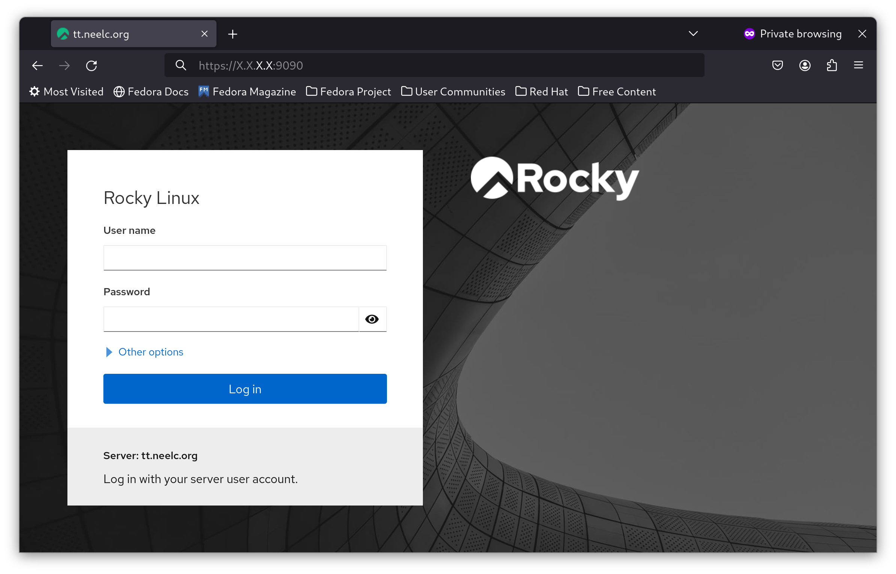
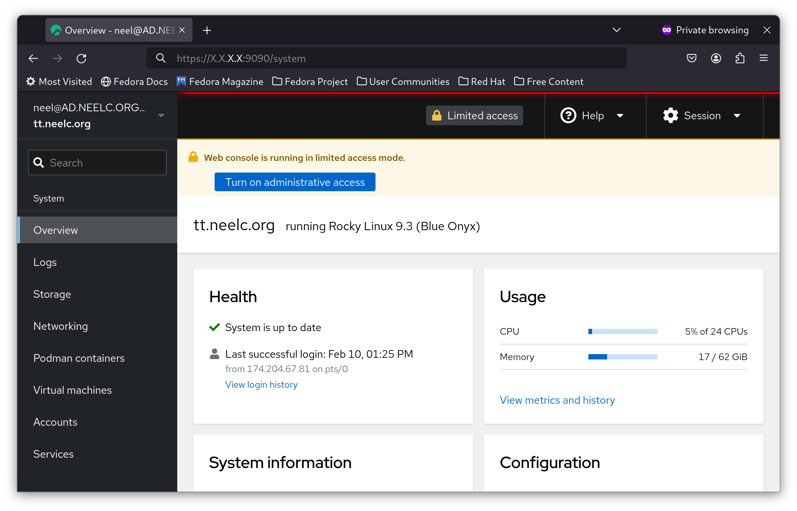
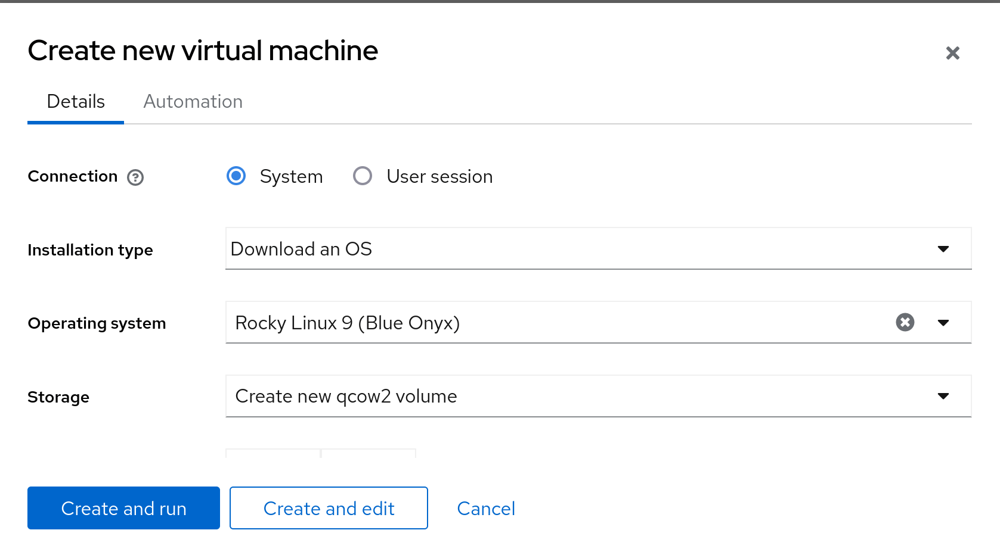

# Cockpit KVM – Tableau de Bord

## Introduction

Cockpit est un outil d'administration qui fournit un tableau de bord facile à utiliser pour gérer votre serveur. L'une des fonctionnalités de Cockpit est qu'avec un package, il peut gérer les machines virtuelles KVM à partir d'une interface Web similaire à VMware ESXi ou Proxmox.

## Prérequis

- Un serveur Rocky Linux avec virtualisation matérielle activée
- Accès aux dépôts Rocky Linux `dnf`

## Installation de Cockpit

Cockpit est fourni par défaut dans Rocky Linux. Cependant, la prise en charge de KVM n'est pas installée prête à l'emploi. Nous allons l'installer via `dnf` :

```bash
dnf install -y cockpit-machines
```

Installez également `libvirtd` :

```bash
dnf install -y libvirt
```

## Activation de `cockpit`

Pour activer à la fois la virtualisation KVM et Cockpit, activez les services `systemd` correspondants :

```bash
systemctl enable --now libvirtd cockpit.socket
```

Après avoir activé `cockpit`, ouvrez un navigateur sur **http://ip_address:9090** (remarque : remplacez **ip_address** par l'adresse IP de votre serveur) :



Connectez-vous en tant qu'utilisateur non root et vous devriez voir un dashboard similaire à celui présenté ici :



## Création de machine virtuelle

Dans ce guide, vous allez créer une machine virtuelle Rocky Linux 9 sur votre système hôte, en utilisant l'automatisation pour ajouter un nom d'utilisateur et un mot de passe root.

Pour créer une machine virtuelle dans Cockpit, cliquez d'abord sur le bouton bleu **Activer l'accès administrateur** et entrez votre mot de passe si nécessaire :


Vous êtes maintenant connecté en tant que `root` dans Cockpit. Dans la barre latérale, cliquez sur **Machines virtuelles** :


Cliquez ensuite sur **Create VM** :


Dans le menu déroulant **Operating System**, sélectionnez **Rocky Linux 9 (Blue Onyx)** :



Ensuite, cliquez sur **Automation** et renseignez les informations de connexion que vous souhaitez sur votre nouvelle VM :


Enfin, sélectionnez **Create and run**.

Dans quelques minutes, sélectionnez votre VM nouvellement créée et vous obtiendrez son adresse IP :


Connectez-vous en SSH à votre hyperviseur et connectez-vous avec SSH à l'adresse IP de Cockpit. Dans cet exemple, il s'agit de **172.20.0.103**. Vous serez connecté à votre nouveau serveur :


## Limitations

Bien que Cockpit soit idéal pour créer et gérer des machines virtuelles, il y a quelques limitations à prendre en compte :

- Vous ne pouvez pas créer une interface bridge.
- Vous ne pouvez pas créer une nouvelle image dans un pool de stockage, uniquement celui « par défaut ».

Heureusement, vous pouvez les créer en ligne de commande, puis Cockpit peut les utiliser.

## Conclusion

Cockpit est un outil précieux pour gérer un serveur Rocky Linux via une interface Web. C'est, du point de vue de l'auteur, l'outil de référence pour créer des machines virtuelles dans son laboratoire personnel. Même si les « machines cockpit » ne sont peut-être pas aussi complètes que sous ESXi ou Proxmox, elles font le travail dans 90 % des cas d'utilisation d'hyperviseur.
