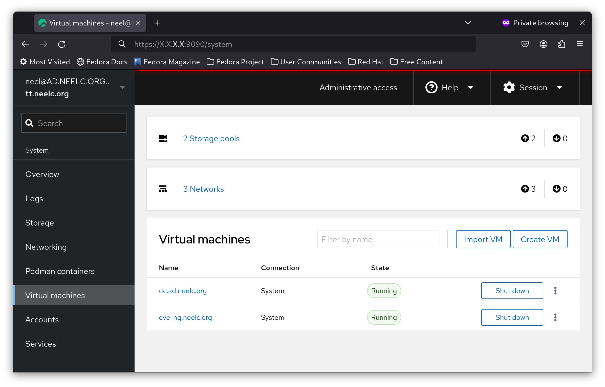

# Cockpit KVM dashboard

## Introduction

Cockpit is a server administration tool that provides an easy-to-use dashboard to manage your server. One feature of Cockpit is that with a package, it can manage KVM virtual machines from a web interface similar to VMware ESXi or Proxmox.

## Prerequisites

* A Rocky Linux server with hardware virtualization enabled
* Access to the Rocky Linux `dnf` repositories

## Installing Cockpit

Cockpit comes by default in Rocky Linux. However, KVM support does not come installed out-of-the-box. We will install it via `dnf`:

```bash
dnf install -y cockpit-machines
```

Also install `libvirtd`:

```bash
dnf install -y libvirt
```

## Enabling `cockpit`

To enable both KVM virtualization and Cockpit, enable the `systemd` services:

```bash
systemctl enable --now libvirtd cockpit
```

After you enable `cockpit`, open a browser to **http://ip_address:9090** (note: replace **ip_address** with the IP address of your server):


Login as a non-root user, and you should see a dashboard similar to the one shown here:


## Creating a virtual machine

In this guide, you will create a Rocky Linux 9 virtual machine on your host system, using automation to add a username and root password.

To create a virtual machine in Cockpit, first click on the blue **Turn on administrative access** button, and enter your password if needed:


You are now logged in as root in Cockpit. In the sidebar, click on **Virtual Machines**:



Then click on **Create VM**:


In the **Operating system** dropdown, select **Rocky Linux 9 (Blue Onyx)**:


Next, click on **Automation**, and fill in the login details you want on your new VM:


Finally, select **Create and run**.

In a few minutes, select your newly-created VM, you will have its IP address:


SSH into your hypervisor, and SSH into the IP address from Cockpit. In this example, it is **172.20.0.103**. You will be logged into your new server:


## Limitations

While Cockpit is great for creating and managing virtual machines, there are a few limitations to be aware of:

* You cannot create a bridge interface.
* You cannot create a new image in any storage pool, only the `default` one.

Fortunately, you can create these at the command line, and then Cockpit can use them.

## Conclusion

Cockpit is an invaluable tool for managing a Rocky Linux server via a web interface. It is personally the author's go-to tool for creating virtual machines in their home lab. While `cockpit-machines` may not be as full-featured as ESXi or Proxmox, it gets the job done for 90% of hypervisor use cases.
