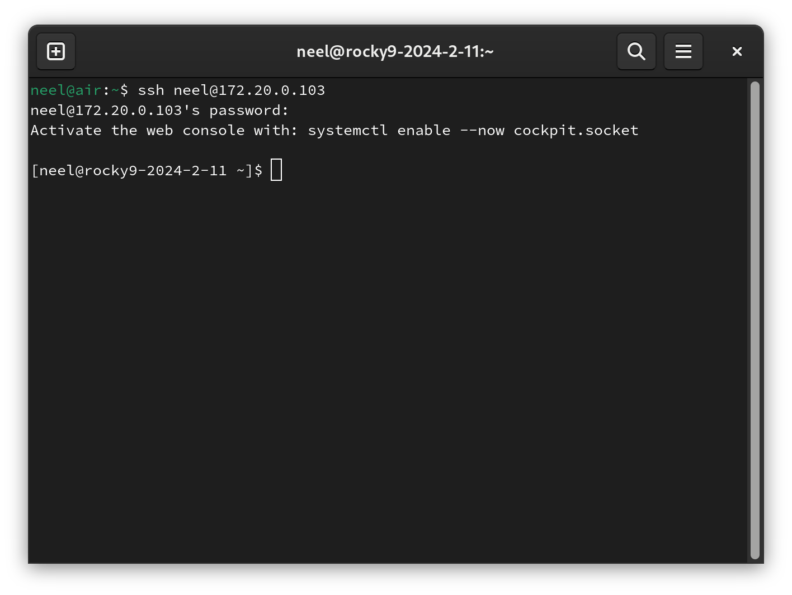

# Cockpit KVM Dashboard

## Introduction

Cockpit is a server administration tool which provides an easy-to-use dashboard to manage your server. One feature of Cockpit is that with a package, it can manage KVM virtual machines from a web interface similar to VMware ESXi or Proxmox.

## Prerequisites

* A Rocky Linux server with hardware virtualization enabled.
* Access to the Rocky Linux `dnf` repositories.

## Installing Cockpit

Cockpit comes by default in Rocky Linux, however, KVM support doesn't come installed out-of-the-box. We'll install it via `dnf`:

```
dnf install -y cockpit-machine
```

We'll also install `libvirtd`:

```
dnf install -y libvirtd
```

## Enabling Cockpit

To actually enable both KVM virtualization and Cockpit, enable the systemd services:

```
systemctl enable --now libvirtd cockpit
```

After you enabled Cockpit, open a browser to http://X.X.X.X:9090 (note: replace X.X.X.X with the IP address of your server):


Login as a non-root user and you should see a dashboard similar to the one below author's home server:


## Creating a virtual machine

In this guide, we'll create a Rocky Linux 9 virtual machine on our host system where we use automation to add a username and root password.

To create a virtual machine in Cockpit, first click on the blue **Turn on administrative access** button, and enter your password if needed:


You are now logged in as root in Cockpit. In the sidebar, click on **Virtual Machines**:


Then click on **Create VM**:


In the **Operating system** dropdown, select **Rocky Linux 9 (Blue Onyx)**:


Next, click on **Automation**, and fill in the login details you want on your new VM:


Finally, select **Create and run**.

In a few minutes, select your newly-created VM, we'll have its IP address:


SSH into your hypervisor, and subsequently SSH into the IP address from Cockpit. In our example, it's **172.20.0.103**. You'll be logged into your new server:



## Limitations

While Cockpit is great for creating and managing virtual machines, there are a few limitations to be aware of:

* You cannot create a bridge interface.
* You cannot create a new image in any storage pool, only the `default` one.

Fortunately, these can be created using the command line, and subsequently be used via Cockpit.

## Conclusion

Cockpit is an invaluable tool for managing a Rocky Linux server via a web interface. It is personally the author's go-to tool for creating virtual machines in their homelab. While `cockpit-machines` may not be as full-featured as ESXi or Proxmox, for 90% of hypervisor use cases, it gets the job done.
