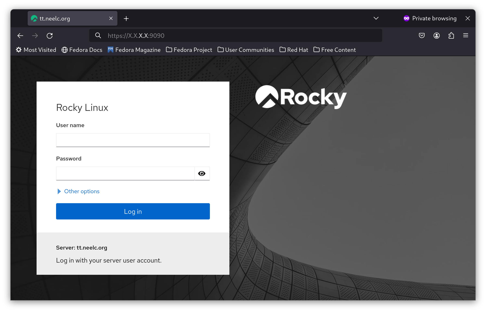
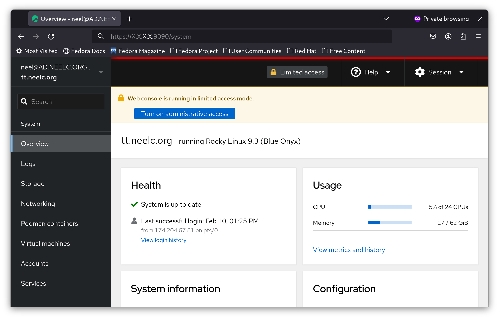
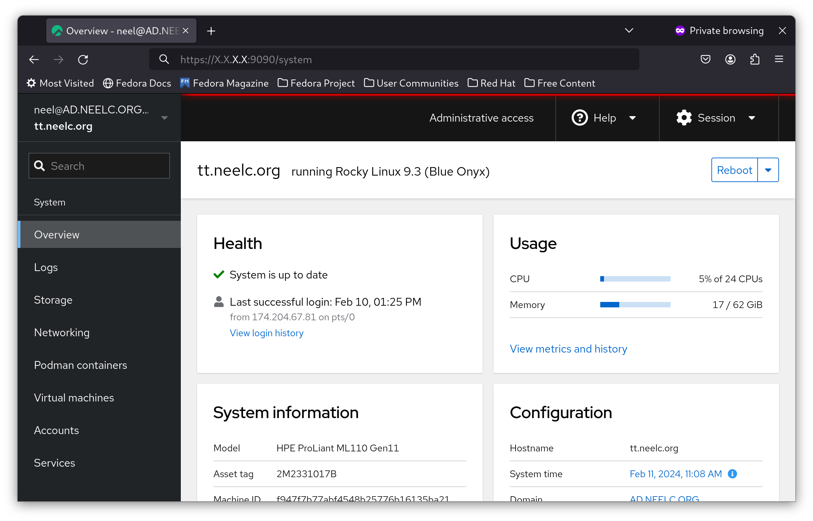
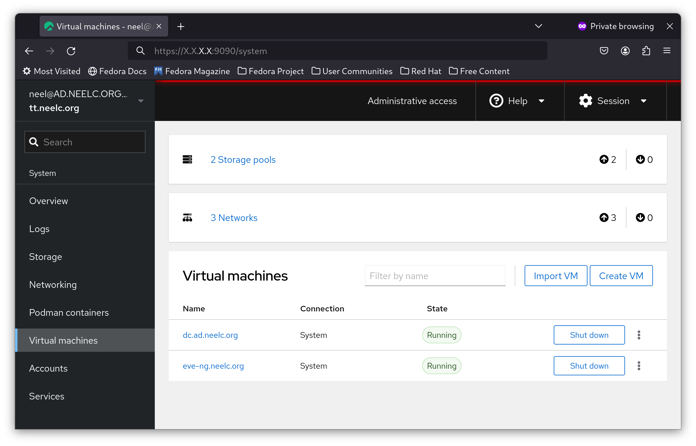
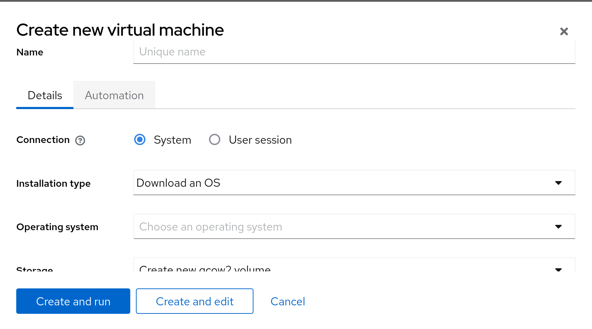
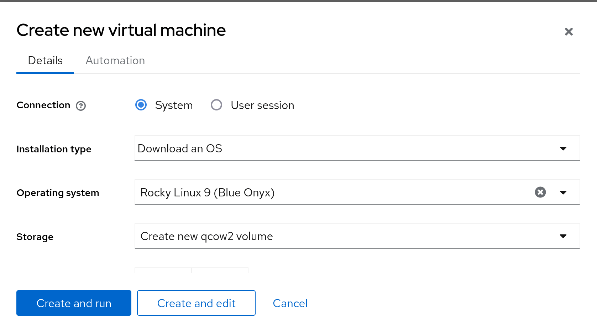
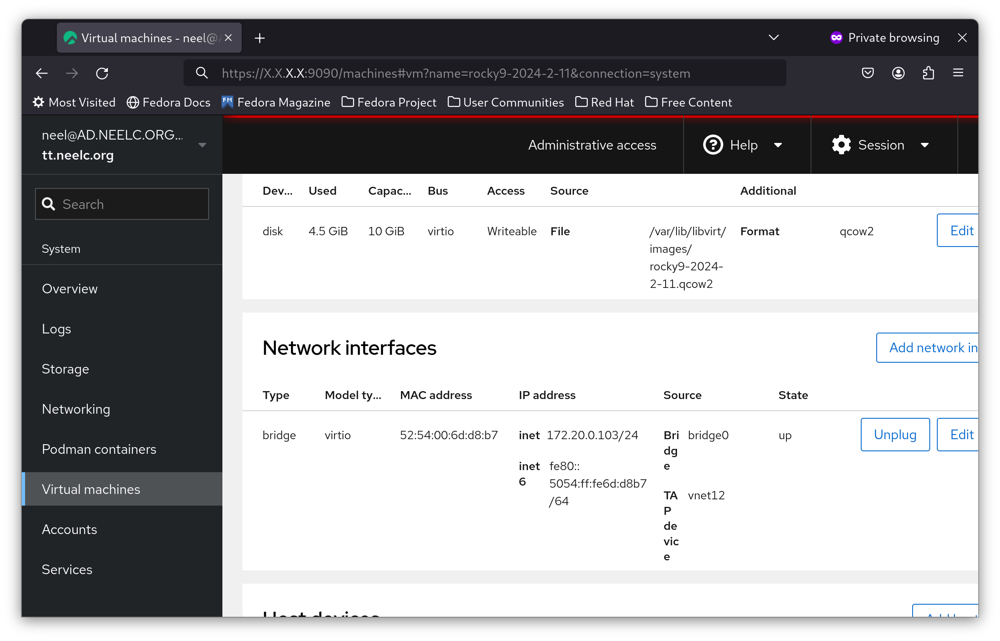

# Cockpit KVM dashboard

## Вступ

Cockpit — це інструмент адміністрування сервера, який надає просту у використанні інформаційну панель для керування сервером. Однією з особливостей Cockpit є те, що за допомогою пакета він може керувати віртуальними машинами KVM за допомогою веб-інтерфейсу, подібного до VMware ESXi або Proxmox.

## Передумови

- Сервер Rocky Linux із увімкненою апаратною віртуалізацією
- Доступ до репозиторіїв Rocky Linux `dnf`

## Встановлення Cockpit

Cockpit встановлюється за замовчуванням у Rocky Linux. Однак підтримка KVM не встановлена з коробки. Ми встановимо його через `dnf`:

```bash
dnf install -y cockpit-machines
```

Також встановіть `libvirtd`:

```bash
dnf install -y libvirt
```

## Увімкнення `cockpit`

Щоб увімкнути віртуалізацію KVM і Cockpit, увімкніть служби `systemd`:

```bash
systemctl enable --now libvirtd cockpit.socket
```

Увімкнувши `cockpit`, відкрийте браузер за адресою **http\://ip_address:9090** (примітка: замініть **ip_address** на IP-адресу вашого сервера):



Увійдіть як користувач не root, і ви побачите інформаційну панель, схожу на ту, що показана тут:



## Створення віртуальної машини

У цьому посібнику ви створите віртуальну машину Rocky Linux 9 на своїй хост-системі, використовуючи автоматизацію для додавання імені користувача та пароля root.

Щоб створити віртуальну машину в Cockpit, спочатку натисніть синю кнопку **Turn on administrative access** і за потреби введіть свій пароль:



Тепер ви ввійшли як root у Cockpit. На бічній панелі натисніть **Virtual Machines**:



Потім натисніть **Create VM**:



У спадному списку **Operating system** виберіть **Rocky Linux 9 (Blue Onyx)**:



Далі натисніть **Automation** та заповніть дані для входу, які ви хочете у своїй новій віртуальній машині:


Нарешті виберіть **Create and run**.

Через кілька хвилин виберіть свою щойно створену віртуальну машину, ви отримаєте її IP-адресу:



SSH у ваш гіпервізор і SSH в IP-адресу з Cockpit. У цьому прикладі це **172.20.0.103**. Ви увійдете на новий сервер:


## Обмеження

Хоча Cockpit чудово підходить для створення та керування віртуальними машинами, є кілька обмежень, про які слід знати:

- Ви не можете створити інтерфейс мосту.
- Ви не можете створити новий образ у будь-якому пулі сховищ, лише у «за замовчуванням».

На щастя, їх можна створити за допомогою командного рядка та використати в Cockpit.

## Висновок

Cockpit — безцінний інструмент для керування сервером Rocky Linux через веб-інтерфейс. Це інструмент автора для створення віртуальних машин у їхній домашній лабораторії. Хоча "cockpit-machines" можуть бути не такими повнофункціональними, як ESXi або Proxmox, вони виконують роботу в 90% випадків використання гіпервізора.
