# Rocky on VirtualBox&reg;

## Introduction

VirtualBox&reg; is a powerful virtualization product for both enterprise and home use. Once in a while, someone posts that they are having trouble getting Rocky Linux to run in VirtualBox&reg;. Testing and running VirtualBox&reg; going back to the release candidate, works fine. The problems people usually report often involve video.

This document is an attempt to give a step-by-step set of instructions for getting Rocky Linux up and running in VirtualBox&reg;. The machine used to build this documentation ran Linux but you can use any of the supported operating systems.

## Prerequisites

* A machine (Windows, Mac, Linux, Solaris) with available memory, and hard disk space to build and run the VirtualBox&reg; instance.
* VirtualBox&reg; installed on your machine. You can find that [here](https://www.virtualbox.org/wiki/Downloads).
* A copy of the Rocky Linux [DVD ISO](https://rockylinux.org/download) for your architecture. (x86_64 or ARM64).
* Ensure that your OS is 64 bit and that hardware virtualization is on in your BIOS.

!!! Note

    Hardware virtualization is 100% necessary in order to install a 64 bit OS. If your configuration screen shows only 32-bit options, you must stop and fix this before continuing.

## Preparing the VirtualBox&reg; configuration

Once you have VirtualBox&reg; installed, the next step is to start it. With no images installed you will get a screen that looks something like this:

 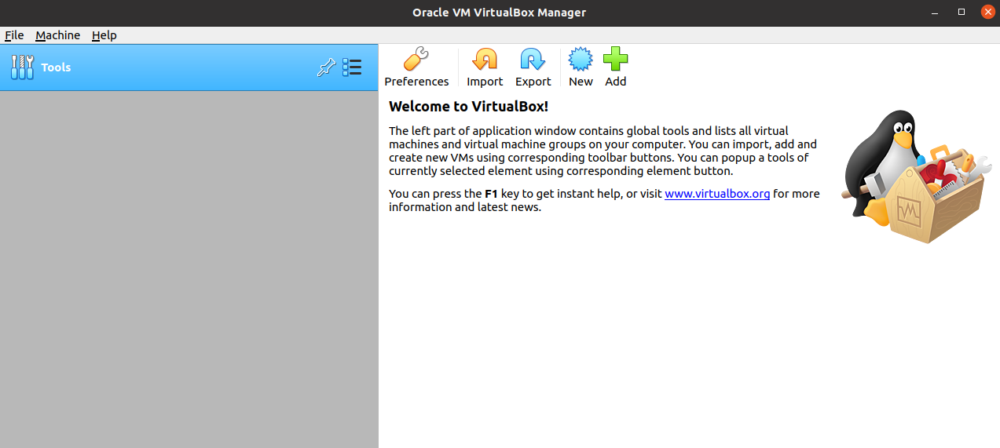

 First, you need to tell VirtualBox&reg; what your OS is going to be:

* Click "New" (saw tooth icon).
* Type a name. Example: "Rocky Linux 8.5".
* Leave the machine folder as automatically filled.
* Change the type to "Linux".
* And choose "Red Hat (64-bit)".
* Click "Next".

 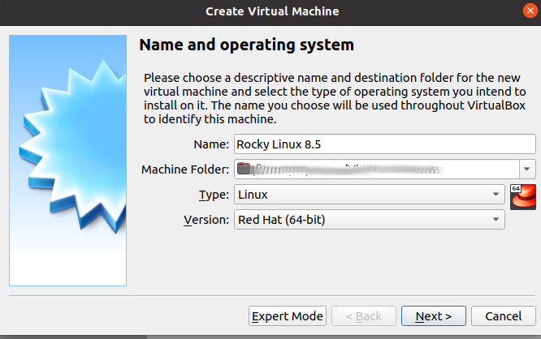

Next, you need to allocate some RAM for this machine. By default, VirtualBox&reg; will automatically fill this to 1024 MB. That will not be optimum for any modern OS, including Rocky Linux. If you have memory to spare, assign 2 to 4 GB (2048 MB or 4096 MB) — or more. VirtualBox&reg will only use this memory during virtual machine operation.

No screenshot for this one, just change the value based on your available memory. Use your best judgment.

You need to set up the hard disk size. By default, VirtualBox&reg; will automatically fill the "Create a virtual hard disk now" radio button.

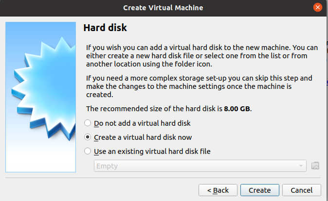

* Click ++"Create"++

You will get a dialog box for creating various virtual hard disk types. Several hard disk types are here. See the Oracle VirtualBox documentation for [more information](https://docs.oracle.com/en/virtualization/virtualbox/6.0/user/vdidetails.html) about selecting virtual hard disk types. For this document, keep the default (VDI):

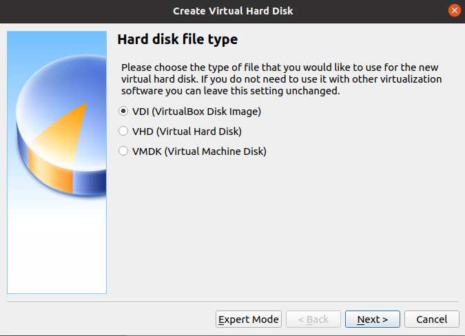

* Click ++"Next"++

The next screen deals with the storage on the physical hard disk. Two options exist. "Fixed Size" will be slower to create, faster to use, but less flexible in terms of space (if you need more space, you cannot grow past what you created).

The default option, "Dynamically Allocated", will be faster to create and slower to use, but will allow you to grow if your disk space needs to change.

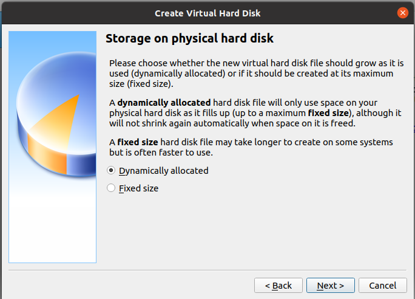

* Click ++"Next"++

VirtualBox&reg; now gives you the option to specify where you want the virtual hard disk file located. An option to expand the default 8 GB virtual hard disk space is also here. This option is good, because 8 GB of hard disk space is not enough to install any GUI install options, much less use. Set this to 20 GB (or more) depending on what you want to use the virtual machine for, and how much disk space you have available:

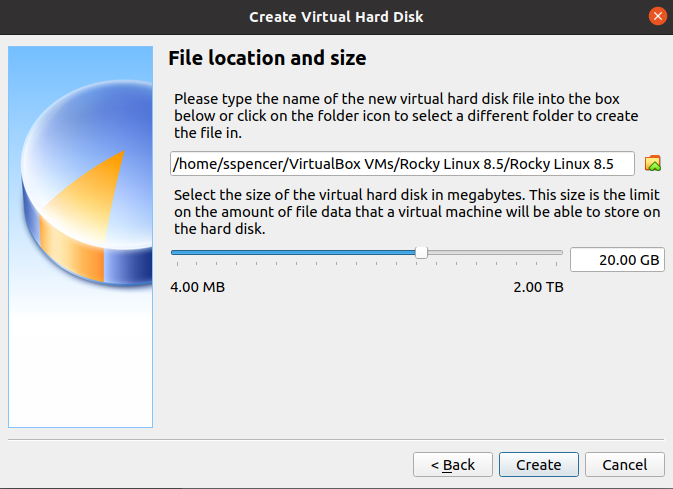

* Click ++"Create"++

You have finished the basic configuration. You will have a screen that looks something like this:

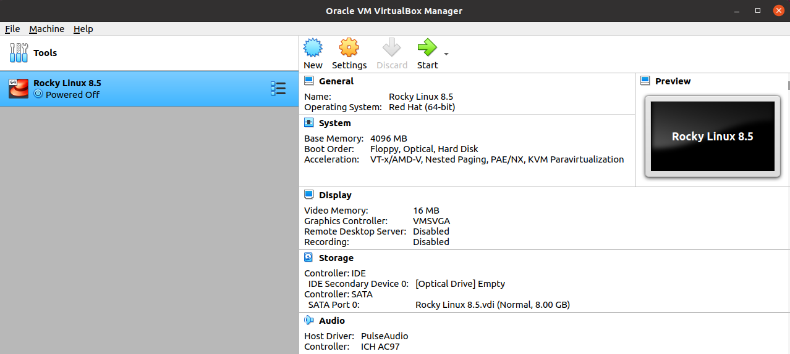

## Attaching the ISO image

The next step is to attach the ISO image that you downloaded as a virtual CD ROM device. Click on the "Settings" (gear icon) and you will get the following screen:

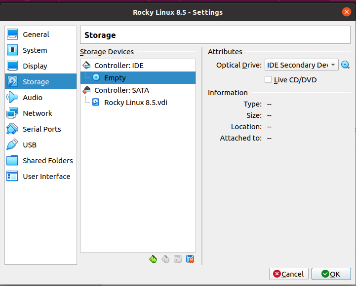

* Click the "Storage" item in the left menu.
* Under "Storage Devices" in the middle section, click the CD icon that says "Empty".
* Under "Attributes" on the right side, click the CD icon.
* Select "Choose/Create a Virtual Optical Disk".
* Click the "Add" button (plus sign icon) and navigate to where your Rocky Linux ISO image is.
* Select the ISO and click "Open".

You should now have the ISO added to the available devices like this:

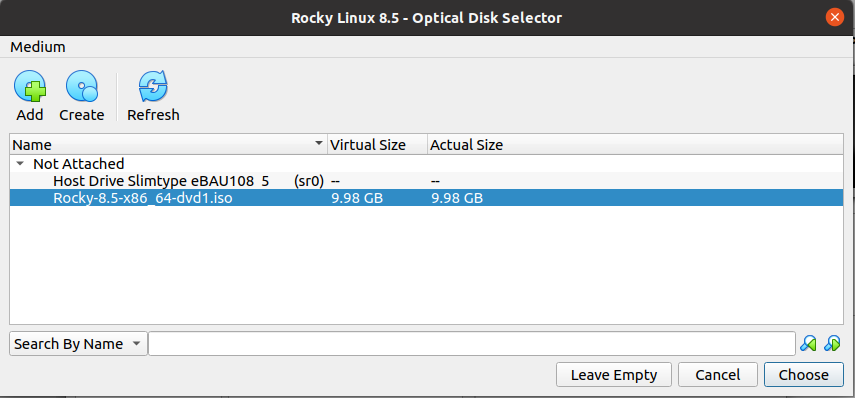

* Highlight the ISO image and then click "Choose".

The Rocky Linux ISO image now shows selected under the "Controller:IDE" in the middle section:

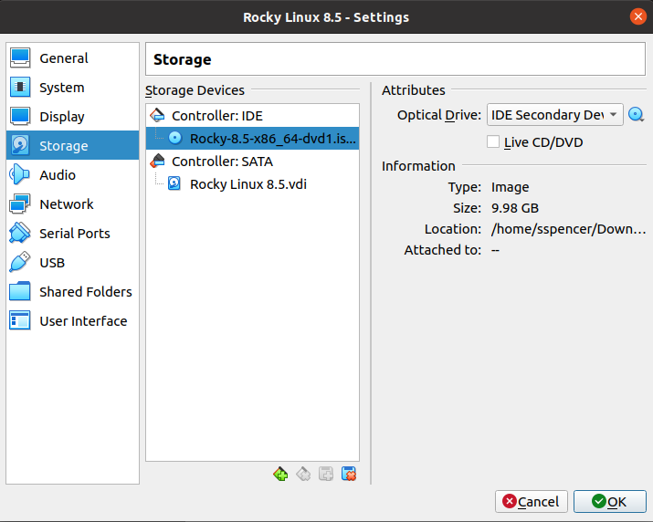

* Click ++"OK"++

### Video memory for graphical installations

VirtualBox&reg; sets up 16 MB of memory to use for video. That is fine if you plan to run a bare-bones server without a GUI, but as soon as you add graphics that is not enough. Users who keep this setting often see a hanging boot screen that never finishes, or other errors.

If running Rocky Linux with a GUI, assign enough memory to run the graphics. If your machine is a bit thin on memory, adjust this value upwards of 16 MB until things run smoothly. Your host machine's video resolution is also a factor that you need to consider.

Think carefully about what you want your Rocky Linux virtual machine to do, and try to allocate video memory that is compatible with your host machine and your other requirements. You can find more information on display settings from [Oracle's official documentation](https://docs.oracle.com/en/virtualization/virtualbox/6.0/user/settings-display.html).

If you have plenty of memory, you can set this value to the maximum of 128 MB. To fix this before you start the virtual machine, click on the "Settings" (gear icon) and you should get the same settings screen that you got when attaching our ISO image (above).

This time:

* Click on "Display" on the left side.
* In the "Screen" tab on the right side, you will notice the "Video Memory" option with the default set to 16 MB.
* Change this to the value that you want. You can adjust this upwards by coming back to this screen anytime. In this example, it is 128 MB.

!!! Tip

    There are ways to set the video memory up to 256 MB. If you need more, check out [this document](https://docs.oracle.com/en/virtualization/virtualbox/6.0/user/vboxmanage-modifyvm.html) from Oracle's official documentation.

Your screen should look something like this:

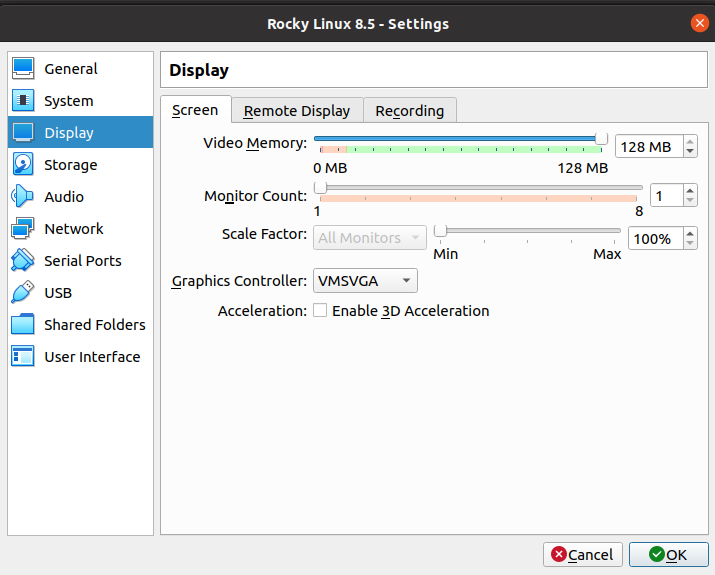

* Click ++"OK"++

## Starting the installation

You have set everything up so that you can start the installation. Note that no particular differences exist in installing Rocky Linux on a VirtualBox&reg; machine compared to stand-alone hardware. The installation steps are the same.

Now that you have everything prepared for the install, you need to click "Start" (green right-arrow icon) to start installing Rocky. Once you click past the language selection screen, your next screen is the "Installation Summary." You need to set any of these items that pertain to you, but the following are musts:

* Time & Date
* Software Selection (if you want something besides the default "Server with GUI")
* Installation Destination
* Network & Hostname
* User Settings

If you are unsure of any of these settings, see the document for [Installing Rocky](../installation.md).

Once you have finished the installation, you should have a running VirtualBox&reg; instance of Rocky Linux.

After installing and rebooting you will get a EULA license agreement screen that you need to agree to. When you have clicked "Finish Configuration", you should get either a graphical (if you chose a GUI option) or command line login. The author chose the default "Server with GUI" for demo purposes:

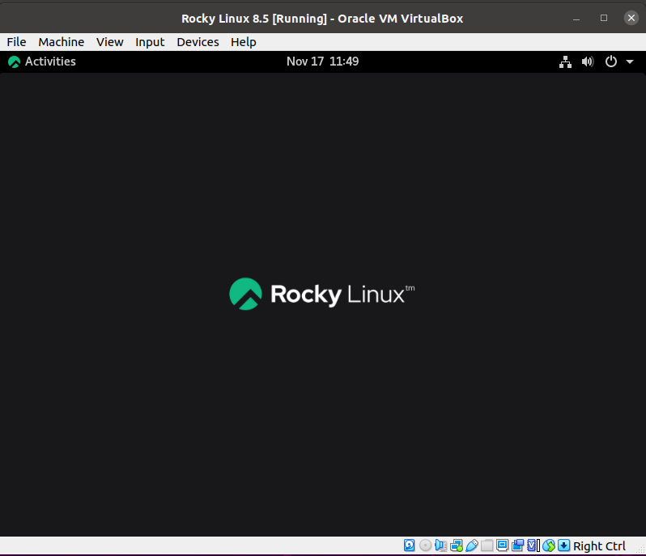

## Other information

This document does not intend to make you an expert on all of the features that VirtualBox&reg; provides. For information on how to do specific things please check the [official documentation](https://docs.oracle.com/en/virtualization/virtualbox/6.0/user/).

!!! tip "Advanced Tip"

    VirtualBox&reg; offers extensive options at the command line using `VBoxManage`. While this document does not cover the use of `VBoxManage`, Oracle's official documentation provides [plenty of details](https://docs.oracle.com/en/virtualization/virtualbox/6.0/user/vboxmanage-intro.html) if you would like to research this further.

## Conclusion

It is easy to create, install, and run a VirtualBox&reg; Rocky Linux machine. While far from an exhaustive guide, following the steps above should get you a running Rocky Linux install. If you use VirtualBox&reg; and have a specific configuration that you want to share, the author invites you to submit new sections to this document.
