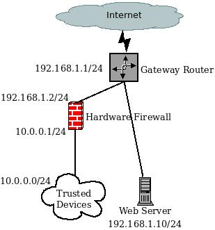

# Apache hardened web server

## Prerequisites and assumptions

* A Rocky Linux web server running Apache
* A heavy comfort level with issuing commands from the command-line, viewing logs, and other general systems administrator duties
* A comfort level with a command line editor (our examples use `vi`, which will usually run the `vim` editor, but you can substitute your favorite editor)
* Assumes `firewalld` for the packet filter firewall
* Assumes the use of a gateway hardware firewall that our trusted devices will sit behind
* Assumes a public IP address directly applied to the web server. (Using a private IP address for our examples here)

## Introduction

Whether you are hosting many websites for customers or a single important website for your business, hardening your web server will give you peace of mind at the expense of a little more up-front work for the administrator.

With many web sites uploaded by your customers, one of them will probably upload a Content Management System (CMS) with the possibility of vulnerabilities. Most customers focus on ease of use, not security, and what happens is that updating their own CMS becomes a process that falls out of their priority list altogether.


While notifying customers of vulnerabilities in their CMS is possible for a company with a large IT staff, this might not be realistic for a small IT team. The best defense is a hardened web server.

Web server hardening can take many forms, including any or all of the tools here and possibly others not defined.

You might use a couple of these tools and not the others. For clarity and readability this document splits into separate documents for each tool. The exception will be the packet-based firewall (`firewalld`) in this main document.

* A good packet filter firewall based on ports (iptables, firewalld, or hardware firewall - using `firewalld` for our examples) [`firewalld` procedure](#iptablesstart)
* A Host-based Intrusion Detection System (HIDS), in this case _ossec-hids_ [Apache Hardened Web Server - ossec-hids](ossec-hids.md)
* A Web-based Application Firewall (WAF), with `mod_security` rules [Apache Hardened Web Server - mod_security](modsecurity.md)
* Rootkit Hunter (`rkhunter`): A scan tool that checks against Linux malware [Apache Hardened Web Server - rkhunter](rkhunter.md)
* Database security (using `mariadb-server` here) [MariaDB Database Server](../../database/database_mariadb-server.md)
* A secure FTP or SFTP server (using `vsftpd` here) [Secure FTP Server - vsftpd](../../file_sharing/secure_ftp_server_vsftpd.md) You can also use [_sftp_ and SSH lock down procedures here](../../file_sharing/sftp.md)

This procedure does not replace the [Apache Web Server Multiple Site Setup](../apache-sites-enabled.md), it adds these security elements to it. If you have not read it, take some time to review it before proceeding.

## Other considerations

Some of the tools outlined here have free and fee-based options. You might want to consider the fee-based versions depending on your needs or support requirements. Researching what is out there and making a decision after weighing all of your options is the best policy.

Purchasing a hardware appliance for many of these options is also possible. If you prefer not to hassle with installing and maintaining your own system, options other than those outlined here are available.

This document uses a `firewalld` firewall. `firewalld` guides are available. One that allows someone with knowledge of `iptables` to [transfer what they know to `firewalld` here](../../security/firewalld.md), and one that is a more [dedicated to beginners here](../../security/firewalld-beginners.md). You might want to review one of these procedures before you start.

You need to tune all of these tools for your systems. Accomplishing this requires careful monitoring of logs, and reported web experiences by your customers. In addition, you will find that there will be ongoing tuning required.

These examples use a private IP address to simulate a public one, but you might carry out the same thing with a one-to-one NAT on the hardware firewall and connecting the web server to that hardware firewall, rather than to the gateway router, with a private IP address.

Explaining that requires digging into the hardware firewall shown, which is outside the scope of this document.

## Conventions

* **IP Addresses:** simulating the public IP address here with a private block: 192.168.1.0/24, and using the LAN IP address block 10.0.0.0/24. Routing these IP blocks over the Internet impossible because they are for private use, but simulating public IP block is impossible without the use of a real IP address assigned to some company or organization. Just remember that for our purposes, the 192.168.1.0/24 block is the "public" IP block and the 10.0.0.0/24 is the "private" IP block.

* **Hardware Firewall:** This is the firewall that controls access to your server room devices from your trusted network. This is not the same as your packed based firewall, though it might be another instance of `firewalld` running on another machine. This device allows ICMP (ping) and SSH (secure shell) to our trusted devices. Defining this device is outside of the scope of this document. The author has used [PfSense](https://www.pfsense.org/) and [OPNSense](https://opnsense.org/) and installed on dedicated hardware for this device with great success. This device will have two IP addresses assigned to it. One that connects to the Internet router's simulated public IP (192.168.1.2) and one that connects to our local area network, 10.0.0.1.
* **Internet router IP:** simulating this with 192.168.1.1/24
* **Web server IP:** This is the "public" IP address assigned to our web server. Again, simulating this with the private IP address 192.168.1.10/24



The diagram shows our general layout. The `firewalld` packet-based firewall runs on the web server.

## Install packages

Each individual package section has the needed installation files and any configuration procedure listed.

## <a name="iptablesstart"></a>Configuring `firewalld` 

```
firewall-cmd --zone=trusted --add-source=192.168.1.2 --permanent
firewall-cmd --zone=trusted --add-service=ssh --permanent
firewall-cmd --zone=public --remove-service=ssh --permanent
firewall-cmd --zone=public --add-service=dns --permanent
firewall-cmd --zone=public --add-service=http --add-service=https --permanent
firewall-cmd --zone=public --add-service=ftp --permanent
firewall-cmd --zone=public --add-port=20/tcp --permanent
firewall-cmd --zone=public --add-port=7000-7500/tcp --permanent
firewall-cmd --reload
```
Here is what is happening:

* set our trusted zone to the IP address of the hardware firewall 
* accept SSH (port 22) from our trusted network, the devices behind the hardware firewall (just one IP address)
* accept DNS from the public zone (limiting this further is possible by specifying the server IP addresses or local DNS servers, if you have them)
* accept web traffic from anywhere over port 80 and 443.
* accept standard FTP (ports 20-21) and the passive ports needed to exchange two-way communications in FTP (7000-7500). These ports can be arbitrarily changed to other ports based on your ftp server configuration.
    
    !!! note

        Using SFTP is the best method these days. You can find out how to [securely use SFTP from this document](../../file_sharing/sftp.md).

* finally reload the firewall

## Conclusion

Many ways exist to harden an Apache web server to make it more secure. Each operates independently of the other, making installing and selecting what you want up to you.

Each requires some configuration and tuning to meet your specific needs. Because web services are constantly under attack by unscrupulous actors, implementing at least some of these will help an administrator sleep at night.
