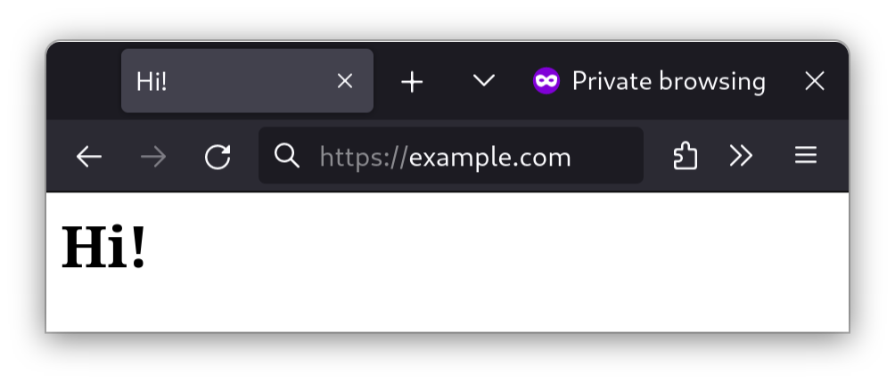

## Introduzione

_Caddy_ è un server web progettato per le moderne applicazioni web. Caddy è semplice da configurare e dispone della funzione automatica Let's Encrypt, quindi i tuoi siti web sono sempre protetti per impostazione predefinita. È il server web preferito dall'autore.

Ecco una breve panoramica delle caratteristiche di Caddy:

- Un server web di base
- Un proxy inverso per indirizzare il traffico verso più siti
- Moduli per molti carichi di lavoro, inclusi TCP, SSH e altro ancora
- Un bilanciatore di carico integrato per la gestione del traffico verso più siti web
- Supporto integrato e automatizzato per Let's Encrypt
- Un'API per riconfigurare il server a livello di programmazione
- Supporto a PHP FastCGI
- E IPv6

## Prerequisiti e presupposti

Sono necessari:

- Una macchina o un server Rocky Linux connesso a internet.
- Una familiarità di base con la riga di comando.
- La possibilità di eseguire comandi come utente root o con `sudo`.
- Un editor di testo a scelta, sia grafico che basato su riga di comando. Per questo tutorial, l'autore utilizza `vim`.
- Un nome di dominio o altro nome host che punta all'indirizzo IP pubblico del tuo server.

## Installazione di Caddy

Innanzitutto, assicuratevi che il vostro computer disponga degli ultimi aggiornamenti:

```bash
sudo dnf update
```

Quindi, installare il repository software `epel-release`:

```bash
sudo dnf install -y epel-release
```

Se si utilizza Rocky Linux 10, abilitare il repository Copr:

```bash
dnf copr enable @caddy/caddy
```

Quindi, installare il server web `caddy`:

```bash
sudo dnf install -y caddy
```

## Configurare il firewall

Se si tenta di visualizzare una pagina Web con l'indirizzo IP o il nome di dominio della propria macchina da un altro computer, probabilmente non si otterrà nulla. Questo sarà il caso se avete un firewall attivo e funzionante.

Per aprire le porte necessarie a "vedere" le pagine web, si utilizzerà il firewall integrato di Rocky Linux, `firewalld`. Il comando di `firewalld` per farlo è `firewall-cmd`.

Per aprire i servizi `http` e `https`, i servizi che gestiscono le pagine web, eseguire:

```bash
sudo firewall-cmd --permanent --zone=public --add-service=http
sudo firewall-cmd --permanent --zone=public --add-service=https
```

Per capire meglio:

- L'opzione `--permanent` indica al firewall di applicare questa configurazione a ogni riavvio del firewall e al riavvio del server.
- `--zone=public` indica al firewall di consentire le connessioni in entrata a questa porta da parte di tutti.
- Infine, `--add-service=http` e `--add-service=https` indicano a `firewalld` di passare tutto il traffico HTTP e HTTPS al server.

Queste configurazioni non avranno effetto finché non si forzerà il problema. Per farlo, occorre indicare a `firewalld` di ricaricare le sue configurazioni:

```bash
sudo firewall-cmd --reload
```

!!! Note "Nota"

````
Ora, c'è una piccolissima possibilità che questo non funzioni. In questi rari casi, fate in modo che `firewalld` esegua i vostri ordini con il vecchio spegnimento-e-riaccensione.

```bash
systemctl restart firewalld
```
````

Per garantire l'autorizzazione delle porte, eseguire `firewall-cmd --list-all`. Un firewall correttamente configurato avrà un aspetto simile a questo:

```bash
public (active)
  target: default
  icmp-block-inversion: no
  interfaces: enp9s0
  sources:
  services: cockpit dhcpv6-client ssh http https
  ports:
  protocols:
  forward: no
  masquerade: no
  forward-ports:
  source-ports:
  icmp-blocks:
  rich rules:
```

Dovrebbe essere tutto ciò di cui avete bisogno, a livello di firewall.

## Configurare Caddy

A differenza dei server web tradizionali come Apache e Nginx, il formato di configurazione di Caddy è molto più semplice. Sono finiti i tempi in cui si dovevano configurare i dettagli, come il modello di threading del server web o i certificati SSL, a meno che non si volesse farlo.

Per modificare il file di configurazione di Caddy:

```bash
sudo vim /etc/caddy/Caddyfile
```

Una configurazione statica minima del server web può essere simile a questa:

```bash
example.com {
    root * /usr/share/caddy/example.com
    file_server
}
```

Sostituire "example.com" con un nome di host che punta al proprio server.

È inoltre necessario aggiungere un sito web nella cartella della directory "root" di Caddy. Per semplicità, aggiungete un sito web statico di una pagina:

```bash
mkdir -p /usr/share/caddy/example.com
echo "<h1>Hi!</h1>" >> /usr/share/caddy/example.com/index.html
```

Successivamente, attivare il servizio systemd di Caddy:

```bash
sudo systemctl enable --now caddy
```

Entro un minuto, Caddy otterrà i certificati SSL da Let's Encrypt. A questo punto, è possibile visualizzare il sito web appena impostato in un browser:



Dovrebbe avere un lucchetto SSL che dovrebbe funzionare in ogni browser moderno, e non solo, anche una valutazione A+ al [Qualys SSL Server Test](https://www.ssllabs.com/ssltest/).

## Opzionale: PHP FastCGI

Come accennato in precedenza, Caddy supporta il supporto FastCGI per PHP. La buona notizia è che, a differenza di Apache e Nginx, Caddy gestisce automaticamente le estensioni dei file PHP.

Per installare PHP, aggiungi prima il repository Remi (nota: se utilizzi Rocky Linux 8.x o 9.x, sostituisci 8 o 9 accanto a "release-" qui sotto):

```bash
sudo dnf install https://rpms.remirepo.net/enterprise/remi-release-10.rpm
```

Successivamente, occorre installare PHP (nota: se si utilizza un'altra versione di PHP, sostituire la versione desiderata con php83):

```bash
sudo dnf install -y php85-php-fpm
```

Se sono necessari altri moduli PHP (ad esempio, GD), aggiungerli al comando precedente.

Quindi, occorre configurare PHP per l'ascolto su un socket TCP:

```bash
sudo vim /etc/opt/remi/php85/php-fpm.d/www.conf
```

Quindi, trovare la riga:

```bash
listen = /var/opt/remi/php85/run/php-fpm/www.sock
```

Sostituirla con questa:

```bash
listen = 127.0.0.1:9000
```

Ora possiamo abilitare e avviare php-fpm:

```bash
sudo systemctl enable --now php85-php-fpm
```

Quindi salva ed esci dal file `www.conf` e apri il file Caddyfile:

```bash
sudo vim /etc/caddy/Caddyfile
```

Passa al blocco server creato in precedenza:

```bash
example.com {
    root * /usr/share/caddy/example.com
    file_server
}
```

Aggiungere la seguente riga dopo la riga "file_server":

```bash
    php_fastcgi 127.0.0.1:9000
```

Il blocco server abilitato per PHP avrà questo aspetto:

```bash
example.com {
    root * /usr/share/caddy/example.com
    file_server
    php_fastcgi 127.0.0.1:9000
}
```

Quindi salva ed esci dal file Caddyfile e riavvia Caddy:

```bash
sudo systemctl restart caddy
```

Per verificare se PHP funziona, aggiungiamo un semplice file PHP:

```bash
echo "<?php phpinfo(); ?>" >> /usr/share/caddy/rockyexample.duckdns.org/phpinfo.php
```

Apri il browser sul file che hai creato e dovresti visualizzare le informazioni PHP:


## Conclusioni

L'installazione e la configurazione di base di Caddy sono incredibilmente semplici. Sono finiti i tempi in cui si passavano ore a configurare Apache. Sì, Nginx è sicuramente un miglioramento, ma manca ancora di funzionalità moderne ma essenziali come Let's Encrypt e il supporto Kubernetes ingress che Caddy integra, mentre su Nginx (e Apache) è necessario aggiungerle separatamente.

Utilizzo Caddy dal 2019 come server web di riferimento ed è semplicemente fantastico. In effetti, ogni volta che ho a che fare con Apache, Nginx o IIS, è quasi come prendere una macchina del tempo e tornare al 2010 o prima.
