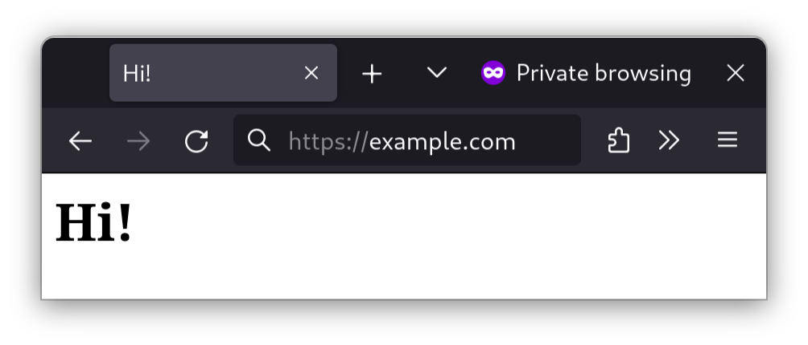
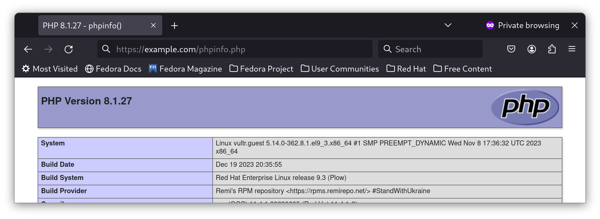

# How to install the latest Caddy web server on Rocky Linux

## Introduction

*Caddy* is a web server designed for modern web applications. Caddy is simple to configure and has automatic Let's Encrypt, so your websites are always secure by default. It is the author's go-to web server.

Here is a short rundown of Caddy's features:

* A basic web server
* A reverse proxy for directing traffic to multiple sites
* Modules for many workloads, including TCP, SSH, and more
* A built-in load balancer for managing traffic to multiple websites
* Built-in, automated Let's Encrypt support
* An API to re-configure the server programmatically
* PHP FastCGI support
* And IPv6

## Prerequisites and assumptions

You will need:

* An internet-connected Rocky Linux machine or server.
* A basic familiarity with the command line.
* The ability to run commands as the root user or with `sudo`.
* A text editor of your choice, whether graphical or command-line based. For this tutorial, the author uses `vim`.
* A domain name or other hostname pointed to your server's public IP address.

## Installing Caddy

First, ensure your machine has the latest updates:

```bash
sudo dnf update
```

Then, install the `epel-release` software repository:

```bash
sudo dnf install -y epel-release
```

Next, install the `caddy` web server:

```bash
sudo dnf install -y caddy
```

## Configuring the firewall

If you try to view a web page at your machine’s IP address or domain name from another computer, you will probably get nothing. That will be the case if you have a firewall up and running.

To open up the necessary ports to actually "see" your web pages, you will use Rocky Linux's build-in firewall, `firewalld`. The `firewalld` command for doing this is `firewall-cmd`.

To open up the `http` and `https` services, the services that handles web pages, run:

```bash
sudo firewall-cmd --permanent --zone=public --add-service=http
sudo firewall-cmd --permanent --zone=public --add-service=https
```

Breaking this down:

* The `-–permanent` flag tells the firewall to apply this configuration every time the firewall restarts, and when the server restarts.
* `–-zone=public` tells the firewall to allow incoming connections to this port from everyone.
* Lastly, `--add-service=http` and `--add-service=https` tells `firewalld` to pass all HTTP and HTTPS traffic to the server.

These configurations won’t take effect until you force the issue. To do that, tell `firewalld` to reload its configurations:

```bash
sudo firewall-cmd --reload
```

!!! Note

    Now, there is a very small chance that this will not work. In those rare cases, make `firewalld` do your bidding with the old turn-it-off-and-turn-it-on-again.

    ```bash
    systemctl restart firewalld
    ```

To ensure allowance of the ports, run `firewall-cmd --list-all`. A properly-configured firewall will look a bit like this:

```bash
public (active)
  target: default
  icmp-block-inversion: no
  interfaces: enp9s0
  sources:
  services: cockpit dhcpv6-client ssh http https
  ports:
  protocols:
  forward: no
  masquerade: no
  forward-ports:
  source-ports:
  icmp-blocks:
  rich rules:
```

That should be everything you need, firewall-wise.

## Configuring Caddy

Unlike traditional web servers like Apache and Nginx, Caddy's configuration format is significantly simpler. Gone are the days where you had to configure the nitty-gritty, like your web server's threading model or SSL certificates, unless you want to.

To edit the Caddy configuration file:

```bash
vim /etc/caddy/Caddyfile
```

A minimum static web server configuration can be similar to this:

```bash
example.com {
    root * /usr/share/caddy/example.com
    file_server
}
```

Replace "example.com" with a hostname pointed to your server.

You must also add a website to the folder in Caddy's "root" directory. For simplicity's sake, add a one-page static website:

```bash
mkdir -p /usr/share/caddy/example.com
echo "<h1>Hi!</h1>" >> /usr/share/caddy/example.com/index.html
```

After that, enable Caddy's systemd service:

```bash
systemctl enable --now caddy
```

Within a minute, Caddy will obtain SSL certificates from Let's Encrypt. Then, you can view the website you just set up in a browser:



It should have an SSL padlock that should work in every modern browser, and not just that, but also an A+ rating at [Qualys SSL Server Test](https://www.ssllabs.com/ssltest/).

## Optional: PHP FastCGI

As mentioned earlier, Caddy supports FastCGI support for PHP. The good news is that unlike Apache and Nginx, Caddy handles PHP file extensions automatically.

To install PHP, first add the Remi repository (note: if you are running Rocky Linux 8.x, substitute in 8 next to the "release-" below):

```bash
dnf install https://rpms.remirepo.net/enterprise/remi-release-9.rpm
```

Next, we need to install PHP (note: if you are using another version of PHP, substitute your desired version for php81):

```bash
dnf install -y php81-php-fpm
```

If you require additional PHP modules (e.g., GD), add them to the above command.

Then, we need to configure PHP to listen on a TCP socket:

```bash
vim /etc/opt/remi/php81/php-fpm.d/www.conf
```

Next, find the line:

```bash
listen = /var/opt/remi/php81/run/php-fpm/www.sock
```

Replace it with this:

```bash
listen = 127.0.0.1:9000
```

Then save and exit the www.conf file, and open the Caddyfile:

```bash
vim /etc/caddy/Caddyfile
```

Navigate to the server block we created earlier:

```bash
example.com {
    root * /usr/share/caddy/example.com
    file_server
}
```

Add the following line after the "file_server" line:

```bash
    php_fastcgi 127.0.0.1:9000
```

Your PHP-enabled server block will look like this:

```bash
example.com {
    root * /usr/share/caddy/example.com
    file_server
    php_fastcgi 127.0.0.1:9000
}
```

Then save and exit the Caddyfile, and restart Caddy:

```bash
systemctl restart caddy
```

To test if PHP works, let's add a simple PHP file:

```bash
echo "<?php phpinfo(); ?>" >> /usr/share/caddy/rockyexample.duckdns.org/phpinfo.php
```

Open your browser to the file you created, and you should be presented with PHP information:



## Conclusion

The basic installation and configuration of Caddy is incredibly easy. Gone are the days when you spent hours configuring Apache. Yes, Nginx is certainly an improvement, but it still lacks modern but essential features such as Let's Encrypt and Kubernetes ingress support that Caddy builds in, whereas on Nginx (and Apache) you must add them separately.

I've been using Caddy since 2019 as my go-to web server, and it's just so good. In fact, whenever I deal with Apache, Nginx or IIS, it's almost like taking a time machine back to 2010 or earlier.
