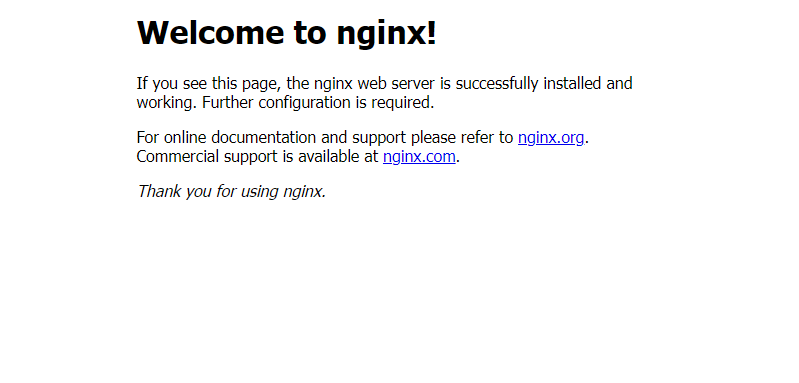

# Come installare il più recente Nginx su Rocky Linux

## Introduzione

*Nginx* è un server web progettato per essere veloce, efficiente e compatibile con qualsiasi cosa si possa immaginare. Personalmente lo uso un po' e — una volta che ci si prende la mano — è in realtà abbastanza facile da impostare e configurare. Ecco un breve riassunto delle caratteristiche principali; Nginx è/ha/può essere:

Ecco una breve panoramica dei modi in cui Nginx si distingue e delle sue caratteristiche:

* Un server web di base
* Un reverse proxy per dirigere il traffico verso più siti
* Un bilanciatore di carico integrato per gestire il traffico verso più siti web
* Caching dei file incorporato per la velocità
* WebSockets
* Supporto FastCGI
* E, naturalmente, IPv6

È fantastico! Quindi basta `sudo dnf install nginx`, giusto? Beh, non esattamente. È sufficiente abilitare prima il modulo giusto, per attivare il ramo "mainline", in modo da avere l'ultima versione di Nginx.

!!! Note "Nota"

    C'è un altro ramo chiamato "stable", ma in realtà è un po' superato per la maggior parte dei casi d'uso. Non riceverà nuove caratteristiche man mano che vengono sviluppate, e solo le correzioni di bug e gli aggiornamenti di sicurezza più urgenti.
    
    Gli sviluppatori di Nginx considerano il ramo "mainline" ben testato e stabile per l'uso generale, *in quanto ottiene tutte le nuove funzionalità, tutte le correzioni di sicurezza e tutte le correzioni di bug.*
    
    Le uniche ragioni per usare il ramo "stable" sono:
    * vuoi *veramente* essere sicuro che le nuove caratteristiche e le correzioni importanti non interrompano il codice di terze parti o il tuo codice personalizzato.
    * Volete attenervi solo ai repository software di Rocky Linux.
    
    Un tutorial alla fine di questa guida spiegherà come attivare e installare il ramo " stable" con il minimo sforzo.

## Prerequisiti e Presupposti

Avrai bisogno di:

* Una macchina o un server Rocky Linux connesso a internet.
* Una familiarità di base con la riga di comando.
* La capacità di eseguire comandi come root, sia come utente root che con `sudo`.
* Un editor di testo a tua scelta, sia grafico che a riga di comando. Per questo tutorial, sto usando `nano`.

## Installazione del repository & Attivazione del modulo

Per prima cosa, assicuratevi che la vostra macchina sia aggiornata:

```bash
sudo dnf update
```

Quindi, installare il repository software `epel-release`:

```bash
sudo dnf install epel-release
```

Quindi abilita il modulo giusto per l'ultima versione di `nginx`. Questo modulo sarà sempre chiamato `nginx:manline`, quindi basta abilitarlo con `dnf` in questo modo:

```bash
sudo dnf module enable nginx:mainline
```

Ti darà il solito "Sei sicuro di volerlo fare? , ma questa non è la seconda edizione D&D con Gary Gygax stesso, quindi sì. Certo che lo fai. Premi ++y++ per confermare.

## Installare ed eseguire Nginx

Poi, installa il pacchetto `nginx` dal repository aggiunto in precedenza:

```bash
sudo dnf install nginx
```

Il terminale ti chiederà se ti va bene installare la chiave GPG del repository. Ne hai bisogno, quindi scegli `Y` per sì.

Una volta che l'installazione è finita, avviate il servizio `nginx` e abilitatelo per avviarsi automaticamente al riavvio tutto in una volta con:

```bash
sudo systemctl enable --now nginx
```

Per verificare che l'ultima versione di *Nginx* sia stata installata, eseguire:

```bash
nginx -v
```

Da lì, si potrebbe semplicemente iniziare ad inserire i file HTML nella directory `/usr/share/nginx/html/` per costruire un semplice sito web statico. Il file di configurazione per il sito web/host virtuale predefinito è chiamato “nginx.conf” ed è in `/etc/nginx/`. Contiene anche una serie di altre configurazioni server Nginx di base, quindi anche se si sceglie di spostare la configurazione del sito web reale in un altro file, si dovrebbe probabilmente lasciare il resto di "nginx. onf" intatto.

## Configurare il Firewall

!!! Note "Nota"

    Se state installando Nginx su un container come LXD/LXC o Docker, potete saltare questa parte per ora. Il firewall dovrebbe essere gestito dal sistema operativo host.

Se si cerca di visualizzare una pagina Web con l'indirizzo IP o il nome di dominio della propria macchina da un altro computer, probabilmente non si otterrà nulla. Beh, sarà così finché avrete un firewall attivo e funzionante.

Per aprire le porte necessarie in modo da poter effettivamente "vedere" le pagine web, utilizzeremo il firewall integrato di Rocky Linux, `firewalld`. Il comando `firewalld` per farlo è `firewall-cmd`. Ci sono due modi per farlo: quello ufficiale e quello manuale. *In questo caso, il modo ufficiale è il migliore,* ma dovresti conoscerli entrambi per riferimento futuro.

Il modo ufficiale apre il firewall al servizio `http`, che è ovviamente il servizio che gestisce le pagine web. Basta eseguire questo:

```bash
sudo firewall-cmd --permanent --zone=public --add-service=http
```

Scomponiamo il tutto:

* L'opzione `--permanent` indica al firewall di assicurarsi che questa configurazione sia utilizzata ogni volta che il firewall viene riavviato e quando il server viene riavviato.
* `--zone=public` dice al firewall di accettare connessioni in entrata a questa porta da chiunque.
* Infine, `--add-service=http` dice a `firewalld` di lasciar passare tutto il traffico HTTP verso il server.

Ecco il modo manuale per farlo. È praticamente la stessa cosa, tranne per il fatto che si apre specificamente la porta 80 utilizzata da HTTP.

```bash
sudo firewall-cmd --permanent --zone=public --add-port=80/tcp
```

* `--add-port=80/tcp` dice al firewall di accettare le connessioni in entrata sulla porta 80, purché stiano usando il Transmission Control Protocol, che è quello che vuoi in questo caso.

Per il traffico SSL/HTTPS, è sufficiente eseguire nuovamente il comando e modificare il servizio o il numero di porta.

```bash
sudo firewall-cmd --permanent --zone=public --add-service=https
# Or, in some other cases:
sudo firewall-cmd --permanent --zone=public --add-port=443/tcp
```

Queste configurazioni non avranno effetto finché non forzerete la questione. Per farlo, dite a `firewalld` di rilasciare le sue configurazioni, così:

```bash
sudo firewall-cmd --reload
```

!!! Note "Nota"

    Ora, c'è una piccolissima possibilità che questo non funzioni. In quei rari casi, fai in modo che `firewalld` faccia il suo invito con il vecchio turn-it-off-and-turn-it-on-again.

    ```bash
    systemctl restart firewalld
    ```

Per assicurarsi che le porte siano state aggiunte correttamente, eseguire `firewall-cmd --list-all`. Un firewall correttamente configurato avrà un aspetto simile a questo:

```bash
public (active)
  target: default
  icmp-block-inversion: no
  interfaces: enp9s0
  sources:
  services: cockpit dhcpv6-client ssh http https
  ports:
  protocols:
  forward: no
  masquerade: no
  forward-ports:
  source-ports:
  icmp-blocks:
  rich rules:
```

E questo dovrebbe essere tutto ciò di cui avete bisogno, a livello di firewall.

*Ora* dovresti essere in grado di vedere una pagina web che assomiglia a questa:



Non è molto, ma significa che il server funziona. Puoi anche testare che la tua pagina web funzioni dalla linea di comando con:

```bash
curl -I http://[your-ip-address]
```

## Creare un Utente del server e Cambiare la Cartella Radice del sito Web

Mentre voi *potreste* semplicemente mettere il vostro sito web nella directory predefinita e proseguire (e questo potrebbe andare bene per *Nginx* quando è in esecuzione all'interno di un container, o su un server di test/sviluppo), non è ciò che noi chiamiamo best practice. Invece, è una buona idea creare un utente Linux specifico sul tuo sistema per il tuo sito web, e mettere i file del tuo sito web in una directory fatta solo per quell'utente.

Se si desidera creare più siti web, è una buona idea creare diversi utenti e directory principali per garantire l'organizzazione e la sicurezza.

In questa guida, avrò solo un utente: un bel diavolo di nome "www". Decidere dove mettere i file del tuo sito web diventa più complicato.

I file del sito web possono essere collocati in diversi punti, a seconda della configurazione del server. Se siete su un server bare-metal (fisico), o state installando `nginx` direttamente su un VPS, probabilmente avete Security Enhanced Linux (SELinux) in esecuzione. SELinux è uno strumento che fa molto per proteggere la vostra macchina, ma detta anche dove potete mettere certe cose, come le pagine web.

Quindi, se state installando `nginx` direttamente sulla vostra macchina, vorrete mettere i vostri siti web nelle sottodirectory della cartella principale predefinita. In questo caso, la root predefinita è `/usr/share/nginx/html`, quindi il sito web per l'utente "www" potrebbe andare in `/usr/share/nginx/html/www`.

Se state eseguendo `nginx` in un contenitore come LXD/LXC, tuttavia, SELinux probabilmente *non* sarà installato, e potete mettere i vostri file dove volete. In questo caso, mi piace mettere tutti i file del sito web di un utente sotto una directory in una normale cartella home, così: `/home/www/`.

Continuerò questa guida come se SELinux fosse installato, comunque. Cambia solo quello che ti serve in base alle tue necessità. Potete anche imparare di più su come funziona SELinux in [la nostra guida sull'argomento](../security/learning_selinux.md).

### Creazione dell'Utente

Per prima cosa, creiamo la cartella che useremo:

```bash
sudo mkdir /usr/share/nginx/html/www
```

Poi, create il gruppo www:

```bash
sudo groupadd www
```
Quindi, creiamo l'utente:

```bash
sudo adduser -G nginx -g www -d /usr/share/nginx/html/www www --system --shell=/bin/false
```

Questo comando dice alla macchina di:

* Creare un utente chiamato "www" (come da testo centrale),
* mettere tutti i suoi file in `/usr/share/nginx/html/www`,
* e aggiungerlo ai seguenti gruppi: "nginx" come supplementare, "www" come primario.
* Il flag `--system` dice che l'utente non è un utente umano, è riservato al sistema. Se volete creare account utente umani per gestire diversi siti web, questa è tutta un'altra guida.
* `--shell=/bin/false` si assicura che nessuno possa anche solo *tentare* di accedere come utente "www".

Il gruppo "nginx" fa una vera magia. Permette al server web di leggere e modificare i file che appartengono all'utente "www" e al gruppo di utenti "www". Vedere [guida alla gestione degli utenti](../../books/admin_guide/06-users.md) di Rocky Linux per maggiori informazioni.

### Cambiare la Cartella Radice del Server

Ora che hai il tuo nuovo e fantasioso account utente, è il momento di fare in modo che `nginx` cerchi i file del tuo sito web in quella cartella. Prendete di nuovo il vostro editor di testo preferito.

Per ora, basta eseguire:

```bash
sudo nano /etc/nginx/conf.d/default.conf
```

Quando il file è aperto, cerca la linea che assomiglia a `root /usr/share/nginx/html;`. Cambialo nella cartella principale del tuo sito web scelto, ad esempio. `root   /usr/share/nginx/html/www;` (o `/home/www` se si esegue `nginx` in contenitori come faccio io). Salvate e chiudete il file, poi testate la vostra configurazione `nginx` per assicurarvi di non aver saltato un punto e virgola o altro:

```bash
nginx -t
```

Se si ottiene il seguente messaggio di successo, tutto è andato bene:

```
nginx: the configuration file /etc/nginx/nginx.conf syntax is ok
nginx: configuration file /etc/nginx/nginx.conf test is successful
```

Poi, date al server un riavvio morbido con:

```bash
sudo systemctl reload nginx
```

!!! Note "Nota"

    Nel caso improbabile che il riavvio morbido non funzioni, date un calcio nei pantaloni a `nginx` con:

    ```bash
    sudo systemctl reload nginx
    ```

Tutti i file HTML nella tua nuova cartella principale dovrebbero ora essere navigabili da... il tuo browser.

### Cambiare i Permessi ai File

I permessi devono essere impostati correttamente per garantire che `nginx` possa leggere, scrivere ed eseguire qualsiasi file nella directory del sito web.

Se si ottiene il seguente messaggio di successo, tutto è andato bene:

```bash
sudo chown -R www:www /usr/share/nginx/html/www
```

Quindi, per garantire che gli utenti che desiderano navigare nel vostro sito web possano effettivamente vedere le pagine, eseguite questi comandi (e sì, quei punti e virgola sono importanti):

```bash
sudo find /usr/share/nginx/html/www -type d -exec chmod 555 "{}" \;
sudo find /usr/share/nginx/html/www -type f -exec chmod 444 "{}" \;
```

In pratica, questo dà a tutti il diritto di guardare i file sul server, ma non di modificarli. Solo gli utenti root e del server possono farlo.

## Ottenere certificati SSL per il Vostro Sito

A partire da ora, la nostra [guida per ottenere certificati SSL con certbot](../security/generating_ssl_keys_lets_encrypt.md) è stata aggiornata con alcune istruzioni di base per `nginx`. Vai a dare un'occhiata, in quanto ha istruzioni complete per l'installazione di certbot, così come la generazione dei certificati.

Sta per arrivare il momento in cui i browser potrebbero smettere di far vedere i siti senza certificati, quindi assicuratevi di ottenerne uno per ogni sito.

## Ulteriori Opzioni di Configurazione e Guide

* Se vuoi vedere come far funzionare *Nginx* con PHP, e PHP-FPM in particolare, controlla la nostra [guida PHP su Rocky Linux](../web/php.md).
* Se vuoi imparare a configurare *Nginx* per più siti Web, ora abbiamo [una guida su questo argomento](nginx-multisite.md).

## Conclusione

Se volete usare il ramo "stable" di `nginx`, anche con le sue limitazioni, ecco come fare. Per prima cosa, assicuratevi che il vostro sistema operativo sia aggiornato:

```bash
sudo dnf update
```

Poi, cercate l'ultima versione `nginx` disponibile nei repo predefiniti con:

```bash
sudo dnf module list nginx
```

Questo dovrebbe darvi una lista che assomiglia a questa:

```bash
Rocky Linux 8 - AppStream
Name       Stream        Profiles        Summary
nginx      1.14 [d]      common [d]      nginx webserver
nginx      1.16          common [d]      nginx webserver
nginx      1.18          common [d]      nginx webserver
nginx      1.20          common [d]      nginx webserver
```

Scegliete il numero più alto della lista e abilitate il suo modulo in questo modo:

```bash
sudo dnf module enable nginx:1.20
```

Vi verrà chiesto se siete sicuri di volerlo fare, quindi digitate `Y`. Poi, usate il comando predefinito per installare `nginx`:

```bash
sudo dnf install nginx
```

Poi puoi abilitare il servizio e configurare il tuo server come descritto sopra.

!!! Note "Nota"

    Il file di configurazione predefinito, in questo caso, è nella cartella di configurazione base di `nginx` in `/etc/nginx/nginx.conf`. La cartella principale del sito web è la stessa, però.

## Regole SELinux

Attenzione che quando applicato, le direttive nginx proxy_pass falliranno con "502 Bad Gateway"

È possibile disattivare setenforce per scopi di sviluppo

```bash
sudo setenforce 0
```

oppure puoi abilitare `http_d` o altri servizi correlati a nginx in `/var/log/audit/audit.log`

```bash
sudo setsebool httpd_can_network_connect 1 -P
```

## Conclusione

L'installazione e la configurazione di base di `nginx` sono facili, anche se è più complicato di quanto dovrebbe essere ottenere l'ultima versione. Ma seguite i passaggi e avrete una delle migliori opzioni di server in funzione rapidamente.

Ora devi solo andare a costruirti un sito web? Cosa potrebbe volerci, altri dieci minuti? *Sobs quietly in Web Designer*
