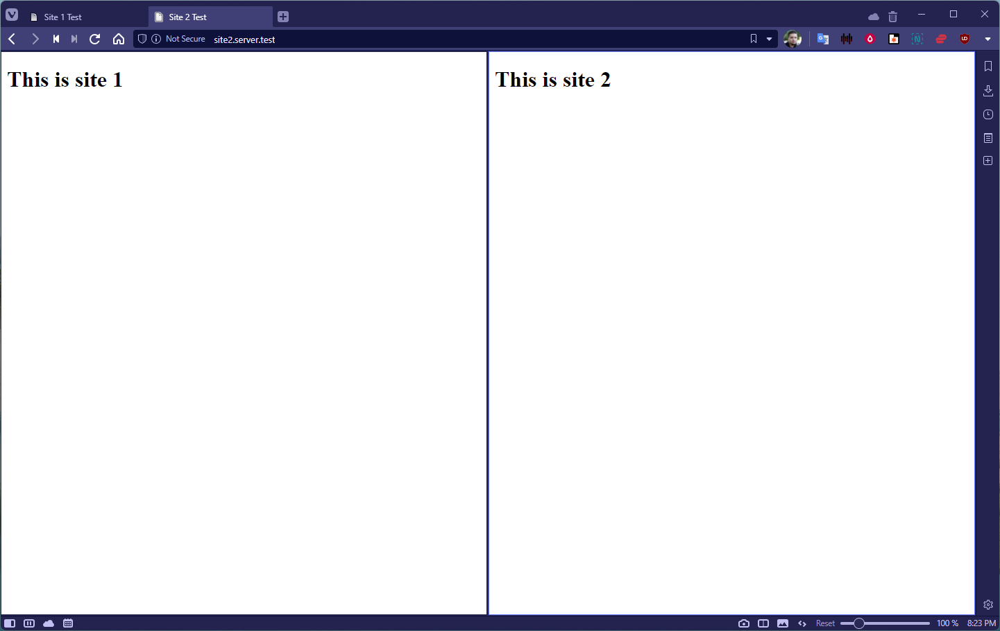

# Як налаштувати Nginx для кількох веб-сайтів у Rocky Linux

## Вступ

Ось мій обіцяний посібник із багатосайтових налаштувань Nginx у Rocky Linux. Почну з примітки для початківців; решта ви знаєте, для чого ви тут, тому прокрутіть вниз.

Привіт новачки! Однією з речей, які Nginx робить *дуже* добре, є спрямування трафіку з однієї центральної точки на кілька веб-сайтів і програм на одному сервері або на кількох інших серверах. Ця функція називається «зворотний проксі», і відносна легкість, з якою Nginx це робить, є однією з причин, чому я почав її використовувати.

Тут я покажу вам, як керувати декількома веб-сайтами в одній інсталяції Nginx і як це робити простим і організованим способом, який дозволить швидко й легко вносити зміни.

Для тих, хто шукає подібне налаштування для Apache, перегляньте [цей посібник.](apache-sites-enabled.md)

Я поясню *багато* деталей... але, зрештою, весь процес передбачає налаштування деяких папок і створення невеликих текстових файлів. У цьому посібнику ми не будемо використовувати надто складні конфігурації веб-сайтів. Коли ви дізнаєтесь, як це зробити, це займе лише кілька хвилин, щоб виконувати кожен раз. Це легко.\*

\* Для заданих значень "легко".

## Передумови та припущення

Це все, що вам знадобиться:

* Сервер Rocky Linux, підключений до Інтернету, на якому вже працює Nginx. Якщо ви ще не зайшли так далеко, ви можете спочатку слідувати [нашому посібнику зі встановлення Nginx](nginx-mainline.md).
* Деякий комфорт із виконанням завдань у командному рядку та встановленням термінального текстового редактора, наприклад `nano`.

    !!! tip "У крайньому випадку"
  
        ... ви можете використати щось на кшталт Filezilla або WinSCP — і звичайний текстовий редактор на основі графічного інтерфейсу користувача — щоб відтворити більшість цих кроків, але в цьому підручнику ми будемо робити все простим шляхом.

* Принаймні один домен вказує на ваш сервер для одного з тестових веб-сайтів. Ви можете використовувати або другий домен, або субдомен для іншого.

    !!! tip "Підказка"
  
        Налаштуйте свій хост-файл для створення імітованих доменних імен, якщо ви робите це на локальному сервері. Інструкції нижче.

* Ми припускаємо, що ви використовуєте Nginx на голому сервері або звичайному VPS і SELinux працює. Усі інструкції будуть сумісні з SELinux за замовчуванням.
* *Усі команди потрібно запускати від імені користувача root,* увійшовши в систему як користувач root або використовуючи `sudo`.

## Налаштування ваших папок і тестових сайтів

### Папки сайту
По-перше, вам знадобиться кілька папок для файлів вашого сайту. Коли ви вперше встановлюєте Nginx, усі «демо» файли веб-сайту будуть у `/usr/share/nginx/html`. Це добре, якщо ви розміщуєте лише один сайт, але ми станемо цікавішими. Наразі проігноруйте каталог `html` і просто перейдіть до його батьківської папки:

```bash
cd /usr/share/nginx
```

Тестовими доменами для цього підручника будуть `site1.server.test` і `site2.server.test`, і ми збираємося назвати папки веб-сайтів відповідно. Ви, звичайно, повинні змінити ці домени на ті, які використовуєте. Однак (і ось трюк, який я взяв від Smarter People<sup>TM</sup>), ми будемо писати доменні імена «задом наперед».

напр. "yourwebsite.com" буде розміщено в папці під назвою `com.yourwebsite`. Майте на увазі, що ви можете *буквально* назвати ці папки як завгодно, але для цього методу є вагома причина, яку я описав нижче.

Наразі просто створіть свої папки:

```bash
mkdir -p test.server.site1/html
mkdir -p test.server.site2/html
```

Отже, ця команда створить, наприклад, папку `test.server.site1` і помістить у неї іншу папку під назвою `html`. Саме там ви розмістите файли, які хочете обслуговувати через веб-сервер. (Ви також можете назвати це "webroot" або щось подібне.)

Це робиться для того, щоб ви могли розміщувати пов’язані з веб-сайтами файли, які ви *не* хочете оприлюднювати, у батьківському каталозі, зберігаючи все в одному місці.

!!! Note "Примітка"

    Прапорець `-p` повідомляє команді `mkdir` про створення будь-яких відсутніх папок у щойно визначеному шляху, тому вам не потрібно створювати кожну папку по одній.

Для цього тесту ми робимо самі «веб-сайти» дуже простими. Просто створіть файл HTML у першій папці за допомогою вашого улюбленого текстового редактора:

```bash
nano test.server.site1/html/index.html
```

Потім вставте наступний фрагмент HTML:

```html
<!DOCTYPE html>
<html lang="en">
<head>
    <meta charset="UTF-8">
    <meta http-equiv="X-UA-Compatible" content="IE=edge">
    <meta name="viewport" content="width=device-width, initial-scale=1.0">
    <title>Site 1</title>
</head>
<body>
    <h1>This is Site 1</h1>
</body>
</html>
```

Збережіть і закрийте файл, а потім повторіть кроки з папкою `test.server.site2`, змінивши «Сайт 1» на «Сайт 2» у HTML-коді вище. Це робиться для того, щоб пізніше ми могли бути впевнені, що все працює належним чином.

Ваші тестові веб-сайти готові; їдемо далі.

### Папки конфігурації

Тепер перейдемо до папки налаштувань і конфігурації Nginx, де ми будемо працювати до кінця цього посібника:

```bash
cd /etc/nginx/
```

Якщо ви запустите команду `ls`, щоб побачити, які тут файли та папки, ви побачите багато різних речей, більшість із яких сьогодні неактуальні. Слід звернути увагу на такі:

* `nginx.conf` — це файл, який містить стандартну конфігурацію Nginx. Ми відредагуємо це пізніше.
* `conf.d` — це каталог, куди ви можете розміщувати власні конфігураційні файли. Ви *можете* використовувати це для веб-сайтів, але краще використовувати його для налаштувань окремих функцій, які ви хочете використовувати на всіх своїх веб-сайтах.
* `default.d` – це каталог, куди *може* перейти конфігурація вашого веб-сайту, якщо на сервері працює лише один сайт або якщо ваш сервер має " первинний" веб-сайт. Залиште це поки що.

Ми хочемо створити дві нові папки під назвою `sites-available` та `sites-enabled`:

```bash
mkdir sites-available
mkdir sites-enabled
```

Ми розмістимо всі конфігураційні файли нашого веб-сайту в папці `sites-available`. Ви можете працювати над конфігураційними файлами там скільки завгодно, поки не будете готові активувати файли за допомогою символічного посилання на папку `sites-enabled`.

Нижче я покажу вам, як це працює. Наразі ми закінчили із папками.

!!! Note "Чому ви (можете) захотіти записати свої домени в зворотному порядку:"

    Простіше кажучи, це організаційна річ, яка особливо корисна під час використання командного рядка із завершенням табуляції, але вона все ще є досить цінною для програм на основі графічного інтерфейсу користувача. Він розроблений для людей, які запускають *багато* веб-сайтів або програм на сервері.
    
    Усі папки вашого веб-сайту (і файли конфігурації) будуть упорядковані в алфавітному порядку спочатку за доменом верхнього рівня (наприклад, .com, .org тощо), потім за основним доменом, а потім за будь-якими субдоменами. Під час пошуку в довгому списку доменів може бути легше звузити те, що ви шукаєте.
    
    Це також полегшує сортування ваших папок і конфігураційних файлів за допомогою інструментів командного рядка. Щоб отримати список усіх папок, пов’язаних із певним доменом, ви можете виконати:

    ```bash
    ls /usr/share/nginx/ | grep com.yoursite*
    ```


    Що виведе щось на зразок:

    ```
    com.yoursite.site1
    com.yoursite.site2
    com.yoursite.site3
    ```

## Налаштування файлів конфігурації

### Редагування nginx.conf

За замовчуванням реалізація Nginx у Rocky Linux відкрита для всього HTTP-трафіку та спрямовує його на демонстраційну сторінку, яку ви могли бачити в нашому посібнику зі встановлення Nginx. Ми цього не хочемо. Ми хочемо, щоб трафік із доменів спрямовувався на вказані нами веб-сайти.

Тож із каталогу `/etc/nginx/` відкрийте `nginx.conf` у вашому улюбленому текстовому редакторі:

```bash
nano nginx.conf
```

Спочатку знайдіть рядок, який виглядає так:

```
include /etc/nginx/conf.d/*.conf;
```

І **додайте** цей біт трохи нижче:

```
include /etc/nginx/sites-enabled/*.conf;
```

Це буде завантажено у файли конфігурації нашого веб-сайту, коли вони будуть готові до запуску.

Тепер перейдіть до розділу, який виглядає так, і або **закоментуйте його** за допомогою символу <kbd>#</kbd>, або видаліть його:

```
server {
    listen       80;
    listen       [::]:80;
    server_name  _;
    root         /usr/share/nginx/www/html;

    # Load configuration files for the default server block.
    include /etc/nginx/default.d/*.conf;

    error_page 404 /404.html;
    location = /404.html {
    }

    error_page 500 502 503 504 /50x.html;
    location = /50x.html {
    }
}
```

Як це виглядало б як «закоментовано»:

```
#server {
#    listen       80;
#    listen       [::]:80;
#    server_name  _;
#    root         /usr/share/nginx/www/html;
#
#    # Load configuration files for the default server block.
#    include /etc/nginx/default.d/*.conf;
#
#    error_page 404 /404.html;
#    location = /404.html {
#    }
#
#    error_page 500 502 503 504 /50x.html;
#    location = /50x.html {
#    }
#}
```

Якщо ви новачок, ви можете зберегти код із коментарями для довідки, що стосується прикладу коду HTTPS, який уже прокоментовано нижче у файлі.

Збережіть і закрийте файл, а потім перезапустіть сервер за допомогою:

```bash
systemctl restart nginx
```

Тепер принаймні демонстраційну сторінку ніхто не побачить.

### Додавання файлів конфігурації сайту

Тепер давайте зробимо ваші тестові веб-сайти доступними на сервері. Як зазначалося раніше, ми зробимо це за допомогою символічних посилань, щоб швидко вмикати та вимикати веб-сайти за бажанням.

!!! Note "Примітка"

    Для абсолютних новачків символічні посилання — це спосіб дозволити файлам удавати, що вони знаходяться у двох папках одночасно. Змініть вихідний файл (або «ціль»), і він зміниться всюди, де ви на нього посилаєтеся. Оригінал буде змінено, якщо ви використовуєте програму для редагування файлу за посиланням.
    
    Однак нічого не станеться з оригінальним файлом, якщо ви видалите посилання на ціль. Цей трюк дозволяє нам помістити файли конфігурації веб-сайту в робочий каталог (`sites-available`), а потім «активувати» їх, посилаючись на ці файли з `sites-enabled`.


Я покажу вам, що я маю на увазі. Створіть файл конфігурації для першого веб-сайту так:

```bash
nano sites-available/test.server.site1.conf
```

Тепер вставте цей код. Це найпростіша робоча конфігурація Nginx, яку ви можете мати, і вона повинна добре працювати на більшості веб-сайтів зі статичним HTML:

```
server {
    listen 80;
    listen [::]:80;

    # virtual server name i.e. domain name #
    server_name site1.server.test;

    # document root #
    root        /usr/share/nginx/test.server.site1/html;

    # log files
    access_log  /var/log/nginx/www_access.log;
    error_log   /var/log/nginx/www_error.log;

    # Directives to send expires headers and turn off 404 error logging. #
    location ~* ^.+\.(ogg|ogv|svg|svgz|eot|otf|woff|mp4|ttf|rss|atom|jpg|jpeg|gif|png|ico|zip|tgz|gz|rar|bz2|doc|xls|exe|ppt|tar|mid|midi|wav|bmp|rtf)$ {
        access_log off; log_not_found off; expires max;
    }
}
```

Все, починаючи з кореня документа і нижче, є технічно необов’язковим. Корисно та рекомендовано, але не обов’язково для функціонування веб-сайту.

У будь-якому разі збережіть і закрийте файл, а потім перейдіть до каталогу `sites-enabled`:

```bash
cd sites-enabled
```

Створіть символічне посилання на щойно створений файл конфігурації в папці `sites-available`:

```bash
ln -s ../sites-available/test.server.site1.conf
```

Перевірте свою конфігурацію за допомогою команди `nginx -t`, і якщо ви отримаєте повідомлення про те, що все гаразд, перезавантажте сервер:

```bash
systemctl restart nginx
```

Потім наведіть свій браузер на домен, який ви використовуєте для цього першого сайту (у моєму випадку: site1.server.test), і знайдіть повідомлення «Це сайт 1», яке ми розмістили у файлі HTML. Якщо у вашій системі встановлено `curl`, ви можете запустити `curl site1.server.test` і перевірити, чи завантажується HTML-код у вашому терміналі.

!!! Note "Примітка"

    Деякі браузери (з найкращими намірами) змушують вас використовувати HTTPS, коли ви вводите домен свого сервера в адресний рядок. Якщо у вас не налаштовано HTTPS, це викличе помилки.
    
    Не забудьте вручну вказати "http://" в адресному рядку браузера, щоб уникнути цієї проблеми. Якщо це не спрацює, очистіть кеш або використовуйте менш вимогливий браузер для цієї частини тестування. Я рекомендую [Min](https://minbrowser.org).

Якщо *все* піде правильно, *повторіть кроки вище, змінивши назви файлів і вміст файлів конфігурації*. "site1" до "site2" і все це. Коли у вас є файли конфігурації та символічні посилання для сайту 1 і сайту 2, і ви перезапустили Nginx, це має виглядати так:



!!! Note "Примітка"

    Ви також можете створювати посилання за межами каталогу з підтримкою сайтів за допомогою довгої форми команди `ln -s`. Це виглядатиме як `ln -s [source-file] [link]`.
    
    У цьому контексті це:

    ```bash
    ln -s /etc/nginx/sites-available/test.server.site1.conf /etc/nginx/sites-enabled/test.server.site1.conf
    ```

### Відключення веб-сайту

Якщо вам потрібно зупинити роботу одного зі своїх веб-сайтів, перш ніж знову запустити його, просто видаліть символічне посилання в розділі «Увімкнено сайти»:

```bash
rm /etc/nginx/sites-enabled/test.server.site1.conf
```

Потім перезапустіть Nginx. Щоб відновити роботу сайту, вам потрібно буде повторно створити символічне посилання та перезапустити Nginx.

## Опціонально: редагування файлу хостів

Ця частина однозначно для новачків. Усі інші, ймовірно, можуть пропустити.

Цей розділ *тільки* застосовується, якщо ви пробуєте цей посібник у локальному середовищі розробки. Це якщо ви запускаєте свій тестовий сервер на своїй робочій станції або іншому комп’ютері у вашій локальній домашній чи корпоративній мережі.

Оскільки вказати зовнішні домени на ваші локальні комп’ютери – це складно (і потенційно небезпечно, якщо ви не знаєте, що робите), ви можете налаштувати кілька «підроблених» доменів, які добре працюватимуть у вашій локальній мережі й ніде більше.

Найпростіший спосіб зробити це за допомогою хост-файлу на вашому комп’ютері. Файл хосту – це лише текстовий файл, який може замінити налаштування DNS. Ви можете вручну вказати доменне ім’я для будь-якої IP-адреси. Однак він працюватиме *лише* на цьому одному комп’ютері.

Отже, на Mac і Linux файл host знаходиться в каталозі `/etc/` і його можна дуже легко редагувати за допомогою командного рядка (вам знадобиться root-доступ). Якщо ви працюєте на робочій станції Rocky Linux, просто запустіть:

```bash
nano /etc/hosts
```

У Windows файл hosts знаходиться за адресою `C:\Windows\system32\drivers\etc\hosts`, і ви можете використовувати будь-який графічний текстовий редактор, якщо у вас є права адміністратора.

Отже, якщо ви працюєте на комп’ютері Rocky Linux і використовуєте сервер Nginx на тому самому комп’ютері, ви повинні відкрити файл і визначити потрібні домени/IP-адреси. Якщо ваша робоча станція та тестовий сервер використовуються на одній машині, це буде:

```
127.0.0.1           site1.server.test
127.0.0.1           site2.server.test
```

Якщо ви використовуєте сервер Nginx на іншій машині в мережі, просто використовуйте адресу цієї машини, наприклад.:

```
192.168.0.45           site1.server.test
192.168.0.45           site2.server.test
```

Потім ви можете вказати свій браузер на ті домени, які мають працювати належним чином.

## Налаштування SSL-сертифікатів для ваших сайтів

Перегляньте [наш посібник із отримання сертифікатів SSL за допомогою Let's Encrypt і certbot](../security/generating_ssl_keys_lets_encrypt.md). Інструкції там працюватимуть чудово.

## Висновок

Пам’ятайте, що більшість угод про організацію папок/файлів і іменування є технічно необов’язковими. Конфігураційні файли вашого веб-сайту здебільшого мають зберігатися всередині `/etc/nginx/`, а `nginx.conf` має знати, де знаходяться ці файли.

Фактичні файли веб-сайту мають бути десь у `/usr/share/nginx/`.

Спробуйте, попрацюйте з Science<sup>TM</sup> і не забудьте запустити `nginx -t` перед перезапуском Nginx, щоб переконатися, що ви не пропустили крапку з комою або що завгодно. Це заощадить вам багато часу.
