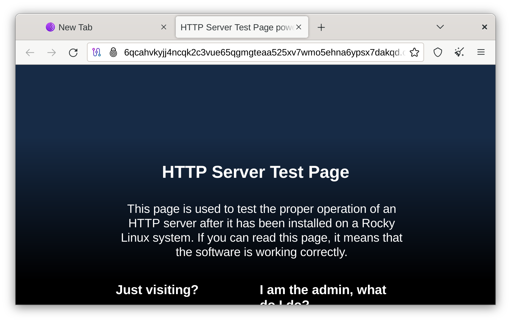

# Сервіс Tor Onion

## Вступ

[Tor](https://www.torproject.org/) — це служба анонімності та програмне забезпечення, яке направляє трафік через три сервери, що працюють на волонтерах і називаються ретрансляторами. Конструкція з трьома стрибками забезпечує конфіденційність шляхом протидії спробам стеження.

Однією з особливостей Tor є те, що ви можете запускати приховані ексклюзивні веб-сайти Tor під назвою [onion services](https://community.torproject.org/onion-services/). Тому весь трафік до служби onion є приватним і зашифрованим.

## Передумови та припущення

Нижче наведено мінімальні вимоги для використання цієї процедури:

- Можливість запускати команди від імені користувача root або використовувати `sudo` для підвищення привілеїв.
- Знайомство з редактором командного рядка. Автор використовує `vi` або `vim` тут, але замініть у вашому улюбленому редакторі.
- Веб-сервер, що працює на локальному хості або іншому порту TCP/IP

## Встановлення Tor

Щоб інсталювати Tor, вам потрібно спочатку встановити EPEL (додаткові пакети для Enterprise Linux) і запустити оновлення:

```bash
dnf -y install epel-release && dnf -y update
```

Потім встановіть Tor:

```bash
dnf -y install tor
```

## Налаштування Tor

Після встановлення пакетів вам потрібно налаштувати Tor. Автор використовує для цього `vi`, але якщо ви віддаєте перевагу `nano` або щось інше, замініть його в:

```bash
vi /etc/tor/torrc
```

Файл `torrc` за замовчуванням є досить описовим, але може бути довгим, якщо вам потрібна цибулева служба. Мінімальна конфігурація служби цибулі подібна до цієї:

```bash
HiddenServiceDir /var/lib/tor/onion-site/
HiddenServicePort 80 127.0.0.1:80
```

### Придивляючись ближче

- «HiddenServiceDir» — це розташування імені хоста вашої onion-служби та криптографічних ключів. Ви зберігаєте ці ключі в `/var/lib/tor/onion-site/`
- «HiddenServicePort» — це порт, який переадресовує ваш локальний сервер до служби onion. Ви пересилаєте 127.0.0.1:80 на порт 80 у нашій службі Tor

!!! warning "Важливо"

```
Якщо ви плануєте використовувати каталог для ключів підпису служби onion за межами `/var/lib/tor/`, ви повинні переконатися, що дозволи `0700`, а власник `toranon:toranon`.
```

## Налаштування веб-сервера

Вам також знадобиться веб-сервер на нашій машині, щоб обслуговувати клієнтів вашої служби цибулі. Можна використовувати будь-який веб-сервер (Caddy, Apache або Nginx). Автор віддає перевагу Caddy. Для простоти встановіть Caddy:

```bash
dnf -y install caddy
```

Далі ви вставите наступне до `/etc/caddy/Caddyfile`:

```bash
http:// {
    root * /usr/share/caddy
    file_server
}
```

## Перевірка та запуск

Після встановлення конфігурації реле Tor наступним кроком є увімкнення демонов Tor і Caddy:

```bash
systemctl enable --now tor caddy
```

Ви можете отримати ім’я хоста служби onion за допомогою цієї команди:

```bash
cat /var/lib/tor/onion-site/hostname
```

Протягом кількох хвилин ваша служба onion пошириться через мережу Tor, і ви зможете переглянути свою нову службу onion у браузері Tor:



## Висновок

Послуги Onion є неоціненними, якщо ви розміщуєте веб-сайт приватно або вам потрібно обійти NAT операторського рівня вашого провайдера, використовуючи лише програмне забезпечення з відкритим кодом.

Хоча послуги Onion не такі швидкі, як пряме розміщення веб-сайту (це зрозуміло через дизайн Tor, який надає перевагу конфіденційності), вони набагато безпечніші та приватніші, ніж публічний Інтернет.
