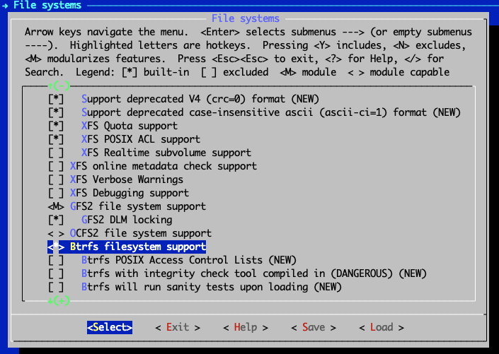

- - -
author: Wale Soyinka contributors: Steven Spencer, Ganna Zhyrnova tested on: All Versions tags:
  - lab exercise
  - Linux Kernel
  - compile
- - -

# Laboratorio 7: Il kernel Linux

## Obiettivi

Dopo aver completato questo laboratorio, sarete in grado di

- installare un nuovo kernel da un pacchetto binario
- compilare e installare un nuovo kernel dai file sorgente

Tempo stimato per completare questo laboratorio: 90 minuti

## kernel

Uno dei compiti che occasionalmente potreste dover svolgere durante l'amministrazione di un sistema Linux sarà quello di aggiornare o risolvere i problemi relativi al kernel del sistema operativo.

Il kernel è il cuore del sistema operativo Linux. È una cosa che accomuna le varie distribuzioni di Linux (Rocky Linux, Red hat, Mandrake, SuSE, Yellow dog ecc.). È responsabile della gestione di varie risorse di sistema e funge da livello di astrazione tra l'hardware del sistema e il software che si interfaccia con esso, fornendo i driver hardware.

Il kernel è sempre in fase di miglioramento e vengono sempre aggiunte nuove funzionalità o risolti bug. Come amministratore potrebbe essere necessario aggiornare al kernel più recente perché:

1. Il kernel più recente contiene correzioni di bug o specifiche ottimizzazioni desiderate
2. Ripara le falle di sicurezza presenti nel vecchio kernel
3. Contiene i driver per un componente hardware che non era possibile utilizzare con il vecchio kernel.


### Codice sorgente e versioni del kernel

Il kernel comprende oltre un milione di righe di codice di programmazione in C. Questo costituisce il cosiddetto codice sorgente del Kernel.

Il repository principale del kernel è il sito web del kernel gestito dall'URL:

[www.kernel.org](https://www.kernel.org)

In questo sito troverete sempre le versioni più recenti [e più vecchie] del kernel.

Come già detto, il kernel è comune a tutte le varie distro Linux. Le varie distro a volte reimpacchettano il codice sorgente del kernel per facilitare l'installazione e gli aggiornamenti o per adattarsi alle loro particolari distro.

Le varie versioni del codice sorgente del Kernel utilizzano la seguente convenzione di denominazione:

```bash 
linux-<kernel.version>.tar.bz2 (o linux-<kernel.version>.tar.gz)  
```

La convenzione attuale è quella di chiamare e numerare le nuove versioni principali del kernel come "Linux 5.x" (chiamate anche kernel vanilla o mainline). Pertanto, la prima di questa serie sarà la versione 5.0 di Linux (uguale alla 5.0.0), la successiva sarà la versione 5.1 di Linux (uguale alla 5.1.0), seguita dalla versione 5.2 e così via.

Eventuali modifiche o aggiornamenti minori all'interno di ciascuna versione della major release si rifletteranno con incrementi alla terza cifra. Questi vengono comunemente chiamati rilasci di punti stabili. Pertanto, la prossima release stabile per il kernel della serie 5.0.0 sarà la versione 5.0.1 di Linux, seguita dalla versione 5.0.2 e così via. Un altro modo per affermare ciò è dire, ad esempio, che la versione 5.0.4 di Linux è la quarta release stabile basata sulla serie 5.0.0 di Linux.

### moduli del kernel

I moduli sono file di oggetti condivisi (con nomi come nome_modulo.o, nome_modulo.ko ecc.). Pensate ai moduli come ai *driver* di Microsoft Windows.

I moduli sono pezzi di codice del kernel che possono o meno essere inclusi direttamente nel kernel. Sono compilati separatamente e possono essere inseriti e rimossi dal kernel in esecuzione in qualsiasi momento.  I sistemi moderni fanno ampio uso del supporto dei moduli caricabili. I moduli caricabili offrono diversi vantaggi, come ad esempio:

1. Riduce la dimensione complessiva dell'immagine finale del kernel, poiché non sono strettamente parte del kernel in esecuzione.
2. In questo modo si risparmia la RAM: vengono caricati nella RAM solo quando sono necessari.

Alcuni moduli devono essere compilati direttamente nel kernel, mentre altri possono essere caricati separatamente.

La scelta di quando rendere disponibile una particolare funzionalità come modulo o compilarla nel kernel è di solito abbastanza semplice. In generale, se l'uso è poco frequente e se le funzionalità sono quelle di un modulo, è meglio compilarlo come modulo.


### Configurazione del kernel

In genere esistono tre metodi per gestire il kernel nelle distro Linux. Questi sono:

1. Utilizzando la versione preconfezionata del kernel fornita dal produttore della distribuzione.  ad esempio utilizzando kernel-<version>.*.rpm. È la soluzione più sicura, più semplice e preferibile

2. Tramite il patching. Utilizzando file di patch come - patch-kernel.version.gz.

3. Compilando il kernel dai sorgenti, ad esempio usando linux-kernel.version.tar.bz2

Nei prossimi esercizi si aggiornerà il kernel in uso a una versione leggermente più recente. Per eseguire l'aggiornamento si utilizzerà innanzitutto una versione preconfezionata (binaria) del kernel Linux.


## Esercizio 1

### Aggiornamento dal pacchetto binario [rpm]

In questo esercizio si aggiornerà direttamente il kernel utilizzando l'applicazione rpm.

#### Per aggiornare il kernel utilizzando rpm

1. Assicuratevi di aver effettuato l'accesso al sistema come root.

2. Eseguire l'utilità `rpm` per elencare tutti i pacchetti del kernel attualmente installati sul sistema. Digitare:

    ``` { .sh data-copy="rpm -q kernel" }
    [root@localhost ~]# rpm -q kernel
    ```

3. Eseguire l'utilità `uname` per visualizzare alcune informazioni sul kernel in esecuzione. Digitare:

    ``` { .bash data-copy="uname --kernel-release" }
    [root@localhost ~]# uname --kernel-release

    5.*.el9_8.x86_64 
    ```

    Annotare il numero di versione/rilascio nell'output.

4. Usare `dnf` per scaricare l'ultimo pacchetto del kernel disponibile dal repository ufficiale dei pacchetti Rocky Linux. Digitare:

    ```bash
    [root@localhost ~]# dnf download kernel
    ```
    Ora si dovrebbe avere un pacchetto RPM con un nome simile a kernel-*.x86_64.rpm salvato nella propria PWD.

5. Usare di nuovo `rpm` per interrogare il pacchetto scaricato e ottenere ulteriori informazioni su di esso. Digitare:

    ```bash
    [root@localhost ~]# rpm -qip kernel-*.x86_64.rpm
    ```

6. Usare `rpm` per fare un'installazione di prova del kernel*.rpm scaricato per assicurarsi che tutte le sue dipendenze siano soddisfatte. Digitare:

    ```bash
    [root@localhost ~]# rpm --test  -ivh kernel-*.x86_64.rpm

    error: Failed dependencies:
    kernel-core-uname-r = *.x86_64 is needed by kernel-*.x86_64
    kernel-modules-uname-r = *.x86_64 is needed by kernel-*.x86_64
    ```

    Dall'output si può vedere che il pacchetto ha dipendenze non soddisfatte.

7. Utilizzare `dnf` per scaricare le dipendenze necessarie segnalate nel precedente messaggio di errore. Digitare:

    ```bash
    [root@localhost ~]# dnf download kernel-core-uname-r kernel-modules-uname-r  
    ```

8.  Eseguite di nuovo `rpm` con l'opzione test per vedere se il pacchetto del kernel può essere aggiornato. Digitare:

    ```bash
    [root@localhost ~]# rpm --test  -Uvh kernel-*.rpm

    Verifying...       ################################# [100%]
    Preparing...       ################################# [100%]
    ```

    Questa volta tutto sembra a posto!

9.  Infine, utilizzare `rpm` per installare il pacchetto kernel con tutte le sue dipendenze. Digitare:

    ```bash
    [root@localhost ~]# rpm  -ivh kernel-*.rpm
    ```

10. Usare `rpm` per elencare tutti i pacchetti kernel installati sul sistema.

    !!! Question "Domanda"
    
         Cosa c'è di diverso tra l'output del comando rpm -q kernel, prima e dopo l'installazione del nuovo kernel?

12. Abbiamo finito di usare RPM per gestire direttamente i pacchetti del kernel sul sistema. Disinstallare l'ultimo pacchetto kernel scaricato e installato. A tale scopo, è necessario specificare le informazioni esatte e corrette su nome-epoca-versione-rilascio-architettura (NEVRA) del kernel e delle sue dipendenze associate che si desidera disinstallare. Digitare:

    ```bash
    [root@localhost ~]# rpm -e \
     kernel-<NEVRA> \
      kernel-core-<NEVRA> \
       kernel-modules-<NEVRA>
    ```

## Esercizio 2

### Aggiornamento dal repository dei pacchetti

In questo esercizio si aggiornerà il kernel utilizzando l'applicazione `dnf`. DNF è un gestore di pacchetti per distribuzioni Linux basate su RPM. Può essere utilizzato per gestire i pacchetti di sistema utilizzando i repository online configurati.

#### Per aggiornare il kernel utilizzando DNF

1. Assicuratevi di aver effettuato l'accesso al sistema come root.

2. Usare `dnf` per elencare tutti i pacchetti del kernel installati sul sistema e i pacchetti del kernel disponibili sul repository remoto dei pacchetti. Digitare:

    ```bash
    [root@localhost ~]# dnf list kernel
    ```

3. Utilizzare il programma `dnf` per verificare la disponibilità di pacchetti kernel aggiornati. Digitare:

    ```bash
    [root@localhost ~]# dnf check-update kernel
    ```

    È possibile che vengano visualizzati o meno gli aggiornamenti dei pacchetti del kernel disponibili sul sistema; l'output dipende da quanto recentemente è stato aggiornato l'intero sistema.

4. Se si vede una nuova versione del kernel elencata come disponibile, si può usare `dnf` per interrogare il repository remoto e ottenere maggiori informazioni sul pacchetto eseguendo:

    ```bash
    [root@localhost ~]# dnf info  kernel --available
    ```

5. Usare `dnf` per trovare, scaricare e installare automaticamente l'ultimo pacchetto del kernel disponibile nel repository remoto dei pacchetti. Digitare:

    ```bash 
    [root@localhost ~]# dnf -y update  kernel
    ```

6. Ora elenchiamo i pacchetti del kernel installati. Digitare:

    ```bash
    [root@localhost ~]# dnf list kernel --installed
    ```

## Esercizio 3

### Aggiornare il kernel dai sorgenti

In questo esercizio si costruirà un nuovo kernel dai sorgenti, configurandolo, compilandolo e installandolo da soli.

#### Per aggiornare il kernel dai sorgenti

!!! note "Note"

    La versione del kernel utilizzata in questo esercizio è l'ultima disponibile al momento. L'ultima versione disponibile al momento della lettura di questo documento potrebbe essere diversa. È stato utilizzato un asterisco (*) per indicare la versione del kernel utilizzata.     È necessario sostituire il simbolo "*" con la versione specifica in uso. Ad esempio, supponendo che la versione del kernel utilizzata nei passaggi seguenti sia 6.6.13.4, il kernel sarà indicato come versione 6.6.*

1. Accedere al sistema come utente con privilegi di amministrazione.

2.  Installare gli strumenti di sviluppo necessari. Digitare:

    ```bash
    [root@localhost linux-6.5.7]# dnf -y groupinstall 'Development Tools'
    ```

3. Installare le librerie e gli strumenti necessari. Digitare:

    ```bash
    [root@localhost linux-6.*]# dnf -y install ncurses-devel bc openssl-devel elfutils-libelf-devel python3 dwarves
    ```

4. Scaricare l'ultimo sorgente del kernel digitando:

    ```bash
    [root@localhost ~]# curl -L -o linux-6.5.7.tar.xz \
    https://www.kernel.org/pub/linux/kernel/v6.x/linux-6.5.7.tar.xz 
    ```

    Si noti che linux-6.5.7.tar.xz è l'ultimo kernel disponibile al momento in cui scriviamo. Sostituite linux-6.5.7.tar.xz o linux-6.*.tar.xz con la versione del kernel che avete scelto per seguire questo esercizio.

6. Scompattate il tarball del kernel nella vostra pwd. Digitare:

    ```bash
    [root@localhost ~]# tar xvJf linux-6.*.tar.xz
    ```

    Il comando tar creerà una nuova directory chiamata: "linux-6.*" sotto la propria PWD.

7. Elencare il contenuto della nuova directory dei sorgenti del kernel

8. Passare (cd) alla directory dei sorgenti del kernel. Digitare:

    ```bash
    [root@localhost ~]# cd linux-6.*
    ```

9. Pulire (preparare) l'ambiente di compilazione del kernel usando il comando `make mrproper`. Digitare:

    ```bash
    [root@localhost ~]# make  O=~/build/kernel mrproper
    ```

10. Copiare e rinominare il file di configurazione preesistente della directory /boot nel nostro ambiente di creazione del kernel:

    ```bash
    [root@localhost ~]# cp /boot/config-`uname -r` ~/build/kernel/.config
    ```

11. Avviare l'utilità di configurazione grafica del kernel. Digitare:

    ```bash
    [root@localhost ~]# make O=~/build/kernel menuconfig
    ```
    Verrà visualizzata una schermata simile a questa:

    

    !!! Note "Nota"

     La schermata di configurazione del kernel che appare è suddivisa in circa tre aree:
    
     1. La parte superiore mostra varie informazioni utili, scorciatoie da tastiera e legende che possono aiutare a navigare nell'applicazione.
    
     2. Il corpo principale della schermata mostra un elenco espandibile a struttura ad albero delle opzioni del kernel complessivamente configurabili. È possibile approfondire le voci con le frecce nel genitore per visualizzare e/o configurare le voci dei sottomenu (o figli).
    
     3. Infine, nella parte inferiore della schermata vengono visualizzate le azioni/opzioni che l'utente può scegliere.

12. A scopo dimostrativo, si aggiungerà il supporto per il filesystem Btrfs al nuovo kernel. Nella schermata di configurazione principale, utilizzare i tasti freccia per spostarsi ed evidenziare la voce File system. Con File system selezionato, premere <kbd>INVIO</kbd> per visualizzare il sottomenu o le voci secondarie di File system.

    Nella sezione File System, utilizzare i tasti freccia per spostarsi su *Btrfs filesystem support*.

13. Con *Btrfs filesystem support* evidenziato, premere `y` per includere il supporto per `btrfs` nel kernel personalizzato. Al termine, accanto all'opzione evidenziata dovrebbe comparire il simbolo dell'asterisco (*). La schermata finale dovrebbe assomigliare a quella mostrata qui:

    

14. Tornare alla schermata principale di configurazione del kernel premendo due volte <kbd>ESC</kbd> sulla tastiera.

15. Uscire dall'applicazione di configurazione del kernel premendo nuovamente due volte <kbd>ESC</kbd> sulla tastiera. L'uscita dal configuratore del kernel comporta il salvataggio delle modifiche nel file .config nella radice dell'albero dei sorgenti del kernel.

16. Viene visualizzata una finestra di dialogo che richiede di salvare la nuova configurazione. Assicurarsi che sia selezionato Yes e premere <kbd>ENTER</kbd>.
17. Dopo l'uscita dell'utilità di configurazione del kernel, si tornerà alla propria shell, all'interno dell'albero dei sorgenti del kernel.

    !!! Tip "Suggerimento"
    
         Per visualizzare i risultati di alcune delle modifiche apportate con lo strumento `menuconfig`, utilizzare l'utilità grep per visualizzare il file .config
         salvato in precedenza. Ad esempio, per visualizzare l'effetto dell'abilitazione del supporto del filesystem `btrfs`, digitare quanto segue:

        ```bash
        # grep  ^CONFIG_BTRFS_FS  ~/build/kernel/.config

        CONFIG_BTRFS_FS=y
        ```

18. Completate un altro passo importante per i kernel personalizzati su Rocky Linux distro. Digitare:


    ```bash
    [root@localhost linux-6*]# sed -ri '/CONFIG_SYSTEM_TRUSTED_KEYS/s/=.+/=""/g' ~/build/kernel/.config 
    ```

19. Aggiungere una semplice personalizzazione al nuovo kernel, per distinguerlo più facilmente dagli altri kernel stock. Per questo, si può usare l'utilità `sed` per modificare il Makefile sul posto. Digitare:

    ```bash
    [root@localhost linux-6.*]# sed  -i 's/^EXTRAVERSION.*/EXTRAVERSION = -custom/'  Makefile
    ```

20. Verificare la versione completa del kernel appena personalizzato passando il target `kernelversion` al comando `make`. Digitare:

    ```bash
    [root@localhost ~]# make O=~/build/kernel kernelversion
    ```

21. Siete pronti per compilare il kernel. Digitare:

    ```bash
    [root@localhost linux-6.*]# make  O=~/build/kernel -j $(nproc)
    make[1]: Entering directory '/root/build/kernel'
    SYNC    include/config/auto.conf.cmd
    GEN     Makefile
    HOSTCC  scripts/kconfig/conf.o
    ```

22. Dopo che la compilazione è stata completata con successo, si otterrà il kernel finito, memorizzato qui:

    ```bash
    ~/build/kernel/arch/x86/boot/bzImage
    ```

23. Installare le parti del kernel configurate come moduli. Digitare:

    ```bash
    [root@localhost linux-6.*]# make O=~/build/kernel modules_install      
    ```

24. Dopo aver compilato il kernel, è il momento di installarlo. Digitare:

    ```bash
    [root@localhost linux-6.*]# cp ~/build/kernel/arch/x86/boot/bzImage  \
    /boot/vmlinuz-<kernel-version>      
    ```

    Sostituire <kernel-version> con il numero di versione del kernel personalizzato. Per il kernel di esempio utilizzato in questa guida, il nome del file sarà vmlinuz-6.*-custom. Ecco il comando esatto per questo esempio:

    ```bash
    cp ~/build/kernel/arch/x86/boot/bzImage  /boot/vmlinuz-6.*-custom
    ```

25. Copiare e rinominare il file System.map corrispondente nella directory /boot utilizzando la stessa convenzione di denominazione:

    ```bash
    [root@localhost linux-6.*]# cp -v ~/build/kernel/System.map /boot/System.map-6.*-custom  
    ```

26. Utilizzare l'utilità `kernel-install` per completare il passaggio del file. Digitare:

    ```bash
    [root@localhost linux-6.*]# kernel-install add  6.*-custom /boot/vmlinuz-6.*-custom
    ```

27. L'utilità `kernel-install` crea una nuova voce di avvio nel file di configurazione del boot loader. Per i sistemi basati su EFI è possibile cercare in /boot/loader/entries/ le voci corrispondenti.

28. Tutto fatto. È il momento della verità. È possibile riavviare il sistema e selezionare il nuovo kernel personalizzato nel menu di avvio di GRUB. Se tutto va bene dopo il riavvio, si può verificare che il sistema stia eseguendo il kernel personalizzato eseguendo il comando `uname` in questo modo:

    ```bash
    [root@localhost linux-6.*]# uname -r
    ```
    
