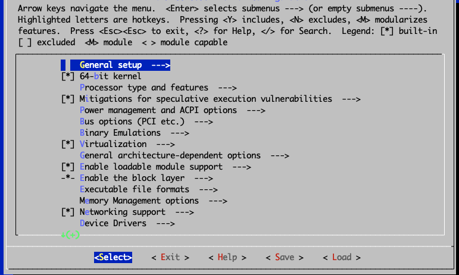

# Lab 7: The Linux Kernel

## Objectives 

After completing this lab, you will be able to 

- install a new kernel from a binary package 
- compile and install a new kernel from source files 

Estimated time to complete this lab: 90 minutes 

## Kernel 

One of the tasks you might occasionally need to perform in the course of administering a Linux system  will be to upgrade or troubleshoot something related to the operating system kernel.

The kernel is the heart of the Linux operating system. It is the one thing that the various distributions of Linux (Rocky Linux, Red hat, Mandrake, SuSE, Yellow dog etc) have in common. It is responsible for managing various system resources and serves as an abstraction layer between the system hardware and the software that interfaces with the system, by providing hardware drivers. 

The Kernel is always being improved upon and new features are always being added to it or bugs fixed from it. As an administrator you may need to upgrade to the newest kernel because: 

1. The newer kernel contains bug fixes or specific desirable optimizations
2. It repairs security holes that were present in the old kernel 
3. It contains drivers for a piece of hardware that you couldn’t use with the old kernel. 


### Kernel source code and versions 

The kernel is made up of over a million lines of C programming code. This constitutes what is known as the Kernel source code. 

The main repository for the kernel is the kernel website maintained under the URL: 

[www.kernel.org](https://www.kernel.org)  

It is at this site that you'll always find the latest [and oldest] versions of the kernel. 

As already mentioned, the kernel is common amongst all the various Linux distros. The various distros sometimes re-package the source code for the kernel to make installation and upgrades easier or to suit their particular distros.  

The various Kernel source code versions  use the following naming convention.:

```bash 
linux-<kernel.version>.tar.bz2    (or  linux-<kernel.version>.tar.gz)  
```

The current convention is to name and number major new kernel releases as “Linux 5.x” (also called the vanilla or mainline kernels). Thus, the first of this series will be Linux version 5.0 (same as 5.0.0), the next will be Linux version 5.1 (same as 5.1.0), followed by Linux version 5.2, and so on.

Any minor changes or updates within each major release version will be reflected by increments to the third digit. These are commonly referred to as stable point releases. Thus, the next stable point release for the 5.0.0 series kernel will be Linux version 5.0.1, followed by version 5.0.2, and so forth. Another way of stating this is to say, for example, that Linux version 5.0.4 is the fourth stable release based on the Linux 5.0.0 series.

### Kernel Modules 

Modules are shared object files (with names like module_name.o, module_name.ko etc). Think of modules as you would *drivers* in the Microsoft Windows world.

Modules are chunks of kernel code which may or may not be included directly in the kernel. They are compiled separately, and can be inserted and removed from the running kernel at almost any time.  Modern systems make extensive use of loadable module support. Loadable modules offer various advantages such: 

1. It reduces the overall size of the final kernel image - since they are not strictly a part of the
  running kernel. 
2. It saves RAM - they are only loaded into RAM when they are needed. 

Some modules need to be directly compiled into the kernel while it is okay to make others separate loadable modules. 

The choice of when to make a particular feature available as a module or to compile it into the kernel is usually fairly straightforward. In general, if it is infrequently used and performs as needed as a module, you should compile it as a module. 


### Configuring the Kernel 

There are generally three methods by which the kernel can be managed on Linux distros. These are:

1. Using the prepackaged version of the kernel from the distributions vendor.  e.g. using     kernel-<version>.*.rpm. This is the safest, easiest and most preferred recommended  

2. Via patching. Using patch files like - patch-kernel.version.gz. 

3. Compiling the kernel from source e.g.  using linux-kernel.version.tar.bz2  

In the next couple of exercises you will upgrade your running kernel to a slightly more recent version.  You will first use a prepackaged (binary) version of the Linux kernel to perform the upgrade. 


## Exercise 1

### Upgrade from binary [rpm] package 

In this exercise you will directly upgrade your kernel using the rpm application. 

#### To upgrade the kernel using rpm

1. Ensure you are logged into the system as root. 

2. Run the `rpm` utility to list all kernel packages currently installed on the system. Type:
       
    ``` { .sh data-copy="rpm -q kernel" }
    [root@localhost ~]# rpm -q kernel
    ```

3. Execute the `uname` utility to view some information about the current running Kernel. Type:
    
    ```bash
    [root@localhost ~]# uname --kernel-release
    
    5.*.el9_8.x86_64 
    ```

    Make a note of the version/release number in your output.
    
4. Use `dnf` to [cheat and] download the latest kernel package available from the official Rocky Linux package repository. Type:
    
    ```bash
    [root@localhost ~]# dnf list kernel
    ```
    You should now have an RPM package with a name similar to kernel-*.x86_64.rpm saved in your PWD.
    
5. Use `rpm` again to query the downloaded package for more information about itself. Type:
    
    ```bash
    [root@localhost ~]# rpm -qip kernel-*.x86_64.rpm
    ```

6. Use `rpm` to do a test install of the downloaded Kernel*.rpm to ensure that all its dependencies will be met. Type:
    
    ```bash
    [root@localhost ~]# rpm --test  -Uvh kernel-*.x86_64.rpm
    
    error: Failed dependencies:
    kernel-core-uname-r = *.x86_64 is needed by kernel-*.x86_64
    kernel-modules-uname-r = *.x86_64 is needed by kernel-*.x86_64
    ```
    
    From the output we can see that the package has unmet dependencies.
    
7. Use `dnf` to download the needed dependencies. Type:
    
    ```bash
    [root@localhost ~]# dnf download kernel-core-uname-r kernel-modules-uname-r  
    ```
    
8.  Run `rpm` with the test option again to see if the kernal package can be upgraded. Type:
    
    ```bash
    [root@localhost ~]# rpm --test  -Uvh kernel-*.rpm
    
    Verifying...       ################################# [100%]
    Preparing...       ################################# [100%]
    ```
    
    Everything looks good this time!
    
9.  Finally use `rpm` to install the kernel package along with all its dependencies. Type:
    
    ```bash
    [root@localhost ~]# rpm  -ivh kernel-*.rpm
    ```

10. Use `rpm` to list all the installed kernel packages on your system. 
    
    !!! Question
    
        What is different between the output of the rpm -q kernel command - before and after you installed the new kernel?
    
12. We are done with using RPM to directly manage Kernel packages on the system. 
    Uninstall the latest kernel package that you downloaded and installed. 
    For this you'll need the to specify the exact and correct name-epoch-version-release-architecture (NEVRA) info for the Kernel and its associated dependencies that you want to uninstall. Type:
    
    ```bash
    [root@localhost ~]# rpm -e \
     kernel-<NEVRA> \
      kernel-core-<NEVRA> \
       kernel-modules-<NEVRA>
    ```
    
## Exercise 2 

### Upgrade from the package repository 

In this exercise you will upgrade your kernel by using the `dnf` application. DNF is a package manager for RPM-base Linux distributions. It can be used to manage packages on a systems using configured online repositories.

#### To upgrade the kernel using DNF

1. Ensure you are logged into the system as root. 

2. Use `dnf` to list all kernel packages installed on the system as well as kernel packages available on the remote package repository. TYpe:
    
    ```bash
    [root@localhost ~]# dnf list kernel
    ```

3. Use the `dnf` program to check if there are any available updated Kernel packages. Type:
    
    ```bash
    [root@localhost ~]# dnf check-update kernel
    ```
    
    You may or may not see any available kernel package updates on your system; Your output depends on how recently you updated the entire system.
    
4. If you see a new version of the kernel listed as being available, you can use `dnf` to query the remote repository for more information about the package by running:
    
    ```bash
    [root@localhost ~]# dnf info  kernel --available
    ```

5. Use `dnf` to automatically find, download, and install the latest Kernel package available in the remote package repository. Type:
    
    ```bash 
    [root@localhost ~]# dnf -y update  kernel
    ```

6. Now list the installed Kernel packages. Type:
    
    ```bash
    [root@localhost ~]# dnf list kernel --installed
    ```
    
## Exercise 3 

### Upgrade the kernel from source 

In this exercise you will build a new kernel from source, by configuring, compiling, and installing it yourself. 

#### To upgrade the kernel from source 

!!! note "Notes"
    
    The kernel version used in this exercise was the latest available at the time. The latest version available at the time you are reading this material may be different. An asterisk (*) has been used to denote the particular kernel version used.     You will need to replace the "*" with the specific version you are using. For example, assuming the kernel version used in the steps below was - 6.6.13.4  - the kernel will be referred to as version 6.6.*
    
1. Log into the system as a user with Administrative privileges.

2.  Install needed development tools. Type:
    
    ```bash
    [root@localhost linux-6.5.7]# sudo dnf -y groupinstall 'Development Tools'
    ```

3. Install the needed libraries. Type:
     
    ```bash
    [root@localhost linux-6.*]# dnf -y install ncurses-devel openssl-devel elfutils-libelf-devel python3 dwarves
    ```

4. Download the latest kernel source by typing:
    
    ```bash
    [root@localhost ~]# curl -L -o linux-6.5.7.tar.xz \
    https://www.kernel.org/pub/linux/kernel/v6.x/linux-6.5.7.tar.xz 
    ```
    
    Note that linux-6.5.7.tar.xz just happens to be the latest kernel available at time of this writing. You should substitute linux-6.5.7.tar.xz or linux-6.*.tar.xz with whatever version of the Kernel that you choose to follow along this exercise with.
    
6. Unpack the kernel tarball into your pwd. Type: 
    
    ```bash
    [root@localhost ~]# tar xvJf linux-6.*.tar.xz
    ```
    
    The tar command will create a new directory called: “linux-6.*” under your PWD.
    
7. List the contents of the new kernel source directory

8. Change (cd) into the kernel source directory. Type:
    
    ```bash
    [root@localhost ~]# cd linux-6.*
    ```

9. Clean (prepare) the kernel build environment by using the `make mrproper` command. Type:
    
    ```bash
    [root@localhost ~]# make  O=~/build/kernel mrproper
    ```

10. Copy over and rename the preexisting configuration file from the /boot directory into our kernel build environment:
    
    ```bash
    [root@localhost ~]# cp /boot/config-`uname -r` ~/build/kernel/.config
    ```

11. Launch the graphical kernel configuration utility. Type:
    
    ```bash
    [root@localhost ~]# make O=~/build/kernel menuconfig
    ```
    A screen similar to this will appear:
    
    
    
    !!! Note
        
        The kernel configuration screen that appears is divided into roughly three areas:
           
        1. The top part shows various helpful information, keyboard shortcuts, and legends that can help you navigate the application.

        2. The main body of the screen shows an expandable tree-structured list of the overall configurable kernel options. You can further drill down into items with arrows in the parent to view and/or configure sub-menu (or child) items.
        
        3. Finally, the bottom of the screen displays the actual actions/options that the user can choose.
           
12. For demonstration purposes you'll add Btrfs filesystem support to the new kernel.
    In the main configuration screen, use your arrow keys to navigate to and highlight the File systems item.
    With File systems selected, press <kbd>ENTER</kbd> to view the sub-menu or child items for File systems.
    
    In the File Systems section, use your arrow keys to navigate to *Btrfs filesystem support*.
    
13. With *Btrfs filesystem support* highlighted, press `y` to include support for `btrfs` in the custom kernel. 
     When you are done, an asterisk symbol (*) should appear beside the highlighted option. The final screen should look like the one shown here:
     
    
    
14. Return to the main kernel configuration screen by pressing <kbd>ESC</kbd> twice on your keyboard.

15. Exit the kernel configuration application by pressing esc twice again on your keyboard.
    Exiting the kernel configurator will force saving your changes to the .config file in the root of the kernel source tree.
    
16. A dialog box will appear prompting you to save your new configuration. Make sure that Yes is selected and then press <kbd>ENTER</kbd>.
17. After the kernel configuration utility exits, you will be thrown back to your shell—inside the kernel source tree.
    
    !!! Tip

        To view the results of some of the changes you made using the `menuconfig` tool, use the grep utility to view the .config
        file that you saved directly. For example, to view the effect of you enabling `btrfs` filesystem support, type the following:
        
        ```bash
        # grep  ^CONFIG_BTRFS_FS  ~/build/kernel/.config
        
        CONFIG_BTRFS_FS=y
        ```
    
18. Complete another important step for custom Kernels on Rocky Linux distro. Type:
    
    
    ```bash
    [root@localhost linux-6*]# sed -ri '/CONFIG_SYSTEM_TRUSTED_KEYS/s/=.+/=""/g' ~/build/kernel/.config 
    ```
    
19. Add a simple customization to the new Kernel that will allow you to more easily distinguish it from the other stock Kernels. For this, use the `sed` utility to edit the Makefile in place. Type:
    
    ```bash
    [root@localhost linux-6.*]# sed  -i 's/^EXTRAVERSION.*/EXTRAVERSION = -custom/'  Makefile
    ```
    
20. Verify the full version of the kernel that you just customized by passing the `kernelversion` target to the `make` command. Type:
    
    ```bash
    [root@localhost ~]# make O=~/build/kernel kernelversion
    ```
    
21. You are ready to compile the Kernel. Type:
    
    ```bash
    [root@localhost linux-6.*]# make  O=~/build/kernel -j $(nproc)
    make[1]: Entering directory '/root/build/kernel'
    SYNC    include/config/auto.conf.cmd
    GEN     Makefile
    HOSTCC  scripts/kconfig/conf.o
    ```
    
22. After the compilation completes successfully, you'll end up with the finished Kernel stored here:
    
    ```bash
    ~/build/kernel/arch/x86/boot/bzImage
    ```

23. Install the portions of the kernel that were configured as modules. Type:
    
    ```bash
    [root@localhost linux-6.*]# make O=~/build/kernel modules_install      
    ```
    
24. With the Kernel now builtm it's time to install it. Type:
    
    ```bash
    [root@localhost linux-6.*]# cp ~/build/kernel/arch/x86/boot/bzImage  \
    /boot/vmlinuz-<kernel-version>      
    ```
    
    Replace <kernel-version> with the version number of your custom kernel. 
    For the sample kernel we are using in this guide, the filename would be vmlinuz-6.*-custom. So here’s the exact command for this example:
    
    ```bash
    cp ~/build/kernel/arch/x86/boot/bzImage  /boot/vmlinuz-6.*-custom
    ```
    
25. Copy over and rename the corresponding System.map file into the /boot directory using the same naming convention:
    
    ```bash
    [root@localhost linux-6.*]# cp -v ~/build/kernel/System.map /boot/System.map-6.*-custom  
    ```

26. Use the `kernel-install` utility to complete the file step. Type:
    
    ```bash
    [root@localhost linux-6.*]# kernel-install add  6.*-custom /boot/vmlinuz-6.*-custom
    ```
    
27. The `kernel-install` utility will create a new boot entry in the boot loader configuration file. For EFI based systems you can look under /boot/loader/entries/ for matching entries.

28. All done. Moment of truth now. You can reboot your system and select the new custom Kernel in the GRUB boot menu.
    If all goes well after the reboot, you can verify that system is running the custom kernel by running the `uname` command like this:
    
    ```bash
    [root@localhost linux-6.*]# uname -r
    ```
    
