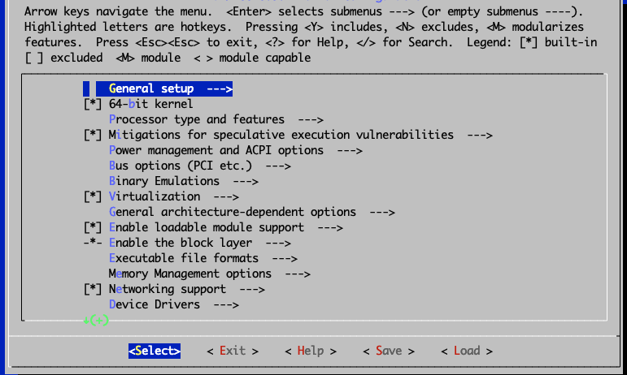

- - -
author: Wale Soyinka contributors: Steven Spencer, Ganna Zhyrnova tested on: Всі версії tags:
  - лабораторна вправа
  - Ядро Linux
  - компілятор
- - -

# Лабораторна робота 7: Ядро Linux

## Завдання

Після виконання цієї лабораторної роботи ви зможете:

- встановити нове ядро з двійкового пакета
- зібрати та встановити нове ядро з вихідних файлів

Приблизний час виконання цієї лабораторної роботи: 90 хвилин

## kernel

Одне із завдань, які вам час від часу може знадобитися виконати під час адміністрування системи Linux, – це оновлення або усунення несправностей, пов’язаних із ядром операційної системи.

Ядро є серцем операційної системи Linux. Це єдине, що об’єднує різні дистрибутиви Linux (Rocky Linux, Red Hat, Mandrake, SuSE, Yellow Dog тощо). Воно відповідає за керування різними системними ресурсами та служить рівнем абстракції між апаратним забезпеченням системи та програмним забезпеченням, яке взаємодіє з системою, надаючи драйвери обладнання.

Ядро постійно вдосконалюється, до нього завжди додаються нові функції або виправляються помилки. Вам як адміністратору може знадобитися оновити ядро до останньої версії, оскільки:

1. Нове ядро містить виправлення помилок або певні бажані оптимізації
2. Воно усуває діри в безпеці, які були присутні в старому ядрі
3. Воно містить драйвери для обладнання, яке ви не могли використовувати зі старим ядром.

### Вихідний код і версії ядра

Ядро містить понад мільйон рядків програмного коду C. Це являє собою так званий вихідний код ядра.

Основним сховищем для ядра є веб-сайт ядра, який підтримується за URL-адресою:

[www.kernel.org](https://www.kernel.org)

На цьому сайті ви завжди знайдете найновіші [і найстаріші] версії ядра.

Як уже згадувалося, ядро є загальним серед усіх різноманітних дистрибутивів Linux. Різні дистрибутиви іноді перепакують вихідний код для ядра, щоб полегшити встановлення та оновлення або щоб відповідати їхнім конкретним дистрибутивам.

У різних версіях вихідного коду ядра використовується наступна угода про найменування:

```bash
linux-<kernel.version>.tar.bz2    (or  linux-<kernel.version>.tar.gz)
```

Поточна конвенція полягає в тому, щоб називати та нумерувати основні нові випуски ядра як «Linux 5.x» (також званий мініатюрними або основними ядрами). Таким чином, першою з цієї серії буде версія Linux 5.0 (така ж, як 5.0.0), наступною буде версія Linux 5.1 (така ж, як 5.1.0), за нею буде версія Linux 5.2 і так далі.

Будь-які незначні зміни чи оновлення в кожній основній версії випуску буде відображено з кроком до третьої цифри. Їх зазвичай називають стабільними точковими випусками. Таким чином, наступним стабільним випуском для ядра серії 5.0.0 буде версія Linux 5.0.1, за якою піде версія 5.0.2 і так далі. Інший спосіб сказати це, наприклад, сказати, що версія Linux 5.0.4 є четвертим стабільним випуском на основі серії Linux 5.0.0.

### Модулі ядра

Модулі — це спільні об’єктні файли (з назвами module_name.o, module_name.ko тощо). Думайте про модулі так само, як про *драйвери* в Microsoft Windows.

Модулі — це фрагменти коду ядра, які можуть бути або не включені безпосередньо. Вони збираються окремо і можуть бути вставлені та видалені з працюючого ядра в будь-який час. Сучасні системи широко використовують підтримку завантажуваних модулів. Завантажувані модулі пропонують ряд переваг, таких як:

1. Це зменшує загальний розмір кінцевого образу ядра, оскільки вони не є частиною запущеного ядра.
2. Це економить оперативну пам’ять – вони завантажуються в оперативну пам’ять лише за потреби.

Деякі модулі потрібно скомпілювати безпосередньо в ядро, тоді як інші можна зробити окремими завантажуваними модулями.

Вибір, коли зробити певну функцію доступною як модуль або скомпілювати її в ядро, зазвичай досить простий. Якщо він використовується рідко і працює за потреби, вам слід скомпілювати його як модуль.

### Налаштування ядра

Загалом існує три методи, за допомогою яких можна керувати ядром у дистрибутивах Linux. Це:

1. Використання готової версії ядра від постачальника дистрибутивів.  напр. з використанням kernel-`<version>`.*.rpm. Це найбезпечніший, найпростіший і найбажаніший рекомендований варіант

2. За допомогою патчів. Використовуючи патчі як - patch-kernel.version.gz.

3. Компіляція ядра з джерела, наприклад, за допомогою linux-kernel.version.tar.bz2

У наступних кількох вправах ви оновите запущене ядро до дещо новішої версії. Для оновлення ви спочатку використаєте готову (бінарну) версію ядра Linux.

## Завдання 1

### Оновлення з бінарного пакета [rpm].

У цій вправі ви безпосередньо оновите своє ядро за допомогою програми rpm.

#### Щоб оновити ядро за допомогою rpm

1. Переконайтеся, що ви ввійшли в систему як root.

2. Запустіть утиліту `rpm`, щоб отримати список усіх пакетів ядра, які зараз встановлені в системі. Впишіть:

    ``` { .sh data-copy="rpm -q kernel" }
    rpm -q kernel
    ```

3. Виконайте утиліту `uname`, щоб переглянути деяку інформацію про поточне запущене ядро. Впишіть:

    ``` { .bash data-copy="uname --kernel-release" }
    uname --kernel-release

    5.*.el9_8.x86_64 
    ```

    Занотуйте номер версії/випуску у вихідних даних.

4. Використовуйте `dnf`, щоб [обдурити та] завантажити найновіший пакет ядра, доступний з офіційного репозиторію пакетів Rocky Linux. Впишіть:

    ```bash
    dnf download kernel
    ```

    Тепер у вашому PWD має бути збережений пакет RPM із назвою, схожою на kernel-*.x86_64.rpm.

5. Скористайтеся `rpm` ще раз, щоб отримати додаткову інформацію про завантажений пакет. Впишіть:

    ```bash
    [root@localhost ~]# rpm -qip kernel-*.x86_64.rpm
    ```

6. Використовуйте `rpm`, щоб перевірити та встановити завантажене kernel*.rpm, щоб переконатися, що всі його залежності виконуються. Впишіть:

    ```bash
    $ rpm --test  -ivh kernel-*.x86_64.rpm

    error: Failed dependencies:
    kernel-core-uname-r = *.x86_64 is needed by kernel-*.x86_64
    kernel-modules-uname-r = *.x86_64 is needed by kernel-*.x86_64
    ```

    З результату ми бачимо, що пакет має невиконані залежності.

7. Використовуйте `dnf`, щоб завантажити необхідні залежності. Впишіть:

    ```bash
    dnf download kernel-core-uname-r kernel-modules-uname-r
    ```

8. Запустіть `rpm` із параметром тестування, щоб перевірити, чи можна оновити пакет ядра. Впишіть:

    ```bash
    $ rpm --test  -Uvh kernel-*.rpm

    Verifying...       ################################# [100%]
    Preparing...       ################################# [100%]
    ```

    Цього разу все виглядає добре!

9. Нарешті, використовуйте `rpm` для встановлення пакета ядра та всіх його залежностей. Впишіть:

    ```bash
    sudo rpm  -ivh kernel-*.rpm
    ```

10. Використовуйте `rpm`, щоб отримати список усіх встановлених пакетів ядра у вашій системі.

    !!! Question "Питання"
    
         Чим відрізняється результат команди rpm -q kernel до та після встановлення нового ядра?

11. Ми завершили використовувати RPM для безпосереднього керування пакетами ядра в системі. Видаліть останній пакет ядра, який ви завантажили та встановили. Для цього вам потрібно буде вказати точну та правильну інформацію про архітектуру випуску епохи-версії (NEVRA) для ядра та пов’язаних із ним залежностей, які ви хочете видалити. Впишіть:

    ```bash
    [root@localhost ~]# rpm -e \
     kernel-<NEVRA> \
      kernel-core-<NEVRA> \
       kernel-modules-<NEVRA>
    ```

## Завдання 2

### Оновлення зі сховища пакетів

У цій вправі ви оновите своє ядро за допомогою програми `dnf`. DNF — це менеджер пакетів для дистрибутивів Linux на базі RPM. Його можна використовувати для керування системними пакетами за допомогою налаштованих онлайн-репозиторіїв.

#### Щоб оновити ядро за допомогою DNF

1. Переконайтеся, що ви ввійшли в систему як root.

2. Використовуйте `dnf`, щоб отримати список усіх пакетів ядра, встановлених у системі, і пакетів ядра, доступних у віддаленому сховищі пакетів. Впишіть:

    ```bash
    [root@localhost ~]# dnf list kernel
    ```

3. Використовуйте програму `dnf`, щоб перевірити наявність оновлених пакетів ядра. Впишіть:

    ```bash
    [root@localhost ~]# dnf check-update kernel
    ```

    Ви можете бачити або не бачити будь-які доступні оновлення пакетів ядра у вашій системі. Результат залежить від того, як нещодавно ви оновили всю систему.

4. Якщо ви бачите нову версію ядра в списку доступних, ви можете використати `dnf`, щоб запитати у віддаленому сховищі додаткову інформацію про пакет, виконавши:

    ```bash
    [root@localhost ~]# dnf info  kernel --available
    ```

5. Використовуйте `dnf` для автоматичного пошуку, завантаження та встановлення останнього пакета ядра, доступного у віддаленому сховищі пакетів. Впишіть:

    ```bash
    [root@localhost ~]# dnf -y update  kernel
    ```

6. Тепер перерахуйте встановлені пакети ядра. Впишіть:

    ```bash
    [root@localhost ~]# dnf list kernel --installed
    ```

## Завдання 3

### Оновіть ядро з початкового коду

У цій вправі ви створите нове ядро з початкових кодів, самостійно налаштувавши, скомпілювавши та встановивши його.

#### Щоб оновити ядро з вихідного коду

!!! note "Примітка"

    Версія ядра, використана в цій вправі, була останньою доступною. Остання доступна версія, коли ви читаєте цей матеріал, може бути іншою. Зірочка (*) була використана для позначення конкретної версії ядра.     Вам потрібно буде замінити «*» на конкретну версію, яку ви використовуєте. Наприклад, якщо припустити, що в наведених нижче кроках використовувалася версія ядра - 6.6.13.4, ядро буде називатися версією 6.6.*

1. Увійдіть в систему як користувач з правами адміністратора.

2. Встановіть необхідні засоби розробки. Впишіть:

    ```bash
    sudo dnf -y groupinstall 'Development Tools'
    ```

3. Встановіть необхідні бібліотеки. Впишіть:

    ```bash
    sudo dnf -y install ncurses-devel bc openssl-devel elfutils-libelf-devel python3 dwarves
    ```

4. Завантажте останнє джерело ядра, ввівши:

    ```bash
    [root@localhost ~]# curl -L -o linux-6.5.7.tar.xz \
    https://www.kernel.org/pub/linux/kernel/v6.x/linux-6.5.7.tar.xz 
    ```

    Зверніть увагу, що linux-6.5.7.tar.xz є найновішим ядром, доступним на момент написання цієї статті. Ви повинні замінити linux-6.5.7.tar.xz або linux-6.*.tar.xz будь-якою версією ядра, яку ви виберете для цієї вправи.

5. Розпакуйте архів ядра у ваш pwd. Впишіть:

    ```bash
    [root@localhost ~]# tar xvJf linux-6.*.tar.xz
    ```

    Команда tar створить новий каталог під назвою «linux-6.*» у вашому PWD.

6. Перелічіть вміст нового вихідного каталогу ядра

7. Змініть (cd) у вихідний каталог ядра. Впишіть:

    ```bash
    cd linux-6.5.7
    ```

8. Очистіть (підготуйте) середовище збирання ядра за допомогою команди `make mrproper`. Впишіть:

    ```bash
    make  O=~/build/kernel mrproper
    ```

9. Скопіюйте та перейменуйте існуючий файл конфігурації з каталогу /boot у наше середовище збирання ядра:

    ```bash
    cp /boot/config-`uname -r` ~/build/kernel/.config
    ```

10. Запустіть утиліту налаштування графічного ядра. Впишіть:

    ```bash
    make O=~/build/kernel menuconfig
    ```

    З’явиться екран, схожий на цей:

    

    !!! Note "Примітка"

     Екран конфігурації ядра, який з’являється, поділений приблизно на три частини:
    
     1. У верхній частині показано корисну інформацію, комбінації клавіш і легенди, які допоможуть вам орієнтуватися в програмі.
    
     2. Основна частина екрана показує розширюваний деревовидний список загальних настроюваних параметрів ядра. Ви можете детальніше перейти до елементів зі стрілками в батьківському меню, щоб переглянути та/або налаштувати підменю (або дочірні) елементи.
    
     3. Нарешті, у нижній частині екрана відображаються фактичні дії/параметри, які користувач може вибрати.

11. Ви додасте підтримку файлової системи Btrfs до нового ядра для демонстраційних цілей. Використовуйте клавіші зі стрілками для навігації та виділення пункту Файлові системи на головному екрані конфігурації. Вибравши файлові системи, натисніть ++enter++, щоб переглянути підменю або дочірні елементи для файлових систем.

    Використовуйте клавіші зі стрілками в розділі «Файлові системи», щоб перейти до *Btrfs filesystem support (Підтримка файлової системи Btrfs)*.

12. Виділивши *Підтримка файлової системи Btrfs*, натисніть `y`, щоб увімкнути підтримку `btrfs` у спеціальному ядрі. Коли ви закінчите, біля виділеної опції має з’явитися символ зірочки (*). Кінцевий екран має виглядати так, як показано тут:

    

13. Поверніться до головного екрана налаштування ядра, двічі натиснувши ++escape++ на клавіатурі.

14. Вийдіть із програми налаштування ядра, двічі натиснувши клавішу ++escape++ на клавіатурі. Вихід із конфігуратора ядра примусово збереже ваші зміни у файлі .config у корені дерева вихідних кодів ядра.

15. З’явиться діалогове вікно з пропозицією зберегти нову конфігурацію. Переконайтеся, що вибрано Yes, потім натисніть ++enter++.
16. Після завершення роботи утиліти конфігурації ядра ви повернетесь до оболонки — у дерево вихідних кодів ядра.

    !!! tip "Порада"
    
         Щоб переглянути результати деяких змін, які ви внесли за допомогою інструмента `menuconfig`, скористайтеся утилітою grep, щоб переглянути безпосередньо збережений файл .config. Наприклад, щоб переглянути ефект увімкнення підтримки файлової системи `btrfs`, введіть наступне:

        ```bash
        # grep  ^CONFIG_BTRFS_FS  ~/build/kernel/.config

        CONFIG_BTRFS_FS=y
        ```

17. Давайте оптимізуємо час збирання ядра та зменшимо дисковий простір, який використовується на етапі компіляції ядра. Якщо встановити `CONFIG_DEBUG_INFO=no`, отриманий образ ядра НЕ міститиме інформацію про налагодження, що призведе до зменшення зображення ядра. Це видаляє символи налагодження зі вбудованого ядра та модулів. Впишіть:

    ```bash
    $ ./scripts/config --file ~/build/kernel/.config  -d DEBUG_INFO \
      -d DEBUG_INFO_DWARF_TOOLCHAIN_DEFAULT -d DEBUG_INFO_DWARF4  \
      -d DEBUG_INFO_DWARF5 -e CONFIG_DEBUG_INFO_NONE
    ```

18. Виконайте ще один важливий крок для спеціальних ядер у дистрибутиві Rocky Linux. Впишіть:

    ```bash
    sed -ri '/CONFIG_SYSTEM_TRUSTED_KEYS/s/=.+/=""/g' ~/build/kernel/.config 
    ```

19. Додайте прості налаштування до нового ядра, що дозволить вам легше відрізнити його від інших стандартних ядер. Для цього скористайтеся утилітою `sed` для редагування Makefile на місці. Впишіть:

    ```bash
    sed  -i 's/^EXTRAVERSION.*/EXTRAVERSION = -custom/'  Makefile
    ```

20. Перевірте повну версію ядра, яку ви щойно налаштували, передавши ціль `kernelversion` команді `make`. Впишіть:

    ```bash
    $ make O=~/build/kernel kernelversion
    ```

    Вихід

    ```bash
    make[1]: Entering directory '/home/rocky/build/kernel'
    6.5.7-custom
    make[1]: Leaving directory '/home/rocky/build/kernel'
    ```

21. Ви готові скомпілювати ядро. Впишіть:

    ```bash
    sudo make  O=~/build/kernel -j $(nproc)
    ```

    Вихід

    ```bash
    make[1]: Entering directory '/root/build/kernel'
    SYNC    include/config/auto.conf.cmd
    GEN     Makefile
    HOSTCC  scripts/kconfig/conf.o
    ...
    ```

22. Після успішного завершення компіляції ви отримаєте готове ядро, яке зберігається тут:

    ```bash
    ~/build/kernel/arch/x86/boot/bzImage
    ```

23. Встановіть ті частини ядра, які були налаштовані як модулі. Впишіть:

    ```bash
    sudo make O=~/build/kernel modules_install
    ```

24. Оскільки ядро вже зібрано, настав час його встановити. Впишіть:

    ```bash
    sudo cp ~/build/kernel/arch/x86/boot/bzImage  \
    /boot/vmlinuz-<kernel-version>
    ```

    Замініть `<kernel-version>` номером версії вашого спеціального ядра. Для зразка ядра, яке ми використовуємо в цьому посібнику, ім’я файлу буде vmlinuz-6.*-custom. Отже, ось точна команда для цього прикладу:

    ```bash
    sudo cp ~/build/kernel/arch/x86/boot/bzImage  /boot/vmlinuz-6.5.7-custom
    ```

25. Скопіюйте та перейменуйте відповідний файл System.map у каталог /boot, використовуючи ті самі імена:

    ```bash
    sudo cp -v ~/build/kernel/System.map /boot/System.map-6.5.7-custom
    ```

26. Використовуйте утиліту `kernel-install`, щоб завершити крок файлу. Впишіть:

    ```bash
    sudo kernel-install add  6.5.7-custom /boot/vmlinuz-6.5.7-custom
    ```

27. Утиліта `kernel-install` створить новий завантажувальний запис у файлі конфігурації завантажувача. Для систем на основі EFI ви можете шукати відповідні записи в /boot/loader/entries/.

28. Запустіть програму grubby, щоб переглянути стандартне ядро для сервера. Впишіть:

    ```bash
    sudo grubby --default-kernel
    ```

29. Все готово. Момент істини зараз. Останнє ядро, ймовірно, буде налаштовано як нове ядро за замовчуванням для завантаження. Ви можете перезавантажити систему та вибрати нове користувацьке ядро в меню завантаження GRUB, якщо у вас є доступ до консолі системи. Якщо після перезавантаження все піде добре, ви можете перевірити, чи система використовує спеціальне ядро, виконавши команду `uname` так:

    ```bash
    $ uname -r
    ```
