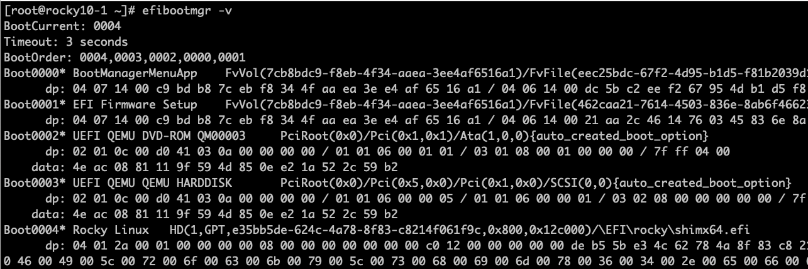

# UEFI, SHIMs, and Secure Boot

When you press the power button on a modern computer, a complex sequence of events begins long before Linux starts.
Firmware initializes hardware, discovers bootable devices, loads early boot software, and eventually transfers control to an operating system kernel.
For decades this process relied on firmware that performed little or no verification of what it executed. That design made the early boot process an attractive target for malware.
UEFI and Secure Boot were introduced to address this problem.

This article introduces the modern PC boot architecture and explains why Secure Boot exists. Later posts in this series will build on this foundation and explore how Linux distributions integrate with Secure Boot.


## The Boot Process at a High Level

Before diving into technical details, it helps to understand the overall stages of system startup.

A simplified version of the modern boot sequence looks like this:

1. System power on
2. Firmware initialization
3. Hardware discovery
4. Bootloader discovery
5. Bootloader execution
6. Operating system kernel loading

Each stage runs with extremely high privilege. If an attacker can insert malicious code early in this sequence, that code may control everything that runs later.

Because of this, the boot process is a critical security boundary.


## Legacy BIOS Boot

For many years, PCs used the Basic Input Output System aka - BIOS.

BIOS firmware performs hardware initialization and then attempts to load the first sector of a bootable disk into memory.

This sector is called the Master Boot Record.

The Master Boot Record contains both a partition table and a small piece of executable code that loads the next stage of the bootloader.

The process looks roughly like this:

1. BIOS initializes CPU, memory, and hardware devices
2. BIOS selects a boot device
3. BIOS reads the Master Boot Record
4. The MBR code loads additional bootloader code
5. The bootloader loads the operating system

This design has two major limitations.

First, the Master Boot Record is only 512 bytes, which severely limits functionality.

Second, BIOS performs no cryptographic verification of what it loads.

If malicious software modifies the MBR, the firmware will execute it without question.

This weakness allowed the creation of a class of malware called bootkits.

## Bootkits and Early Boot Malware

Bootkits are designed to infect the earliest stages of the boot process.

Unlike normal malware that runs inside the operating system, bootkits execute before the operating system kernel loads.

This makes them particularly potent because:

- They can hide from operating system security tools
- They can intercept kernel loading
- They can modify system memory before protections activate

Historically, bootkits targeted components like - The Master Boot Record, Bootloader code, and Firmware extensions

Because BIOS performed no signature verification, attackers only needed write access to disk or firmware to persist across reboots.

These weaknesses motivated the industry to rethink the boot architecture.


## The Move to UEFI

The Unified Extensible Firmware Interface replaces the legacy BIOS model.

UEFI provides a more flexible firmware environment and introduces the concept of executing EFI applications during boot.

Instead of loading a tiny 512 byte sector, UEFI loads full executable files stored on a dedicated partition called the EFI System Partition.

These files use the PE executable format and typically have the extension `.efi`.

Examples include:

- Bootloaders such as GRUB
- Boot managers such as systemd-boot
- Firmware utilities

!!! note "Bootloader vs Boot Manager"

    A *boot manager* is responsible for selecting which operating system or boot entry should be started. It presents a menu of choices and decides which boot target to launch. A *bootloader*, on the other hand, is responsible for loading the operating system kernel into memory and transferring control to it.

    In many Linux systems these roles are combined in the same program. For example, GRUB2 can present a boot menu (acting as a boot manager) and then load the Linux kernel (acting as a bootloader).


The modern boot flow looks roughly like this:

1. System power on
2. UEFI firmware initializes hardware
3. Firmware loads configuration variables
4. Firmware searches for EFI boot entries
5. Firmware loads an EFI application
6. The EFI application loads the operating system kernel

This architecture allows much richer functionality than the legacy BIOS model.

However, it also creates a larger attack surface.


## The EFI System Partition

UEFI systems store bootloaders in a dedicated partition known as the EFI System Partition.

This partition is usually formatted with FAT32 and mounted at `/boot/efi` in Linux systems.

Use the `tree or ls command to view the contents of the EFI System Partition:

```
# tree  /boot/efi/
/boot/efi/
└── EFI
    ├── BOOT
    │   ├── BOOTX64.EFI
    │   └── fbx64.efi
    └── rocky
        ├── BOOTX64.CSV
        ├── grub.cfg
        ├── grubx64.efi
        ├── mmx64.efi
        ├── shim.efi
        ├── shimx64.efi
        └── shimx64-rocky.efi
```

You'll notice some important EFI executables under the `/boot/efi/EFI/rocky/` sub-folder such as `shimx64.efi`, `grubx64.efi`, and so on. Because these files are executed directly by the firmware, they act as critical security components.

These EFI binaries/executables form the beginning of the Linux boot chain.

Later articles will explore how these files are signed and verified.


## Why Secure Boot Was Introduced

UEFI alone does not automatically make systems secure.

Without verification, firmware would still execute any EFI binary it encounters.

Secure Boot adds a cryptographic verification step.

When Secure Boot is enabled, firmware verifies that EFI binaries are signed by trusted certificates before executing them.

If a binary is not signed by a trusted key, the firmware refuses to run it.

This mechanism establishes the beginning of a trust chain that continues through the bootloader and eventually to the operating system kernel.


## The Concept of a Chain of Trust

Secure Boot works by extending trust from one component to the next.

Each stage verifies the next stage before executing it.

The process follows this pattern:

1. Firmware verifies an EFI application
2. The EFI application verifies the next boot component
3. The bootloader verifies the operating system kernel

If any stage fails verification, the boot process stops.

Later articles will explore how this trust chain works in detail.


## Hands-On: Determine Whether Your System Uses UEFI

You can quickly determine whether a Linux system booted using UEFI.

Run the following command:

```
ls /sys/firmware/efi
```

If the directory exists, the system booted using UEFI.

If the directory does not exist, the system booted using legacy BIOS mode.


## Hands-On: View UEFI Boot Entries

UEFI firmware stores boot configuration entries that point to EFI executables.

You can inspect them using the `efibootmgr` tool.

Install it if necessary:

```
sudo dnf -y install efibootmgr
```

Then run:

```
efibootmgr -v
```

This displays boot entries stored in firmware along with the paths to EFI executables.

Example output is shown in the figure below:



These entries tell firmware which EFI applications to launch during boot.


## Summary

In this article we explored how modern systems boot and why Secure Boot was created.

Key ideas introduced here include:

- The limitations of legacy BIOS boot
- The design of UEFI firmware
- The role of EFI applications
- The importance of early boot security

In the next installment of this secure boot series, we will examine the cryptographic foundations that make Secure Boot possible.

We will introduce digital signatures, public key cryptography, and the concept of a chain of trust.

