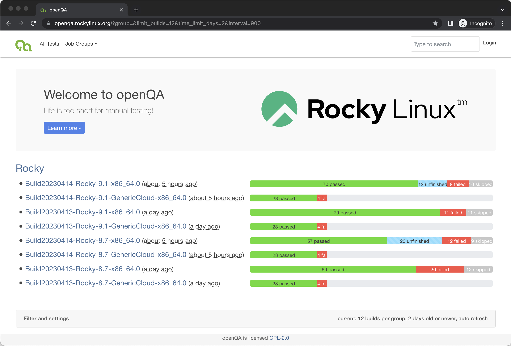
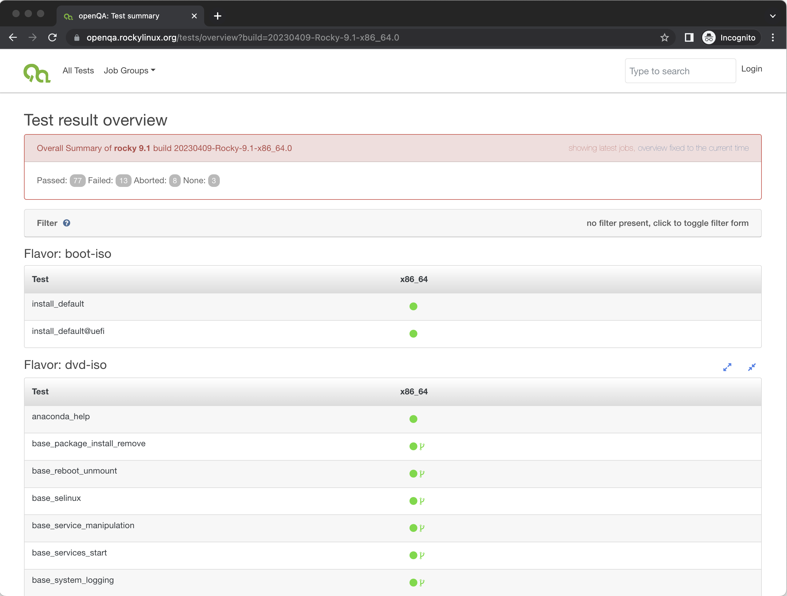

# openqa-cli POST Examples

This page will provide a brief overview of some basic `openqa-cli` `POST` examples.

## System / Access Requirements

To complete any of the examples please complete the API `POST` Access steps outlined in the [openQA - Rocky Production Access](openqa_access.md) document.

## Basic POST

A basic `POST` can be used for any of the default test suites for the various {{ rc.prod }} media that are made available. The following examples show some of these standard `POST`s that are commonly used by our team and will be used to demonstrate how some minor variations.

### FLAVOR=boot-iso

This first `POST` is the most basic, simply providing the minimal set of variables required to trigger the standard test suite for the {{ rc.prod }} {{ rc.r9 }} boot ISO on openqa workers for the `x86_64` architecture. All tests of the test suite are predetermined and configure on the openQA server. Since the boot ISO doesn't contain any packages this test suite is effectively a network install from standard {{ rc.prod }} repository servers and/or mirrors.

```bash
$ openqa-cli api -X POST isos ISO=Rocky-{{ rc.r9 }}-x86_64-boot.iso ARCH=x86_64 \
  DISTRI=rocky FLAVOR=boot-iso VERSION={{ rc.r9}} CURRREL=9 BUILD={{ rc.r9date }}-Rocky-{{ rc.r9 }}-x86_64.0
```

### FLAVOR=minimal-iso

This `POST` demonstrates how a different media type, in this case the minimal ISO, for an alternate {{ rc.prod }} version, in this case {{ rc.prod }} {{ rc.r8 }}, can be triggered. As can be seen by this and the previous `POST` the `BUILD` variable will typically be designate the date, version and architecture of the test suite. Since the minimal ISO contains all packages required to conduct a ***minimal*** install of {{ rc.prod }} that is the behavior of this test suite.

```bash
$ openqa-cli api -X POST isos ISO=Rocky-{{ rc.r8 }}-x86_64-minimal.iso ARCH=x86_64 \
  DISTRI=rocky FLAVOR=minimal-iso VERSION={{ rc.r8 }} CURRREL=8 BUILD={{ rc.r8date }}-Rocky-{{ rc.r8 }}-x86_64.0
```

### FLAVOR=package-set

This `POST` demonstrates specification of the final normal media type, the dvd ISO, along with what is called a `FLAVOR`, in this case `package-set` for the `x86_64` architecture and {{ rc.prod }} {{ rc.r9 }}. Since the dvd ISO contains all of the packages available at release of a specific version or {{ rc.prod }} the `package-set` test suite will test installation of all primary installation types of {{ rc.prod }} not included in the `minimal-iso` test suite above.

```bash
$ openqa-cli api -X POST isos ISO=Rocky-{{ rc.r9 }}-x86_64-dvd.iso ARCH=x86_64 \
  DISTRI=rocky FLAVOR=package-set VERSION={{ rc.r9 }} CURRREL=9 BUILD={{ rc.r9date }}-Rocky-{{ rc.r9 }}-x86_64.0
```

These three test suites provide for the minimal testing of all ISOs produced for a given release of {{ rc.prod }}. 

## Advanced POST

In addition to the [Basic POSTs](#basic-post) described above there are additional default test suites that use the dvd ISO media and include substantially more test cases. Those include:

- installing in graphical, text and serial console
- installation for standard BIOS and UEFI
- validation of the Anaconda help system
- disk layout variations including LVM, RAID, partition shrink and/or grow, iSCSI and LUKS
- PXE installation from various network sources
- installation in various languages

Standard `POST`s for these test suites is very similar to the basic POSTs above and are shown below...

### FLAVOR=dvd-iso

```bash
$ openqa-cli api -X POST isos ISO=Rocky-{{ rc.r9 }}-x86_64-dvd.iso ARCH=x86_64 \
  DISTRI=rocky FLAVOR=dvd-iso VERSION={{ rc.r9 }} CURRREL=9 BUILD={{ rc.r9date }}-Rocky-{{ rc.r9 }}-x86_64.0
```

### FLAVOR=universal

```bash
$ openqa-cli api -X POST isos ISO=Rocky-{{ rc.r9 }}-x86_64-dvd.iso ARCH=x86_64 \
  DISTRI=rocky FLAVOR=universal VERSION={{ rc.r9 }} CURRREL=9 BUILD={{ rc.r9date }}-Rocky-{{ rc.r9 }}-x86_64.0
```

## Collection of test suites by BUILD

A feature of openQA is that for a given job group test suites which use the same `BUILD` identifier are collected into a single view in the web UI.

{ loading=lazy }

Thus, the examples show above which all use `BUILD={{ rc.r9date }}-Rocky-{{ rc.r9 }}-x86_64.0` are all shown in a single view. Additionally, that view is accessible via a predictable URI, for example [`https://openqa.rockylinux.org/tests/overview?build={{ rc.r9date }}-Rocky-{{ rc.r9 }}-x86_64.0`](https://openqa.rockylinux.org/tests/overview?build={{ rc.r9date }}-Rocky-{{ rc.r9 }}-x86_64.0) as shown below...

{ loading=lazy }

## References

[openQA Documentation](https://open.qa/documentation/)


