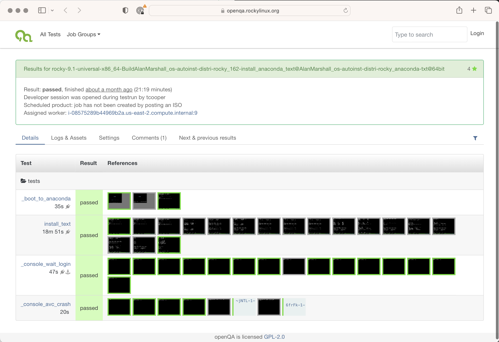
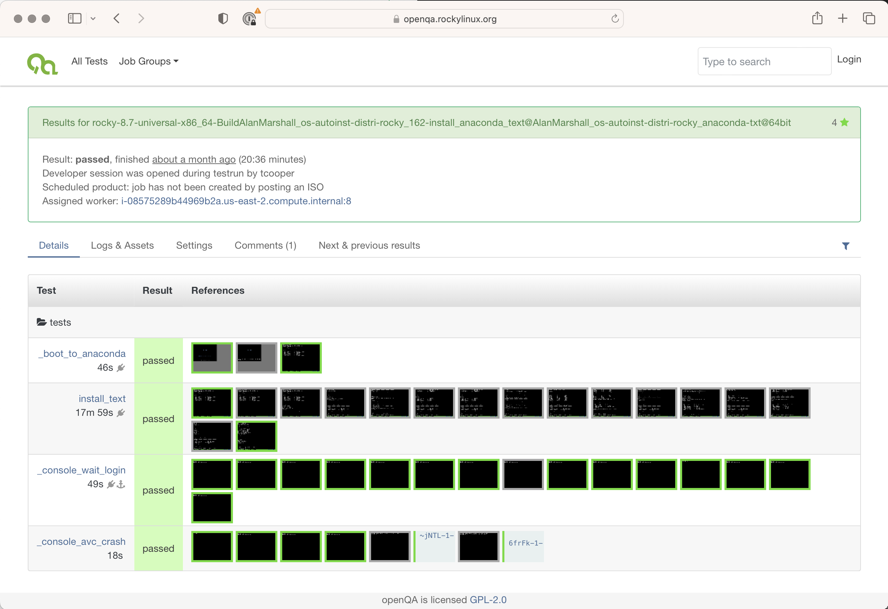

# openqa-clone-custom-git-refspec Examples

This page will provide a brief overview of basic and advanced job cloning using the `openqa-clone-custom-git-refspec` command.

At a high level `openqa-clone-custom-git-refspec` can be viewed as a mechanism to test PRs for openQA tests directly in a {{ rc.prod }} openQA instance with making changes to the default configuration. As such, it can support testing of PRs that change test code and needles as long as changes to `templates.fif.json` are not also required. A combination of `openqa-clone-custom-git-refspec` and `openqa-clone-job` (which is actually used by `openqa-clone-custom-git-refspec` under the hood) can be used for some cases where `POST` variables are pre-defined in `templates.fif.json`.

## System / Access Requirements

To complete any of the examples please complete the API `POST` Access steps outlined in the [openQA - Access](openqa_access.md) document.

## Basic `openqa-clone-custom-git-refspec`

The following example demonstrates the testing of an open Github pull request in the {{ rc.prod }} openQA production system. The PR only changes test code and does not supply updated needles for the test.

### Github PR information

***NOTE: The Github CLI tool (`gh`) is used to display PR information statically in this guide.***

```text
➜  os-autoinst-distri-rocky git:(develop) gh pr view 168
Serial console install #168
Merged • AlanMarshall wants to merge 1 commit into develop from serial_console • about 27 days ago
+5 -2 • No checks
Reviewers: akatch (Approved), tcooper (Approved), lumarel (Requested)
Labels: priority: medium, type: bug, test suite


  Network is enabled by default at v9 so requires conditional code to handle multiple versions.
  Tested for 9.1, 8.7 & 8.8:

    openqa-cli api -X POST isos ISO=Rocky-9.1-20221214.1-x86_64-dvd.iso ARCH=x86_64 DISTRI=rocky FLAVOR=universal
  VERSION=9.1 BUILD=-"$(date +%Y%m%d.%H%M%S).0"-9.1-20221214.1-universal TEST=install_serial_console
    openqa-cli api -X POST isos ISO=Rocky-8.7-x86_64-dvd1.iso ARCH=x86_64 DISTRI=rocky FLAVOR=universal VERSION=8.7 BUILD=-
  "$(date +%Y%m%d.%H%M%S).0"-8.7-20221110-universal TEST=install_serial_console
    openqa-cli api -X POST isos ISO=Rocky-8.8-x86_64-dvd1.iso ARCH=x86_64 DISTRI=rocky FLAVOR=universal VERSION=8.8 BUILD=-
  "$(date +%Y%m%d.%H%M%S).0"-8.8-lookahead-universal TEST=install_serial_console

  Result: Tests pass.
  Also confirm that all main hub check boxes are checked and user test created prior to start of installation.
  Fixes Issue #102

View this pull request on GitHub: https://github.com/rocky-linux/os-autoinst-distri-rocky/pull/168
```

Above is the information provided in the original PR and it includes tests performed in Alan's openQA development system. We can rerun failing tests in the {{ rc.prod }} openQA system after identifying an appropriate job ID for each Rocky Linux version we are testing. For this example the openQA WebUI was used to find appropriate test IDs to clone.

### Run `openqa-clone-custom-git-refspec` in `--verbose --dry-run` mode

In practice it is useful to run `openqa-clone-custom-git-refspec` in `--verbose` and `--dry-run` mode to observe it's behavior even for the Basic cases...

```bash
$ openqa-clone-custom-git-refspec --verbose --dry-run \
    https://github.com/rocky-linux/os-autoinst-distri-rocky/pull/168 \
    https://openqa.rockylinux.org/tests/16080 2>&1 | tee pr-168
```

***NOTE: The full output of `openqa-clone-custom-git-refspece` will not be shown here.***

```diff
+ shift
+ true
+ case "$1" in
+ dry_run=true
+ shift
+ true
+ case "$1" in
+ shift
+ break
+ job_list=https://openqa.rockylinux.org/tests/16080
+ [[ -z '' ]]
+ first_arg=https://github.com/rocky-linux/os-autoinst-distri-rocky/pull/168
+ [[ https://github.com/rocky-linux/os-autoinst-distri-rocky/pull/168 == *\p\u\l\l* ]]
+ pr_url=https://github.com/rocky-linux/os-autoinst-distri-rocky/pull/168
+ target_repo_part=https://github.com/rocky-linux/os-autoinst-distri-rocky
+ pr=168
+ pr=168
+ [[ -z '' ]]
+ pr_url=https://api.github.com/repos/rocky-linux/os-autoinst-distri-rocky/pulls/168
++ eval 'curl -s https://api.github.com/repos/rocky-linux/os-autoinst-distri-rocky/pulls/168'
+++ curl -s https://api.github.com/repos/rocky-linux/os-autoinst-distri-rocky/pulls/168

...<snip>...

++ jq -r '.NEEDLES_DIR | select (.!=null)'
+ old_needledir=
+ local needles_dir=
+ needles_dir=rocky/needles
+ local repo_branch=AlanMarshall/os-autoinst-distri-rocky#serial_console
+ local test_suffix=@AlanMarshall/os-autoinst-distri-rocky#serial_console
+ local build=AlanMarshall/os-autoinst-distri-rocky#168
+ local casedir=https://github.com/AlanMarshall/os-autoinst-distri-rocky.git#serial_console
+ local GROUP=0
+ local dry_run=true
+ local scriptdir
++ dirname /usr/bin/openqa-clone-custom-git-refspec
+ scriptdir=/usr/bin
+ local 'cmd=true /usr/bin/openqa-clone-job --skip-chained-deps --parental-inheritance --within-instance "https://openqa.rockylinux.org" "15973" _GROUP="0" TEST+="@AlanMarshall/os-autoinst-distri-rocky#serial_console" BUILD="AlanMarshall/os-autoinst-distri-rocky#168" CASEDIR="https://github.com/AlanMarshall/os-autoinst-distri-rocky.git#serial_console" PRODUCTDIR="os-autoinst-distri-rocky" NEEDLES_DIR="rocky/needles"'
+ [[ 0 -ne 0 ]]
+ [[ -n '' ]]
+ eval 'true /usr/bin/openqa-clone-job --skip-chained-deps --parental-inheritance --within-instance "https://openqa.rockylinux.org" "15973" _GROUP="0" TEST+="@AlanMarshall/os-autoinst-distri-rocky#serial_console" BUILD="AlanMarshall/os-autoinst-distri-rocky#168" CASEDIR="https://github.com/AlanMarshall/os-autoinst-distri-rocky.git#serial_console" PRODUCTDIR="os-autoinst-distri-rocky" NEEDLES_DIR="rocky/needles"'
++ true /usr/bin/openqa-clone-job --skip-chained-deps --parental-inheritance --within-instance https://openqa.rockylinux.org 15973 _GROUP=0 TEST+=@AlanMarshall/os-autoinst-distri-rocky#serial_console BUILD=AlanMarshall/os-autoinst-distri-rocky#168 CASEDIR=https://github.com/AlanMarshall/os-autoinst-distri-rocky.git#serial_console PRODUCTDIR=os-autoinst-distri-rocky NEEDLES_DIR=rocky/needles
```

What can be seen from the complete `--dry-run` output for `openqa-clone-custom-git-refspec` is that both the job to be cloned and the PR to be used are inspected and a `openqa-clone-job` command is generated to be submitted to the openQA system the job is being cloned on.

Without using `--dry-run` the final `openqa-clone-job` command shown above will be run causing the job of interest to be cloned with additional `POST` variables that will cause the repository/branch referenced in the PR to be cloned into the test directory with important files referenced in the cloned job.

### Run `openqa-clone-custom-git-refspec` without `--verbose --dry-run` mode...

```bash
$ openqa-clone-custom-git-refspec \
    https://github.com/rocky-linux/os-autoinst-distri-rocky/pull/168 \
    https://openqa.rockylinux.org/tests/16080
Created job #16119: rocky-9.1-universal-x86_64-Build20230329-Rocky-9.1-x86_64.0-install_serial_console@64bit -> https://openqa.rockylinux.org/t16119
```

### Cloned job information...

```bash
$ openqa-cli api jobs/16119 --pretty
{
   "job" : {
      "assets" : {
         "iso" : [
            "Rocky-9.1-20221214.1-x86_64-dvd.iso"
         ]
      },
      "assigned_worker_id" : 5,
      "blocked_by_id" : null,
      "children" : {
         "Chained" : [],
         "Directly chained" : [],
         "Parallel" : []
      },
      "clone_id" : 16121,
      "group_id" : null,
      "has_parents" : 0,
      "id" : 16119,
      "name" : "rocky-9.1-universal-x86_64-BuildAlanMarshall_os-autoinst-distri-rocky_168-install_serial_console@AlanMarshall_os-autoinst-distri-rocky_serial_console@64bit",
      "parents" : {
         "Chained" : [],
         "Directly chained" : [],
         "Parallel" : []
      },
      "parents_ok" : 1,
      "priority" : 10,
      "reason" : "isotovideo abort: isotovideo received signal TERM",
      "result" : "user_restarted",
      "settings" : {
         "ANACONDA_TEXT" : "1",
         "ARCH" : "x86_64",
         "ARCH_BASE_MACHINE" : "64bit",
         "BACKEND" : "qemu",
         "BUILD" : "AlanMarshall\/os-autoinst-distri-rocky#168",
         "CASEDIR" : "https:\/\/github.com\/AlanMarshall\/os-autoinst-distri-rocky.git#serial_console",
         "CLONED_FROM" : "https:\/\/openqa.rockylinux.org\/tests\/15973",
         "CURRREL" : "9",
         "DISTRI" : "rocky",
         "FLAVOR" : "universal",
         "HDDSIZEGB" : "15",
         "ISO" : "Rocky-9.1-20221214.1-x86_64-dvd.iso",
         "LOCATION" : "https:\/\/download.rockylinux.org\/pub\/rocky\/9.1\/BaseOS",
         "MACHINE" : "64bit",
         "NAME" : "00016119-rocky-9.1-universal-x86_64-BuildAlanMarshall_os-autoinst-distri-rocky_168-install_serial_console@AlanMarshall_os-autoinst-distri-rocky_serial_console@64bit",
         "NEEDLES_DIR" : "rocky\/needles",
         "NICTYPE_USER_OPTIONS" : "net=172.16.2.0\/24",
         "NO_UEFI_POST" : "1",
         "PART_TABLE_TYPE" : "mbr",
         "PRODUCTDIR" : "os-autoinst-distri-rocky",
         "QEMUCPU" : "Nehalem",
         "QEMUCPUS" : "2",
         "QEMURAM" : "2048",
         "QEMU_HOST_IP" : "172.16.2.2",
         "QEMU_VIDEO_DEVICE" : "virtio-vga",
         "QEMU_VIRTIO_RNG" : "1",
         "SERIAL_CONSOLE" : "1",
         "TEST" : "install_serial_console@AlanMarshall\/os-autoinst-distri-rocky#serial_console",
         "TEST_SUITE_NAME" : "install_serial_console",
         "TEST_TARGET" : "ISO",
         "VERSION" : "9.1",
         "VIRTIO_CONSOLE_NUM" : "2",
         "WORKER_CLASS" : "qemu_x86_64",
         "XRES" : "1024",
         "YRES" : "768"
      },
      "state" : "done",
      "t_finished" : "2023-03-29T06:19:37",
      "t_started" : "2023-03-29T06:12:26",
      "test" : "install_serial_console@AlanMarshall\/os-autoinst-distri-rocky#serial_console"
   }
}
```


## Advanced `openqa-clone-custom-git-refspec`

The following example demonstrates the testing of an open Github pull request in the {{ rc.prod }} openQA production system. The PR changes test code and supplies updated needles for the test.

### Github PR information

```text
➜  os-autoinst-distri-rocky git:(nazunalika/develop) gh pr view 162

Anaconda text install #162
Open • AlanMarshall wants to merge 2 commits into develop from anaconda-txt • about 1 day ago
+30 -5 • No checks
Reviewers: akatch (Approved), lumarel (Requested), tcooper (Requested)
Labels: priority: medium, type: bug, test suite


  Added new needle for text install.
  Deleted redundant code.
  Tested for 9.1, 8.7 & 8.8:

    openqa-cli api -X POST isos ISO=Rocky-9.1-20221214.1-x86_64-dvd.iso ARCH=x86_64 DISTRI=rocky FLAVOR=universal
  VERSION=9.1 BUILD=-"$(date +%Y%m%d.%H%M%S).0"-9.1-20221214.1-universal TEST=install_anaconda_text
    openqa-cli api -X POST isos ISO=Rocky-8.7-x86_64-dvd1.iso ARCH=x86_64 DISTRI=rocky FLAVOR=universal VERSION=8.7 BUILD=-
  "$(date +%Y%m%d.%H%M%S).0"-8.7-20221110-universal TEST=install_anaconda_text
    openqa-cli api -X POST isos ISO=Rocky-8.8-x86_64-dvd1.iso ARCH=x86_64 DISTRI=rocky FLAVOR=universal VERSION=8.8 BUILD=-
  "$(date +%Y%m%d.%H%M%S).0"-8.8-lookahead-universal TEST=install_anaconda_text

  Result: Pass
  Fixes Issue #145


akatch approved (Member) • 18h • Newest comment

  All indicated tests pass.


View this pull request on GitHub: https://github.com/rocky-linux/os-autoinst-distri-rocky/pull/162
```

### Run `openqa-clone-custom-git-refspec` in `--verbose --dry-run` mode

```diff
$ openqa-clone-custom-git-refspec --verbose --dry-run https://github.com/rocky-linux/os-autoinst-distri-rocky/pull/162 https://openqa.rockylinux.org/tests/13371
+ shift
+ true
+ case "$1" in
+ dry_run=true
+ shift
+ true
+ case "$1" in
+ shift
+ break
+ job_list=https://openqa.rockylinux.org/tests/13371
+ [[ -z '' ]]
+ first_arg=https://github.com/rocky-linux/os-autoinst-distri-rocky/pull/162
+ [[ https://github.com/rocky-linux/os-autoinst-distri-rocky/pull/162 == *\p\u\l\l* ]]
+ pr_url=https://github.com/rocky-linux/os-autoinst-distri-rocky/pull/162
+ target_repo_part=https://github.com/rocky-linux/os-autoinst-distri-rocky


...<snip>...

++ jq -r '.NEEDLES_DIR | select (.!=null)'
+ old_needledir=
+ local needles_dir=
+ needles_dir=rocky/needles
+ local repo_branch=AlanMarshall/os-autoinst-distri-rocky#anaconda-txt
+ local test_suffix=@AlanMarshall/os-autoinst-distri-rocky#anaconda-txt
+ local build=AlanMarshall/os-autoinst-distri-rocky#162
+ local casedir=https://github.com/AlanMarshall/os-autoinst-distri-rocky.git#anaconda-txt
+ local GROUP=0
+ local dry_run=true
+ local scriptdir
++ dirname /usr/bin/openqa-clone-custom-git-refspec
+ scriptdir=/usr/bin
+ local 'cmd=true /usr/bin/openqa-clone-job --skip-chained-deps --parental-inheritance --within-instance "https://openqa.rockylinux.org" "13371" _GROUP="0" TEST+="@AlanMarshall/os-autoinst-distri-rocky#anaconda-txt" BUILD="AlanMarshall/os-autoinst-distri-rocky#162" CASEDIR="https://github.com/AlanMarshall/os-autoinst-distri-rocky.git#anaconda-txt" PRODUCTDIR="os-autoinst-distri-rocky" NEEDLES_DIR="rocky/needles"'
+ [[ 0 -ne 0 ]]
+ [[ -n '' ]]
+ eval 'true /usr/bin/openqa-clone-job --skip-chained-deps --parental-inheritance --within-instance "https://openqa.rockylinux.org" "13371" _GROUP="0" TEST+="@AlanMarshall/os-autoinst-distri-rocky#anaconda-txt" BUILD="AlanMarshall/os-autoinst-distri-rocky#162" CASEDIR="https://github.com/AlanMarshall/os-autoinst-distri-rocky.git#anaconda-txt" PRODUCTDIR="os-autoinst-distri-rocky" NEEDLES_DIR="rocky/needles"'
++ true /usr/bin/openqa-clone-job --skip-chained-deps --parental-inheritance --within-instance https://openqa.rockylinux.org 13371 _GROUP=0 TEST+=@AlanMarshall/os-autoinst-distri-rocky#anaconda-txt BUILD=AlanMarshall/os-autoinst-distri-rocky#162 CASEDIR=https://github.com/AlanMarshall/os-autoinst-distri-rocky.git#anaconda-txt PRODUCTDIR=os-autoinst-distri-rocky NEEDLES_DIR=rocky/needles
```

This PR provides updated needles and the default behavior of `openqa-clone-custom-git-refspec` is to **not** provide an alternate location for `NEEDLES`. The `--verbose --dry-run` output needs to be modified to ensure the needles provided in the PR are used in the test.

### Modify `--verbose --dry-run` output to point to needles in the PR...

Use output to modify clone job...

#### original

```bash
$ /usr/bin/openqa-clone-job --skip-chained-deps --parental-inheritance --within-instance https://openqa.rockylinux.org \
  13371 _GROUP=0 TEST+=@AlanMarshall/os-autoinst-distri-rocky#anaconda-txt \
  BUILD=AlanMarshall/os-autoinst-distri-rocky#162 CASEDIR=https://github.com/AlanMarshall/os-autoinst-distri-rocky.git#anaconda-txt \
  PRODUCTDIR=os-autoinst-distri-rocky
NEEDLES_DIR=rocky/needles
```

#### specify NEEDLES_DIR manually pointing at PR branch

```bash
$ /usr/bin/openqa-clone-job --skip-chained-deps --parental-inheritance --within-instance https://openqa.rockylinux.org \
  13371 _GROUP=0 TEST+=@AlanMarshall/os-autoinst-distri-rocky#anaconda-txt \
  BUILD=AlanMarshall/os-autoinst-distri-rocky#162 CASEDIR=https://github.com/AlanMarshall/os-autoinst-distri-rocky.git#anaconda-txt \
  PRODUCTDIR=os-autoinst-distri-rocky NEEDLES_DIR=https://github.com/AlanMarshall/os-autoinst-distri-rocky.git#anaconda-txt/needles
```

#### {{ rc.prod }} 9.1

```bash
$ /usr/bin/openqa-clone-job --skip-chained-deps --parental-inheritance --within-instance https://openqa.rockylinux.org \
  13255 _GROUP=0 TEST+=@AlanMarshall/os-autoinst-distri-rocky#anaconda-txt \
  BUILD=AlanMarshall/os-autoinst-distri-rocky#162 CASEDIR=https://github.com/AlanMarshall/os-autoinst-distri-rocky.git#anaconda-txt \
  PRODUCTDIR=os-autoinst-distri-rocky NEEDLES_DIR=https://github.com/AlanMarshall/os-autoinst-distri-rocky.git#anaconda-txt/needles
Created job #14228: rocky-9.1-universal-x86_64-Build20230319-Rocky-9.1-x86_64.0-install_anaconda_text@64bit -> https://openqa.rockylinux.org/t14228
```

```bash
$ openqa-cli api jobs/14228 --pretty
{
   "job" : {
      "assets" : {
         "iso" : [
            "Rocky-9.1-20221214.1-x86_64-dvd.iso"
         ]
      },
      "assigned_worker_id" : 9,
      "blocked_by_id" : null,
      "children" : {
         "Chained" : [],
         "Directly chained" : [],
         "Parallel" : []
      },
      "clone_id" : null,
      "group_id" : null,
      "has_parents" : 0,
      "id" : 14228,
      "name" : "rocky-9.1-universal-x86_64-BuildAlanMarshall_os-autoinst-distri-rocky_162-install_anaconda_text@AlanMarshall_os-autoinst-distri-rocky_anaconda-txt@64bit",
      "parents" : {
         "Chained" : [],
         "Directly chained" : [],
         "Parallel" : []
      },
      "parents_ok" : 1,
      "priority" : 0,
      "result" : "passed",
      "settings" : {
         "ANACONDA_TEXT" : "1",
         "ARCH" : "x86_64",
         "ARCH_BASE_MACHINE" : "64bit",
         "BACKEND" : "qemu",
         "BUILD" : "AlanMarshall\/os-autoinst-distri-rocky#162",
         "CASEDIR" : "https:\/\/github.com\/AlanMarshall\/os-autoinst-distri-rocky.git#anaconda-txt",
         "CLONED_FROM" : "https:\/\/openqa.rockylinux.org\/tests\/13255",
         "CURRREL" : "9",
         "DISTRI" : "rocky",
         "FLAVOR" : "universal",
         "HDDSIZEGB" : "15",
         "ISO" : "Rocky-9.1-20221214.1-x86_64-dvd.iso",
         "LOCATION" : "https:\/\/dl.rockylinux.org\/pub\/rocky\/9.1",
         "MACHINE" : "64bit",
         "NAME" : "00014228-rocky-9.1-universal-x86_64-BuildAlanMarshall_os-autoinst-distri-rocky_162-install_anaconda_text@AlanMarshall_os-autoinst-distri-rocky_anaconda-txt@64bit",
         "NEEDLES_DIR" : "https:\/\/github.com\/AlanMarshall\/os-autoinst-distri-rocky.git#anaconda-txt\/needles",
         "NICTYPE_USER_OPTIONS" : "net=172.16.2.0\/24",
         "PART_TABLE_TYPE" : "mbr",
         "PRODUCTDIR" : "os-autoinst-distri-rocky",
         "QEMUCPU" : "Nehalem",
         "QEMUCPUS" : "2",
         "QEMURAM" : "2048",
         "QEMU_HOST_IP" : "172.16.2.2",
         "QEMU_VIDEO_DEVICE" : "virtio-vga",
         "QEMU_VIRTIO_RNG" : "1",
         "TEST" : "install_anaconda_text@AlanMarshall\/os-autoinst-distri-rocky#anaconda-txt",
         "TEST_SUITE_NAME" : "install_anaconda_text",
         "TEST_TARGET" : "ISO",
         "VERSION" : "9.1",
         "WORKER_CLASS" : "qemu_x86_64",
         "XRES" : "1024",
         "YRES" : "768"
      },
      "state" : "done",
      "t_finished" : "2023-03-22T05:28:28",
      "t_started" : "2023-03-22T05:07:09",
      "test" : "install_anaconda_text@AlanMarshall\/os-autoinst-distri-rocky#anaconda-txt"
   }
}
```

{ loading=lazy }

#### {{ rc.prod }} 8.7

```bash
$ /usr/bin/openqa-clone-job --skip-chained-deps --parental-inheritance --within-instance https://openqa.rockylinux.org \
  13371 _GROUP=0 TEST+=@AlanMarshall/os-autoinst-distri-rocky#anaconda-txt \
  BUILD=AlanMarshall/os-autoinst-distri-rocky#162 CASEDIR=https://github.com/AlanMarshall/os-autoinst-distri-rocky.git#anaconda-txt \
  PRODUCTDIR=os-autoinst-distri-rocky NEEDLES_DIR=https://github.com/AlanMarshall/os-autoinst-distri-rocky.git#anaconda-txt/needles
Created job #14229: rocky-8.7-universal-x86_64-Build20230319-Rocky-8.7-x86_64.0-install_anaconda_text@64bit -> https://openqa.rockylinux.org/t14229
```

```bash
$ openqa-cli api jobs/14229 --pretty
{
   "job" : {
      "assets" : {
         "iso" : [
            "Rocky-8.7-x86_64-dvd1.iso"
         ]
      },
      "assigned_worker_id" : 8,
      "blocked_by_id" : null,
      "children" : {
         "Chained" : [],
         "Directly chained" : [],
         "Parallel" : []
      },
      "clone_id" : null,
      "group_id" : null,
      "has_parents" : 0,
      "id" : 14229,
      "name" : "rocky-8.7-universal-x86_64-BuildAlanMarshall_os-autoinst-distri-rocky_162-install_anaconda_text@AlanMarshall_os-autoinst-distri-rocky_anaconda-txt@64bit",
      "parents" : {
         "Chained" : [],
         "Directly chained" : [],
         "Parallel" : []
      },
      "parents_ok" : 1,
      "priority" : 0,
      "result" : "passed",
      "settings" : {
         "ANACONDA_TEXT" : "1",
         "ARCH" : "x86_64",
         "ARCH_BASE_MACHINE" : "64bit",
         "BACKEND" : "qemu",
         "BUILD" : "AlanMarshall\/os-autoinst-distri-rocky#162",
         "CASEDIR" : "https:\/\/github.com\/AlanMarshall\/os-autoinst-distri-rocky.git#anaconda-txt",
         "CLONED_FROM" : "https:\/\/openqa.rockylinux.org\/tests\/13371",
         "CURRREL" : "8",
         "DISTRI" : "rocky",
         "FLAVOR" : "universal",
         "HDDSIZEGB" : "15",
         "ISO" : "Rocky-8.7-x86_64-dvd1.iso",
         "LOCATION" : "https:\/\/dl.rockylinux.org\/pub\/rocky\/8.7",
         "MACHINE" : "64bit",
         "NAME" : "00014229-rocky-8.7-universal-x86_64-BuildAlanMarshall_os-autoinst-distri-rocky_162-install_anaconda_text@AlanMarshall_os-autoinst-distri-rocky_anaconda-txt@64bit",
         "NEEDLES_DIR" : "https:\/\/github.com\/AlanMarshall\/os-autoinst-distri-rocky.git#anaconda-txt\/needles",
         "NICTYPE_USER_OPTIONS" : "net=172.16.2.0\/24",
         "PART_TABLE_TYPE" : "mbr",
         "PRODUCTDIR" : "os-autoinst-distri-rocky",
         "QEMUCPU" : "Nehalem",
         "QEMUCPUS" : "2",
         "QEMURAM" : "2048",
         "QEMU_HOST_IP" : "172.16.2.2",
         "QEMU_VIDEO_DEVICE" : "virtio-vga",
         "QEMU_VIRTIO_RNG" : "1",
         "TEST" : "install_anaconda_text@AlanMarshall\/os-autoinst-distri-rocky#anaconda-txt",
         "TEST_SUITE_NAME" : "install_anaconda_text",
         "TEST_TARGET" : "ISO",
         "VERSION" : "8.7",
         "WORKER_CLASS" : "qemu_x86_64",
         "XRES" : "1024",
         "YRES" : "768"
      },
      "state" : "done",
      "t_finished" : "2023-03-22T05:31:22",
      "t_started" : "2023-03-22T05:10:46",
      "test" : "install_anaconda_text@AlanMarshall\/os-autoinst-distri-rocky#anaconda-txt"
   }
}
```

{ loading=lazy }

## References

[openQA Documentation](http://open.qa/documentation/)


