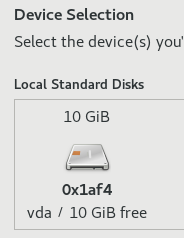
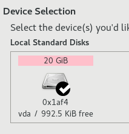

!!! info "Associated release criterion"
    This test case is associated with the [Release_Criteria#Update Image](../../guidelines/release_criteria/r9/9_release_criteria.md#update-image) release criterion. If you are doing release validation testing, a failure of this test case may be a breach of that release criterion.

## Description
<!-- TODO provide documentation on the topic of updates.img -->
This test case verifies that an [update image]() can be loaded into Anaconda and applied during the install process.



## Setup

1. Hit the Tab key to edit the boot command

## How to test
<!-- TODO host this internally -->
1. Supply `inst.updates=https://fedorapeople.org/groups/qa/updates/updates-openqa.img` to the GRUB command line
1. Boot into the installer as usual.
1. In Anaconda, open the Installation Destination spoke.

## Expected Results
1. Within the Installation Destination spoke, the selected install disk should have a pink background
=== "FAIL"
    { loading=lazy }

=== "PASS"
    { loading=lazy }

1. If you cannot verify visually, check for the existence of `/tmp/updates`, which should contain updated source files if the update was successfully applied. Note that if the update image doesn't actually contain any source files, this directory will not be created.
<!-- TODO does /tmp/updates appear without completing installation? -->

## Testing with openQA
The following openQA test suites satisfy this release criteria:

- `install_scsi_updates_img`

## Additional References
- [Red Hat Debug Boot Options (RHEL-9)](https://docs.redhat.com/en/documentation/red_hat_enterprise_linux/9/html/automatically_installing_rhel/custom-boot-options_rhel-installer#debug-boot-options_custom-boot-options), [Red Hat Debug Boot Options (RHEL-10)](https://docs.redhat.com/en/documentation/red_hat_enterprise_linux/10/html/automatically_installing_rhel/boot-options-reference#debug-boot-options)
- [Fedora QA:Testcase Anaconda updates.img via URL](https://fedoraproject.org/wiki/QA:Testcase_Anaconda_updates.img_via_URL)
- [Fedora QA:Testcase Anaconda updates.img via local media](https://fedoraproject.org/wiki/QA:Testcase_Anaconda_updates.img_via_local_media)


