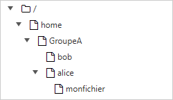
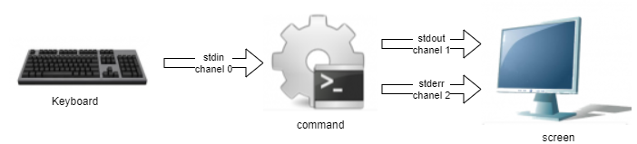
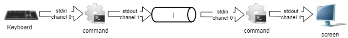

# Commands for Linux users

In this chapter you will learn how to work with Linux with the commands.

****

**Objectives** : In this chapter, future Linux administrators will learn how to:

:heavy_check_mark: **move** in the system tree;   
:heavy_check_mark: **create** a text file, **display** its contents and **modify** it;   
:heavy_check_mark: use the most useful Linux commands.

:checkered_flag: **user commands**, **linux**

**Knowledge**: :star:   
**Complexity**: :star:

**Reading time**: 40 minutes

****

## Generalities

Current Linux systems have graphical utilities dedicated to the work of an administrator. However, it is important to be able to use the interface in command line mode for several reasons:

* The majority of system commands are common to all Linux distributions, which is not the case for graphical tools.
* It can happen that the system does not start correctly but that a backup command interpreter remains accessible.
* Remote administration is done on the command line with an SSH terminal.
* In order to preserve server resources, the graphical interface is either not installed or launched on demand.
* Administration is done by scripts.

Learning these commands allows the administrator to connect to a Linux terminal, to manage its resources, its files, to identify the station, the terminal, and the connected users, etc.

### The users

The user of a Linux system is defined in the `/etc/passwd` file, by:

* a **login name**, more commonly called "login", containing no spaces;
* a numeric identifier : **UID** (User Identifier);
* a group identifier : **GID** (Group Identifier);
* a **command interpreter**, a shell, which can be different from one user to another;
* a **connection directory**, the __home directory__.

In other files by:

* a **password**, which will be encrypted before being stored (`/etc/shadow`);
* a **command prompt**, or __prompt__ login, which will be symbolized by a `#` for administrators and a `$` for other users (`/etc/profile`).

Depending on the security policy implemented on the system, the password will have to contain a certain number of characters and meet certain complexity requirements.

Among the existing command interpreters, the **Bourne-Again Shell** (`/bin/bash`) is the one most frequently used. It is assigned by default to new users. For various reasons, advanced Linux users can choose alternative shells from among the Korn Shell (`ksh`), the C Shell (`csh`), etc.

The user's login directory is by convention stored in the `/home` directory of the workstation. It will contain the user's personal data and the configuration files of his applications. By default, at login, the login directory is selected as the current directory.

A workstation type installation (with graphical interface) starts this interface on terminal 1. Linux being multi-user, it is possible to connect several users several times, on different **physical terminals** (TTY) or **virtual terminals** (PTS). Virtual terminals are available within a graphical environment. A user switches from one physical terminal to another using <kbd>Alt</kbd> + <kbd>Fx</kbd> from the command line or using <kbd>CTRL</kbd> + <kbd>Alt</kbd> + <kbd>Fx</kbd>.

### The shell

Once the user is connected to a console, the shell displays the command **prompt**. It then behaves like an infinite loop, with each statement entered:

* displaying the command prompt;
* reading the command ;
* syntax analysis ;
* substitution of special characters ;
* execute the command;
* display the command prompt;
* etc.

The key sequence <kbd>CTRL</kbd> + <kbd>C</kbd> is used to interrupt a running command.

The use of a command generally follows this sequence:

```
command [option(s)] [arguments(s)]
```

The name of the command is **often in lower case**.

A space separates each item.

Short **options** begin with a dash (`-l`), while **long options** begin with two dashes (`--list`).
A double dash (`--`) indicates the end of the option list.

It is possible to group some short options together:

```
$ ls -l -i -a
```

is equivalent to:

```
$ ls -lia
```

There can of course be several arguments after an option:

```
$ ls -lia /etc /home /var
```

In the literature, the term "option" is equivalent to the term "parameter," which is more commonly used in programming. The optional side of an option or argument is symbolized by enclosing it in square brackets `[` and `]`. When more than one option is possible, a vertical bar called a "pipe" separates them `[a|e|i]`.

## General commands

### `apropos`, `whatis` et `man` commands

It is impossible for an administrator at any level to know all the commands and options in detail. A manual is usually available for all installed commands.

#### `apropos`command

The command `apropos` allows you to search by keyword within these manual pages:

| Options                                     | Observations                                               |
| ------------------------------------------- | ---------------------------------------------------------- |
| `-s`, `--sections list` or `--section list` | Limited to manual sections.                                |
| `-a` or `--and`                             | Displays only the item matching all the provided keywords. |

Example:

```
$ apropos clear
clear (1)            - clear the terminal screen
clear_console (1)    - clear the console
clearenv (3)         - clear the environment
clearerr (3)         - check and reset stream status
clearerr_unlocked (3) - nonlocking stdio functions
feclearexcept (3)    - floating-point rounding and exception handling
fwup_clear_status (3) - library to support management of system firmware updates
klogctl (3)          - read and/or clear kernel message ring buffer; set console_loglevel
sgt-samegame (6)     - Block-clearing puzzle
syslog (2)           - read and/or clear kernel message ring buffer; set console_loglevel
timerclear (3)       - timeval operations
XClearArea (3)       - clear area or window
XClearWindow (3)     - clear area or window
XSelectionClearEvent (3) - SelectionClear event structure
```

To find the command that will allow changing the password of an account:

```
$ apropos --exact password  -a change
chage (1)            - change user password expiry information
passwd (1)           - change user password
```

#### `whatis` command

The `whatis` command displays the description of the command passed as argument:

```
$ whatis clear
```

Example:

```
$ whatis clear
clear (1)            - clear the terminal screen
```

#### `man` command

Once found by `apropos` or `whatis`, the manual is read by `man` ("Man is your friend").
This set of manuals is divided into 8 sections, grouping information by topic, the default section being 1:

1. User Commands;
2. System Calls;
3. C library functions;
4. Peripherals and special files;
5. File formats ;
6. Games;
7. Miscellaneous;
8. System administration tools and daemons.
   Information about each section can be accessed by typing `man x intro`, where `x` is the section number.

The command :

```
$ man passwd
```

will tell the administrator about the passwd command, its options, etc. While a :

```
$ man 5 passwd
```

will inform him about the files related to the command.

Not all pages of the manual are translated from English. However, they are generally very accurate and provide all the information needed. The syntax used and the division may confuse the beginner administrator, but with practice, he will quickly find the information he is looking for.

The navigation in the manual is done with the arrows <kbd>↑</kbd> and <kbd>↓</kbd>. The manual is exited by pressing the <kbd>q</kbd> key.

### `shutdown` command

The `shutdown` command allows you to **electrically shut down** a Linux server, either immediately or after a certain period of time.

```
[root]# shutdown [-h] [-r] time [message]
```

The shutdown time should be specified in the format `hh:mm` for a precise time, or `+mm` for a delay in minutes.

To force an immediate stop, the word `now` will replace the time. In this case, the optional message is not sent to other users of the system.

Examples:

```
[root]# shutdown -h 0:30 "Server shutdown at 0:30"
[root]# shutdown -r +5
```

Options :

| Options | Remarks                          |
| ------- | -------------------------------- |
| `-h`    | Shutdown the system electrically |
| `-r`    | Restarts the system              |

### `history` command

The `history` command displays the history of commands that have been entered by the user.
The commands are stored in the `.bash_history` file in the user's login directory.

Example of a history command

```
$ history
147 man ls
148 man history
```

| Options | Comments                                                                                                           |
| ------- | ------------------------------------------------------------------------------------------------------------------ |
| `-w`    | The `-w` option will copy the history of the current session to it.                                                |
| `-c`    | The `-c` option will delete the history of the current session (but not the contents of the `.bash_history` file). |

* Manipulating history:

To manipulate the history, the following commands entered from the command prompt will:

| Keys               | Function                                                  |
| ------------------ | --------------------------------------------------------- |
| <kdb>!!</kdb>      | Recall the last command placed.                           |
| <kdb>!n</kdb>      | Recall the command by its number in the list.             |
| <kdb>!string</kdb> | Recall the most recent command beginning with the string. |
| <kdb>↑</kdb>       | Recall the most recent command beginning with the string. |
| <kdb>↓</kdb>       | Recall the most recent command beginning with the string. |

### The auto-completion

Auto-completion is also a great help.
* It allows you to complete commands, entered paths, or file names.
* A press of the <kbd>TAB</kbd> key completes the entry in the case of a single solution.
* Otherwise, a second press will be required to obtain the list of possibilities.
  If a double press of the <kbd>TAB</kbd> key causes no reaction from the system, then there is no solution to the current completion.

## Display and identification

### `clear` command

The `clear` command clears the contents of the terminal screen. In fact, to be more precise, it shifts the display so that the command prompt is at the top of the screen on the first line.

In a terminal, the display will be permanently hidden, whereas in a graphical interface, a scrollbar will allow you to go back in the history of the virtual terminal.

> :star: **TIP:**
> <kbd>CTRL</kbd> + <kbd>L</kbd> will have the same effect as the `clear` command

### `echo` command

The `echo` command is used to display a string of characters.

This command is most commonly used in administration scripts to inform the user during execution.

The `-n` option will not return to the line after displaying the text (which is the default behavior of the command).

For various reasons, the script developer may need to use special sequences (starting with a `\` character). In this case, the `-e` option will be stipulated, allowing interpretation of the sequences.

Among the frequently used sequences, we can mention :

| Sequence | Result                |
| -------- | --------------------- |
| `\a`     | Send a sonor bip      |
| `\b`     | Back                  |
| `\n`     | Adds a line break     |
| `\t`     | Adds a horizontal tab |
| `\v`     | Adds vertical tab     |

### `date` command

The `date` command displays the date and time. The command has the following syntax:

```
date [-d AAAAMMJJ] [format]
```

Examples:

```
$ date
Mon May 24 16:46:53 CEST 2021
$ date -d 20210517 +%j
137
```

In this last example, the `-d` option displays a given date. The `+%j` option formats this date to show only the day of the year.

> :warning: **WARNING:**
> The format of a date can change depending on the value of the language defined in the environment variable `$LANG`.

The date display can follow the following formats:

| Option                                                                                                             | Format                           |
| ------------------------------------------------------------------------------------------------------------------ | -------------------------------- |
| `+%A`                                                                                                              | Full Name of Day                 |
| `+%B`                                                                                                              | Full Name of Month               |
| `+%c`                                                                                                              | Full Date Display                |
| `+%d`                                                                                                              | Day number                       |
| `+%F`                                                                                                              | Date in `YYYY-MM-DD` format      |
| `+%G`                                                                                                              | Year                             |
| `+%H`                                                                                                              | Time of day                      |
| `+%j`                                                                                                              | Day of the year                  |
| `+%m`                                                                                                              | Month number                     |
| `+%M`                                                                                                              | Minute                           |
| `+%R`                                                                                                              | Time in `hh:mm` format           |
| `+%s`                                                                                                              | Seconds since January 1, 1970    |
| `+%T`                                                                                                              | Time in `hh:mm:ss` format        |
| `+%u`                                                                                                              | Day of the week (`1` for Monday) |
| `+%V`                                                                                                              | Week number (`+%V`)              |
| `+%x`                                                                                                              | Date in format `DD/MM/YYYY`      |

The `date` command also allows you to change the system date and time. In this case, the `-s` option will be used.

```
[root]# date -s "2021-05-24 10:19"
```

The format to be used following the `-s` option is this:

```
date -s "[AA]AA-MM-JJ hh:mm:[ss]"
```

### `id`, `who` and `whoami` commands

The `id` command displays the name of the current user and its groups or those of a user, if the user's login is given as an argument.

```
$ id rockstar
uid=1000(rockstar) gid=1000(rockstar) groups=1000(rockstar),10(wheel)
```

The `-g`, `-G`, `-n` and `-u` options display the main group GID, subgroup GIDs, names instead of numeric identifiers, and the user's UID respectively.

The `whoami` command displays the login of the current user.

The `who` command alone displays the names of logged in users:

```
$ who
rockstar tty1   2021-05-24 10:30
root     pts/0  2021-05-24 10:31
```

Since Linux is multi-user, it is likely that multiple sessions are open on the same station, either physically or over the network. It is interesting to know which users are logged in, if only to communicate with them by sending messages.

* tty: represents a terminal.
* pts/: represents a virtual console in a graphical environment with the number after representing the instance of the virtual console (0, 1, 2...)

The `-r` option also displays the execution level (see chapter "startup").

## File tree

In Linux, the file tree is an inverted tree, called a **single hierarchical tree**, whose root is the directory `/`.

The **current directory** is the directory where the user is located.

The **connection directory** is the working directory associated with the user. The login directories are, by default, stored in the `/home` directory.

When the user logs in, the current directory is the login directory.

An **absolute path** references a file from the root by traversing the entire tree to the file level:
* `/home/groupA/alice/file`

The **relative path** references that same file by traversing the entire tree from the current directory:
* `../alice/file`

In the above example, the "`..`" refers to the parent directory of the current directory.

A directory, even if it is empty, will necessarily contain at least **two references** :
* `.`: reference to itself.
* `..`: reference to the parent directory of the current directory.

A relative path can thus start with `./` or `../`. When the relative path refers to a subdirectory or file in the current directory, then the `./` is often omitted. Mentioning the first `./` in the tree will only really be required to run an executable file.

Errors in paths can cause many problems: creating folders or files in the wrong places, unintentional deletions, etc. It is therefore strongly recommended to use auto-completion when entering paths.



In the above example, we are looking to give the location of the file `myfile` from the directory of bob.

* By an **absolute path**, the current directory does not matter. We start at the root, and work our way down to the directories `home`, `groupA`, `alice` and finally the file `myfile`: `/home/groupA/alice/myfile`.
* By a **relative path**, our starting point being the current directory `bob`, we go up one level through `..` (i.e., into the `groupA` directory), then down into the alice directory, and finally the `myfile` file: `../alice/myfile`.

### `pwd` command

The `pwd` (Print Working Directory) command displays the absolute path of the current directory.

```
$ pwd
/home/rockstar
```

To move around using a relative path, you must know its position in the tree.

Depending on the command interpreter, the command prompt may also display the name of the current directory.

### `cd` command

The `cd` (Change Directory) command allows you to change the current directory, in other words, to move through the tree.

```
$ cd /tmp
$ pwd
/tmp
$ cd ../
$ pwd
/
$ cd
$ pwd
/home/rockstar
```

As you can see in the last example above, the command `cd` with no arguments moves the current directory to the `home directory`.

### `ls` command

The `ls` command displays the contents of a directory

```
ls [-a] [-i] [-l] [directory1] [directory2] […]
```

Example:

```
$ ls /home
.    ..    rockstar
```

The main options of the `ls` command are :

| Option                                                       | Information                                                                                                                          |
| ------------------------------------------------------------ | ------------------------------------------------------------------------------------------------------------------------------------ |
| `-a`                                                         | Displays all files, even hidden ones. Hidden files in Linux are those beginning with `.`.                                            |
| `-i`                                                         | Displays inode numbers.                                                                                                              |
| `-l`                                                         | The `-l` command displays a vertical list of files with additional information formatted in columns.                                 |

The `ls` command, however, has a lot of options (see `man`):

| Option                                                       | Information                                                                                                                          |
| ------                                                       | ------------                                                                                                                         |
| `-d`                                                         | Displays information about a directory instead of listing its contents.                                                              |
| `-g`                                                         | Displays UID and GID rather than owner names.                                                                                        |
| `-h`                                                         | Displays file sizes in the most appropriate format (byte, kilobyte, megabyte, gigabyte, ...). `h` stands for Human Readable.         |
| `-s`                                                         | Displays the size in bytes (unless `k` option).                                                                                      |
| `-A`                                                         | Displays all files in the directory except `.` and `.`.                                                                              |
| `-R`                                                         | Displays the contents of subdirectories recursively.                                                                                 |
| `-F`                                                         | Displays the type of files. Prints a `/` for a directory, `*` for executables, `@` for a symbolic link, and nothing for a text file. |
| `-X`                                                         | Sort files according to their extensions.                                                                                            |

* Description of columns:

```
$ ls -lia /home
78489 drwx------ 4 rockstar rockstar 4096 25 oct. 08:10 rockstar
```

| Value           | Information                                                                                                   |
| --------------- | ------------------------------------------------------------------------------------------------------------- |
| `78489`         | Inode Number.                                                                                                 |
| `drwx------`    | File type (`d`) and rights (`rwx------`).                                                                       |
| `4`             | Number of subdirectories (`.` and `..` included). For a file of type physical link: number of physical links. |
| `rockstar`      | For a physical link file: number of physical links.                                                           |
| `rockstar`      | For a file of type physical link: number of physical links.                                                   |
| `4096`          | For a physical link type file: number of physical links.                                                      |
| `25 oct. 08:10` | Last modified date.                                                                                           |
| `rockstar`      | The name of the file (or directory).                                                                          |

> :notebook: **NOTE:**
> **Aliases** are frequently positioned in common distributions.
> This is the case of the alias `ll`:
> ```
> alias ll='ls -l --color=auto'
> ```

The `ls` command has many options and here are some advanced examples of uses:
* List the files in `/etc` in order of last modification:

```
$ ls -ltr /etc
total 1332
-rw-r--r--.  1 root root    662 29 may   2021 logrotate.conf
-rw-r--r--.  1 root root    272 17 may.   2021 mailcap
-rw-------.  1 root root    122 12 may.  2021 securetty
...
-rw-r--r--.  2 root root     85 18 may.  17:04 resolv.conf
-rw-r--r--.  1 root root     44 18 may.  17:04 adjtime
-rw-r--r--.  1 root root    283 18 may.  17:05 mtab
```
* List `/var` files larger than 1 megabyte but less than 1 gigabyte:

```
$ ls -Rlh /var | grep [0-9]M
...
-rw-r--r--. 1 apache apache 1,2M 10 may.  13:02 XB RiyazBdIt.ttf
-rw-r--r--. 1 apache apache 1,2M 10 may.  13:02 XB RiyazBd.ttf
-rw-r--r--. 1 apache apache 1,1M 10 may.  13:02 XB RiyazIt.ttf
...
```
* Show the rights on a folder:

To find out the rights to a folder, in our example `/etc`, the following command would not be appropriate:

```
$ ls -l /etc
total 1332
-rw-r--r--.  1 root root     44 18 nov.  17:04 adjtime
-rw-r--r--.  1 root root   1512 12 janv.  2010 aliases
-rw-r--r--.  1 root root  12288 17 nov.  17:41 aliases.db
drwxr-xr-x.  2 root root   4096 17 nov.  17:48 alternatives
...
```

since the command lists by default the contents of the folder and not the container.

To do this, use the `-d` option:

```
$ ls -ld /etc
drwxr-xr-x. 69 root root 4096 18 nov.  17:05 /etc
```

* List files by size:

```
$ ls -lhS
```

* Display the modification date in "timestamp" format:

```
$ ls -l --time-style="+%Y-%m-%d %m-%d %H:%M" /
total 12378
dr-xr-xr-x. 2 root root 4096 2014-11-23 11-23 03:13 bin
dr-xr-xr-x. 5 root root 1024 2014-11-23 11-23 05:29 boot
```

* Add the _trailing slash_ to the end of folders:

By default, the `ls` command does not display the last slash of a folder.
In some cases, like for scripts for example, it is useful to display them:

```
$ ls -dF /etc
/etc/
```

* Hide some extensions:

```
$ ls /etc --hide=*.conf
```

### `mkdir` command

The `mkdir` command creates a directory or directory tree.

```
mkdir [-p] directory [directory] [...]
```

Example:

```
$ mkdir /home/rockstar/work
```

The "rockstar" directory must exist to create the "work" directory.
Otherwise, the `-p` option should be used. The `-p` option creates the parent directories if they do not exist.

> :fire: **DANGER:**
> It is not recommended to use Linux command names as directory or file names.

### `touch` command

The `touch` command changes the timestamp of a file or creates an empty file if the file does not exist.

```
touch [-t date] file
```

Example :

```
$ touch /home/rockstar/myfile
```

| Option                            | Information                                                                |
| --------------------------------- | -------------------------------------------------------------------------- |
| `-t date`                         | Changes the date of last modification of the file with the specified date. |

Date format: `[AAAA]MMJJhhmm[ss]`

> :star: **TIP:**
> The `touch` command is primarily used to create an empty file, but it can be useful for incremental or differential backups for example. Indeed, the only effect of executing a `touch` on a file will be to force it to be saved during the next backup.

### `rmdir` command

The `rmdir` command deletes an empty directory.

Example:

```
$ rmdir /home/rockstar/work
```

| Option                                                                  | Information |
| ----------------------------------------------------------------------- | ----------- |
| `-p` |  Removes the parent directory or directories provided if they are empty.           |

> :star: **TIP:**
> To delete both a non-empty directory and its contents, use the `rm` command.

### `rm` command

The `rm` command deletes a file or directory.

```
rm [-f] [-r] file [file] [...]
```

> :fire: **CAUTION:**
> Any deletion of a file or directory is final.

| Options | Information                              |
| ------- | ---------------------------------------- |
| `-f`    | Do not ask for confirmation of deletion. |
| `-i`    | Requires confirmation of deletion.       |
| `-r`    | Recursively deletes subdirectories.      |

> :notebook: **NOTE:**
> The `rm` command itself does not ask for confirmation when deleting files. However, with a RedHat/Rocky distribution, `rm` does ask for confirmation of deletion because the `rm` command is an `alias` of the `rm -i` command. Don't be surprised if on another distribution, like Debian for example, you don't get a confirmation request.

Deleting a folder with the `rm` command, whether the folder is empty or not, will require the `-r` option to be added.

The end of the options is signaled to the shell by a double dash `--`.

In the example:

```
$ >-hard-hard # To create an empty file called -hard-hard
hard-hard
[CTRL+C] To interrupt the creation of the file
$ rm -f -- -hard-hard
```

The hard-hard file name starts with a `-`. Without the use of the `--` the shell would have interpreted the `-d` in `-hard-hard` as an option.

### `mv` command

The `mv` command moves and renames a file.

```
mv file [file ...] destination
```

Examples:

```
$ mv /home/rockstar/file1 /home/rockstar/file2
$ mv /home/rockstar/file1 /home/rockstar/file2 /tmp
```

| Options                                                                        | Information                                                     |
| ------------------------------------------------------------------------------ | --------------------------------------------------------------- |
| `-f`                                                                           | Don't ask for confirmation if overwriting the destination file. |
| `-i`                                                                           | Request confirmation if overwriting destination file (default). |

A few concrete cases will help you understand the difficulties that can arise:

```
$ mv /home/rockstar/file1 /home/rockstar/file2
```

Renames `file1` to `file2`, if `file2` already exists, it will be replaced by `file1`.

```
$ mv /home/rockstar/file1 /home/rockstar/file2 /tmp
```

Moves `file1` and `file2` into the `/tmp` directory.

```
$ mv file1 /repexist/file2
```

Moves `file1` into `repexist` and renames it `file2`.

```
$ mv file1 file2
```

`file1` is renamed to `file2`.

```
$ mv file1 /repexist
```

If the destination directory exists, `file1` is moved to `/repexist`.

```
$ mv file1 /wrongrep
```

If the destination directory does not exist, `file1` is renamed to `wrongrep` in the root directory.

### `cp` command

The `cp` command copies a file.

```
cp file [file ...] destination
```

Example:

```
$ cp -r /home/rockstar /tmp
```

| Options | Information                                                      |
| ------- | ---------------------------------------------------------------- |
| `-i`    | Request confirmation if overwriting (default).                   |
| `-f`    | Do not ask for confirmation if overwriting the destination file. |
| `-p`    | Keeps the owner, permissions and timestamp of the copied file.   |
| `-r`    | Copies a directory with its files and subdirectories.            |

```
cp file1 /repexist/file2
```

`file1` is copied to `/repexist` under the name `file2`.

```
$ cp file1 file2
```

`file1` is copied as `file2` to this directory.

```
$ cp file1 /repexist
```

If the destination directory exists, `file1` is copied to `/repexist`.

```
$ cp file1 /wrongrep
```

If the destination directory does not exist, `file1` is copied under the name `wrongrep` to the root directory.

## Visualization

### `file` command

The `file` command displays the type of a file.

```
file file1 [files]
```

Example:

```
$ file /etc/passwd /etc
/etc/passwd:    ASCII text
/etc:        directory
```

### `more` command

The `more` command displays the contents of one or more files screen by screen.

```
more file1 [files]
```

Example:

```
$ more /etc/passwd
root:x:0:0:root:/root:/bin/bash
...
```

Using the <kbd>ENTER</kbd> key, the move is line by line. Using the <kbd>SPACE</kbd> key, the move is page by page. `/text` allows you to search for the occurrence in the file.

### `less` command

The `less` command displays the contents of one or more files. The `less` command is interactive and has its own commands for use.

```
less file1 [files]
```

The commands specific to `less` are:

| Command           | Action                                          |
| ----------------- | ----------------------------------------------- |
| `h`               | Help.                                           |
| `Arrows`          | Move up, down a line, or to the right or left.. |
| `Enter`           | Move down one line.                             |
| `Space`           | Move down one page.                             |
| `PgUp` and `PgDn` | Move up or down one page.                       |
| `Begin` and `End` | Move to the beginning or end of a file.         |
| `/texte`          | Search for text.                                |
| `q`               | Quit the `less` command.                        |

### `cat` command

The `cat` command concatenates the contents of multiple files and displays the result on the standard output.

```
cat file1 [files]
```

Example 1 - Displaying the contents of a file to the standard output :

```
$ cat /etc/passwd
```

Example 2 - Displaying the contents of multiple files to standard output:

```
$ cat /etc/passwd /etc/group
```

Example 3 - Displaying the contents of several files in the file `usersAndGroups.txt` :

```
$ cat /etc/passwd /etc/group > usersAndGroups.txt
```

Example 4 - Displaying the line numbering :

```
$ cat -n /etc/profile
     1    # /etc/profile: system-wide .profile file for the Bourne shell (sh(1))
     2    # and Bourne compatible shells (bash(1), ksh(1), ash(1), ...).
     3
     4    if [ "`id -u`" -eq 0 ]; then
     5      PATH="/usr/local/sbin:/usr/local/bin:/usr/sbin:/usr/bin:/sbin:/bin"
     6    else
…
```

Example 5 - Shows the numbering of non-empty lines:

```
$ cat -b /etc/profile
     1    # /etc/profile: system-wide .profile file for the Bourne shell (sh(1))
     2    # and Bourne compatible shells (bash(1), ksh(1), ash(1), ...).

     3    if [ "`id -u`" -eq 0 ]; then
     4      PATH="/usr/local/sbin:/usr/local/bin:/usr/sbin:/usr/bin:/sbin:/bin"
     5    else
…
```

### `tac` command

The `tac` command does almost the opposite of the `cat` command. It displays the contents of a file starting from the end (which is particularly interesting for reading logs!).

Example: Display a log file by displaying the last line first:

```
[root]# tac /var/log/messages | less
```

### `head` command

The `head` command displays the beginning of a file.

```
head [-n x] file
```

| Option                                                                                                | Observation                             |
| ----------------------------------------------------------------------------------------------------- | --------------------------------------- |
| `-n x`                                                                                                | Display the first `x` lines of the file |

By default (without the `-n` option), the `head` command will display the first 10 lines of the file.

### `tail` command

The `tail` command displays the end of a file.

```
tail [-f] [-n x] file
```

| Option   | Observation                               |
| -------- | ----------------------------------------- |
| `-n x`   | Displays the last `x` lines of the file   |
| `-f`     | Displays changes to the file in real time |

Example:

```
tail -n 3 /etc/passwd
sshd:x:74:74:Privilege-separeted sshd:/var/empty /sshd:/sbin/nologin
tcpdump::x:72:72::/:/sbin/nologin
user1:x:500:500:grp1:/home/user1:/bin/bash
```

With the `-f` option, the `tail` command does not give back and runs until the user interrupts it with the sequence <kbd>CTRL</kbd> + <kbd>C</kbd>. This option is very frequently used to track log files (the logs) in real time.

Without the `-n` option, the tail command displays the last 10 lines of the file.

### `sort` command

The `sort` command sorts the lines of a file.

It allows you to order the result of a command or the content of a file in a given order, numerically, alphabetically, by size (KB, MB, GB) or in reverse order.

```
sort [-kx] [-n] [-o file] [-ty] file
```

Example:

```
$ sort -k3 -t: -n /etc/passwd
root:x:0:0:root:/root:/bin/bash
adm:x:3:4:adm:/var/adm/:/sbin/nologin
```

| Option                                                                                                                                                                                                                               | Observation                                  |
| ------------------------------------------------------------------------------------------------------------------------------------------------------------------------------------------------------------------------------------ | -------------------------------------------- |
| `-kx`                                                                                                                                                                                                                                | Specifies the `x` column to sort on          |
| `-n`                                                                                                                                                                                                                                 | Requests a numeric sort                      |
| `-o file   `                                                                                                                                                                                                                         | Saves the sort to the specified file         |
| `-ty`                                                                                                                                                                                                                                | Specifies the field separator character `y`. |
| `-r`                                                                                                                                                                                                                                 | Reverse the order of the result              |

The `sort` command sorts the file only on the screen. The file is not modified by the sorting. To save the sort, use the `-o` option or an output redirection `>`.

By default, the numbers are sorted according to their character. Thus, "110" will be before "20", which will itself be before "3". The `-n` option must be specified so that the numeric character blocks are sorted by their value.

The `sort` command reverses the order of the results, with the `-r` option:

```
$ sort -k3 -t: -n -r /etc/passwd
root:x:0:0:root:/root:/bin/bash
adm:x:3:4:adm:/var/adm/:/sbin/nologin
```

In this example, the `sort` command will sort the contents of the `/etc/passwd` file this time from largest uid to smallest.

Some advanced examples of using the `sort` command:

* Shuffling values

The `sort` command also allows you to shuffle values with the `-R` option:

```
$ sort -R /etc/passwd
```

* Sorting IP addresses

A system administrator is quickly confronted with the processing of IP addresses from the logs of his services such as SMTP, VSFTP or Apache. These addresses are typically extracted with the `cut` command.

Here is an example with the file `dns-client.txt` :

```
192.168.1.10
192.168.1.200
5.1.150.146
208.128.150.98
208.128.150.99
```

```
$ sort -nr dns-client.txt
208.128.150.99
208.128.150.98
192.168.1.200
192.168.1.10
5.1.150.146
```

* Sorting file by sizes

The `sort` command knows how to recognize file sizes, from commands like `ls` with the `-h` option.

Here is an example with the file `size.txt` :

```
1,7G
18M
69K
2,4M
1,2M
4,2G
6M
124M
12,4M
4G
```

```
$ sort -hr size.txt
4,2G
4G
1,7G
124M
18M
12,4M
6M
2,4M
1,2M
69K
```

### `wc` command

The `wc` command counts the number of lines, words and/or bytes in a file.

```
wc [-l] [-m] [-w] file [files]
```

| Option | Observation                     |
| ------ | ------------------------------- |
| `-c`   | Count the number of bytes.      |
| `-m`   | Count the number of characters. |
| `-l`   | Counts the number of lines.     |
| `-w`   | Counts the number of words.     |

## Search

### `find` command

The `find` command searches for files or directories location.

```
find directory [-name name] [-type type] [-user login] [-date date]
```

Since there are so many options to the `find` command, it is best to refer to the `man`.

If the search directory is not specified, the `find` command will search from the current directory.

| Option              | Observation                            |
| ------------------- | -------------------------------------- |
| `-perm permissions` | Search for files by their permissions. |
| `-size size`        | Search for files by size.              |

### `-exec` option of the `find` command

It is possible to use the `-exec` option of the `find` command to execute a command on each result line:

```
$ find /tmp -name *.txt -exec rm -f {} \;
```

The previous command searches for all files in the `/tmp` directory named `*.txt` and deletes them.

> :star: **TIP:**
> **Understand the -exec** option
> In the example above, the `find` command will construct a string representing the command to be executed.
> If the `find` command finds three files named `log1.txt`, `log2.txt`, and `log3.txt`, then the `find` command will construct the string by replacing in the string `rm -f {} \;` the braces with one of the results of the search, and do this as many times as there are results.
> This will give us :
>```
>rm -f /tmp/log1.txt ; rm -f /tmp/log2.txt ; rm -f /tmp/log3.txt ;
>```
>The `;` character is a special shell character that must be protected by a `\` to prevent it from being interpreted too early by the `find` command (and not in the `-exec`).

> :star: **TIP:**
> `$ find /tmp -name *.txt -delete` does the same thing.

### `whereis` command

The `whereis` command searches for files related to a command.

```
whereis [-b] [-m] [-s] command
```

Example:

```
$ whereis -b ls
ls: /bin/ls
```

| Option | Observation                     |
| ------ | ------------------------------- |
| `-b`   | Search only the binary file.    |
| `-m`   | Searches only for man pages.    |
| `-s`   | Searches only for source files. |

### `grep` command

The `grep` command searches for a string in a file.

```
grep [-w] [-i] [-v] "string" file
```

Example:

```
$ grep -w "root:" /etc/passwd
root:x:0:0:root:/root:/bin/bash
```

| Option                                                                                  | Observation                             |
| --------------------------------------------------------------------------------------- | --------------------------------------- |
| `-i`                                                                                    | Ignore the case of the searched string. |
| `-v`                                                                                    | Excludes lines containing the string.   |
| `-w`                                                                                    | Search for the exact word.              |

The `grep` command returns the complete line containing the string you are looking for.
* The `^` special character is used to search for a string at the beginning of a line.
* The special character `$` searches for a string at the end of a line.

```
$ grep -w "^root" /etc/passwd
```

> :notebook: **NOTE:**
> This command is very powerful and it is highly recommended to consult its manual. It has many derivatives.

It is possible to search for a string in a file tree with the `-R` option.

```
grep -R "Virtual" /etc/httpd
```

### Meta-characters (wildcards)

Meta-characters replace one or more characters (or even an absence of characters) during a search. These meta-characters are also known as wildcards. They can be combined. The `*` character replaces a string composed of any characters. The `*` character can also represent an absence of character.

```
$ find /home -name "test*"
/home/rockstar/test
/home/rockstar/test1
/home/rockstar/test11
/home/rockstar/tests
/home/rockstar/test362
```

Meta-characters allow more complex searches by replacing all or part of a word. Simply replace the unknowns with these special characters.

The character `?` replaces a single character, whatever it is.

```
$ find /home -name "test?"
/home/rockstar/test1
/home/rockstar/tests
```

The square brackets `[` are used to specify the values that a single character can take.

```
$ find /home -name "test[123]*"
/home/rockstar/test1
/home/rockstar/test11
/home/rockstar/test362
```

> :notebook: **NOTE:**
> Always surround words containing meta-characters with `"` to prevent them from being replaced by the names of files that meet the criteria.

> :fire: **DANGER:**
> Do not confuse shell meta-characters with regular expression meta-characters. The `grep` command uses regular expression meta-characters.

## Redirects and pipes

### Standard input and output

On UNIX and Linux systems, there are three standard streams. They allow programs, via the `stdio.h` library, to input or output information.

These streams are called X channel or X file descriptor.

By default:
* the keyboard is the input device for channel 0, called **stdin** ;
* the screen is the output device for channels 1 and 2, called **stdout** and **stderr**.



**stderr** receives the error streams returned by a command. The other streams are directed to **stdout**.

These streams point to peripheral files, but since everything is a file in UNIX/Linux, I/O streams can easily be diverted to other files. This principle is the strength of the shell.

### Input redirection

It is possible to redirect the input stream from another file with the character `<` or `<<`. The command will read the file instead of the keyboard:

```
$ ftp -in serverftp << ftp-commands.txt
```

> :notebook: **NOTE:**
> Only commands that require keyboard input will be able to handle input redirection.

Input redirection can also be used to simulate user interactivity. The command will read the input stream until it encounters the defined keyword after the input redirection.

This feature is used to script interactive commands:

```
$ ftp -in serverftp << END
user alice password
put file
bye
END
```

The keyword `END` can be replaced by any word.

```
$ ftp -in serverftp << STOP
user alice password
put file
bye
STOP
```

The shell exits the `ftp` command when it receives a line containing only the keyword.

> :fire: **CAUTION:**
> The ending keyword, here `END` or `STOP`, must be the only word on the line and must be at the beginning of the line.

The standard input redirection is rarely used because most commands accept a filename as an argument.

The command `wc` could be used like this:

```
$ wc -l .bash_profile
27 .bash_profile # the number of lines is followed by the file name
$ wc -l < .bash_profile
27 # returns only the number of lines
```

### Output redirection

Standard output can be redirected to other files using the `>` or `>>` characters.

The simple `>` redirection overwrites the contents of the output file:

```
$ date +%F > date_file
```

while the double redirection `>>` adds (concatenates) to the content of the output file.

```
$ date +%F >> date_file
```

In both cases, the file is automatically created when it does not exist.

The standard error output can also be redirected to another file. This time it will be necessary to specify the channel number (which can be omitted for channels 0 and 1):

```
$ ls -R / 2> errors_file
$ ls -R / 2>> errors_file
```

### Examples of redirection

Redirection of 2 outputs to 2 files :

```
$ ls -R / >> ok_file 2>> nok_file
```

Redirection of the 2 outputs to a single file:

```
$ ls -R / >> log_file 2>&1
```

Redirection of *stderr* to a "bottomless pit" (`/dev/null`) :

```
$ ls -R / 2>> /dev/null
```

When both output streams are redirected, no information is displayed on the screen. To use both the output redirection and to keep the display, you will have to use the command `tee`.

### Pipes

A **pipe** is a mechanism allowing you to link the standard output of a first command to the standard input of a second command.

This communication is uni directional and is done with the `|` symbol. The pipe symbol `|` is obtained by pressing the  <kbd>SHIFT</kbd> + <kbd>|</kbd> simultaneously.



All data sent by the control on the left of the pipe through the standard output channel is sent to the standard input channel of the control on the right.

The commands particularly used after a pipe are filters.

* Examples:

Display only the beginning:
```
$ ls -lia / | head
```

Display only the end:
```
$ ls -lia / | tail
```

Sort the result:
```
$ ls -lia / | sort
```

Count the number of words / characters:
```
$ ls -lia / | wc
```

Search for a string in the result:
```
$ ls -lia / | grep fichier
```

## Special points

### `tee` command

The `tee` command is used to redirect the standard output of a command to a file while maintaining the screen display.

It is combined with the `|` pipe to receive as input the output of the command to be redirected:
```
$ ls -lia / | tee fic
$ cat fic
```
The `-a` option adds to the file instead of overwriting it.

### `alias` and `unalias` commands

Using **alias** is a way to ask the shell to remember a particular command with its options and give it a name.

For example:
```
$ ll
```
will replace the command :
```
$ ls -l
```
The `alias` command lists the aliases for the current session. Aliases are set by default on Linux distributions. Here, the aliases for a Rocky server :

```
$ alias
alias l.='ls -d .* --color=auto'
alias ll='ls -l --color=auto'
alias ls='ls --color=auto'
alias vi='vim'
alias which='alias | /usr/bin/which --tty-only --read-alias --show-dot --show-tilde'
```
The aliases are only defined temporarily, for the time of the user session.

For permanent use, they must be created in the :
* `.bashrc` file in the user's login directory;
* `/etc/profile.d/alias.sh` file for all users.

> :warning: **WARNING:**
> Special care must be taken when using aliases which can be potentially dangerous! For example, an alias set up without the administrator's knowledge :
```
alias cd='rm -Rf'
```

The `unalias` command allows you to delete aliases.

To delete a single alias:
```
$ unalias ll
```
To delete all aliases:
```
$ unalias -a
```

To disable an alias temporarily, the combination is `\<alias name>`.

For example if we do:
```
$ type ls
```
it might return the following:
```
ls is an alias to « ls -rt »
```
Now that this is known, we can see the results of using the alias or disabling it one time with the `\` by executing the following:
```
$ ls file*   # order by time
file3.txt  file2.txt  file1.txt
$ \ls file*  # order by name
file1.txt  file2.txt  file3.txt
```

### Aliases and useful functions

* `grep` alias
Colorize the result of the `grep` command:
`alias grep='grep --color=auto'`

* `mcd` function
It is common to create a folder and then move around in it:
`mcd() { mkdir -p "$1"; cd "$1"; }`

* `cls` function
Move to a folder and list its contents:
`cls() { cd "$1"; ls; }`

* `backup` function
Create a backup copy of a file:
`backup() { cp "$1"{,.bak}; }`

* `extract` function
Extract any type of archive:

```
extract () {
  if [ -f $1 ] ; then
    case $1 in
      *.tar.bz2) tar xjf $1 ;;
      *.tar.gz) tar xzf $1 ;;
      *.bz2) bunzip2 $1 ;;
      *.rar) unrar e $1 ;;
      *.gz) gunzip $1 ;;
      *.tar) tar xf $1 ;;
      *.tbz2) tar xjf $1 ;;
      *.tgz) tar xzf $1 ;;
      *.zip) unzip $1 ;;
      *.Z) uncompress $1 ;;
      *.7z) 7z x $1 ;;
      *)
        echo "'$1' cannot be extracted via extract()" ;;
    esac
  else
    echo "'$1' is not a valid file"
  fi
}

```

* If `alias cmount` returns the following:
`alias cmount="mount | column -t"`

Then we can use cmount to show all of the system mounts in columns like this:

`[root]# cmount`

which would return our mounted filesystem in the following format:

```
/dev/simfs  on  /                                          type  simfs        (rw,relatime,usrquota,grpquota)
proc        on  /proc                                      type  proc         (rw,relatime)
sysfs       on  /sys                                       type  sysfs        (rw,relatime)
none        on  /dev                                       type  devtmpfs     (rw,relatime,mode=755)
none        on  /dev/pts                                   type  devpts       (rw,relatime,mode=600,ptmxmode=000)
none        on  /dev/shm                                   type  tmpfs        (rw,relatime)
none        on  /proc/sys/fs/binfmt_misc                   type  binfmt_misc  (rw,relatime)

```

### The character `;`

The `;` character strings the commands.

The commands will all run sequentially in the order of input once the user presses <kbd>ENTER</kdb>.
```
$ ls /; cd /home; ls -lia; cd /
```

## Check your Knowledge

:heavy_check_mark: What defines a user under Linux? (7 answers)

:heavy_check_mark: What characterizes a long option for an order?

:heavy_check_mark: Which commands allow you to search for help on a command:   
- [ ] `google`   
- [ ] `chuck --norris`   
- [ ] `info`   
- [ ] `apropos`   
- [ ] `whatis`   

:heavy_check_mark: Which command allows you to view a user's history?

:heavy_check_mark: Which command allows you to search for text in a file?    
- [ ] `find`   
- [ ] `grep`   

:heavy_check_mark: Which command allows you to search for a file?    
- [ ] `find`    
- [ ] `grep`   

:heavy_check_mark: Which command redirects the error stream of a command to a new `errors.log` file:   
- [ ] `ls -R / 2> errors.log`   
- [ ] `ls -R / 2>> errors.log`   
- [ ] `ls -R / 2> errors.log 2>&1`   
