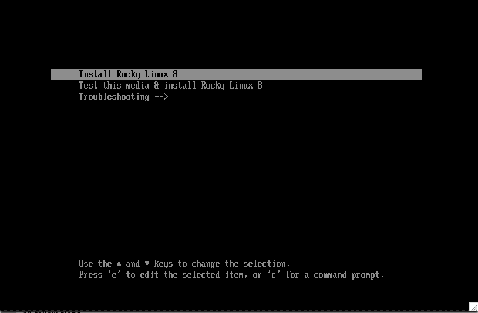
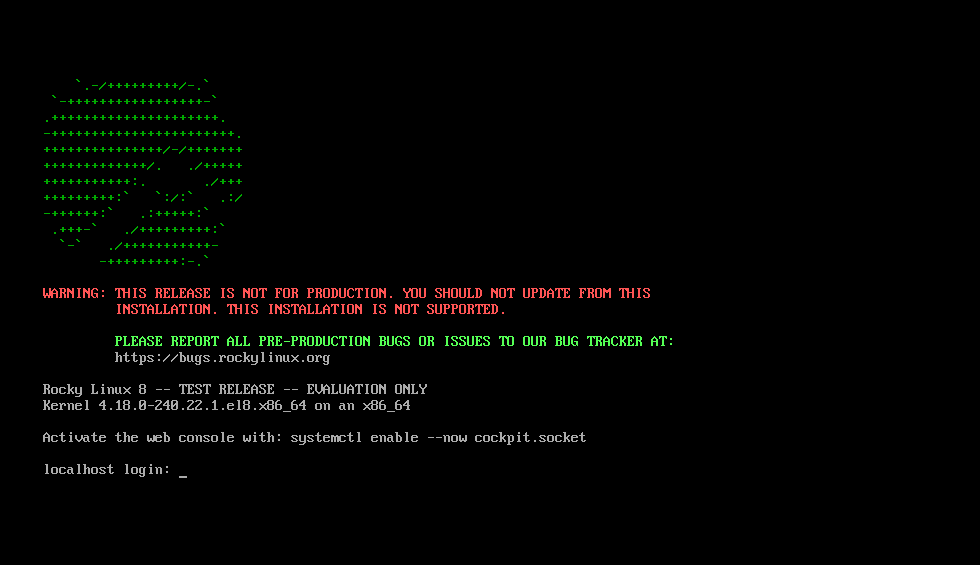

# Installing Rocky Linux

This guide walks-through the detailed steps to install a 64-bit version of the rocky Linux distribution on a stand-alone system. 

We will be performing a server class install in this chapter using an operating system installer image downloaded from the rocky project website. We will tackle the installation and customizations steps in the following sections.


## OS installation prerequisites

First, you need to download the ISO for Rocky that we will be installing.

The latest ISO image for the version of Rocky that we will be using for this installation can be downloaded from here:

```
https://www.rockylinux.org/download/

```

To download the ISO directly from the command line, type:

```
$ wget https://download.rockylinux.org/pub/rocky/8.3/isos/x86_64/Rocky-8.3-x86_64-minimal.iso
```

Rocky ISOs are named following this convention:

```
Rocky-<MAJOR#>.<MINOR#>.<ARCH>-<VARIANT>.iso
```

For example  `Rocky-8.3-x86_64-minimal.iso`


**Note:**
Rocky project web page has a listing of several mirrors located all over the world. Whenever possible, you should choose the mirror geographically closest to you. The list of official mirrors can be found at `https://#`


## Verifying the installer ISO

If you've downloaded the Rocky ISO(s) on an existing Linux distribution, you can use teh sha256sum utility to verify that file(s) you downloaded are not corrupted in anyway. We'll show an example of how to verify the sha256sum of the `sha256sum Rocky-8.3-x86_64-minimal.iso `.

First download the file that contains the official checksums for the avaiable ISOs. While still in the folder that contains the downloaded Rocky ISO, type:

```
wget http://download.rockylinux.org/pub/rocky/8.3/isos/x86_64/CHECKSUM
```

Use the sha256sum utility to verify the 

```
sha256sum -c CHECKSUM    --ignore-missing Rocky-8.3-x86_64-minimal.iso
```

The output should include:

```
Rocky-8.3-x86_64-minimal.iso: OK
```


**TIP:** Before starting the installation proper, the system’s Unified Extensible Firmware Interface (UEFI) or Basic Input/Output System (BIOS) should be preconfigured to boot from the correct medium. 

# The Installation

Let’s begin the installation process.

Insert and boot off the installation medium (optical disk, USB flash drive, and so on).

Once booted, you'll be presented with a welcome splash screen.



If you do not press any key, the prompt will begin a countdown, after which the installation process will start by booting the highlighted Test This Media & Install Rocky Linux 8 ... option. You can also press enter to start the process immediately.

A quick media verification step will take place. This media verification step can save you the trouble of starting the installation only to find out halfway through that the installer will abort because of bad installation media.

After the media check runs to completion, and the media is successfully verified to be usable, the installer will automatically continue to the next screen.

Select the language you want to use to perform the installation in this screen. For this example, we select English (United States). Then click the Continue button.

**Warning:** :warning: You'll next see warning screen. The screen will warn you that you are installing pre-release software and that you should NOT use the operating system in a production environment. If you okay with this, click `I want to proceed` to continue 

# Installation Summary

The Installation Summary screen is an all-in-one area where you make the important decisions about the operating system to be installed. The screen is roughly divided into the following sections:
    • Localization (Keyboard, Language Support, and Time & Date)
    • Software (Installation Source and Software Selection)
    • System (Installation Destination and Network & Hostname)

We delve into each of these sections next and make changes where necessary.


## Localization Section
This section is used for customizing items related to the locale of the system. This includes – Keyboard, Language Support, Time and Date.


### Keyboard
On our demo system in this guide, we accept the default value (English US) and make no changes.
However if you need to make any changes here, from the Installation Summary screen, click the Keyboard option to specify the keyboard layout of the system. You can add additional keyboard layouts if you need to in the ensuing screen and specify their order.
Click Done when you are done.

### Language Support
The Language Support option on the Installation Summary screen enables you to specify support for additional languages that you may need on the finished system.
We accept the default value (English – United States) and make no change. Click Done.


### Time & Date
Click the Time & Date option on the main Installation Summary screen to bring up another screen that will allow you to select the time zone in which the machine is located. Scroll through the list of regions and cities and select the area closest to you. 

Depending on your installation source, the Network Time option could be set to ON or OFF by default. Accept the default ON setting; this allows the system to automatically set the correct time using the Network Time Protocol (NTP). Click Done after making any changes.

## Software Section
Under the Software section of the Installation Summary screen, you can select the installation source as well as additional packages (applications) that get installed.

### Installation Source
Since we are performing our installation using a full Rocky 8 image, you will notice that Local Media is automatically specified under the Installation Source section of the main Installation Summary screen. We'll accept the preset defaults.

### Software Selection


Clicking the Software Selection option on the main Installation Summary screen presents you with the section of the installation where you can pick the exact software packages that get installed on the system. The software selection area is divided into the Base Environment (Server, Minimal Install, Custom Operating System) and Additional software for Selected Environment area.
Selecting a Base Environment on the left side presents a variety of related additional software that can be installed for the given environment on the right side.

Select the Minimal Install (Basic functionality) option instead.

Click Done at the top of the screen.
        ​
## System Section
The System section of the Installation Summary screen is used for customizing and making changes to the underlying hardware of the target system. This is where you create your hard drive partitions or volumes, specify the file system to be used, and specify the network configuration.

### Installation Destination

From the Installation Summary screen, click the Installation Destination option. This takes you to the corresponding task area.
You will see a screen displaying all the candidate disk drives that you have available on the target system. If you have only one disk drive on the system, as on our sample system, you will see the drive listed under Local Standard Disks with a check mark beside it. Clicking the disk icon will toggle on or off the disk selection check mark. We want it selected/checked here.


Under the Storage Configuration Options section, select the Automatic radio button.
Then click Done at the top of the screen.
Once the installer determines that you have a usable disk, you will be returned to the installation summary screen.


### Network & Hostname
The final task of the installation procedure deals with network configuration, where you can configure or tweak network-related settings for the system.

**NOTE:** After you click on the Network & Hostname option, all correctly detected network interface hardware (such as Ethernet, wireless network cards, and so on) will be listed in the left pane of the network configuration screen.Depending on the Linux distribution and the specific hardware setup, Ethernet devices in Linux have names similar to eth0, eth1, ens3, ens4, em1, em2, p1p1, enp0s3, and so on.
 
For each interface, you can either configure it using DHCP or manually set the IP address. If you choose to configure manually, be sure to have all the pertinent information ready, such as the IP address, netmask, and so on.
Clicking the Network & Hostname button in the main Installation Summary screen opens the corresponding configuration screen. Among other things, you have the option to configure the hostname of the system (the name defaults to localhost.localdomain). Note that you can easily change this name later on after the OS has been installed. For now, accept the default value supplied for the hostname.

The next important configuration task is related to the network interfaces on the system. First, verify that an Ethernet card (or any network card) is listed in the left pane. Click any of the detected network devices in the left pane to select it. The configurable properties of the selected network adapter will appear in the right pane of the screen.
On our sample server, we have four Ethernet devices (ens3, ens4, ens5 and ens6), all of which are in a connected state. The type, name, quantity, and state of the network devices on your system may vary from the ones on our sample system.
Make sure the switch of the device you want to configure is flipped to the ON position in the right pane.
We'll accept all the defaults in this section.

Click Done to return to the main Installation Summary screen.

**CAUTION:**  Pay attention to the IP address of the server in this section of this installer. If you don’t have physical or easy console access to the system, this information will come in handy later on when you need to connect to the server to continue working on it.

## The Installation
Once you are satisfied with your choices for the various installation tasks, the next phase of the installation process will begin the installation proper.

## User Settings Section

 This section can be used for creating a password for the root user account and also for creating new administrative or non-administrative accounts.


### Set the Root Password

Click the Root Password field under User Settings to launch the Root Password task screen. In the Root Password text box, set a strong password for the root user. 
This user is the most privileged account on the system. Therefore, if you choose to use it or enable it - it is crucial that you protect this account with a very good password.
Enter the same password again in the Confirm text box. Click Done.
            ​

### Create a User Account

Next click the User Creation field under User Settings to launch the Create User task screen. This task area allows you to create a privileged or non-privileged (non-administrative) user account on the system. 

Creating and using a non-privileged account for day-to-day tasks on a system is a good system administration practice. 

We’ll create a regular user that can invoke superuser (administrator) powers when needed.
Complete the fields in the Create User screen with the following information and then click Done:

Full name
`rockstar`
Username
`rockstar`
Make this user administrator
Checked

Require a password to use this account
Checked

Password
`04302021`

Confirm password
`04302021`


### Start the Installation

Once you are satisfied with your choices for the various installation tasks, click the Begin Installation button on the main Installation Summary screen. The installation will begin, and the installer will show the progress of the installation.

**NOTE:** If you develop cold feet after you click the Begin Installation button, you can still safely back out of the installation without any loss of data (or self-esteem). To quit the installer, simply reset your system either by clicking the Quit button, pressing ctrl-alt-del on the keyboard, or pushing the reset or power switch.

When the installation begins, various tasks will begin running in the background, such as partitioning the disk, formatting the partitions or LVM volumes, checking for and resolving software dependencies, writing the operating system to the disk, and so on.   ​
 
### Complete the Installation
After you’ve completed any of the mandatory subtasks and the installer has run its course, you'll be presented with a final installation progress screen with a complete message.

Finally, complete the entire procedure by clicking the Reboot System button. The system will reboot itself.
            ​
### Log In
The system is now set up and ready for use. You will see the adorable Rocky Linux console.



To log onto the system, type `rockstar` at the login prompt and press enter. 

At the Password prompt, type `04302021` (rockstar’s password) and press enter.

We'll run the `whoami` command after login. 


