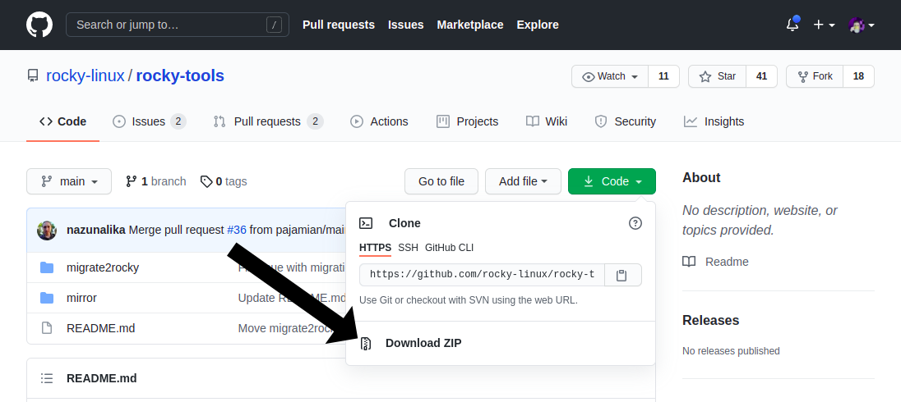
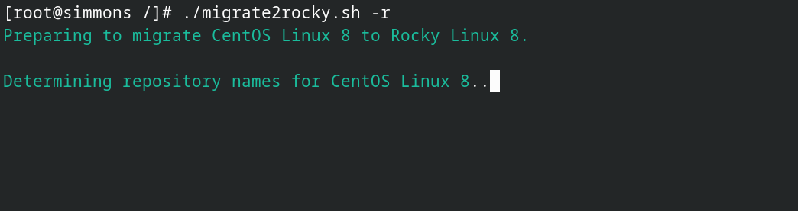
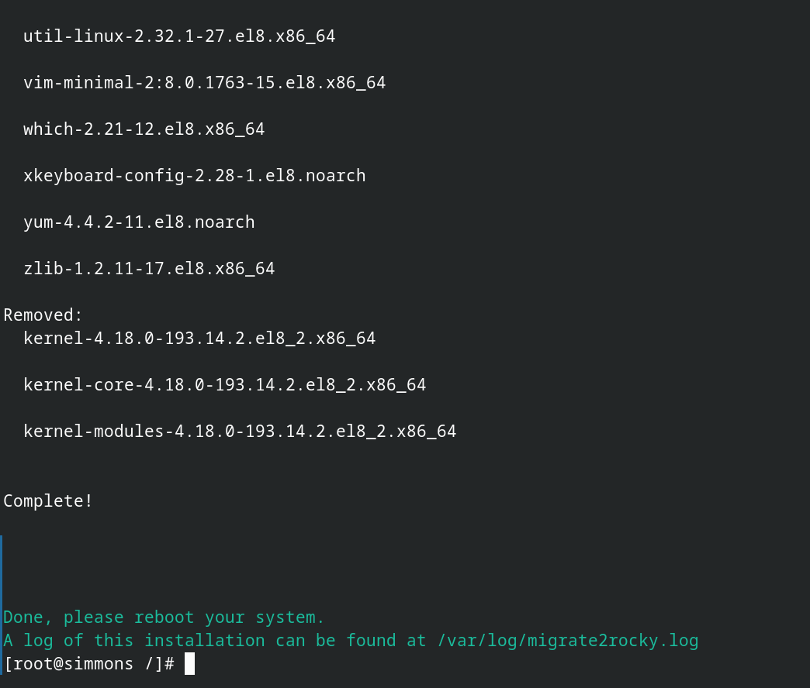
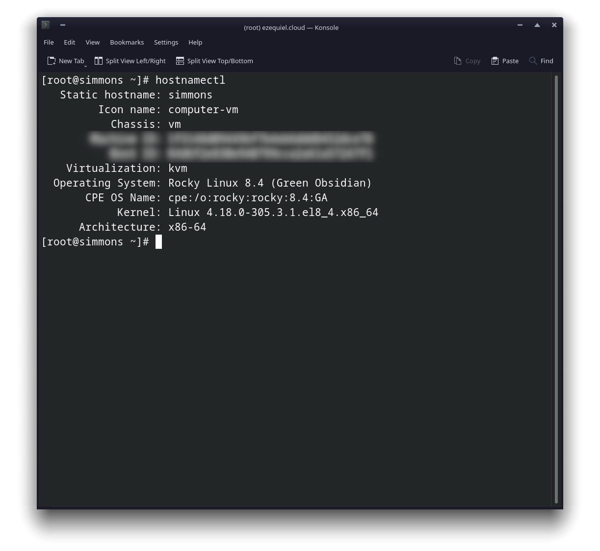

# How to Migrate to Rocky Linux from CentOS, Alma Linux, RHEL, or Oracle Linux

## Prerequisites & Assumptions

* A hardware server or VPS running, well... CentOS, Alma Linux, RHEL, or Oracle Linux. The current supported version for each of these is 8.4.
* A working knowledge of the command line.
* A working knowledge of SSH for remote machines.
* A mildly risk-taking attitude.
* All commands should be run as root. Either log in as root, or get ready to type "sudo" a lot.

## Introduction

In this guide, you'll learn how to convert all of the OSes listed above to fully functional Rocky Linux installs. This is probably one of the most roundabout ways of installing Rocky Linux, but it'll come in handy for people in a variety of situations.

For example, some server providers won't support Rocky Linux by default for a while. Or you may have a production server that you want to convert to Rocky Linux without reinstalling everything.

Well, we've got the tool for you: [migrate2rocky](https://github.com/rocky-linux/rocky-tools/tree/main/migrate2rocky).

It's a script that, when executed, will change out all of your repositories to those of Rocky Linux. Packages will be installed and upgraded/downgraded as necessary, and all of your OS' branding will change too.

Don't worry, if you're new to systems administration, I'll be keeping this as user-friendly as possible. Well, as user friendly as the command line gets.

### Caveats and warnings

1. Do check out migrate2rocky's README page (linked above), because there is a known clash between the script and Katello's repositories. In time, it's probable that we'll discover (and eventually patch) more clashes and incompatibilities, so you'll want to know about those, especially for production servers.
2. This script is most likely to work without incident on completely fresh installs. _If you want to convert a production server, for the love of all that is holy and good, **do it in a staging environment first.**_

Okay? We ready? Let's do this.

## Prepare your server

You'll need to grab the actual script file from the repository. This can be done in a number of ways.

### The manual way

Download the compressed files from GitHub and extract the one you need (That'd be *migrate2rocky.sh*). You can find zip files for any GitHub repo on the right-ish side of the repo's main page:



Then, upload the executable to your server with ssh by running this command on your local machine:

```
scp PATH/TO/FILE/migrate2rocky.sh root@yourdomain.com:/home/
```

Just, you know, adjust all the file paths and server domains or addresses as needed.

### The git way

Install git on your server with:

```
dnf install git
```

Then clone the rocky-tools repository with:

```
git clone https://github.com/rocky-linux/rocky-tools.git
```

Note: this method will download all of the scripts and files in the rocky-tools repository.

### The easy-but-slightly-less-secure way

Okay, this is not necessarily the best thing to do, security-wise. But, it is the easiest way to grab the script.

Run this command to download the script into whatever directory you're using:

```
curl https://raw.githubusercontent.com/rocky-linux/rocky-tools/main/migrate2rocky/migrate2rocky.sh -o migrate2rocky.sh
```

That command will download the file straight to your server, and *only* the file you want. But again, there are security concerns that suggest this isn't necessarily the best practice, so keep that in mind.

## Installation

Here comes what is probably the easiest bit. Log in to your server, and then use the terminal to navigate to whatever folder contains the migrate2rocky.sh file.

Then, make sure the file is executable:

```
chmod +x migrate2rocky.sh
```

And now, at long last, execute the script:

```
./migrate2rocky.sh -r
```

That "-r" option tells the script to just go ahead and install everything.

If you've done everything right, your terminal window should look a bit like this:



Now, it'll take the script a while to convert everything, depending on the actual machine/server, and the connection it has to the wider internet.

If you see this mesage at the end, everything has gone right. Just reboot your server to finish the job.



Give it some time, log back in, and you should have a fancy schmancy new Rocky Linux server to play wi... I mean do very serious work on. Run the `hostnamectl` command to check that your OS was migrated properly, and you're good to go.


